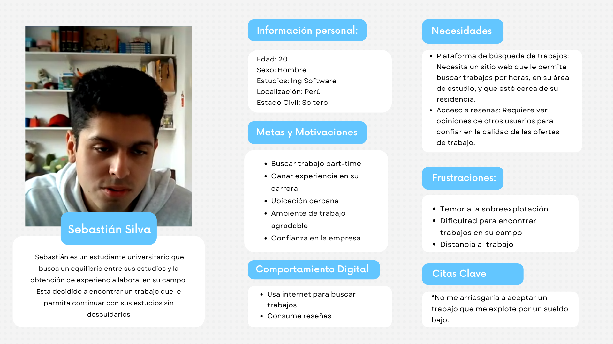
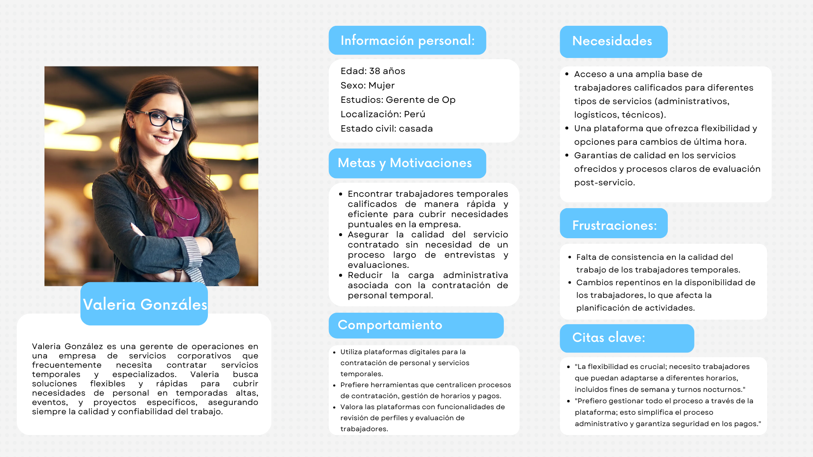
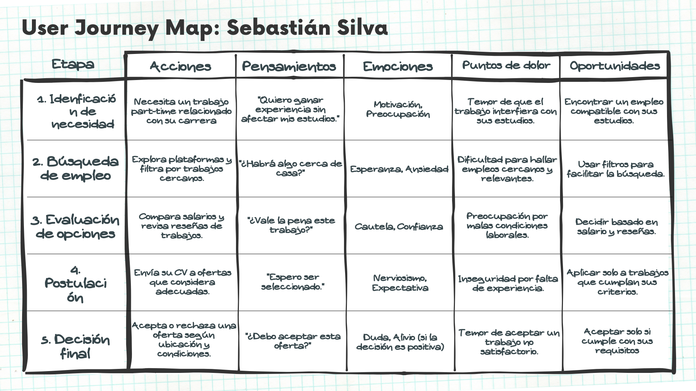
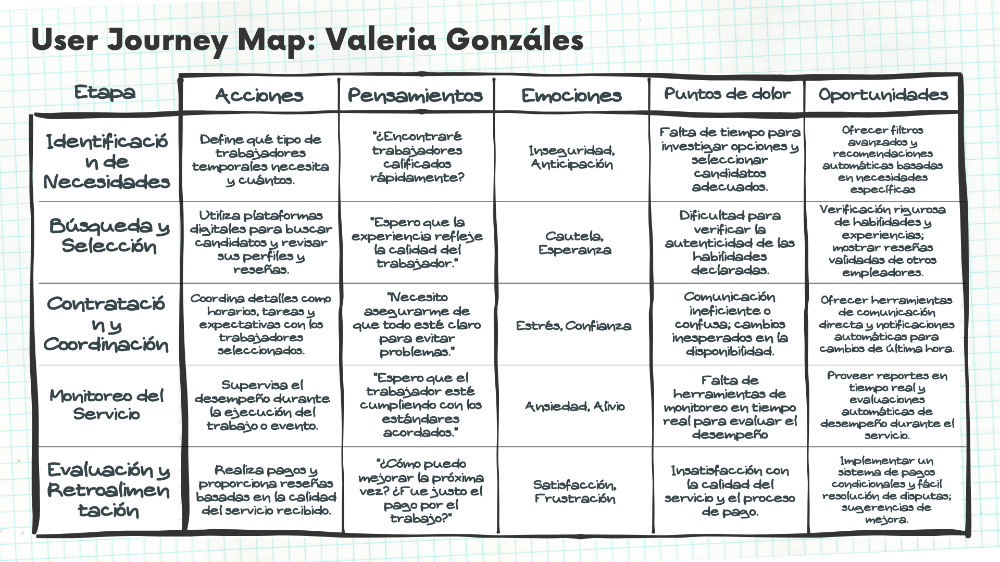
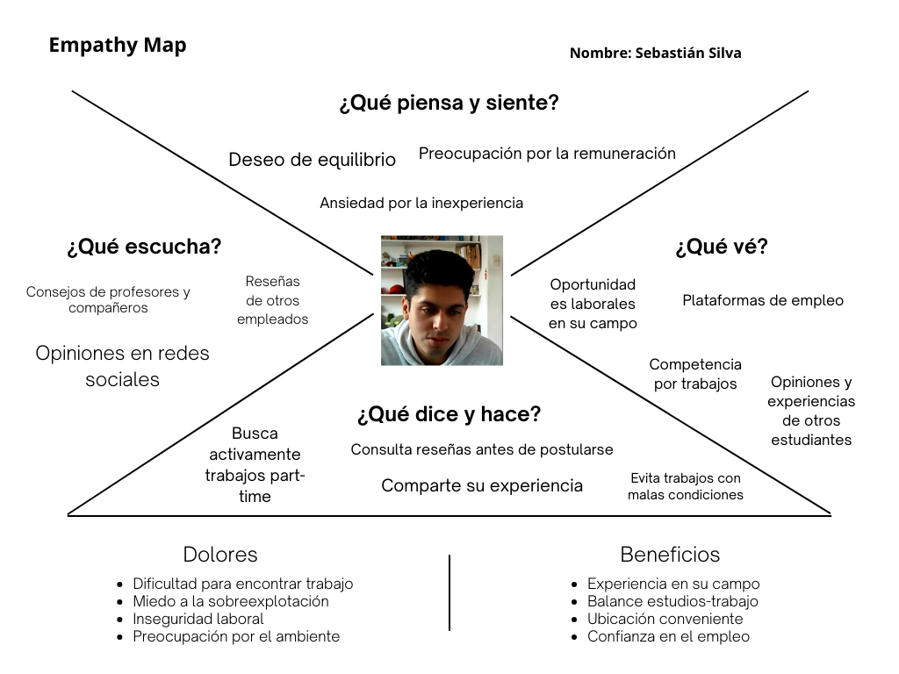
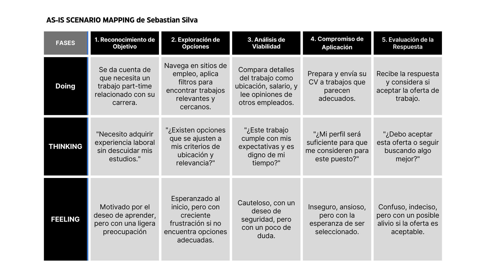

# 
COURSE PROJECT

    <strong>Universidad Peruana de Ciencias Aplicadas</strong> 
    </img> 
    <strong>Ingeniería de Software - 2024-2</strong> 
    <strong>Desarrollo de Aplicaciones Open Source - WX51</strong> 
    <strong>Profesor: Alberto Wilmer Sanchez Seña</strong> 
     <strong>Informe del Trabajo Final</strong>

    <strong>Startup: GPTDevs</strong> 
    <strong>Producto: TaskLinker </strong>

    <h3>Team Members:</h3>
    <table align="center">
        <tr>
            <th style="text-align:center;">Member</th>
            <th style="text-align:center;">Code</th>
        </tr>
        <tr>
            <td>Ramos Najar, Tony Alexander</td>
            <td>U20211A153</td>
        </tr>
        <tr>
            <td>Sanchez Rios, Camila Cristina</td>
            <td>U202210973</td>
        </tr>
        <tr>
            <td>Durand Vera, Gianfranco Angel</td>
            <td>U20201F640</td>
        </tr>
        <tr>
            <td>Chávarri Zarzosa, Daniel Jhared</td>
            <td>U202211108</td>
        </tr>
         <tr>
            <td>Roque Tello, Jack Eddie</td>
            <td>U20221C448</td>
         </tr>
    </table>

    <strong>Agosto, 2024</strong>

 

<h1 align="center">Registro de versiones del Informe</h1>
 
<table>
        <thead>
            <tr>
                <th>Versión</th>
                <th>Fecha</th>
                <th>Autor</th>
                <th>Descripción de modificaciones</th>
            </tr>
        </thead>
        <tbody>
            <tr>
                <th>TB1</th>
                <td>20/08/2024</td>
                <td>
                    <ul>
          <li>Tony Ramos</li>
          <li>Camila Sanchez</li>
          <li>Gianfranco Durand</li>
          <li>Daniel Chávarri</li>
          <li>Jack Roque</li>
                    <ul>
           </td>
      <td>            
             <ul>
          <li>Capítulo I: Introducción</li>
          <li>Capítulo II: Requirements Elicitation & Analysis</li>
          <li>Capítulo III: Requirements Specification</li>
          <li>Capítulo IV: Product Design</li>
          <li>Avance del Capítulo V: Product Implementation, Validation & Deployment hasta el punto 5.2.1.8</li>
          <li>Avance de Conclusiones, Bibliografía y Anexos</li>
        </ul>
      </td>
  </tr>
</tbody>
</table>

# Project Report Collaboration Insights

# Contenido
[Student Outcome](#student-outcome)

[Capítulo I: Introducción](#capítulo-i-introducción)
- [1.1. Startup Profile](#11-startup-profile)
  - [1.1.1. Descripción de la Startup](#111-descripción-de-la-startup)
  - [1.1.2. Perfiles de integrantes del equipo](#112-perfiles-de-integrantes-del-equipo)
- [1.2. Solution Profile](#12-solution-profile)
  - [1.2.1 Antecedentes y problemática](#121-antecedentes-y-problemática)
  - [1.2.2 Lean UX Process](#122-lean-ux-process)
    - [1.2.2.1. Lean UX Problem Statements](#1221-lean-ux-problem-statements)
    - [1.2.2.2. Lean UX Assumptions](#1222-lean-ux-assumptions)
    - [1.2.2.3. Lean UX Hypothesis Statements](#1223-lean-ux-hypothesis-statements)
    - [1.2.2.4. Lean UX Canvas](#1224-lean-ux-canvas)
- [1.3. Segmentos objetivo](#13-segmentos-objetivo)

[Capítulo II: Requirements Elicitation & Analysis](#capítulo-ii-requirements-elicitation--analysis)
- [2.1. Competidores](#21-competidores)
  - [2.1.1. Análisis competitivo](#211-análisis-competitivo)
  - [2.1.2. Estrategias y tácticas frente a competidores](#212-estrategias-y-tácticas-frente-a-competidores)
- [2.2. Entrevistas](#22-entrevistas)
  - [2.2.1. Diseño de entrevistas](#221-diseño-de-entrevistas)
  - [2.2.2. Registro de entrevistas](#222-registro-de-entrevistas)
  - [2.2.3. Análisis de entrevistas](#223-análisis-de-entrevistas)
- [2.3. Needfinding](#23-needfinding)
  - [2.3.1. User Personas](#231-user-personas)
  - [2.3.2. User Task Matrix](#232-user-task-matrix)
  - [2.3.3. User Journey Mapping](#233-user-journey-mapping)
  - [2.3.4. Empathy Mapping](#234-empathy-mapping)
  - [2.3.5. As-is Scenario Mapping](#235-as-is-scenario-mapping)
- [2.4. Ubiquitous Language](#24-ubiquitous-language)

[Capítulo III: Requirements Specification](#capítulo-iii-requirements-specification)
- [3.1. To-Be Scenario Mapping](#31-to-be-scenario-mapping)
- [3.2. User Stories](#32-user-stories)
- [3.3. Impact Mapping](#33-impact-mapping)
- [3.4. Product Backlog](#34-product-backlog)

[Capítulo IV: Product Design](#capítulo-iv-product-design)
- [4.1. Style Guidelines](#41-style-guidelines)
  - [4.1.1. General Style Guidelines](#411-general-style-guidelines)
  - [4.1.2. Web Style Guidelines](#412-web-style-guidelines)
- [4.2. Information Architecture](#42-information-architecture)
  - [4.2.1. Organization Systems](#421-organization-systems)
  - [4.2.2. Labeling Systems](#422-labeling-systems)
  - [4.2.3. SEO Tags and Meta Tag](#423-seo-tags-and-meta-tag)
  - [4.2.4. Searching Systems](#424-searching-systems)
  - [4.2.5. Navigation Systems](#425-navigation-systems)
- [4.3. Landing Page UI Design](#43-landing-page-ui-design)
  - [4.3.1. Landing Page Wireframe](#431-landing-page-wireframe)
  - [4.3.2. Landing Page Mock-up](#432-landing-page-mock-up)
- [4.4. Web Applications UX/UI Design](#44-web-applications-uxui-design)
  - [4.4.1. Web Applications Wireframes](#411-general-style-guidelines)
  - [4.4.2. Web Applications Wireflow Diagrams](#442-web-applications-wireflow-diagrams)
  - [4.4.3. Web Applications Mock-ups](#443-web-applications-mock-ups)
  - [4.4.4. Web Applications User Flow Diagrams](#444-web-applications-user-flow-diagrams)
- [4.5. Web Applications Prototyping](#45-web-applications-prototyping)
- [4.6. Domain-Driven Software Architecture](#46-domain-driven-software-architecture)
  - [4.6.1. Software Architecture Context Diagram](#461-software-architecture-context-diagram)
  - [4.6.2. Software Architecture Container Diagrams](#462-software-architecture-container-diagrams)
  - [4.6.3. Software Architecture Components Diagrams](#463-software-architecture-components-diagrams)
- [4.7. Software Object-Oriented Design](#47-software-object-oriented-design)
  - [4.7.1. Class Diagrams](#471-class-diagrams)
  - [4.7.2. Class Dictionary](#472-class-dictionary)
- [4.8. Database Design](#48-database-design)
  - [4.8.1. Database Diagram](#481-database-diagram)

[Capítulo V: Product Implementation, Validation & Deployment](#capítulo-v-product-implementation-validation--deployment)
- [5.1. Software Configuration Management](#51-software-configuration-management)
  - [5.1.1. Software Development Environment Configuration](#511-software-development-environment-configuration)
  - [5.1.2. Source Code Management](#512-source-code-management)
  - [5.1.3. Source Code Style Guide & Conventions](#513-source-code-style-guide--conventions)
  - [5.1.4. Software Deployment Configuration](#514-software-deployment-configuration)
- [5.2. Landing Page, Services & Applications Implementation](#52-landing-page-services--applications-implementation)
  - [5.2.X. Sprint ](#52x-sprint)
    - [5.2.X.1. Sprint Planning n](#52x1-sprint-planning-n)
    - [5.2.X.2. Sprint Backlog n](#52x2-sprint-backlog-n)
    - [5.2.X.3. Development Evidence for Sprint Review](#52x3-development-evidence-for-sprint-review)
    - [5.2.X.4. Testing Suite Evidence for Sprint Review](#52x4-testing-suite-evidence-for-sprint-review)
    - [5.2.X.5. Execution Evidence for Sprint Review](#52x5-execution-evidence-for-sprint-review)
    - [5.2.X.6. Services Documentation Evidence for Sprint Review](#52x6-services-documentation-evidence-for-sprint-review)
    - [5.2.X.7. Software Deployment Evidence for Sprint Review](#52x7-software-deployment-evidence-for-sprint-review)
    - [5.2.X.8. Team Collaboration Insights during Sprint](#52x8-team-collaboration-insights-during-sprint)
- [5.3. Validation Interviews](#53-validation-interviews)
  - [5.3.1. Diseño de Entrevistas](#531-diseño-de-entrevistas)
  - [5.3.2. Registro de Entrevistas](#532-registro-de-entrevistas)
  - [5.3.3. Evaluaciones según heurísticas](#533-evaluaciones-según-heurísticas)
- [5.4. Video About-the-Product](#54-video-about-the-product)

[Conclusiones](#conclusiones)
- [Conclusiones y recomendaciones](#conclusiones-y-recomendaciones)
- [Video About-the-Team](#video-about-the-team)

[Bibliografía](#bibliografía)

[Anexos](#anexos)

# Student Outcome
ABET – EAC - Student Outcome 3

Criterio: Capacidad de comunicarse efectivamente con un rango de audiencias

Criterio: Capacidad de comunicarse efectivamente con un rango de audiencias

<table>
  <tr>
    <td><b>Criterio específico</b></td>
    <td><b>Acciones realizadas</b></td>
    <td><b>Conclusiones</b></td>
  </tr>
    </thead>
  <tbody>
    <tr>
      <td><b>Comunica oralmente con
efectividad a diferentes rangos
de audiencia.</b></td>
      <td>
        
<b>Ramos Najar, Tony Alexander  </b>

        
<b>TB1:</b>

        
.

        
<b>TP1:</b>

        
.

        
<b>TB2:</b>

        
.

        
<b>TF:</b>

        
.

        
<b>Sanchez Rios, Camila Cristina</b>

       
<b>TB1:</b>

        
.

        
<b>TP1:</b>

        
.

        
<b>TB2:</b>

        
.

        
<b>TF:</b>

        
.

        
<b>Durand Vera, Gianfranco Angel</b>

        
<b>TB1:</b>

        
.

        
<b>TP1:</b>

        
.

        
<b>TB2:</b>

        
.

        
<b>TF:</b>

        
.

        
<b>Chávarri Zarzosa, Daniel Jhared</b>

       
<b>TB1:</b>

        
.

        
<b>TP1:</b>

        
.

        
<b>TB2:</b>

        
.

        
<b>TF:</b>

        
.

        
<b>Roque Tello, Jack Eddie</b>

       
<b>TB1:</b>

        
.

        
<b>TP1:</b>

        
.

        
<b>TB2:</b>

        
.

        
<b>TF:</b>

        
.

      </td>
      <td>
        
<strong>TB1:</strong>

        
En conclusión, .

        
<strong>TP1:</strong>

        
En resumen, .

        
<strong>TB2:</strong>

        
En conclusión, 

        
<strong>TF:</strong>

        
En conclusión, .

      </td>
    </tr>
    <tr>
      <td>Comunica por escrito con
efectividad a diferentes rangos
de audiencia.</td>
      <td>
        
<b>Ramos Najar, Tony Alexander  </b>

        
<b>TB1:</b>

        
.

        
<b>TP1:</b>

        
.

        
<b>TB2:</b>

        
.

        
<b>TF:</b>

        
.

        
<b>Sanchez Rios, Camila Cristina</b>

       
<b>TB1:</b>

        
.

        
<b>TP1:</b>

        
.

        
<b>TB2:</b>

        
.

        
<b>TF:</b>

        
.

        
<b>Durand Vera, Gianfranco Angel</b>

        
<b>TB1:</b>

        
.

        
<b>TP1:</b>

        
.

        
<b>TB2:</b>

        
.

        
<b>TF:</b>

        
.

        
<b>Chávarri Zarzosa, Daniel Jhared</b>

       
<b>TB1:</b>

        
.

        
<b>TP1:</b>

        
.

        
<b>TB2:</b>

        
.

        
<b>TF:</b>

        
.

        
<b>Roque Tello, Jack Eddie</b>

       
<b>TB1:</b>

        
.

        
<b>TP1:</b>

        
.

        
<b>TB2:</b>

        
.

        
<b>TF:</b>

        
.

      </td>
       <td>
        
<strong>TB1:</strong>

        
En conclusión, .

        
<strong>TP1:</strong>

        
En resumen, .

        
<strong>TB2:</strong>

        
En conclusión, 

        
<strong>TF:</strong>

        
En conclusión, .

      </td>
    </tr>
  </tbody>
</table>

# Capítulo I: Introducción
## 1.1. Startup Profile
### 1.1.1. Descripción de la Startup
"TaskLinker" es una innovadora plataforma web que facilita la conexión entre personas que buscan ingresos adicionales laborando por horas y quienes requieren contratar servicios temporales o para tareas específicas. Dirigida a estudiantes, amas de casa, jubilados y cualquier persona interesada en trabajos por horas, TaskLinker actúa como un puente efectivo y confiable entre la oferta y la demanda en el mercado laboral peruano. A través de nuestra plataforma, tanto individuos como organizaciones pueden encontrar soluciones rápidas y eficientes para sus necesidades, optimizando el uso de la fuerza laboral disponible y promoviendo la flexibilidad en el empleo.

La misión de TaskLinker es empoderar a las personas con oportunidades de trabajo flexible, permitiéndoles generar ingresos adicionales en sus propios términos. Al mismo tiempo, buscamos proporcionar a las organizaciones e individuos una herramienta eficiente para encontrar y contratar rápidamente talento adecuado para sus necesidades temporales o específicas.

Nuestra visión es convertirnos en la plataforma líder en Perú para la contratación de trabajos por horas y servicios temporales, siendo reconocidos por nuestra capacidad para conectar de manera efectiva a las personas con oportunidades de ingresos adicionales. Aspiramos a expandir nuestro impacto, promoviendo un mercado laboral más dinámico, inclusivo y flexible, donde cada persona pueda acceder fácilmente a oportunidades laborales que se ajusten a su estilo de vida y necesidades, mientras que las organizaciones logran satisfacer sus demandas con rapidez y precisión.

### 1.1.2. Perfiles de integrantes del equipo
<table>
  <tr>
    <th>
      
    </th>
    <td valign="top">
      
<b>Ramos Najar, Tony Alexander</b>

      

        Mi nombre es Tony Ramos, estoy cursando el 8vo ciclo de la carrera de Ingeniería de Software. Me considero hábil en el ámbito de la programación en los lenguajes, Python, Javascript, y últimamente estoy aprendiendo Angular. Con respeto a mi, me considero una persona responsable, con ganas de aprender y a superarme a mi mismo
      

    </td>
  </tr>
  <tr>
    <th>
      
    </th>
    <td valign="top">
      
<b>Sánchez Ríos, Camila Cristina</b>

      

        Soy estudiante de la carrera de Ingeniería de Software en la Universidad Peruana de Ciencias Aplicadas, actualmente me encuentro en el cuarto ciclo. Me gusta escuchar música y leer en los ratos libres y aprender más sobre la carrera.
      

    </td>
  </tr>
  <tr>
    <th>
      
    </th>
    <td valign="top">
      
<b>Durand Vera, Gianfranco Ángel</b>

      

        Soy estudiante de la carrera de Ingeniería de Software en la Universidad Peruana de Ciencias Aplicadas, actualmente me encuentro en el sexto ciclo, escogí esta carrera porque me gusta mucho la programación. Tengo experiencia en lenguajes de programación como C++, C#, Python, Kotlin y JavaScript.
      

    </td>
  </tr>
  <tr>
    <th>
      
    </th>
    <td valign="top">
      
<b>Chávarri Zarzosa, Daniel Jhared</b>

      

       ...
      

    </td>
  </tr>
  <tr>
    <th>
      
    </th>
    <td valign="top">
      
<b>Roque Tello, Jack Eddie</b>

      

        ...
      

    </td>
  </tr>
</table>
 

## 1.2. Solution Profile
### 1.2.1 Antecedentes y problemática
En el mercado laboral peruano, existe una creciente demanda de trabajos temporales y por horas, impulsada tanto por trabajadores que buscan flexibilidad como por empleadores que requieren soluciones rápidas para tareas específicas. No obstante, la falta de una plataforma centralizada ha dificultado la conexión eficiente entre ambas partes, lo que resulta en una subutilización del talento disponible y en procesos de contratación ineficaces.

**5W y 2H**

- **Who (Quién):** 

Los trabajadores objetivo de TaskLinker incluyen estudiantes, amas de casa, jubilados y personas con empleo parcial que buscan ingresos adicionales sin comprometer sus horarios. Por otro lado, los empleadores incluyen pequeñas y medianas empresas (PyMEs), particulares, organizadores de eventos, y startups que necesitan contratar personal temporal de manera rápida y eficiente.

- **What (Qué):**

TaskLinker es una plataforma web que facilita la conexión entre personas que buscan trabajo temporal por horas y empleadores que necesitan contratar servicios específicos. La plataforma ofrece una solución centralizada que permite a ambas partes encontrar rápidamente lo que necesitan, ya sea una oportunidad de trabajo flexible o personal temporal calificado.

- **Where (Dónde):**

La plataforma opera principalmente en el mercado laboral peruano, donde existe una alta demanda de trabajos temporales y por horas. TaskLinker está diseñada para ser accesible desde cualquier dispositivo con conexión a internet, lo que la hace disponible en cualquier lugar dentro del ámbito nacional.

- **When (Cuándo):**

La necesidad de TaskLinker surge en un contexto donde la economía y el mercado laboral están en constante cambio, con un aumento en la demanda de flexibilidad tanto por parte de trabajadores como de empleadores. Esta plataforma es especialmente útil en momentos de alta demanda laboral temporal, como durante eventos especiales o picos estacionales de trabajo.

- **Why (Por qué):**

La falta de una plataforma centralizada que conecte de manera efectiva a trabajadores temporales con empleadores ha llevado a una subutilización de la fuerza laboral disponible y a ineficiencias en el proceso de contratación. TaskLinker responde a esta problemática proporcionando una solución que simplifica y agiliza la búsqueda de trabajo temporal y la contratación de personal por horas, beneficiando a ambos lados del mercado.

-  **How (Cómo):**

TaskLinker funciona a través de una plataforma en línea intuitiva donde los trabajadores pueden crear perfiles, buscar y postularse a trabajos que se ajusten a sus habilidades y disponibilidad. Los empleadores pueden publicar tareas o proyectos específicos y acceder a una base de trabajadores calificados de manera rápida. La plataforma integra un sistema de evaluaciones y reputación para garantizar la confianza y transparencia en las interacciones. El modelo de negocio se sustenta en dos esquemas principales: una comisión por transacción, que se cobra cuando un trabajador es contratado y completa un trabajo, y un plan de suscripción premium, que elimina las comisiones y ofrece beneficios adicionales como priorización en los listados y acceso a tareas exclusivas.

- **How Much (Cuánto):**

En el esquema de comisión por transacción, TaskLinkera cobra una pequeña comisión proporcional al valor del trabajo, la cual se descuenta automáticamente una vez que el trabajo es completado y pagado. Por otro lado, el plan de suscripción premium tiene un costo fijo que elimina estas comisiones por transacción y brinda acceso a funcionalidades avanzadas, como la priorización en los listados, acceso a tareas exclusivas, y herramientas de gestión mejoradas. Este modelo de negocio está diseñado para ser accesible y rentable, permitiendo a los usuarios elegir la opción que mejor se adapte a sus necesidades y volumen de trabajo.

#### 1.2.2.3. Lean UX Hypothesis Statements

#### 1.2.2.4. Lean UX Canvas

## 1.3. Segmentos objetivo

**1. Trabajadores que buscan ingresos adicionales y flexibilidad:**
Este segmento incluye a estudiantes que necesitan ingresos para cubrir sus estudios o gastos personales sin afectar sus horarios académicos, amas de casa que desean contribuir económicamente sin comprometer sus responsabilidades en el hogar, jubilados que buscan mantenerse activos y generar ingresos extra, y personas con empleo parcial que desean complementar sus ingresos. Todos ellos valoran la flexibilidad que les ofrece TaskLinker, permitiéndoles encontrar oportunidades laborales que se adapten a su tiempo y necesidades específicas.

**2. Empleadores que requieren soluciones laborales temporales:**

Este segmento abarca a pequeñas y medianas empresas (PyMEs) que necesitan personal temporal para cubrir picos de trabajo o tareas específicas, particulares que requieren servicios domésticos, reparaciones, o tareas puntuales sin compromiso a largo plazo, organizadores de eventos que necesitan personal por horas para diferentes funciones como catering o atención al cliente, y startups que demandan flexibilidad en la contratación para adaptarse al ritmo dinámico de su crecimiento. Estos empleadores buscan soluciones rápidas, confiables y eficientes para satisfacer sus necesidades laborales temporales.

# Capítulo II: Requirements Elicitation & Analysis

## 2.1. Competidores

### 2.1.1. Análisis competitivo

- **Bumeran**

Bumeran es una de las principales bolsas de trabajo en América Latina, con una fuerte presencia en países como Argentina, México, Perú y otros. La plataforma facilita la búsqueda de empleo en diversas categorías, incluyendo trabajos temporales y por horas.

[Bumeran Perú](https://www.bumeran.com.pe/)

- **Computrabajo**

Computrabajo es una de las bolsas de trabajo más grandes en América Latina, con una sólida presencia en Perú y otros países de la región. La plataforma ofrece una amplia gama de empleos, incluidos trabajos temporales y por horas

[Computrabajo](https://pe.computrabajo.com/)

- **Indeed**

Indeed es una plataforma global de búsqueda de empleo que agrega ofertas de trabajo de diversas fuentes, incluyendo bolsas de trabajo, sitios de empresa y anuncios clasificados. Fundada en 2004, Indeed se ha consolidado como uno de los motores de búsqueda de empleo más grandes del mundo, con una presencia significativa en numerosos países, incluyendo Perú y América Latina.

[Indeed](https://pe.indeed.com/)

#### **Comparativa con Competidores**

|               | TaskLinker                                                     | Bumeran                                                          | Computrabajo                                                      | Indeed                                                            |
|---------------|----------------------------------------------------------------|------------------------------------------------------------------|-------------------------------------------------------------------|-------------------------------------------------------------------|
| **Perfil**    | Plataforma web que conecta a personas que buscan ingresos adicionales con quienes necesitan contratar servicios temporales o específicos. | Bolsa de trabajo líder en América Latina con una amplia base de datos de empleos. | Bolsa de trabajo con fuerte presencia en Perú y otros países de América Latina. | Motor de búsqueda de empleo global con presencia significativa en América Latina. |
| **Overview**  | Facilita la conexión entre individuos interesados en trabajos por horas y organizaciones que requieren servicios temporales. | Plataforma que facilita la búsqueda y publicación de empleos en diversas categorías, incluyendo trabajos temporales y por horas. | Plataforma que ofrece una variedad de empleos, desde trabajos permanentes hasta temporales y por horas. | Agrega ofertas de empleo de diversas fuentes y permite buscar y aplicar a trabajos en una amplia gama de categorías. |
| **Ventaja competitiva** ¿Qué valor ofrece a los clientes? | Especialización en trabajos por horas y temporales, facilitando la conexión directa entre oferta y demanda. | Amplia red de usuarios y empleadores en varios países de América Latina, con una variedad de empleos disponibles. | Herramientas efectivas para empleadores y candidatos con una fuerte presencia local en Perú. | Búsqueda integral de empleos con una amplia base de datos y la capacidad de aplicar a trabajos globalmente. |
| **Perfil de Marketing** |                                                                  |                                                                  |                                                                   |                                                                   |
| **Mercado objetivo** | Estudiantes, amas de casa, jubilados y personas interesadas en trabajos por horas en Perú. | Empresas y candidatos en busca de empleos temporales y por horas en América Latina. | Empresas y candidatos en Perú buscando empleos temporales y por horas. | Candidatos y empleadores globales y locales en busca de una amplia gama de oportunidades laborales. |
| **Estrategias de Marketing** | Promoción a través de redes sociales y colaboraciones con instituciones educativas y organizaciones locales. | Publicidad en medios digitales y colaboraciones con empresas de recursos humanos y consultoras. | Marketing digital enfocado en la búsqueda de empleo local y colaboración con empresas. | Publicidad en línea y optimización para motores de búsqueda, así como herramientas avanzadas para empleadores. |
| **Perfil de Producto** |                                                                  |                                                                  |                                                                   |                                                                   |
| **Productos y Servicios** | Plataforma para encontrar y ofrecer trabajos temporales y por horas, con herramientas de gestión para empleadores y candidatos. | Publicación de ofertas de empleo, búsqueda y filtrado de trabajos en varias categorías. | Publicación de ofertas de empleo, herramientas de gestión para empleadores y alertas de empleo. | Agregación de ofertas de empleo, herramientas para publicación y promoción de anuncios, y recursos adicionales para candidatos. |
| **Precios y Costos** | Modelos de suscripción para empresas y opciones de publicación para trabajos específicos. | Precios varían según el tipo de publicación y servicios adicionales. | Costos para publicación de ofertas y servicios premium para empresas. | Costos de patrocinio de anuncios y servicios premium para empleadores. |
| **Canales de Distribución** | Página web. | Página web, aplicaciones móviles. | Página web, aplicaciones móviles. | Página web, aplicaciones móviles. |
| **Análisis FODA** |                                                                  |                                                                  |                                                                   |                                                                   |
| **Fortalezas** | Especialización en trabajos por horas y temporales, facilitando una conexión directa y eficiente. | Amplia cobertura en América Latina y variedad de empleos disponibles. | Fuerte presencia local en Perú con herramientas efectivas para búsqueda de empleo. | Amplia base de datos global y funcionalidad avanzada para la búsqueda y aplicación de empleos. |
| **Debilidades** | Limitada cobertura comparada con competidores más grandes; dependencia en la adopción local. | Competencia elevada y falta de especialización en trabajos por horas. | Competencia elevada y falta de especialización en nichos específicos. | Alta competencia global y menos enfoque en trabajos temporales específicos. |
| **Oportunidades** | Expansión en el mercado de trabajos temporales en Perú y potencial de crecimiento en América Latina. | Expansión en el mercado de trabajos temporales y por horas en América Latina. | Oportunidades para mejorar la especialización en trabajos temporales y por horas. | Expansión de servicios y optimización para la búsqueda de trabajos específicos por horas y temporales. |
| **Amenazas** | Competencia de plataformas globales y locales que ofrecen servicios similares. | Plataformas globales y locales que ofrecen servicios similares. | Competencia de otras bolsas de trabajo locales y globales. | Competencia de plataformas globales con amplias bases de datos y funcionalidades avanzadas. |

### 2.1.2. Estrategias y tácticas frente a competidores

Para destacar frente a la competencia, TaskLinker se enfocará en proporcionar una visibilidad clara y accesible de oportunidades laborales flexibles, ofrecer un modelo de remuneración competitivo para atraer tanto a trabajadores como a empleadores, colaborar con instituciones y organizaciones locales para ampliar su alcance, resaltar las ofertas más recientes y relevantes en la plataforma, y garantizar la confianza y transparencia mediante un sistema robusto de calificaciones y reseñas.

## 2.2. Entrevistas

### 2.2.1. Diseño de entrevistas

*Preguntas para el segmento objetivo 1: Trabajadores que buscan ingresos adicionales y flexibilidad*

#### 1. ¿Qué tipo de trabajos por horas te interesan más y por qué?  
##### Objetivo: Identificar las preferencias y áreas de interés laboral.

#### 2. ¿Cuántas horas a la semana estás dispuesto/a a trabajar y qué horarios te resultan más convenientes?  
##### Objetivo: Entender la disponibilidad y flexibilidad.

#### 3. ¿Qué factores consideras más importantes al elegir un trabajo por horas?  
##### Objetivo: Conocer los criterios clave en la toma de decisiones laborales.

#### 4. ¿Has utilizado anteriormente plataformas similares para encontrar trabajos por horas? Si es así, ¿qué te gustó o no te gustó de ellas?  
##### Objetivo: Evaluar la experiencia previa y expectativas sobre plataformas de empleo.

#### 5. ¿Qué tipo de apoyo o recursos te gustaría recibir de una plataforma de trabajos por horas para facilitar tu búsqueda de empleo?  
##### Objetivo: Identificar necesidades adicionales que podrían mejorar la experiencia.

#### 6. ¿Cuáles son tus principales preocupaciones o desafíos al buscar trabajos por horas?  
##### Objetivo: Detectar barreras o problemas comunes en la búsqueda de empleo.

#### 7. ¿Qué tan importante es para ti la posibilidad de calificar y dejar reseñas sobre las oportunidades laborales y empleadores?  
##### Objetivo: Evaluar la importancia de la transparencia y el feedback en la plataforma.

  
*Preguntas para el segmento objetivo 2: Empleadores que requieren soluciones laborales temporales*

#### 1. ¿Qué tipo de servicios temporales o especializados sueles necesitar con mayor frecuencia?
##### Objetivo: Identificar los tipos de servicios más demandados.

#### 2. ¿Qué criterios utilizas para seleccionar a un trabajador o proveedor de servicios temporales?
##### Objetivo: Comprender los factores clave en la selección de proveedores de servicios.

#### 3. ¿Cuál es tu experiencia previa al contratar servicios temporales a través de plataformas digitales? ¿Qué aspectos fueron positivos o negativos?
##### Objetivo: Obtener información sobre experiencias pasadas y expectativas sobre la plataforma.

#### 4. ¿Qué nivel de flexibilidad esperas en cuanto a horarios y disponibilidad de los trabajadores que contratas?
##### Objetivo: Entender las expectativas de flexibilidad y adaptabilidad.

#### 5. ¿Qué importancia le das a la capacidad de revisar perfiles y leer reseñas antes de contratar a alguien?
##### Objetivo: Evaluar la relevancia de la transparencia y la información de la plataforma.

#### 6. ¿Qué problemas o desafíos has enfrentado al contratar servicios temporales y cómo te gustaría que una plataforma los resolviera?
##### Objetivo: Identificar problemas comunes y posibles soluciones que la plataforma podría ofrecer.

#### 7. ¿Cómo prefieres gestionar el proceso de contratación y pago (por ejemplo, a través de la plataforma, de forma directa, etc.)?
##### Objetivo: Entender las preferencias en la gestión de la contratación y los pagos.

### 2.2.2. Registro de entrevistas

## Entrevista #1 

**Nombre:** Sebastian Silva

**Segmento objetivo perteneciente:** Trabajadores que buscan ingresos adicionales y flexibilidad

[Entrevista 1 - video](https://drive.google.com/file/d/1hcTIO_iKWuJBhMhqibhFp9EVkvvag9VR/view?usp=sharing)

**Duración de la entrevista:** 5:50

## Entrevista #2 

**Nombre:** Sandy Ingaruca

**Segmento objetivo perteneciente:** Empleadores que requieren soluciones laborales temporales

[Entrevista 2 - video](https://drive.google.com/file/d/1P-LY7ZTOfnj-71BLL2_X4Ol6UZSEEiXa/view?usp=sharing)

**Duración de la entrevista:** 5:42

### 2.2.3. Análisis de entrevistas

*Entrevista 1:*

Sebastián Silva es un estudiante de ingeniero de software y tiene 20 años, debido a que actualmente se encuentra estudiando una carrera universitaria, Sebastián preferiblemente está decidido a buscar un trabajo part-time, para que no se descuide del estudio y pueda ganar experiencia siempre y cuando hayan vacantes de puestos de trabajos en el ámbito de su carrera, está dispuesto a trabajar mínimo 48 horas a la semana full time, y mínimo 24 horas part-time a la semana, considera que el factor mas importante es la actividad a realizar para ver si es conveniente con respecto a la paga, además tiene claro de que no debe arriesgar a aceptar un trabajo sobrexplotado para ganar muy menos de lo remunerado, le gustaría recibir ayuda de una sitio web especial encargado de búsqueda de trabajos por horas, además de la ubicación que sea cercana a su residencia actual. Le preocupa que al no laburar en un lugar tan céntrico, no exista un ámbito agradable y que se encuentre lejos de su hogar. Por ultimo, a él le fascina las opiniones, por ende necesita ver reseñas de una determinada aplicación o sitio web para poder confiar

*Entrevista 2:*

Sandy Ingaruca, empleadora, necesita con frecuencia servicios temporales de soporte administrativo como digitación de datos y atención al cliente durante temporadas altas, personal para eventos corporativos (asistentes logísticos, técnicos de sonido e iluminación), y trabajadores especializados en limpieza profunda o mantenimiento para proyectos específicos. Al seleccionar trabajadores, prioriza la experiencia comprobable, la flexibilidad horaria, la disponibilidad inmediata, y las reseñas positivas de otros empleadores. Su experiencia con plataformas digitales ha sido mixta: valora la facilidad y agilidad del proceso, pero ha enfrentado problemas como la falta de verificación de habilidades y cambios de última hora en la disponibilidad del personal. La flexibilidad es esencial, ya que necesita trabajadores dispuestos a trabajar en horarios no convencionales y a aceptar tareas con poca antelación. También otorga gran importancia a la revisión de perfiles detallados y reseñas antes de contratar. Entre los desafíos enfrentados, menciona la inconsistencia en la calidad del trabajo y la dificultad para gestionar cambios de última hora, por lo que preferiría que la plataforma ofreciera garantías de calidad y opciones de reemplazo. Además, prefiere gestionar la contratación y el pago completamente a través de la plataforma para garantizar seguridad y simplificación del proceso administrativo.

## 2.3. Needfinding

### 2.3.1. User Personas

#### User Persona 1: Sebastián Silva, Trabajador

#### User Persona 2: Valeria Gonzáles, Empleadora

### 2.3.2. User Task Matrix

#### User Task Matrix: Sebastián Silva

| **User Tasks**                                              | **Prioridad** | **Frecuencia** | **Contexto de Uso**                                             | **Notas**                                                                 |
|-------------------------------------------------------------|---------------|----------------|------------------------------------------------------------------|----------------------------------------------------------------------------|
| **Buscar trabajos de medio tiempo relacionados con su carrera** | Alta          | Frecuente       | En su laptop o móvil, principalmente en su tiempo libre o fines de semana. | Sebastián está constantemente buscando oportunidades que le permitan obtener experiencia relevante sin interferir con sus estudios. |
| **Filtrar ofertas de trabajo por ubicación cercana**        | Alta          | Frecuente       | Al utilizar plataformas de búsqueda de empleo.                   | Prefiere trabajar cerca de su hogar para evitar largos desplazamientos.   |
| **Consultar reseñas de empleos o empleadores**              | Alta          | Frecuente       | Antes de postularse a un empleo, ya sea desde su laptop o móvil. | Confía en las opiniones de otros para asegurarse de que el lugar de trabajo tiene buenas condiciones y ambiente. |
| **Postularse a empleos**                                    | Media         | Ocasional       | Después de haber revisado y seleccionado una oferta adecuada.    | Solo aplica a empleos que cumplen con sus criterios de ubicación, horas y reseñas positivas. |
| **Comparar la remuneración ofrecida con el esfuerzo requerido** | Alta          | Ocasional       | Al revisar una oferta de trabajo.                                | Sebastián evalúa si la paga justifica el esfuerzo y las horas que dedicará al trabajo. |
| **Guardar trabajos interesantes para revisarlos más tarde** | Media         | Ocasional       | Cuando encuentra varias ofertas que le parecen interesantes.     | Le gusta guardar opciones para evaluar con calma y tomar una decisión informada. |
| **Configurar alertas para nuevas ofertas de trabajo**       | Baja          | Ocasional       | Cuando se inscribe en una plataforma de búsqueda de empleo.      | Le gustaría recibir notificaciones de nuevas ofertas que se ajusten a sus criterios. |
| **Investigar más sobre la empresa contratante**             | Media         | Ocasional       | Antes de aplicar o aceptar una oferta de trabajo.                | Quiere asegurarse de que la empresa tiene una buena reputación y ofrece un ambiente laboral saludable. |

#### User Task Matrix: Valeria Gonzáles

| **User Task**                                            | **Prioridad** | **Frecuencia** | **Contexto de Uso**                                                                                     | **Notas**                                                                                                                                                    |
|----------------------------------------------------------|---------------|----------------|----------------------------------------------------------------------------------------------------------|--------------------------------------------------------------------------------------------------------------------------------------------------------------|
| **Buscar trabajadores temporales calificados**           | Alta          | Alta           | Al inicio de cada temporada alta, evento o proyecto específico.                                           | Valeria usa plataformas digitales para filtrar candidatos por experiencia, habilidades y reseñas; necesita verificación de habilidades más rigurosa.           |
| **Contratar y coordinar personal temporal**              | Alta          | Alta           | Después de identificar candidatos potenciales; importante durante la planificación de eventos o picos de trabajo. | Requiere una plataforma que permita la coordinación eficiente de detalles como horarios y expectativas. Le gustaría tener opciones para manejar cambios inesperados. |
| **Gestionar pagos y evaluar el servicio**                | Media         | Media          | Una vez finalizado el servicio; crucial para garantizar calidad y eficiencia en los pagos.                 | Valeria prefiere realizar pagos a través de la plataforma, pero necesita un sistema de pago que brinde seguridad ante insatisfacción con el servicio.          |
| **Planificar y ajustar la contratación según necesidades**| Media         | Media          | Durante la planificación de personal para diferentes proyectos o temporadas de trabajo.                    | Necesita una herramienta que facilite la previsión de necesidades y ajuste de contrataciones de forma ágil y flexible.                                        |
| **Evaluar y mejorar el proceso de contratación**         | Baja          | Baja           | Periódicamente, después de varias contrataciones o al final de una temporada alta o evento.                | Requiere tiempo para analizar el proceso de contratación y evaluar experiencias pasadas; prefiere que la plataforma ofrezca resúmenes automáticos y sugerencias.|
| **Monitorear el desempeño durante el servicio**          | Alta          | Media          | Durante la ejecución del servicio, especialmente en eventos o proyectos críticos.                          | Necesita herramientas de seguimiento y reportes en tiempo real para asegurar la calidad del trabajo y corregir problemas rápidamente.                         |
| **Manejar cancelaciones o cambios de última hora**       | Alta          | Media          | Cuando hay cancelaciones inesperadas o cambios en la disponibilidad de los trabajadores.                   | Le gustaría una funcionalidad que facilite la búsqueda rápida de reemplazos y notificaciones automáticas de cambios.                                           |
| **Mantener comunicación constante con los trabajadores** | Media         | Alta           | Durante la contratación y el desarrollo del servicio; importante para coordinación y aclaraciones.         | Valeria valora una comunicación fluida y rápida para evitar malentendidos y asegurar que se cumplan los requisitos del trabajo.                               |
| **Gestionar documentación y contratos**                  | Media         | Baja           | Al contratar trabajadores y al finalizar proyectos; necesario para temas legales y administrativos.         | Necesita funcionalidades en la plataforma que permitan manejar documentación de contratos de forma segura y accesible.                                        |
| **Realizar reportes y análisis post-evento o temporada** | Baja          | Baja           | Al finalizar una temporada alta o evento; útil para planificar futuras contrataciones y mejoras.            | Valeria busca herramientas de análisis y reportes detallados que faciliten la evaluación del desempeño y eficiencia de los trabajadores.                      |

### 2.3.3. User Journey Mapping

User Journey Mapping: Sebastián Silva

User Journey Mapping: Valeria Gonzáles

### 2.3.4. Empathy Mapping

#### Empathy Map: Sebastián Silva

### 2.3.5. As-is Scenario Mapping

## 2.4. Ubiquitous Language

En esta sección se muestra el Ubiquitous Language, el cual es un lenguaje común que se utiliza en el desarrollo de software para garantizar una comunicación efectiva entre los miembros del equipo de desarrollo y los stakeholders. El Ubiquitous Language se basa en un conjunto de términos y conceptos compartidos que se utilizan de manera consistente en todo el proceso de desarrollo de software. A continuación, se presentan algunos términos y conceptos clave relacionados con TaskLinker:

1. **TaskLinker:**
Una plataforma web que conecta a personas que buscan ingresos adicionales laborando por horas con aquellos que necesitan contratar servicios temporales o para tareas específicas. Está dirigida al mercado laboral peruano, especialmente a estudiantes, amas de casa, jubilados y cualquier persona interesada en trabajos por horas.

2. **Task Seeker: (Buscador de Tareas):**
Individuos que buscan oportunidades de trabajo por horas para generar ingresos adicionales, ya sea para complementar sus ingresos actuales o para tener una mayor flexibilidad en su vida laboral.

3. **Task Provider: (Proveedora de Tareas):**
Organizaciones o individuos que necesitan contratar servicios temporales o tareas específicas, buscando soluciones rápidas y eficaces para satisfacer sus necesidades a corto plazo.

4. **Hourly Job: (Trabajo por Horas):**
Tareas o trabajos específicos que se remuneran por el tiempo dedicado, generalmente orientados a periodos cortos y de naturaleza temporal. Estas tareas pueden variar en duración y frecuencia según las necesidades del Task Provider

5. **Flexible Work: (Trabajo Flexible):**
Oportunidades laborales que permiten a los Task Seekers ajustar sus horarios y condiciones laborales según su disponibilidad y preferencias, ofreciendo un equilibrio entre vida personal y trabajo.

6. **Booking: (Reserva):**
El proceso mediante el cual los Task Providers seleccionan y reservan Task Seekers para realizar trabajos específicos, asegurando que el talento adecuado esté disponible cuando sea necesario.

7. **Review System: (Sistema de Reseñas):**
Una característica de TaskLinker que permite a los Task Seekers y Task Providers dejar opiniones y calificaciones sobre sus experiencias, ayudando a otros usuarios a tomar decisiones informadas al contratar o aceptar tareas.

8. **Transaction Fee: (Tarifa por Transacción):**
Una tarifa impuesta por TaskLinker a los Task Providers cada vez que se completa una tarea o se efectúa una contratación a través de la plataforma, garantizando un modelo de negocio sostenible.

9. **Commission Fee: (Tarifa de Comisión):**
Una tarifa aplicada por TaskLinker sobre los ingresos generados por los Task Seekers, asegurando una compensación justa por el uso de la plataforma y los servicios que ofrece.

10. **Job Matching: (Emparejamiento de Trabajos):**
El proceso mediante el cual TaskLinker conecta a los Task Seekers con los Task Providers de acuerdo con sus habilidades, disponibilidad y la naturaleza de las tareas ofrecidas, optimizando el proceso de contratación.

11. **Task Posting: (Publicación de Tareas):**
La acción de los Task Providers al listar tareas o trabajos disponibles en la plataforma, especificando los detalles y requisitos para atraer a los Task Seekers adecuados.
   
# Capítulo III: Requirements Specification
## 3.1. To-Be Scenario Mapping
## 3.2. User Stories
## 3.3. Impact Mapping
## 3.4. Product Backlog

# Capítulo IV: Product Design
## 4.1. Style Guidelines
### 4.1.1. General Style Guidelines
### 4.1.2. Web Style Guidelines
## 4.2. Information Architecture
### 4.2.1. Organization Systems
### 4.2.2. Labeling Systems
### 4.2.3. SEO Tags and Meta Tag
### 4.2.4. Searching Systems
### 4.2.5. Navigation Systems
## 4.3. Landing Page UI Design
### 4.3.1. Landing Page Wireframe
### 4.3.2. Landing Page Mock-up
## 4.4. Web Applications UX/UI Design
### 4.4.1. Web Applications Wireframes
### 4.4.2. Web Applications Wireflow Diagrams
### 4.4.3. Web Applications Mock-ups
### 4.4.4. Web Applications User Flow Diagrams
## 4.5. Web Applications Prototyping
## 4.6. Domain-Driven Software Architecture
### 4.6.1. Software Architecture Context Diagram
### 4.6.2. Software Architecture Container Diagrams
### 4.6.3. Software Architecture Components Diagrams
## 4.7. Software Object-Oriented Design
### 4.7.1. Class Diagrams
### 4.7.2. Class Dictionary
## 4.8. Database Design
## 4.8.1. Database Diagram

# Capítulo V: Product Implementation, Validation & Deployment
## 5.1. Software Configuration Management
### 5.1.1. Software Development Environment Configuration
### 5.1.2. Source Code Management
### 5.1.3. Source Code Style Guide & Conventions
### 5.1.4. Software Deployment Configuration
## 5.2. Landing Page, Services & Applications Implementation
### 5.2.X. Sprint 
#### 5.2.X.1. Sprint Planning n
#### 5.2.X.2. Sprint Backlog n
#### 5.2.X.3. Development Evidence for Sprint Review
#### 5.2.X.4. Testing Suite Evidence for Sprint Review
#### 5.2.X.5. Execution Evidence for Sprint Review
#### 5.2.X.6. Services Documentation Evidence for Sprint Review
#### 5.2.X.7. Software Deployment Evidence for Sprint Review
#### 5.2.X.8. Team Collaboration Insights during Sprint
## 5.3. Validation Interviews
### 5.3.1. Diseño de Entrevistas
### 5.3.2. Registro de Entrevistas
### 5.3.3. Evaluaciones según heurísticas
# 5.4. Video About-the-Product

# Conclusiones
## Conclusiones y recomendaciones
## Video About-the-Team.

# Bibliografía

# Anexos
