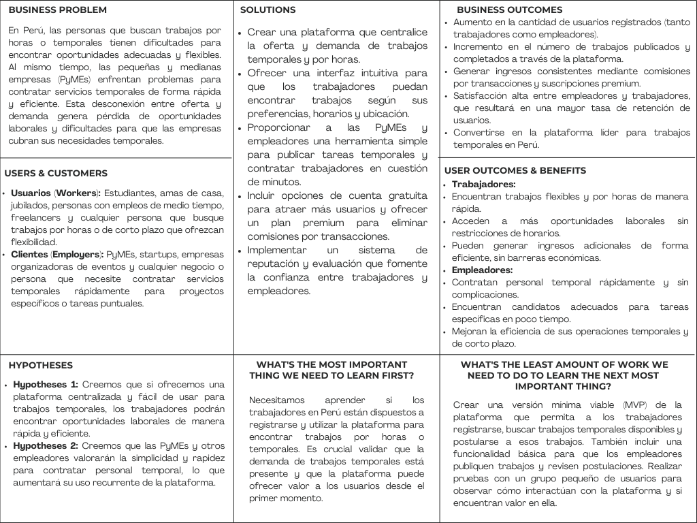

# 
COURSE PROJECT

    <strong>Universidad Peruana de Ciencias Aplicadas</strong> 
    </img> 
    <strong>Ingeniería de Software - 2024-2</strong> 
    <strong>Desarrollo de Aplicaciones Open Source - WX51</strong> 
    <strong>Profesor: Alberto Wilmer Sanchez Seña</strong> 
     <strong>Informe del Trabajo Final</strong>

    <strong>Startup: GPTDevs</strong> 
    <strong>Producto: TaskLinker </strong>

    <h3>Team Members:</h3>
    <table align="center">
        <tr>
            <th style="text-align:center;">Member</th>
            <th style="text-align:center;">Code</th>
        </tr>
        <tr>
            <td>Ramos Najar, Tony Alexander</td>
            <td>U20211A153</td>
        </tr>
        <tr>
            <td>Sanchez Rios, Camila Cristina</td>
            <td>U202210973</td>
        </tr>
        <tr>
            <td>Durand Vera, Gianfranco Angel</td>
            <td>U20201F640</td>
        </tr>
        <tr>
            <td>Chávarri Zarzosa, Daniel Jhared</td>
            <td>U202211108</td>
        </tr>
         <tr>
            <td>Roque Tello, Jack Eddie</td>
            <td>U20221C448</td>
         </tr>
    </table>

    <strong>Agosto, 2024</strong>

 

<h1 align="center">Registro de versiones del Informe</h1>
 
<table>
        <thead>
            <tr>
                <th>Versión</th>
                <th>Fecha</th>
                <th>Autor</th>
                <th>Descripción de modificaciones</th>
            </tr>
        </thead>
        <tbody>
            <tr>
                <th>TB1</th>
                <td>20/08/2024</td>
                <td>
                    <ul>
          <li>Tony Ramos</li>
          <li>Camila Sanchez</li>
          <li>Gianfranco Durand</li>
          <li>Daniel Chávarri</li>
          <li>Jack Roque</li>
                    <ul>
           </td>
      <td>            
             <ul>
          <li>Capítulo I: Introducción</li>
          <li>Capítulo II: Requirements Elicitation & Analysis</li>
          <li>Capítulo III: Requirements Specification</li>
          <li>Capítulo IV: Product Design</li>
          <li>Avance del Capítulo V: Product Implementation, Validation & Deployment hasta el punto 5.2.1.8</li>
          <li>Avance de Conclusiones, Bibliografía y Anexos</li>
        </ul>
      </td>
  </tr>
</tbody>
</table>

# Project Report Collaboration Insights

# Contenido
[Student Outcome](#student-outcome)

[Capítulo I: Introducción](#capítulo-i-introducción)
- [1.1. Startup Profile](#11-startup-profile)
  - [1.1.1. Descripción de la Startup](#111-descripción-de-la-startup)
  - [1.1.2. Perfiles de integrantes del equipo](#112-perfiles-de-integrantes-del-equipo)
- [1.2. Solution Profile](#12-solution-profile)
  - [1.2.1 Antecedentes y problemática](#121-antecedentes-y-problemática)
  - [1.2.2 Lean UX Process](#122-lean-ux-process)
    - [1.2.2.1. Lean UX Problem Statements](#1221-lean-ux-problem-statements)
    - [1.2.2.2. Lean UX Assumptions](#1222-lean-ux-assumptions)
    - [1.2.2.3. Lean UX Hypothesis Statements](#1223-lean-ux-hypothesis-statements)
    - [1.2.2.4. Lean UX Canvas](#1224-lean-ux-canvas)
- [1.3. Segmentos objetivo](#13-segmentos-objetivo)

[Capítulo II: Requirements Elicitation & Analysis](#capítulo-ii-requirements-elicitation--analysis)
- [2.1. Competidores](#21-competidores)
  - [2.1.1. Análisis competitivo](#211-análisis-competitivo)
  - [2.1.2. Estrategias y tácticas frente a competidores](#212-estrategias-y-tácticas-frente-a-competidores)
- [2.2. Entrevistas](#22-entrevistas)
  - [2.2.1. Diseño de entrevistas](#221-diseño-de-entrevistas)
  - [2.2.2. Registro de entrevistas](#222-registro-de-entrevistas)
  - [2.2.3. Análisis de entrevistas](#223-análisis-de-entrevistas)
- [2.3. Needfinding](#23-needfinding)
  - [2.3.1. User Personas](#231-user-personas)
  - [2.3.2. User Task Matrix](#232-user-task-matrix)
  - [2.3.3. User Journey Mapping](#233-user-journey-mapping)
  - [2.3.4. Empathy Mapping](#234-empathy-mapping)
  - [2.3.5. As-is Scenario Mapping](#235-as-is-scenario-mapping)
- [2.4. Ubiquitous Language](#24-ubiquitous-language)

[Capítulo III: Requirements Specification](#capítulo-iii-requirements-specification)
- [3.1. To-Be Scenario Mapping](#31-to-be-scenario-mapping)
- [3.2. User Stories](#32-user-stories)
- [3.3. Impact Mapping](#33-impact-mapping)
- [3.4. Product Backlog](#34-product-backlog)

[Capítulo IV: Product Design](#capítulo-iv-product-design)
- [4.1. Style Guidelines](#41-style-guidelines)
  - [4.1.1. General Style Guidelines](#411-general-style-guidelines)
  - [4.1.2. Web Style Guidelines](#412-web-style-guidelines)
- [4.2. Information Architecture](#42-information-architecture)
  - [4.2.1. Organization Systems](#421-organization-systems)
  - [4.2.2. Labeling Systems](#422-labeling-systems)
  - [4.2.3. SEO Tags and Meta Tag](#423-seo-tags-and-meta-tag)
  - [4.2.4. Searching Systems](#424-searching-systems)
  - [4.2.5. Navigation Systems](#425-navigation-systems)
- [4.3. Landing Page UI Design](#43-landing-page-ui-design)
  - [4.3.1. Landing Page Wireframe](#431-landing-page-wireframe)
  - [4.3.2. Landing Page Mock-up](#432-landing-page-mock-up)
- [4.4. Web Applications UX/UI Design](#44-web-applications-uxui-design)
  - [4.4.1. Web Applications Wireframes](#411-general-style-guidelines)
  - [4.4.2. Web Applications Wireflow Diagrams](#442-web-applications-wireflow-diagrams)
  - [4.4.3. Web Applications Mock-ups](#443-web-applications-mock-ups)
  - [4.4.4. Web Applications User Flow Diagrams](#444-web-applications-user-flow-diagrams)
- [4.5. Web Applications Prototyping](#45-web-applications-prototyping)
- [4.6. Domain-Driven Software Architecture](#46-domain-driven-software-architecture)
  - [4.6.1. Software Architecture Context Diagram](#461-software-architecture-context-diagram)
  - [4.6.2. Software Architecture Container Diagrams](#462-software-architecture-container-diagrams)
  - [4.6.3. Software Architecture Components Diagrams](#463-software-architecture-components-diagrams)
- [4.7. Software Object-Oriented Design](#47-software-object-oriented-design)
  - [4.7.1. Class Diagrams](#471-class-diagrams)
  - [4.7.2. Class Dictionary](#472-class-dictionary)
- [4.8. Database Design](#48-database-design)
  - [4.8.1. Database Diagram](#481-database-diagram)

[Capítulo V: Product Implementation, Validation & Deployment](#capítulo-v-product-implementation-validation--deployment)
- [5.1. Software Configuration Management](#51-software-configuration-management)
  - [5.1.1. Software Development Environment Configuration](#511-software-development-environment-configuration)
  - [5.1.2. Source Code Management](#512-source-code-management)
  - [5.1.3. Source Code Style Guide & Conventions](#513-source-code-style-guide--conventions)
  - [5.1.4. Software Deployment Configuration](#514-software-deployment-configuration)
- [5.2. Landing Page, Services & Applications Implementation](#52-landing-page-services--applications-implementation)
  - [5.2.X. Sprint ](#52x-sprint)
    - [5.2.X.1. Sprint Planning n](#52x1-sprint-planning-n)
    - [5.2.X.2. Sprint Backlog n](#52x2-sprint-backlog-n)
    - [5.2.X.3. Development Evidence for Sprint Review](#52x3-development-evidence-for-sprint-review)
    - [5.2.X.4. Testing Suite Evidence for Sprint Review](#52x4-testing-suite-evidence-for-sprint-review)
    - [5.2.X.5. Execution Evidence for Sprint Review](#52x5-execution-evidence-for-sprint-review)
    - [5.2.X.6. Services Documentation Evidence for Sprint Review](#52x6-services-documentation-evidence-for-sprint-review)
    - [5.2.X.7. Software Deployment Evidence for Sprint Review](#52x7-software-deployment-evidence-for-sprint-review)
    - [5.2.X.8. Team Collaboration Insights during Sprint](#52x8-team-collaboration-insights-during-sprint)
- [5.3. Validation Interviews](#53-validation-interviews)
  - [5.3.1. Diseño de Entrevistas](#531-diseño-de-entrevistas)
  - [5.3.2. Registro de Entrevistas](#532-registro-de-entrevistas)
  - [5.3.3. Evaluaciones según heurísticas](#533-evaluaciones-según-heurísticas)
- [5.4. Video About-the-Product](#54-video-about-the-product)

[Conclusiones](#conclusiones)
- [Conclusiones y recomendaciones](#conclusiones-y-recomendaciones)
- [Video About-the-Team](#video-about-the-team)

[Bibliografía](#bibliografía)

[Anexos](#anexos)

# Student Outcome
ABET – EAC - Student Outcome 3

Criterio: Capacidad de comunicarse efectivamente con un rango de audiencias

Criterio: Capacidad de comunicarse efectivamente con un rango de audiencias

<table>
  <tr>
    <td><b>Criterio específico</b></td>
    <td><b>Acciones realizadas</b></td>
    <td><b>Conclusiones</b></td>
  </tr>
    </thead>
  <tbody>
    <tr>
      <td><b>Comunica oralmente con
efectividad a diferentes rangos
de audiencia.</b></td>
      <td>
        
<b>Ramos Najar, Tony Alexander  </b>

        
<b>TB1:</b>

        
.

        
<b>TP1:</b>

        
.

        
<b>TB2:</b>

        
.

        
<b>TF:</b>

        
.

        
<b>Sanchez Rios, Camila Cristina</b>

       
<b>TB1:</b>

        
.

        
<b>TP1:</b>

        
.

        
<b>TB2:</b>

        
.

        
<b>TF:</b>

        
.

        
<b>Durand Vera, Gianfranco Angel</b>

        
<b>TB1:</b>

        
.

        
<b>TP1:</b>

        
.

        
<b>TB2:</b>

        
.

        
<b>TF:</b>

        
.

        
<b>Chávarri Zarzosa, Daniel Jhared</b>

       
<b>TB1:</b>

        
.

        
<b>TP1:</b>

        
.

        
<b>TB2:</b>

        
.

        
<b>TF:</b>

        
.

        
<b>Roque Tello, Jack Eddie</b>

       
<b>TB1:</b>

        
.

        
<b>TP1:</b>

        
.

        
<b>TB2:</b>

        
.

        
<b>TF:</b>

        
.

      </td>
      <td>
        
<strong>TB1:</strong>

        
En conclusión, .

        
<strong>TP1:</strong>

        
En resumen, .

        
<strong>TB2:</strong>

        
En conclusión, 

        
<strong>TF:</strong>

        
En conclusión, .

      </td>
    </tr>
    <tr>
      <td>Comunica por escrito con
efectividad a diferentes rangos
de audiencia.</td>
      <td>
        
<b>Ramos Najar, Tony Alexander  </b>

        
<b>TB1:</b>

        
.

        
<b>TP1:</b>

        
.

        
<b>TB2:</b>

        
.

        
<b>TF:</b>

        
.

        
<b>Sanchez Rios, Camila Cristina</b>

       
<b>TB1:</b>

        
.

        
<b>TP1:</b>

        
.

        
<b>TB2:</b>

        
.

        
<b>TF:</b>

        
.

        
<b>Durand Vera, Gianfranco Angel</b>

        
<b>TB1:</b>

        
.

        
<b>TP1:</b>

        
.

        
<b>TB2:</b>

        
.

        
<b>TF:</b>

        
.

        
<b>Chávarri Zarzosa, Daniel Jhared</b>

       
<b>TB1:</b>

        
.

        
<b>TP1:</b>

        
.

        
<b>TB2:</b>

        
.

        
<b>TF:</b>

        
.

        
<b>Roque Tello, Jack Eddie</b>

       
<b>TB1:</b>

        
.

        
<b>TP1:</b>

        
.

        
<b>TB2:</b>

        
.

        
<b>TF:</b>

        
.

      </td>
       <td>
        
<strong>TB1:</strong>

        
En conclusión, .

        
<strong>TP1:</strong>

        
En resumen, .

        
<strong>TB2:</strong>

        
En conclusión, 

        
<strong>TF:</strong>

        
En conclusión, .

      </td>
    </tr>
  </tbody>
</table>

# Capítulo I: Introducción
## 1.1. Startup Profile
### 1.1.1. Descripción de la Startup

"TaskLinker" es una innovadora plataforma web que facilita la conexión entre personas que buscan ingresos adicionales laborando por horas y quienes requieren contratar servicios temporales o para tareas específicas. Dirigida a estudiantes, amas de casa, jubilados y cualquier persona interesada en trabajos por horas, TaskLinker actúa como un puente efectivo y confiable entre la oferta y la demanda en el mercado laboral peruano. A través de nuestra plataforma, tanto individuos como organizaciones pueden encontrar soluciones rápidas y eficientes para sus necesidades, optimizando el uso de la fuerza laboral disponible y promoviendo la flexibilidad en el empleo.

La misión de TaskLinker es empoderar a las personas con oportunidades de trabajo flexible, permitiéndoles generar ingresos adicionales en sus propios términos. Al mismo tiempo, buscamos proporcionar a las organizaciones e individuos una herramienta eficiente para encontrar y contratar rápidamente talento adecuado para sus necesidades temporales o específicas.

Nuestra visión es convertirnos en la plataforma líder en Perú para la contratación de trabajos por horas y servicios temporales, siendo reconocidos por nuestra capacidad para conectar de manera efectiva a las personas con oportunidades de ingresos adicionales. Aspiramos a expandir nuestro impacto, promoviendo un mercado laboral más dinámico, inclusivo y flexible, donde cada persona pueda acceder fácilmente a oportunidades laborales que se ajusten a su estilo de vida y necesidades, mientras que las organizaciones logran satisfacer sus demandas con rapidez y precisión.

### 1.1.2. Perfiles de integrantes del equipo

<table>
  <tr>
    <th>
      
    </th>
    <td valign="top">
      
<b>Ramos Najar, Tony Alexander</b>

      

        Mi nombre es Tony Ramos, estoy cursando el 8vo ciclo de la carrera de Ingeniería de Software. Me considero hábil en el ámbito de la programación en los lenguajes, Python, Javascript, y últimamente estoy aprendiendo Angular. Con respeto a mi, me considero una persona responsable, con ganas de aprender y a superarme a mi mismo
      

    </td>
  </tr>
  <tr>
    <th>
      
    </th>
    <td valign="top">
      
<b>Sánchez Ríos, Camila Cristina</b>

      

        Soy estudiante de la carrera de Ingeniería de Software en la Universidad Peruana de Ciencias Aplicadas, actualmente me encuentro en el cuarto ciclo. Me gusta escuchar música y leer en los ratos 
        libres y aprender más sobre la carrera.
      

    </td>
  </tr>
  <tr>
    <th>
      
    </th>
    <td valign="top">
      
<b>Durand Vera, Gianfranco Ángel</b>

      

        Soy estudiante de la carrera de Ingeniería de Software en la Universidad Peruana de Ciencias Aplicadas, actualmente me encuentro en el sexto ciclo, escogí esta carrera porque me gusta mucho la 
        programación. Tengo experiencia en lenguajes de programación como C++, C#, Python, Kotlin y JavaScript.
      

    </td>
  </tr>
  <tr>
    <th>
      
    </th>
    <td valign="top">
      
<b>Chávarri Zarzosa, Daniel Jhared</b>

      

       Soy estudiante de la UPC, tengo 19 años. Estoy en la carrera de Ingeniería de Software, ya que, siempre me gustó la tecnología, los videojuegos, las páginas web, pero sobre todo cómo crearlos. Estoy 
       cursando el 5 ciclo de la carrera y mis habilidades son C++, Python, HTML y JavaScript. También soy bueno en ser responsable con cada curso y organizar mi tiempo en ellos.
      

    </td>
  </tr>
  <tr>
    <th>
      
    </th>
    <td valign="top">
      
<b>Roque Tello, Jack Eddie</b>

      

        Mi nombre es Jack Eddie Roque Tello y tengo 20 años. Soy estudiante de la carrera de Ingeniería de Software en la Universidad Peruana de Ciencias Aplicadas (UPC) actualmente estoy en el quinto ciclo. Soy una persona competitiva, siempre en busca de nuevos aprendizajes, con un enfoque en la mejora continua. Tengo conocimientos en varios lenguajes de programación, incluyendo C++, JavaScript, Java y Ruby.
Fuera del ámbito académico, disfruto ver películas, leer y viajar, lo que me ayuda a expandir mis perspectivas y a mantener un equilibrio entre mis responsabilidades y mis pasiones. En este curso, estaré atento a cualquier eventualidad que surja, dispuesto a colaborar y aportar para el éxito del proyecto, siempre en beneficio de mi equipo y mi crecimiento profesional.
      

    </td>
  </tr>
</table>
 

## 1.2. Solution Profile
### 1.2.1 Antecedentes y problemática

En el mercado laboral peruano, existe una creciente demanda de trabajos temporales y por horas, impulsada tanto por trabajadores que buscan flexibilidad como por empleadores que requieren soluciones rápidas para tareas específicas. No obstante, la falta de una plataforma centralizada ha dificultado la conexión eficiente entre ambas partes, lo que resulta en una subutilización del talento disponible y en procesos de contratación ineficaces.

**5W y 2H**

- **Who (Quién):** 

Los trabajadores objetivo de TaskLinker incluyen estudiantes, amas de casa, jubilados y personas con empleo parcial que buscan ingresos adicionales sin comprometer sus horarios. Por otro lado, los empleadores incluyen pequeñas y medianas empresas (PyMEs), particulares, organizadores de eventos, y startups que necesitan contratar personal temporal de manera rápida y eficiente.

- **What (Qué):**

TaskLinker es una plataforma web que facilita la conexión entre personas que buscan trabajo temporal por horas y empleadores que necesitan contratar servicios específicos. La plataforma ofrece una solución centralizada que permite a ambas partes encontrar rápidamente lo que necesitan, ya sea una oportunidad de trabajo flexible o personal temporal calificado.

- **Where (Dónde):**

La plataforma opera principalmente en el mercado laboral peruano, donde existe una alta demanda de trabajos temporales y por horas. TaskLinker está diseñada para ser accesible desde cualquier dispositivo con conexión a internet, lo que la hace disponible en cualquier lugar dentro del ámbito nacional.

- **When (Cuándo):**

La necesidad de TaskLinker surge en un contexto donde la economía y el mercado laboral están en constante cambio, con un aumento en la demanda de flexibilidad tanto por parte de trabajadores como de empleadores. Esta plataforma es especialmente útil en momentos de alta demanda laboral temporal, como durante eventos especiales o picos estacionales de trabajo.

- **Why (Por qué):**

La falta de una plataforma centralizada que conecte de manera efectiva a trabajadores temporales con empleadores ha llevado a una subutilización de la fuerza laboral disponible y a ineficiencias en el proceso de contratación. TaskLinker responde a esta problemática proporcionando una solución que simplifica y agiliza la búsqueda de trabajo temporal y la contratación de personal por horas, beneficiando a ambos lados del mercado.

-  **How (Cómo):**

TaskLinker funciona a través de una plataforma en línea intuitiva donde los trabajadores pueden crear perfiles, buscar y postularse a trabajos que se ajusten a sus habilidades y disponibilidad. Los empleadores pueden publicar tareas o proyectos específicos y acceder a una base de trabajadores calificados de manera rápida. La plataforma integra un sistema de evaluaciones y reputación para garantizar la confianza y transparencia en las interacciones. El modelo de negocio se sustenta en dos esquemas principales: una comisión por transacción, que se cobra cuando un trabajador es contratado y completa un trabajo, y un plan de suscripción premium, que elimina las comisiones y ofrece beneficios adicionales como priorización en los listados y acceso a tareas exclusivas.

- **How Much (Cuánto):**

En el esquema de comisión por transacción, TaskLinkera cobra una pequeña comisión proporcional al valor del trabajo, la cual se descuenta automáticamente una vez que el trabajo es completado y pagado. Por otro lado, el plan de suscripción premium tiene un costo fijo que elimina estas comisiones por transacción y brinda acceso a funcionalidades avanzadas, como la priorización en los listados, acceso a tareas exclusivas, y herramientas de gestión mejoradas. Este modelo de negocio está diseñado para ser accesible y rentable, permitiendo a los usuarios elegir la opción que mejor se adapte a sus necesidades y volumen de trabajo.

### 1.2.2 Lean UX Process
#### 1.2.2.1. Lean UX Problem Statements

<strong>1. Construcción de Confianza y Credibilidad:</strong>

Problema: Los usuarios potenciales, como estudiantes, amas de casa, jubilados y trabajadores a tiempo parcial, podrían desconfiar de una nueva plataforma como TaskLinker debido a preocupaciones sobre la fiabilidad y efectividad en la conexión con trabajos temporales legítimos y bien remunerados.

Impacto: Esta desconfianza podría ralentizar la adopción de usuarios, limitando la capacidad de TaskLinker para construir una base de usuarios sólida y activa, lo que en última instancia obstaculizaría el éxito de la plataforma en un mercado competitivo.

Suposición: Al proporcionar características transparentes y centradas en el usuario, como perfiles verificados de empleadores, testimonios de usuarios y calificaciones, podemos generar confianza y animar a más usuarios a interactuar con la plataforma.

<strong>2. Demostración del Valor del Empleo Flexible:</strong>

Problema: Muchos usuarios potenciales pueden no reconocer completamente el valor de usar una plataforma como TaskLinker para encontrar oportunidades de trabajo flexible que se alineen con sus horarios y necesidades.

Impacto: Esto podría resultar en una menor tasa de participación de usuarios, ya que las personas podrían seguir confiando en métodos tradicionales de búsqueda de empleo, perdiendo las ventajas que TaskLinker ofrece.

Suposición: Al mostrar estudios de casos exitosos y resaltar los beneficios financieros y personales de utilizar TaskLinker, podemos motivar a los usuarios a probar la plataforma y adoptarla como una herramienta esencial para encontrar trabajos por horas.

<strong>3. Superación de la Subutilización del Talento Disponible:</strong>

Problema: La falta de una plataforma centralizada que conecte eficazmente a los trabajadores temporales con los empleadores ha llevado a una subutilización de la fuerza laboral disponible, afectando tanto a quienes buscan trabajo como a quienes necesitan personal temporal.

Impacto: Esto perpetúa ineficiencias en el proceso de contratación, resultando en una pérdida de oportunidades tanto para los trabajadores como para los empleadores.
Suposición: Al centralizar la oferta y demanda de trabajos temporales en TaskLinker, podemos optimizar el uso del talento disponible, mejorando la eficiencia del mercado laboral temporal en Perú.

#### 1.2.2.2. Lean UX Assumptions

1. Los usuarios buscan una plataforma confiable para encontrar trabajos temporales que se adapten a sus horarios y necesidades específicas. TaskLinker está diseñada para facilitar este proceso, permitiendo a 
   los usuarios acceder a oportunidades de empleo de manera rápida y segura.

2. La plataforma está dirigida a adultos jóvenes, amas de casa, jubilados y personas con empleo parcial que desean complementar sus ingresos. Este grupo valora la flexibilidad y la conveniencia que ofrece 
   TaskLinker, lo que les permite gestionar mejor su tiempo y responsabilidades.

3. Los usuarios iniciales de TaskLinker serán personas mayores de 18 años que buscan soluciones rápidas y flexibles para trabajar por horas. Este segmento incluye tanto a quienes desean un ingreso adicional 
   como a aquellos que buscan empleo temporal debido a su situación actual.

4. TaskLinker generará ingresos a través de un modelo de comisión por transacción, así como mediante suscripciones premium que ofrecen funciones avanzadas, como priorización en los listados y acceso a tareas 
   exclusivas. Esto permitirá monetizar la plataforma mientras crece la base de usuarios.

5. Adquiriremos la mayoría de nuestros usuarios a través de alianzas estratégicas con universidades, organizaciones comunitarias, y empresas que necesiten personal temporal. También lanzaremos campañas de 
   concienciación en redes sociales y comunidades en línea enfocadas en empleo y trabajo temporal.

6. Nuestra competencia incluye otras plataformas de trabajo temporal y servicios freelance establecidos en el mercado. Sin embargo, TaskLinker se diferencia por su enfoque en la simplicidad, la 
   personalización, y la eficiencia en la conexión entre empleadores y trabajadores temporales.

7. Superaremos a nuestra competencia ofreciendo una plataforma altamente intuitiva y eficiente, diseñada para ser accesible incluso para aquellos sin conocimientos tecnológicos avanzados. La personalización 
   de los perfiles de usuario y las opciones de búsqueda nos posicionarán como la opción preferida entre los usuarios.

8. El mayor riesgo para TaskLinker radica en la competencia con plataformas más conocidas, lo que podría afectar nuestra penetración en el mercado. Para mitigar este riesgo, mejoraremos continuamente la 
   experiencia del usuario, ampliando la funcionalidad y fortaleciendo nuestra propuesta de valor.

9. Para mitigar los riesgos de competencia, realizaremos un análisis continuo de las fortalezas y debilidades de nuestra plataforma en comparación con las alternativas en el mercado, y utilizaremos esta 
   información para mejorar TaskLinker, asegurando así su calidad y competitividad.

#### 1.2.2.3. Lean UX Hypothesis Statements

Problema: Creemos que las personas en Perú (estudiantes, amas de casa, jubilados, etc.) tienen dificultades para encontrar trabajos flexibles y por horas que se ajusten a sus necesidades y horarios.

Solución: Si ofrecemos una plataforma que centraliza la oferta y demanda de trabajos por horas, las personas podrán encontrar oportunidades laborales de forma rápida y fácil.
Resultado esperado: Observaremos un aumento en el número de personas registradas y en la frecuencia con la que encuentran trabajo a través de la plataforma.
Problema: Creemos que las pequeñas y medianas empresas (PyMEs) en Perú necesitan contratar servicios temporales de manera eficiente, pero enfrentan dificultades en el proceso de búsqueda y contratación.

Solución: Si proporcionamos una plataforma donde puedan publicar tareas y contratar trabajadores de forma rápida, las PyMEs podrán cubrir sus necesidades temporales sin problemas.
Resultado esperado: Veremos una alta tasa de satisfacción entre los empleadores y un aumento en el número de tareas publicadas en la plataforma.
Problema: Creemos que muchos usuarios en Perú valoran la flexibilidad y desean acceder a una plataforma gratuita para comenzar a trabajar inmediatamente.

Solución: Si ofrecemos una opción gratuita con comisiones por tarea realizada y un plan premium que elimina esas comisiones, los usuarios podrán empezar a trabajar sin barreras económicas.
Resultado esperado: Tendremos una alta conversión de usuarios del plan gratuito al plan premium a medida que generen más ingresos.

#### 1.2.2.4. Lean UX Canvas

 

## 1.3. Segmentos objetivo

**1. Trabajadores que buscan ingresos adicionales y flexibilidad:**
Este segmento incluye a estudiantes que necesitan ingresos para cubrir sus estudios o gastos personales sin afectar sus horarios académicos, amas de casa que desean contribuir económicamente sin comprometer sus responsabilidades en el hogar, jubilados que buscan mantenerse activos y generar ingresos extra, y personas con empleo parcial que desean complementar sus ingresos. Todos ellos valoran la flexibilidad que les ofrece TaskLinker, permitiéndoles encontrar oportunidades laborales que se adapten a su tiempo y necesidades específicas.

**2. Empleadores que requieren soluciones laborales temporales:**

Este segmento abarca a pequeñas y medianas empresas (PyMEs) que necesitan personal temporal para cubrir picos de trabajo o tareas específicas, particulares que requieren servicios domésticos, reparaciones, o tareas puntuales sin compromiso a largo plazo, organizadores de eventos que necesitan personal por horas para diferentes funciones como catering o atención al cliente, y startups que demandan flexibilidad en la contratación para adaptarse al ritmo dinámico de su crecimiento. Estos empleadores buscan soluciones rápidas, confiables y eficientes para satisfacer sus necesidades laborales temporales.

# Capítulo II: Requirements Elicitation & Analysis
## 2.1. Competidores
### 2.1.1. Análisis competitivo
### 2.1.2. Estrategias y tácticas frente a competidores
## 2.2. Entrevistas
### 2.2.1. Diseño de entrevistas
### 2.2.2. Registro de entrevistas
### 2.2.3. Análisis de entrevistas
## 2.3. Needfinding
### 2.3.1. User Personas
### 2.3.2. User Task Matrix
### 2.3.3. User Journey Mapping
### 2.3.4. Empathy Mapping
### 2.3.5. As-is Scenario Mapping
## 2.4. Ubiquitous Language

# Capítulo III: Requirements Specification
## 3.1. To-Be Scenario Mapping
## 3.2. User Stories
## 3.3. Impact Mapping
## 3.4. Product Backlog

# Capítulo IV: Product Design
## 4.1. Style Guidelines
### 4.1.1. General Style Guidelines
### 4.1.2. Web Style Guidelines
## 4.2. Information Architecture
### 4.2.1. Organization Systems
### 4.2.2. Labeling Systems
### 4.2.3. SEO Tags and Meta Tag
### 4.2.4. Searching Systems
### 4.2.5. Navigation Systems
## 4.3. Landing Page UI Design
### 4.3.1. Landing Page Wireframe
### 4.3.2. Landing Page Mock-up
## 4.4. Web Applications UX/UI Design
### 4.4.1. Web Applications Wireframes
### 4.4.2. Web Applications Wireflow Diagrams
### 4.4.3. Web Applications Mock-ups
### 4.4.4. Web Applications User Flow Diagrams
## 4.5. Web Applications Prototyping
## 4.6. Domain-Driven Software Architecture
### 4.6.1. Software Architecture Context Diagram
### 4.6.2. Software Architecture Container Diagrams
### 4.6.3. Software Architecture Components Diagrams
## 4.7. Software Object-Oriented Design
### 4.7.1. Class Diagrams
### 4.7.2. Class Dictionary
## 4.8. Database Design
## 4.8.1. Database Diagram

# Capítulo V: Product Implementation, Validation & Deployment
## 5.1. Software Configuration Management
### 5.1.1. Software Development Environment Configuration
### 5.1.2. Source Code Management
### 5.1.3. Source Code Style Guide & Conventions
### 5.1.4. Software Deployment Configuration
## 5.2. Landing Page, Services & Applications Implementation
### 5.2.X. Sprint 
#### 5.2.X.1. Sprint Planning n
#### 5.2.X.2. Sprint Backlog n
#### 5.2.X.3. Development Evidence for Sprint Review
#### 5.2.X.4. Testing Suite Evidence for Sprint Review
#### 5.2.X.5. Execution Evidence for Sprint Review
#### 5.2.X.6. Services Documentation Evidence for Sprint Review
#### 5.2.X.7. Software Deployment Evidence for Sprint Review
#### 5.2.X.8. Team Collaboration Insights during Sprint
## 5.3. Validation Interviews
### 5.3.1. Diseño de Entrevistas
### 5.3.2. Registro de Entrevistas
### 5.3.3. Evaluaciones según heurísticas
# 5.4. Video About-the-Product

# Conclusiones
## Conclusiones y recomendaciones
## Video About-the-Team.

# Bibliografía

# Anexos
