# 
COURSE PROJECT

    <strong>Universidad Peruana de Ciencias Aplicadas</strong> 
    </img> 
    <strong>Ingeniería de Software - 2024-2</strong> 
    <strong>Desarrollo de Aplicaciones Open Source - WX51</strong> 
    <strong>Profesor: Alberto Wilmer Sanchez Seña</strong> 
     <strong>Informe del Trabajo Final</strong>

    <strong>Startup: GPTDevs</strong> 
    <strong>Producto: TaskLinker </strong>

    <h3>Team Members:</h3>
    <table align="center">
        <tr>
            <th style="text-align:center;">Member</th>
            <th style="text-align:center;">Code</th>
        </tr>
        <tr>
            <td>Ramos Najar, Tony Alexander</td>
            <td>U20211A153</td>
        </tr>
        <tr>
            <td>Sanchez Rios, Camila Cristina</td>
            <td>U202210973</td>
        </tr>
        <tr>
            <td>Durand Vera, Gianfranco Angel</td>
            <td>U20201F640</td>
        </tr>
        <tr>
            <td>Chávarri Zarzosa, Daniel Jhared</td>
            <td>U202211108</td>
        </tr>
    </table>

    <strong>Agosto, 2024</strong>

 

<h1 align="center">Registro de versiones del Informe</h1>
 
<table>
        <thead>
            <tr>
                <th>Versión</th>
                <th>Fecha</th>
                <th>Autor</th>
                <th>Descripción de modificaciones</th>
            </tr>
        </thead>
        <tbody>
            <tr>
                <th>TB1</th>
                <td>20/08/2024</td>
                <td>
                    <ul>
          <li>Tony Ramos</li>
          <li>Camila Sanchez</li>
          <li>Gianfranco Durand</li>
          <li>Daniel Chávarri</li>
                    <ul>
           </td>
      <td>            
             <ul>
          <li>Capítulo I: Introducción</li>
          <li>Capítulo II: Requirements Elicitation & Analysis</li>
          <li>Capítulo III: Requirements Specification</li>
          <li>Capítulo IV: Product Design</li>
          <li>Avance del Capítulo V: Product Implementation, Validation & Deployment hasta el punto 5.2.1.8</li>
          <li>Avance de Conclusiones, Bibliografía y Anexos</li>
        </ul>
      </td>
  </tr>
</tbody>
</table>

# Project Report Collaboration Insights

# Contenido
[Student Outcome](#student-outcome)

[Capítulo I: Introducción](#capítulo-i-introducción)
- [1.1. Startup Profile](#11-startup-profile)
  - [1.1.1. Descripción de la Startup](#111-descripción-de-la-startup)
  - [1.1.2. Perfiles de integrantes del equipo](#112-perfiles-de-integrantes-del-equipo)
- [1.2. Solution Profile](#12-solution-profile)
  - [1.2.1 Antecedentes y problemática](#121-antecedentes-y-problemática)
  - [1.2.2 Lean UX Process](#122-lean-ux-process)
    - [1.2.2.1. Lean UX Problem Statements](#1221-lean-ux-problem-statements)
    - [1.2.2.2. Lean UX Assumptions](#1222-lean-ux-assumptions)
    - [1.2.2.3. Lean UX Hypothesis Statements](#1223-lean-ux-hypothesis-statements)
    - [1.2.2.4. Lean UX Canvas](#1224-lean-ux-canvas)
- [1.3. Segmentos objetivo](#13-segmentos-objetivo)

[Capítulo II: Requirements Elicitation & Analysis](#capítulo-ii-requirements-elicitation--analysis)
- [2.1. Competidores](#21-competidores)
  - [2.1.1. Análisis competitivo](#211-análisis-competitivo)
  - [2.1.2. Estrategias y tácticas frente a competidores](#212-estrategias-y-tácticas-frente-a-competidores)
- [2.2. Entrevistas](#22-entrevistas)
  - [2.2.1. Diseño de entrevistas](#221-diseño-de-entrevistas)
  - [2.2.2. Registro de entrevistas](#222-registro-de-entrevistas)
  - [2.2.3. Análisis de entrevistas](#223-análisis-de-entrevistas)
- [2.3. Needfinding](#23-needfinding)
  - [2.3.1. User Personas](#231-user-personas)
  - [2.3.2. User Task Matrix](#232-user-task-matrix)
  - [2.3.3. User Journey Mapping](#233-user-journey-mapping)
  - [2.3.4. Empathy Mapping](#234-empathy-mapping)
  - [2.3.5. As-is Scenario Mapping](#235-as-is-scenario-mapping)
- [2.4. Ubiquitous Language](#24-ubiquitous-language)

[Capítulo III: Requirements Specification](#capítulo-iii-requirements-specification)
- [3.1. To-Be Scenario Mapping](#31-to-be-scenario-mapping)
- [3.2. User Stories](#32-user-stories)
- [3.3. Impact Mapping](#33-impact-mapping)
- [3.4. Product Backlog](#34-product-backlog)

[Capítulo IV: Product Design](#capítulo-iv-product-design)
- [4.1. Style Guidelines](#41-style-guidelines)
  - [4.1.1. General Style Guidelines](#411-general-style-guidelines)
  - [4.1.2. Web Style Guidelines](#412-web-style-guidelines)
- [4.2. Information Architecture](#42-information-architecture)
  - [4.2.1. Organization Systems](#421-organization-systems)
  - [4.2.2. Labeling Systems](#422-labeling-systems)
  - [4.2.3. SEO Tags and Meta Tag](#423-seo-tags-and-meta-tag)
  - [4.2.4. Searching Systems](#424-searching-systems)
  - [4.2.5. Navigation Systems](#425-navigation-systems)
- [4.3. Landing Page UI Design](#43-landing-page-ui-design)
  - [4.3.1. Landing Page Wireframe](#431-landing-page-wireframe)
  - [4.3.2. Landing Page Mock-up](#432-landing-page-mock-up)
- [4.4. Web Applications UX/UI Design](#44-web-applications-uxui-design)
  - [4.4.1. Web Applications Wireframes](#411-general-style-guidelines)
  - [4.4.2. Web Applications Wireflow Diagrams](#442-web-applications-wireflow-diagrams)
  - [4.4.3. Web Applications Mock-ups](#443-web-applications-mock-ups)
  - [4.4.4. Web Applications User Flow Diagrams](#444-web-applications-user-flow-diagrams)
- [4.5. Web Applications Prototyping](#45-web-applications-prototyping)
- [4.6. Domain-Driven Software Architecture](#46-domain-driven-software-architecture)
  - [4.6.1. Software Architecture Context Diagram](#461-software-architecture-context-diagram)
  - [4.6.2. Software Architecture Container Diagrams](#462-software-architecture-container-diagrams)
  - [4.6.3. Software Architecture Components Diagrams](#463-software-architecture-components-diagrams)
- [4.7. Software Object-Oriented Design](#47-software-object-oriented-design)
  - [4.7.1. Class Diagrams](#471-class-diagrams)
  - [4.7.2. Class Dictionary](#472-class-dictionary)
- [4.8. Database Design](#48-database-design)
  - [4.8.1. Database Diagram](#481-database-diagram)

[Capítulo V: Product Implementation, Validation & Deployment](#capítulo-v-product-implementation-validation--deployment)
- [5.1. Software Configuration Management](#51-software-configuration-management)
  - [5.1.1. Software Development Environment Configuration](#511-software-development-environment-configuration)
  - [5.1.2. Source Code Management](#512-source-code-management)
  - [5.1.3. Source Code Style Guide & Conventions](#513-source-code-style-guide--conventions)
  - [5.1.4. Software Deployment Configuration](#514-software-deployment-configuration)
- [5.2. Landing Page, Services & Applications Implementation](#52-landing-page-services--applications-implementation)
  - [5.2.X. Sprint ](#52x-sprint)
    - [5.2.X.1. Sprint Planning n](#52x1-sprint-planning-n)
    - [5.2.X.2. Sprint Backlog n](#52x2-sprint-backlog-n)
    - [5.2.X.3. Development Evidence for Sprint Review](#52x3-development-evidence-for-sprint-review)
    - [5.2.X.4. Testing Suite Evidence for Sprint Review](#52x4-testing-suite-evidence-for-sprint-review)
    - [5.2.X.5. Execution Evidence for Sprint Review](#52x5-execution-evidence-for-sprint-review)
    - [5.2.X.6. Services Documentation Evidence for Sprint Review](#52x6-services-documentation-evidence-for-sprint-review)
    - [5.2.X.7. Software Deployment Evidence for Sprint Review](#52x7-software-deployment-evidence-for-sprint-review)
    - [5.2.X.8. Team Collaboration Insights during Sprint](#52x8-team-collaboration-insights-during-sprint)
- [5.3. Validation Interviews](#53-validation-interviews)
  - [5.3.1. Diseño de Entrevistas](#531-diseño-de-entrevistas)
  - [5.3.2. Registro de Entrevistas](#532-registro-de-entrevistas)
  - [5.3.3. Evaluaciones según heurísticas](#533-evaluaciones-según-heurísticas)
- [5.4. Video About-the-Product](#54-video-about-the-product)

[Conclusiones](#conclusiones)
- [Conclusiones y recomendaciones](#conclusiones-y-recomendaciones)
- [Video About-the-Team](#video-about-the-team)

[Bibliografía](#bibliografía)

[Anexos](#anexos)

# Student Outcome
ABET – EAC - Student Outcome 3

Criterio: Capacidad de comunicarse efectivamente con un rango de audiencias

Criterio: Capacidad de comunicarse efectivamente con un rango de audiencias

<table>
  <tr>
    <td><b>Criterio específico</b></td>
    <td><b>Acciones realizadas</b></td>
    <td><b>Conclusiones</b></td>
  </tr>
    </thead>
  <tbody>
    <tr>
      <td><b>Comunica oralmente con
efectividad a diferentes rangos
de audiencia.</b></td>
      <td>
        
<b>Ramos Najar, Tony Alexander  </b>

        
<b>TB1:</b>

        
Capítulo II: Requirements Elicitation & Analysis y User Stories  Realicé un optimo trabajo en equipo, para crear, visualizar y corregir detalles importantes, además fui flexible con el tiempo de entrega de los capítulos

        
<b>TP1:</b>

        
Para esta entrega, realice correciones al documento general, además de implementar el product backlog en Trello con las historias de usuario correspondientes al sprint 2.

        
<b>TB2:</b>

        
Para esta entrega, se trabajó el Sprint 3 que consta de la implementación de los Web Services o Backend, en mi caso me enfoqúe en el Vounded Context Profiles.

        
<b>TF:</b>

        
.

        
<b>Sanchez Rios, Camila Cristina</b>

       
<b>TB1:</b>

        
Realicé el Capítulo III: Product Design y User Stories; también realicé lo sieguiente del Capítulo IV: 4.1. Style Guidelines, General Style Guidelines, Web Style Guidelines, Information Architecture, Organization Systems, Labeling Systems, SEO Tags and Meta Tags, Searching Systems, Navigation Systems, Landing Page UI Design, Landing Page Wireframe, Landing Page Mock-up, Web Applications UX/UI Design, Web Applications Wireframes, Web Applications Wireflow Diagrams, Web Applications Mock-ups, Web Applications User Flow Diagrams, Web Applications Prototyping.

        
<b>TP1:</b>

        
Correcciones al reporte los agregué a los User Stories los Technical Stories y trabajé en el desarrollo del frontend Toolbar y Traduccion. Colaboración en el proyecto cumpliendo con las indicaciones realizadas por el equipo para lograr lo esperado.

        
<b>TB2:</b>

        
Para esta entrega colabore con la parte del web Services Job Post BC y la parte del Capitulo 5 - 5.3. Validation Interviews con algunas correciones.

        
<b>TF:</b>

        
Para esta entrega colabore en el Capitulo 5 con la realizacion de entrevista y documentacion, heuristicas, tambien hacer el trello del sprint 4.

        
<b>Durand Vera, Gianfranco Angel</b>

        
<b>TB1:</b>

        
Capítulo IV: Product Design y User Stories  Coordiné y realicé la reunión inicial del proyecto, explicando claramente los objetivos y el plan de trabajo. Cree diferentes reuniones para clarificar los roles de cada integrante del equipo.      
        

        
<b>TP1:</b>

        
Realicé commits para la web application siguendo las convenciones para una comunicación escrita, realice el deployment de la aplicación de modo que los interesados puedan ver el avance del proyecto y tener un producto en desarrollo que demuestre nuestro avance durante el sprint.

        
<b>TB2:</b>

        
En esta tercera entrega, se desarrolló el Sprint 3 del proyecto. Para ello, realizamos los avances correspondientes en Frontend y Backend.

        
<b>TF:</b>

        
.

        
<b>Chávarri Zarzosa, Daniel Jhared</b>

       
<b>TB1:</b>

        
Capítulo III: Requirements Specification

        
<b>TP1:</b>

        
En resumen, para el Front-end hice el feature/work-done y feature/task, correjí el impact mapping y implementé la presentación del canva.

        
<b>TB2:</b>

        
En esta parte, realicé la parte del back-end, el context NotificationsBC y algunas mejoras con respecto a nuestro proyecto.

        
<b>TF:</b>

        
Continué mejorando el back-end de mi context Notifications-BC, agregando lo que había implementado el profesor, también hice recordatorios a mis compañeros de hacer las actividades pendientes, con el fin de acabar el proyecto de manera satisfactoria.

      </td>
      <td>
        
<strong>TB1:</strong>

        
En conclusión, en esta primera entrega se logró una buena comunicación entre los miembros del equipo. Cada participante estuvo activo y presento sus ideas de manera que todos pudieran entenderse entre sí. Concluimos que aún hay pequeñas dificultades para expresarnos con todos, pero que se puede solucionar con tiempo.

        
<strong>TP1:</strong>

        
En resumen, durante esta etapa del proyecto, implementamos las mejoras sugeridas por el profesor, las cuales incluyeron la mejora de user storires. Además, todos los integrantes del equipo completaron con éxito todas las actividades asignadas en el segundo sprint.

        
<strong>TB2:</strong>

        
En conclusión, para esta entrega se comunicó con los segmentos objetivo para obtener retroalimentación de nuestro avance con los productos de software. Asimismo, se desarrollaron los videos About-The-Product y About-The-Team que muestran como hemos desarrollado nuestra propuesta.

        
<strong>TF:</strong>

        
En conclusión, para esta entrega final nos mantenimos comunicados de forma activa mediante mensajes y la documentación de nuestros avances tanto de los back-ends, landing page, el reporte y la validación de dichos productos.

      </td>
    </tr>
    <tr>
      <td>Comunica por escrito con
efectividad a diferentes rangos
de audiencia.</td>
      <td>
        
<b>Ramos Najar, Tony Alexander  </b>

        
<b>TB1:</b>

        
Capítulo II: Requirements Elicitation & Analysis y User Stories  Realicé correctamente lo establecido para esta entrega, además apoyé en otras definiciones a mi team Collab

        
<b>TP1:</b>

        
Para esta entrega, realice correciones al documento general, además de implementar el product backlog en Trello con las historias de usuario correspondientes al sprint 2.

        
<b>TB2:</b>

        
Para esta entrega, se trabajó el Sprint 3 que consta de la implementación de los Web Services o Backend, en mi caso me enfoqúe en el Vounded Context Profiles.

        
<b>TF:</b>

        
.

        
<b>Sanchez Rios, Camila Cristina</b>

       
<b>TB1:</b>

        
Realicé el Capítulo III: Product Design y User Stories; también realicé lo sieguiente del Capítulo IV: 4.1. Style Guidelines, General Style Guidelines, Web Style Guidelines, Information Architecture, Organization Systems, Labeling Systems, SEO Tags and Meta Tags, Searching Systems, Navigation Systems, Landing Page UI Design, Landing Page Wireframe, Landing Page Mock-up, Web Applications UX/UI Design, Web Applications Wireframes, Web Applications Wireflow Diagrams, Web Applications Mock-ups, Web Applications User Flow Diagrams, Web Applications Prototyping.

        
<b>TP1:</b>

        
Correcciones al reporte los agregué a los User Stories los Technical Stories y trabajé en el desarrollo del frontend Toolbar y Traduccion. Colaboración en el proyecto cumpliendo con las indicaciones realizadas por el equipo para lograr lo esperado.

        
<b>TB2:</b>

        
Para esta entrega colabore con la parte del web Services Job Post BC y la parte del Capitulo 5 - 5.3. Validation Interviews con algunas correciones.

        
<b>TF:</b>

        
Para esta entrega colabore en el Capitulo 5 con la realizacion de entrevista y documentacion, heuristicas, tambien hacer el trello del sprint 4.

        
<b>Durand Vera, Gianfranco Angel</b>

        
<b>TB1:</b>

        
Capítulo IV: Product Design y User Stories  Cree repositorios para almacenar nuestro informe con un registro de versiones constante, además de comenzar un registro de los puntos que nos falta completar.
        

        
<b>TP1:</b>

        
Realicé commits para la web application siguendo las convenciones para una comunicación escrita, realice el deployment de la aplicación de modo que los interesados puedan ver el avance del proyecto y tener un producto en desarrollo que demuestre nuestro avance durante el sprint.

        
<b>TB2:</b>

        
En esta tercera entrega, se desarrolló el Sprint 3 del proyecto. Para ello, realizamos los avances correspondientes en Frontend y Backend.

        
<b>TF:</b>

        
.

        
<b>Chávarri Zarzosa, Daniel Jhared</b>

       
<b>TB1:</b>

        
Capítulo III: Requirements Specification

        
<b>TP1:</b>

        
En resumen, para el Front-end hice el feature/work-done y feature/task, correjí el impact mapping y implementé la presentación del canva.

        
<b>TB2:</b>

        
En esta parte, realicé la parte del back-end, el context NotificationsBC y algunas mejoras con respecto a nuestro proyecto.

        
<b>TF:</b>

        
Continué mejorando el back-end de mi context Notifications-BC, agregando lo que había implementado el profesor, también hice recordatorios a mis compañeros de hacer las actividades pendientes, con el fin de acabar el proyecto de manera satisfactoria.

      </td>
       <td>
        
<strong>TB1:</strong>

        
Se participó equitativamente el informe. En conclusión, estamos en camino para desempeñarnos de manera equitativa en el trabajo.

        
<strong>TP1:</strong>

        
En resumen, durante esta etapa del proyecto, implementamos las mejoras sugeridas por el profesor, las cuales incluyeron la mejora de user storires. Además, todos los integrantes del equipo completaron con éxito todas las actividades asignadas en el segundo sprint.

        
<strong>TB2:</strong>

        
En conclusión, para esta entrega se comunicó con los segmentos objetivo para obtener retroalimentación de nuestro avance con los productos de software. Asimismo, se desarrollaron los videos About-The-Product y About-The-Team que muestran como hemos desarrollado nuestra propuesta.

        
<strong>TF:</strong>

        
En conclusión, para esta entrega final nos mantenimos comunicados de forma activa mediante mensajes y la documentación de nuestros avances tanto de los back-ends, landing page, el reporte y la validación de dichos productos.

      </td>
    </tr>
  </tbody>
</table>

# Capítulo I: Introducción
## 1.1. Startup Profile
### 1.1.1. Descripción de la Startup
"TaskLinker" es una innovadora plataforma web que facilita la conexión entre personas que buscan ingresos adicionales laborando por horas y quienes requieren contratar servicios temporales o para tareas específicas. Dirigida a estudiantes, amas de casa, jubilados y cualquier persona interesada en trabajos por horas, TaskLinker actúa como un puente efectivo y confiable entre la oferta y la demanda en el mercado laboral peruano. A través de nuestra plataforma, tanto individuos como organizaciones pueden encontrar soluciones rápidas y eficientes para sus necesidades, optimizando el uso de la fuerza laboral disponible y promoviendo la flexibilidad en el empleo.

La misión de TaskLinker es empoderar a las personas con oportunidades de trabajo flexible, permitiéndoles generar ingresos adicionales en sus propios términos. Al mismo tiempo, buscamos proporcionar a las organizaciones e individuos una herramienta eficiente para encontrar y contratar rápidamente talento adecuado para sus necesidades temporales o específicas.

Nuestra visión es convertirnos en la plataforma líder en Perú para la contratación de trabajos por horas y servicios temporales, siendo reconocidos por nuestra capacidad para conectar de manera efectiva a las personas con oportunidades de ingresos adicionales. Aspiramos a expandir nuestro impacto, promoviendo un mercado laboral más dinámico, inclusivo y flexible, donde cada persona pueda acceder fácilmente a oportunidades laborales que se ajusten a su estilo de vida y necesidades, mientras que las organizaciones logran satisfacer sus demandas con rapidez y precisión.

### 1.1.2. Perfiles de integrantes del equipo
<table>
  <tr>
    <th>
      
    </th>
    <td valign="top">
      
<b>Ramos Najar, Tony Alexander</b>

      

        Mi nombre es Tony Ramos, estoy cursando el 8vo ciclo de la carrera de Ingeniería de Software. Me considero hábil en el ámbito de la programación en los lenguajes, Python, Javascript, y últimamente estoy aprendiendo Angular. Con respeto a mi, me considero una persona responsable, con ganas de aprender y superarme a mí mismo
      

    </td>
  </tr>
  <tr>
    <th>
      
    </th>
    <td valign="top">
      
<b>Sánchez Ríos, Camila Cristina</b>

      

        Soy estudiante de la carrera de Ingeniería de Software en la Universidad Peruana de Ciencias Aplicadas, actualmente me encuentro en el cuarto ciclo. Me gusta escuchar música y leer en los ratos libres y aprender más sobre la carrera.
      

    </td>
  </tr>
  <tr>
    <th>
      
    </th>
    <td valign="top">
      
<b>Durand Vera, Gianfranco Ángel</b>

      

        Soy estudiante de la carrera de Ingeniería de Software en la Universidad Peruana de Ciencias Aplicadas, actualmente me encuentro en el sexto ciclo, escogí esta carrera porque me gusta mucho la programación. Tengo experiencia en lenguajes de programación como C++, C#, Python, Kotlin y JavaScript.
      

    </td>
  </tr>
  <tr>
    <th>
      
    </th>
    <td valign="top">
      
<b>Chávarri Zarzosa, Daniel Jhared</b>

      

       Soy estudiante de la UPC, tengo 19 años. Estoy en la carrera de Ingeniería de Software, ya que, siempre me gustó la tecnología, los videojuegos, las páginas web, pero sobre todo cómo crearlos. Estoy cursando el 5 ciclo de la carrera y mis habilidades son C++, Python, HTML y JavaScript. También soy bueno en ser responsable con cada curso y organizar mi tiempo en ellos.
      

    </td>
  </tr>
</table>
 

## 1.2. Solution Profile
### 1.2.1 Antecedentes y problemática
En el mercado laboral peruano, existe una creciente demanda de trabajos temporales y por horas, impulsada tanto por trabajadores que buscan flexibilidad como por empleadores que requieren soluciones rápidas para tareas específicas. No obstante, la falta de una plataforma centralizada ha dificultado la conexión eficiente entre ambas partes, lo que resulta en una subutilización del talento disponible y en procesos de contratación ineficaces.

**5W y 2H**

- **Who (Quién):** 

Los trabajadores objetivo de TaskLinker incluyen estudiantes, amas de casa, jubilados y personas con empleo parcial que buscan ingresos adicionales sin comprometer sus horarios. Por otro lado, los empleadores incluyen pequeñas y medianas empresas (PyMEs), particulares, organizadores de eventos, y startups que necesitan contratar personal temporal de manera rápida y eficiente.

- **What (Qué):**

TaskLinker es una plataforma web que facilita la conexión entre personas que buscan trabajo temporal por horas y empleadores que necesitan contratar servicios específicos. La plataforma ofrece una solución centralizada que permite a ambas partes encontrar rápidamente lo que necesitan, ya sea una oportunidad de trabajo flexible o personal temporal calificado.

- **Where (Dónde):**

La plataforma opera principalmente en el mercado laboral peruano, donde existe una alta demanda de trabajos temporales y por horas. TaskLinker está diseñada para ser accesible desde cualquier dispositivo con conexión a internet, lo que la hace disponible en cualquier lugar dentro del ámbito nacional.

- **When (Cuándo):**

La necesidad de TaskLinker surge en un contexto donde la economía y el mercado laboral están en constante cambio, con un aumento en la demanda de flexibilidad tanto por parte de trabajadores como de empleadores. Esta plataforma es especialmente útil en momentos de alta demanda laboral temporal, como durante eventos especiales o picos estacionales de trabajo.

- **Why (Por qué):**

La falta de una plataforma centralizada que conecte de manera efectiva a trabajadores temporales con empleadores ha llevado a una subutilización de la fuerza laboral disponible y a ineficiencias en el proceso de contratación. TaskLinker responde a esta problemática proporcionando una solución que simplifica y agiliza la búsqueda de trabajo temporal y la contratación de personal por horas, beneficiando a ambos lados del mercado.

-  **How (Cómo):**

TaskLinker funciona a través de una plataforma en línea intuitiva donde los trabajadores pueden crear perfiles, buscar y postularse a trabajos que se ajusten a sus habilidades y disponibilidad. Los empleadores pueden publicar tareas o proyectos específicos y acceder a una base de trabajadores calificados de manera rápida. La plataforma integra un sistema de evaluaciones y reputación para garantizar la confianza y transparencia en las interacciones. El modelo de negocio se sustenta en dos esquemas principales: una comisión por transacción, que se cobra cuando un trabajador es contratado y completa un trabajo, y un plan de suscripción premium, que elimina las comisiones y ofrece beneficios adicionales como priorización en los listados y acceso a tareas exclusivas.

- **How Much (Cuánto):**

En el esquema de comisión por transacción, TaskLinkera cobra una pequeña comisión proporcional al valor del trabajo, la cual se descuenta automáticamente una vez que el trabajo es completado y pagado. Por otro lado, el plan de suscripción premium tiene un costo fijo que elimina estas comisiones por transacción y brinda acceso a funcionalidades avanzadas, como la priorización en los listados, acceso a tareas exclusivas, y herramientas de gestión mejoradas. Este modelo de negocio está diseñado para ser accesible y rentable, permitiendo a los usuarios elegir la opción que mejor se adapte a sus necesidades y volumen de trabajo.

### 1.2.2 Lean UX Process
#### 1.2.2.1. Lean UX Problem Statements

En el mercado laboral peruano, existe una desconexión significativa entre la oferta y la demanda de trabajos temporales y por horas. Por un lado, los trabajadores buscan flexibilidad para encontrar oportunidades que se ajusten a su disponibilidad. Por otro, los empleadores necesitan contratar personal de manera rápida y eficiente para tareas puntuales o picos de trabajo. Sin embargo, la falta de una plataforma centralizada que facilite esta conexión genera ineficiencias en ambos lados, creando barreras para la optimización del talento disponible y el acceso a oportunidades laborales.

Estudiantes, amas de casa, jubilados y personas con empleo parcial en Perú se enfrentan a un desafío constante: ¿cómo encontrar trabajos temporales o por horas que se ajusten a sus horarios y necesidades específicas? Actualmente, la falta de una plataforma centralizada y eficiente para acceder a estas oportunidades laborales limita su capacidad para generar ingresos adicionales, lo que lleva a una subutilización de su tiempo y potencial.  ¿Qué solución podría ofrecerse para permitirles encontrar trabajos de manera rápida y eficiente, maximizando su tiempo disponible?

La falta de un sistema eficiente que centralice estas oportunidades también deja en desventaja a los trabajadores que desean postularse a trabajos en los que tienen experiencia o competencias específicas. ¿Qué características debe tener una plataforma para asegurar que los trabajadores puedan filtrar y postularse solo a las oportunidades que realmente les interesan, sin comprometer su tiempo ni su disponibilidad para otras responsabilidades personales?

Pequeñas y medianas empresas (PyMEs), startups, organizadores de eventos y particulares en Perú se enfrentan a una necesidad urgente: ¿cómo contratar personal temporal para tareas específicas o picos de trabajo de manera rápida y efectiva? 

La falta de una solución adecuada provoca retrasos operativos, un aumento en los costos de contratación y una menor eficiencia en la gestión de recursos humanos. ¿Qué plataforma puede facilitar este proceso, reduciendo el tiempo de contratación y mejorando la eficiencia en la búsqueda de talento calificado? Además, ¿cómo se puede asegurar que los empleadores puedan acceder a una base confiable de trabajadores con las habilidades necesarias para sus tareas específicas sin incurrir en largos procesos de selección?

#### 1.2.2.2. Lean UX Assumptions
**Business Outcomes:**

1. Si ofrecemos una plataforma fácil de usar con un proceso de registro rápido y accesible, más trabajadores potenciales (estudiantes, amas de casa, jubilados) se inscribirán y utilizarán la plataforma para obtener ingresos adicionales.
2.  Si proporcionamos un sistema eficiente para la contratación rápida y confiable de trabajadores temporales, los empleadores recurrirán a la plataforma para cubrir tareas específicas de manera recurrente.
3.  Si simplificamos el proceso de contratación y comunicación entre empleadores y trabajadores, el número de trabajos realizados a través de la plataforma aumentará.
4.  Si mejoramos las herramientas de búsqueda y filtrado, los empleadores podrán encontrar candidatos adecuados de manera más eficiente.
5.  Si ofrecemos características premium valiosas como eliminación de comisiones, acceso a tareas exclusivas y visibilidad prioritaria, más usuarios optarán por suscribirse al plan premium.
6.  Si implementamos un sistema de evaluación transparente y confiable, tanto trabajadores como empleadores tendrán más confianza al usar la plataforma, lo que aumentará la satisfacción general.
7.  Si notificamos a los trabajadores de nuevas oportunidades relevantes para sus habilidades, aumentaremos su participación activa en la plataforma.
8.  Si lanzamos campañas de marketing dirigidas a nuevas regiones, podemos atraer a trabajadores y empleadores de otras ciudades, ampliando nuestro alcance geográfico.
9.  Si mejoramos la facilidad y seguridad en los métodos de pago, aumentará la confianza y la velocidad en las transacciones entre empleadores y trabajadores.
10. Si facilitamos la interacción entre los usuarios (trabajadores y empleadores) a través de herramientas de mensajería y soporte, mejoraremos la percepción de confianza y colaboración en la plataforma.

#### 1.2.2.3. Lean UX Hypothesis Statements

**Hipótesis 1:**

Creemos que si proporcionamos un proceso de registro rápido y fácil para los trabajadores, aumentará la tasa de inscripción en la plataforma. Sabremos que esto es verdad cuando veamos un  aumento del 25% en las inscripciones de nuevos usuarios dentro de los primeros 3 meses de optimizar el proceso de registro.

**Hipótesis 2:**

Creemos que las personas en Perú (estudiantes, amas de casa, jubilados, etc.) tienen dificultades para encontrar trabajos flexibles y por horas que se ajusten a sus necesidades y horarios. Si ofrecemos una plataforma que centraliza la oferta y demanda de trabajos por horas, las personas podrán encontrar oportunidades laborales de forma rápida y fácil. Observaremos un aumento en el número de personas registradas y en la frecuencia con la que encuentran trabajo a través de la plataforma.

**Hipótesis 3:**

Creemos que las pequeñas y medianas empresas (PyMEs) en Perú necesitan contratar servicios temporales de manera eficiente, pero enfrentan dificultades en el proceso de búsqueda y contratación. Si proporcionamos una plataforma donde puedan publicar tareas y contratar trabajadores de forma rápida, las PyMEs podrán cubrir sus necesidades temporales sin problemas. Veremos una alta tasa de satisfacción entre los empleadores y un aumento en el número de tareas publicadas en la plataforma.

**Hipótesis 4:**

Creemos que muchos usuarios en Perú valoran la flexibilidad y desean acceder a una plataforma gratuita para comenzar a trabajar inmediatamente. Si ofrecemos una opción gratuita con comisiones por tarea realizada y un plan premium que elimina esas comisiones, los usuarios podrán empezar a trabajar sin barreras económicas. Tendremos una alta conversión de usuarios del plan gratuito al plan premium a medida que generen más ingresos.

**Hipótesis 5:**

Creemos que un sistema de evaluaciones y reseñas mejorará la confianza entre empleadores y trabajadores, lo que resultará en más transacciones exitosas. Sabremos que esto es verdad cuando veamos un incremento en las evaluaciones en un 30% más de trabajos finalizados con reseñas positivas dentro del primer año de implementación del sistema de evaluaciones.

#### 1.2.2.4. Lean UX Canvas

*Imagen (N°1). Elaboración propia. Realizado en Canva*

## 1.3. Segmentos objetivo
**1. Trabajadores que buscan ingresos adicionales y flexibilidad:**
Este segmento incluye a estudiantes que necesitan ingresos para cubrir sus estudios o gastos personales sin afectar sus horarios académicos, amas de casa que desean contribuir económicamente sin comprometer sus responsabilidades en el hogar, jubilados que buscan mantenerse activos y generar ingresos extra, y personas con empleo parcial que desean complementar sus ingresos. Todos ellos valoran la flexibilidad que les ofrece TaskLinker, permitiéndoles encontrar oportunidades laborales que se adapten a su tiempo y necesidades específicas.

**2. Empleadores que requieren soluciones laborales temporales:**

Este segmento abarca a pequeñas y medianas empresas (PyMEs) que necesitan personal temporal para cubrir picos de trabajo o tareas específicas, particulares que requieren servicios domésticos, reparaciones, o tareas puntuales sin compromiso a largo plazo, organizadores de eventos que necesitan personal por horas para diferentes funciones como catering o atención al cliente, y startups que demandan flexibilidad en la contratación para adaptarse al ritmo dinámico de su crecimiento. Estos empleadores buscan soluciones rápidas, confiables y eficientes para satisfacer sus necesidades laborales temporales.

# Capítulo II: Requirements Elicitation & Analysis
## 2.1. Competidores
### 2.1.1. Análisis competitivo
### 2.1.2. Estrategias y tácticas frente a competidores
## 2.2. Entrevistas
### 2.2.1. Diseño de entrevistas
### 2.2.2. Registro de entrevistas
### 2.2.3. Análisis de entrevistas
## 2.3. Needfinding
### 2.3.1. User Personas
### 2.3.2. User Task Matrix
### 2.3.3. User Journey Mapping
### 2.3.4. Empathy Mapping
### 2.3.5. As-is Scenario Mapping
## 2.4. Ubiquitous Language

# Capítulo III: Requirements Specification
## 3.1. To-Be Scenario Mapping
## 3.2. User Stories
## 3.3. Impact Mapping
## 3.4. Product Backlog

# Capítulo IV: Product Design
## 4.1. Style Guidelines
### 4.1.1. General Style Guidelines
### 4.1.2. Web Style Guidelines
## 4.2. Information Architecture
### 4.2.1. Organization Systems
### 4.2.2. Labeling Systems
### 4.2.3. SEO Tags and Meta Tag
### 4.2.4. Searching Systems
### 4.2.5. Navigation Systems
## 4.3. Landing Page UI Design
### 4.3.1. Landing Page Wireframe
### 4.3.2. Landing Page Mock-up
## 4.4. Web Applications UX/UI Design
### 4.4.1. Web Applications Wireframes
### 4.4.2. Web Applications Wireflow Diagrams
### 4.4.3. Web Applications Mock-ups
### 4.4.4. Web Applications User Flow Diagrams
## 4.5. Web Applications Prototyping
## 4.6. Domain-Driven Software Architecture
### 4.6.1. Software Architecture Context Diagram
### 4.6.2. Software Architecture Container Diagrams
### 4.6.3. Software Architecture Components Diagrams
## 4.7. Software Object-Oriented Design
### 4.7.1. Class Diagrams
### 4.7.2. Class Dictionary
## 4.8. Database Design
## 4.8.1. Database Diagram
# Capítulo V: Product Implementation, Validation & Deployment
## 5.1. Software Configuration Management
### 5.1.1. Software Development Environment Configuration
### 5.1.2. Source Code Management
### 5.1.3. Source Code Style Guide & Conventions

### 5.1.4. Software Deployment Configuration
## 5.2. Landing Page, Services & Applications Implementation
### 5.2.1. Sprint 1
#### 5.2.1.1. Sprint Planning 1
#### 5.2.1.2. Sprint Backlog 1
#### 5.2.1.3. Development Evidence for Sprint Review
#### 5.2.1.4. Testing Suite Evidence for Sprint Review
#### 5.2.1.5. Execution Evidence for Sprint Review
#### 5.2.1.6. Services Documentation Evidence for Sprint Review

#### 5.2.1.7. Software Deployment Evidence for Sprint Review
#### 5.2.1.8. Team Collaboration Insights during Sprint
### 5.2.2. Sprint 2
#### 5.2.2.1. Sprint Planning 2
#### 5.2.2.2. Sprint Backlog 2
#### 5.2.2.3. Development Evidence for Sprint Review
#### 5.2.2.4. Testing Suite Evidence for Sprint Review
#### 5.2.2.5. Execution Evidence for Sprint Review
#### 5.2.2.6. Services Documentation Evidence for Sprint Review

#### 5.2.2.7. Software Deployment Evidence for Sprint Review
#### 5.2.2.8. Team Collaboration Insights during Sprint
### 5.2.3. Sprint 3

#### 5.2.3.1. Sprint Planning 3

| Sprint # | Sprint 3 |
| -------- | -------- |
|**Sprint Planning Background**|
| Date | 2024-10-23|
| Time | 08:00 PM |
| Location | Discord Virtual Meeting |
| Prepared By | Camila Sanchez, Gianfranco Durand |
|Attendees (to planning meeting) | Camila Sanchez, Gianfranco Durand, Daniel Chávarri , Tony Ramos, Jack Roque
| Sprint 2 Review Summary | Durante el segundo sprint, el equipo se enfocó en la creación de la primera versión del frontend, utilizando Trello para organizar tareas y basándose en las historias de usuario, asegurando su atractivo visual y funcionalidad. |
| Sprint 2 Retrospective Summary | Se identificó la necesidad de mejorar la comunicación para abordar dudas más rápidamente y de aumentar la revisión de pruebas antes del despliegue para asegurar la calidad. |
| **Sprint Goal & User Stories** | 
| Sprint 3 Goal | 	Desplegar la primera versión de Web Services. |
| Sprint 3 Velocity | 11 |
| Sum of Story Points | 43 Story points | 

#### 5.2.3.2. Sprint Backlog 3

En este Sprint 3, trabajaremos en los servicios clave del backend, incluyendo la autenticación para el acceso seguro, la creación y edición de perfiles de trabajadores y empleadores, la funcionalidad para que los empleadores puedan publicar ofertas de trabajo, y el sistema de notificaciones que enviará alertas importantes por correo y mensajería interna. Estos elementos asegurarán que la plataforma ofrezca una experiencia fluida y conecte eficazmente a todos los usuarios.

link: [Enlace de trello](https://trello.com/b/b8PH3hVt/sprint-3-tb2) https://trello.com/b/b8PH3hVt/sprint-3-tb2

| Sprint 3 |     |     |     |     |     |     |     |
| --- | --- | --- | --- | --- | --- | --- | --- |
| User Story |     | WorkItem/ Task |     |     |     |     |     |
| Id  | Title | Epic Id  | Title | Description | Estimation(Hours) | Assigned To | Status(To do/ In Process/ To Review/Done) |
| US011 | Ver la reputación de los trabajadores | EP010 | Gestión y Clasificación de Tareas | Como empleador, quiero poder ver las calificaciones y comentarios previos de otros empleadores sobre un trabajador antes de contratarlo, para asegurarme de que es confiable y competente. | 8 hours | Diego, Camila | Done |
| US12 | Actualizar la reputación de los trabajadores | EP010 | Gestión y Clasificación de Tareas | Como trabajador, quiero que mi reputación en la plataforma se actualice automáticamente con cada evaluación recibida, para reflejar de manera precisa mi desempeño a lo largo del tiempo | 7 hours | Tony | Done |
| US05 | Subir y actualizar documentos| EP03 | Implementación de un Sistema de Reputación. | Como trabajador, quiero poder subir y actualizar documentos importantes en mi perfil, como certificados de habilidades y documentos de identidad, para que los empleadores puedan evaluar mi idoneidad para los trabajos disponibles. | 8 hours | Tony, Camila | Done |
| US13 | Editar perfil de usuario | EP005 | Panel de Usuario Personalizado | Como usuario registrado, quiero poder editar mi perfil para actualizar mi información personal, habilidades y disponibilidad, para que los empleadores tengan datos precisos sobre mí. | 8 hours | Tony | In process |
| US14 | Visualizar y gestionar mis tareas | EP005 | Panel de Usuario Personalizado	 | Como usuario registrado, quiero poder ver y gestionar las tareas que he aceptado o completado, para hacer seguimiento de mi trabajo y planificar mejor mis actividades. | 8 hours | Camila | In process |
| US15 | Recibir notificaciones de nuevas oportunidades de trabajo | EP006 | Panel de Usuario Personalizado | Como trabajador, quiero recibir notificaciones automáticas cuando se publiquen nuevas oportunidades de trabajo que coincidan con mis preferencias, para poder aplicar rápidamente a tareas relevantes. | 8 hours | Diego | Done |
| US16 | Ver perfil detallados de los trabajadores | EP007 | Gestión de Perfiles y Evaluaciones | Como empleador, quiero poder ver perfiles detallados de los trabajadores, incluyendo experiencia, habilidades y evaluaciones previas, para tomar decisiones informadas antes de contratarlos. | 8 hours | Tony | Done |
| US17 | Actualizar mi perfil como trabajador | EP007 | Gestión de Perfiles y Evaluaciones | Como trabajador, quiero poder actualizar mi perfil con nueva información sobre habilidades, experiencia o certificaciones, para atraer más empleadores y mostrar mi crecimiento profesional. | 8 hours | Franco, Camila | In process |
| US20 | Iniciar sesión con autenticación multifactor activada | EP009 | Implementadón de Autenticación Multifactor		| Como usuario, quiero que al iniciar sesión en mi cuenta, se me solicite una verificación adicional a través de la autenticación multifactor, para asegurar que solo yo pueda acceder a mi cuenta. | 8 hours | Franco | In process |
| US21 | Evaluar a los trabajadores después de un trabajo | EP007 | Gestión de Perfiles y Evaluaciones	| Como empleador, quiero evaluar a los trabajadores una vez que terminen un trabajo, para que pueda contribuir a la reputación y ayudar a otros empleadores a elegir a los mejores candidatos. | 8 hours | Camila | In process |
| US30 | Creación de perfil como trabajador | EP007 | Gestión de Perfiles y Evaluaciones | Como trabajador, quiero crear un perfil en la plataforma para poder ofrecer mis servicios y ser contratado por empleadores. | 8 hours | Franco, Camila | Done |
| US31 | Creación de perfil como empleador | EP007 | Gestión de Perfiles y Evaluaciones | Como empleador, quiero crear un perfil en la plataforma para poder publicar ofertas de trabajo y contratar trabajadores para tareas específicas o temporales. | 8 hours | Franco, Camila | Done |
| US32 | Ver perfil detallado de los empleadores | EP005 | Panel de Usuario Personalizado | Como empleador, quiero poder actualizar mi perfil en la plataforma para reflejar cambios en los datos de la compañía, detalles de contacto, método de pago, rango salarial y número de teléfono, asegurando que la información sea precisa y esté actualizada para atraer a trabajadores potenciales. | 8 hours | Tony | Done |
| US33 | Creación de perfil como empleador | EP005 | Panel de Usuario Personalizado	 | Como empleador, quiero crear un perfil en la plataforma para poder publicar ofertas de trabajo y contratar trabajadores para tareas específicas o temporales. | 8 hours | Tony | Done |

#### 5.2.3.3. Development Evidence for Sprint Review

| Branch | Commit Id | Commit Message                       | Committed on (Dated) |
|--------|-----------|--------------------------------------|-----------------------|
| feature/iam   | 875c43d   | feat: add authentication controller, resources, transforms | 25/10/24             |
| feature/iam   | ed5db1e   | feat: add user command query service and implementatio  | 25/10/24             |
| feature/iam   | e9ebefd   | feat: add user repository                               | 25/10/24             |
| feature/iam   | e48c722   | feat: add getUserByEmail query                          | 25/10/24             |
| feature/iam   | 83ef41a   | feat: add sign in sign up commands                      | 25/10/24             |
| feature/iam   | bafa219   | feat: add user model, paymentcard entity, phonenumber value object | 25/10/24             |
| feature/jobPostBC      | e225f4b   | feat: add infrastructure                | 02/11/24             |
| feature/jobPostBC      | b4e97b5   | feat: add domain model and services     | 02/11/24             |
| feature/jobPostBC      | a222da1   | chore: jobPost                          | 25/10/24             |
| feature/jobPostBC      | 702acf9   | chore: jobpost                          | 25/10/24             |
| feature/notificationBC    | 124383d   | Chore: (TasklinkerApplicationTests.java)     | 18/10/24             |
| feature/notificationBC    | 9632251   | Chore: (application.properties)              | 18/10/24             |
| feature/notificationBC    | 43b6397   | Chore: (TasklinkerApplication.java)          | 18/10/24             |
| feature/notificationBC    | 743e5c6   | Chore: (NotificationService.java)            | 18/10/24             |
| feature/notificationBC    | b48e366   | Chore: (NotificationRepository.java)         | 18/10/24             |
| feature/notificationBC    | 062790a   | Chore: (Notification.java)                   | 18/10/24             |
| feature/notificationBC    | 0c2fd67   | Chore:(NotificationController.java)          | 18/10/24             |
| feature/notificationBC    | dca090e   | Chore: (pom.xml)                             | 18/10/24             |
| feature/profileCreateBC  | 9b5c63e   | chore: profile create bounded context added   | 21/10/24             |
| feature/shared | eba6185   | feat: add snake case naming          | 22/10/24             |
| feature/shared | 3db1b41   | feat: add auditable aggregate, model | 22/10/24             |

#### 5.2.3.4. Testing Suite Evidence for Sprint Review

#### 5.2.3.5. Execution Evidence for Sprint Review
La realización de estas tareas refleja un enfoque estructurado para el desarrollo de la aplicación web. Cada tarea aborda un componente crucial del producto, lo que asegura que se cubran tanto aspectos visuales como funcionales. Este enfoque modular permite no solo mantener un orden en el proceso de desarrollo, sino también garantizar que cada sección cumple con las funcionalidades.  
Para la presente entrega, enfatizamos nuestro enfoque en los Web Services o Back-end de nuestro sitio web, logramos definir y ejecutar satisfactoriamente varios endpoints de nuestros bounded contexts, pero a continucación se proporcionará algunas evidencias de ejecución del servicio de los bounded contexts mas relevantes.

##### Bounded Context Profiles

##### Notifications 

POST
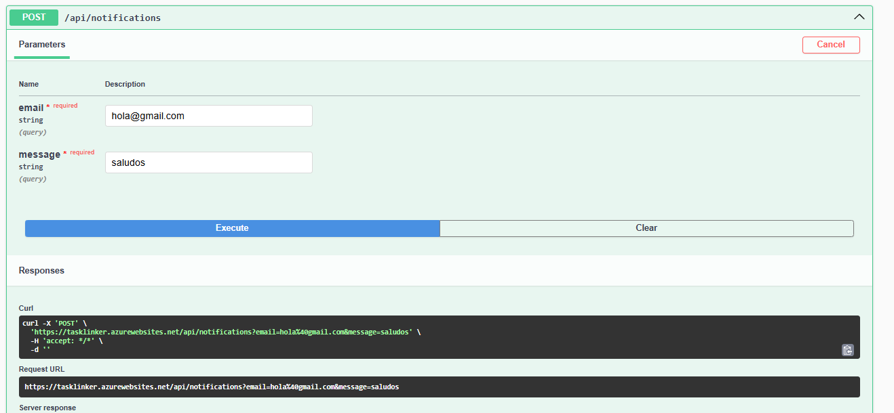

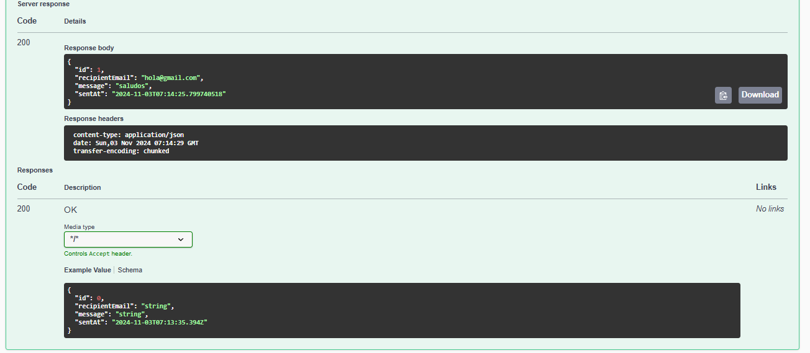

GET
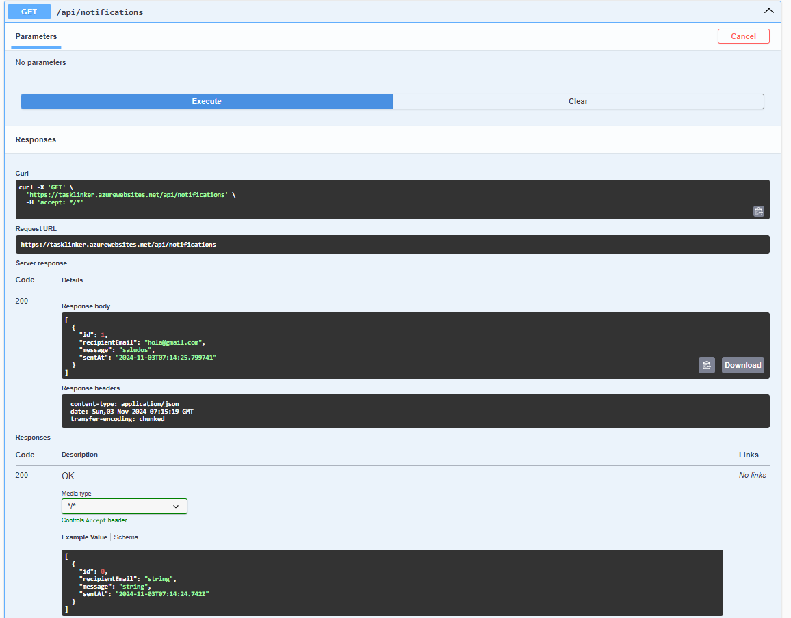

##### Worker Profile

POST
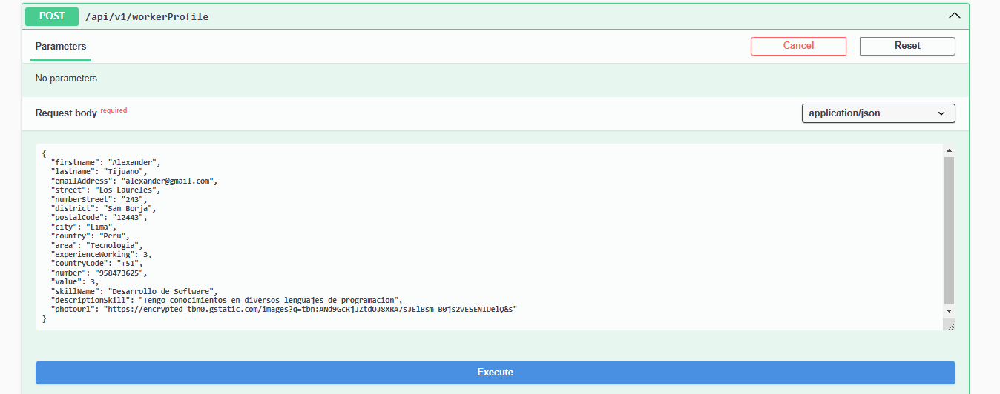

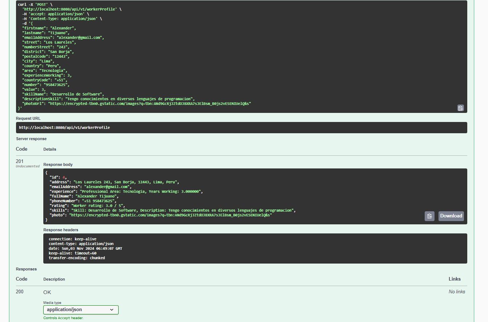

GET
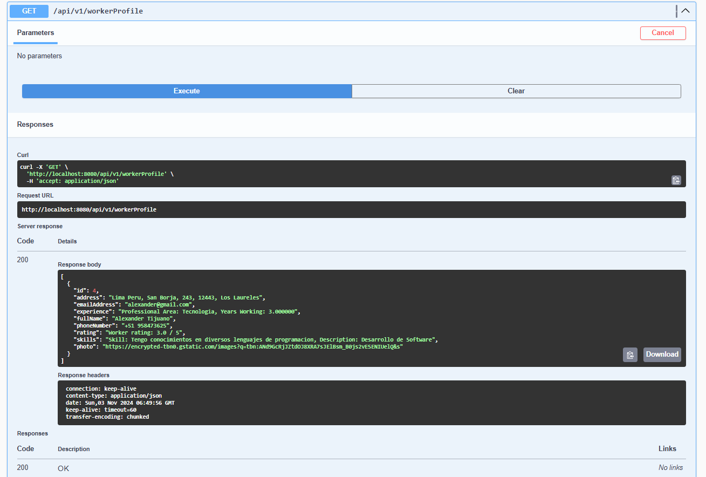

GET BY ID

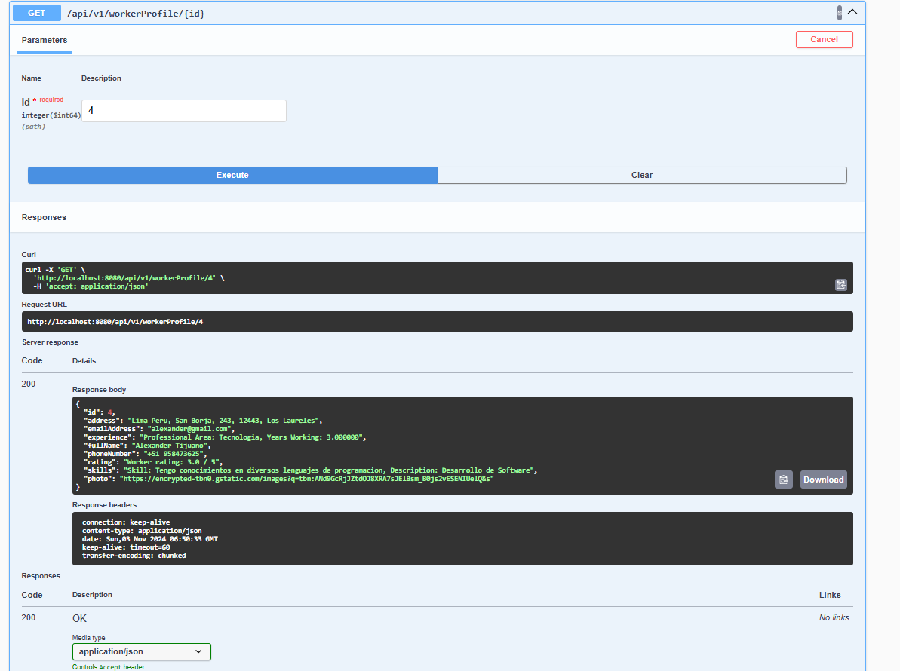

DELETE

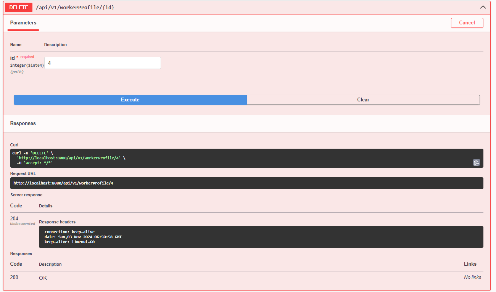

##### Employer Profile

POST
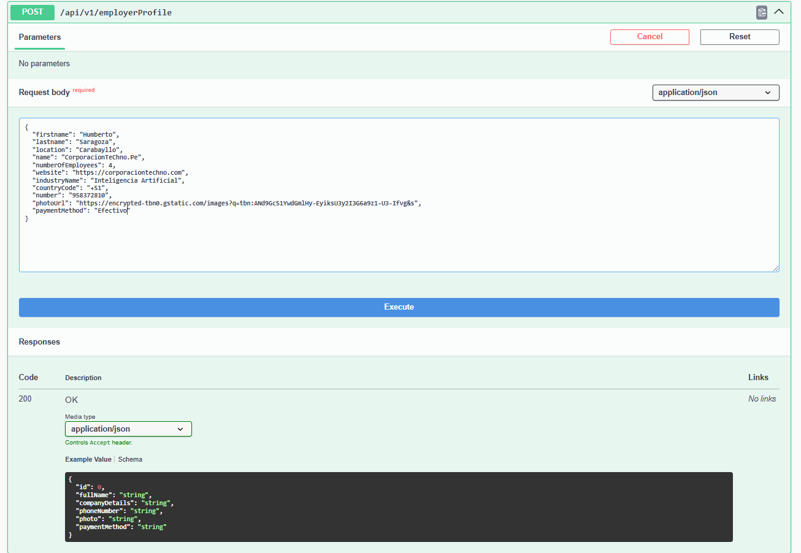

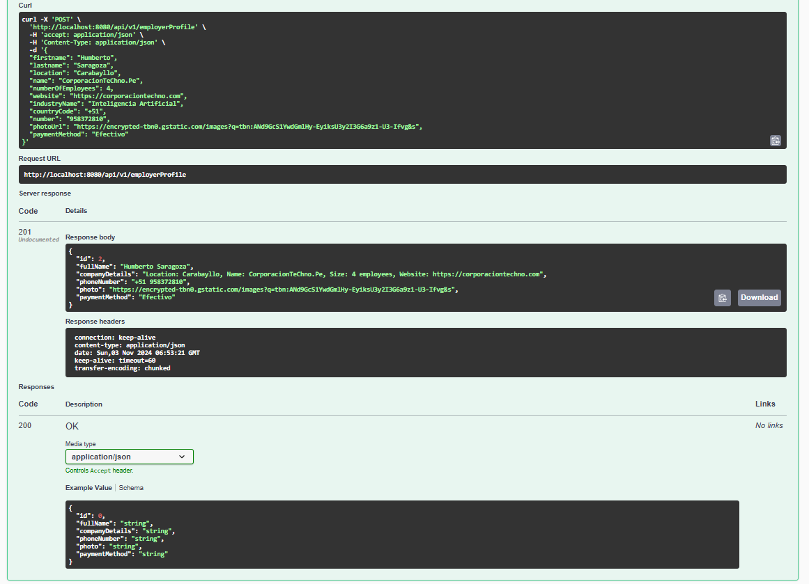

GET
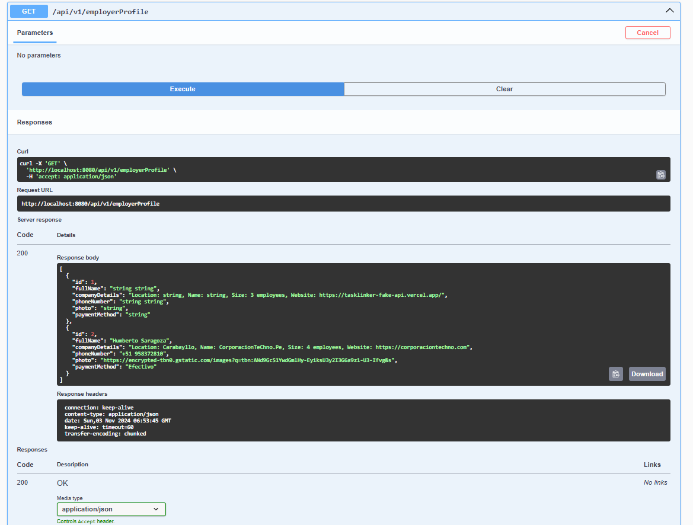

#### 5.2.3.6. Service Documentation Evidence for Sprint Review

En esta sección, se destacarán los principales endpoints de los bounded context , detallando sus funcionalidades y cómo respaldan las operaciones esenciales del servicio. Se describirá el propósito y la utilidad de cada endpoint, enfocándose en acciones como la creación, consulta, actualización y eliminación de perfiles de trabajadores y empleadores. Por otra parte, con respecto a la utilidad del bounded context Notifications, la creación y consulta requerida.

##### Notification

| Endpoint Route                 | Action                              | HTTP Verb | Required Parameters                               | Call Example | Response |
|--------------------------------|-------------------------------------|-----------|---------------------------------------------------|--------------|----------|
| `/api/notifications` |  Create a new notification  |     POST      |   `email` string required,  `message` string required                |    `POST /api/notifications` with JSON body        |  `200 OK`     |
| `/api/notifications` |  Get all notifications      |     GET       |                None                    |    `GET /api/notifications`           |     `200 OK`     |

##### Worker

| Endpoint Route               | Action                            | HTTP Verb | Required Parameters                          | Call Example                                                                                                                                       | Response                                                                                                                                                                       |
|------------------------------|-----------------------------------|-----------|----------------------------------------------|-----------------------------------------------------------------------------------------------------------------------------------------------------|--------------------------------------------------------------------------------------------------------------------------------------------------------------------------------|
| `/api/v1/workerProfile`      | Create a new worker profile      | POST      | `CreateWorkerResource` in the request body   | `POST /api/v1/workerProfile` with JSON body                | `201 Created` with `WorkerResource` JSON body if successful                                                                                |
| `/api/v1/workerProfile/{id}` | Get a worker profile by ID       | GET       | `id` as path variable                       | `GET /api/v1/workerProfile/1`                                                                                                                     | `200 OK` with `WorkerResource` JSON body if found                                                                                         |
| `/api/v1/workerProfile`      | Get all worker profiles          | GET       | None                                         | `GET /api/v1/workerProfile`                                                                                                                       | `200 OK` with array of `WorkerResource` JSON objects if profiles exist                                                                    |
| `/api/v1/workerProfile/{id}` | Update a worker profile by ID    | PUT       | `id` as path variable, `UpdateWorkerByIdCommand` in the request body | `PUT /api/v1/workerProfile/1` with JSON body | `200 OK` with updated `Worker` JSON object if successful                                                               |
| `/api/v1/workerProfile/{id}` | Delete a worker profile by ID    | DELETE    | `id` as path variable                       | `DELETE /api/v1/workerProfile/1`                                                                                                                  | `200 OK` if deleted successfully                                                                                  |

##### Employer

| Endpoint Route                 | Action                              | HTTP Verb | Required Parameters                               | Call Example                                                                                                                                                                      | Response                                                                                                                                                                                       |
|--------------------------------|-------------------------------------|-----------|---------------------------------------------------|------------------------------------------------------------------------------------------------------------------------------------------------------------------------------------|------------------------------------------------------------------------------------------------------------------------------------------------------------------------------------------------|
| `/api/v1/employerProfile`      | Create a new employer profile       | POST      | `CreateEmployerResource` in the request body      | `POST /api/v1/employerProfile` with JSON body                                                     | `201 Created` with `EmployerResource` JSON body if successful                                                                                           |
| `/api/v1/employerProfile/{id}` | Get an employer profile by ID       | GET       | `id` as path variable                             | `GET /api/v1/employerProfile/1`                                                                                                                                                   | `200 OK` with `EmployerResource` JSON body if found                                                                                                           |
| `/api/v1/employerProfile`      | Get all employer profiles           | GET       | None                                              | `GET /api/v1/employerProfile`                                                                                                                                                     | `200 OK` with an array of `EmployerResource` JSON objects if profiles exist                                                                             |
| `/api/v1/employerProfile/{id}` | Update an employer profile by ID    | PUT       | `id` as path variable, `UpdateEmployerByIdCommand` in the request body | `PUT /api/v1/employerProfile/1` with JSON body                | `200 OK` with updated `Employer` JSON object if successful                                                                            |
| `/api/v1/employerProfile/{id}` | Delete an employer profile by ID    | DELETE    | `id` as path variable                             | `DELETE /api/v1/employerProfile/1`                                                                                                                                                 | `200 OK` if deleted successfully                                                                                                         |

#### 5.2.3.7. Software Deployment Evidence for Sprint Review
Durante este sprint, se utilizó Azure como plataforma de despliegue para la aplicación web.

- 1. Crear un recurso de *Azure App Service*

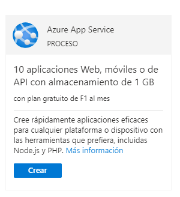

- 2. Escoger el entorno de **Java 21** y configurar un nombre para el dominio

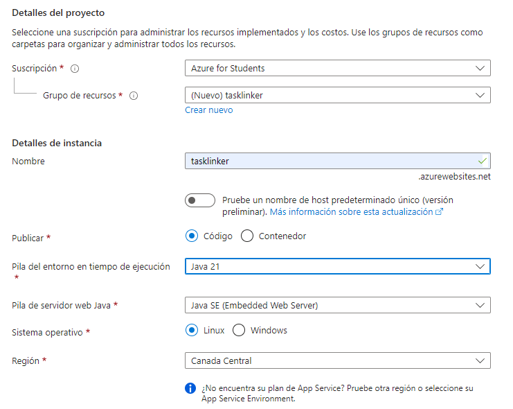

- 3. Actualizar la conexión a la base de datos

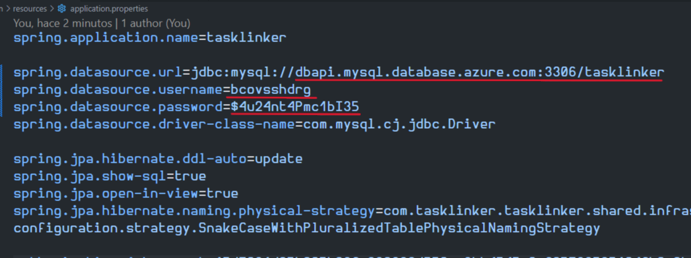

- 4. En el menú del recurso de Azure seleccionar *Deploy to Web App* 

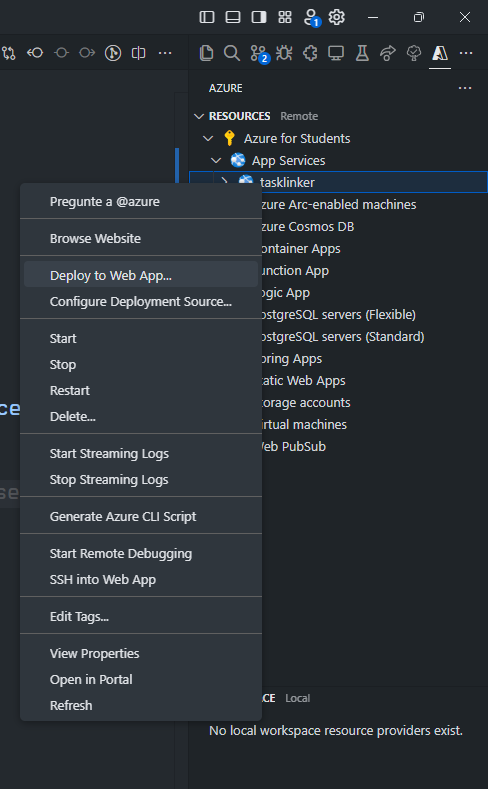

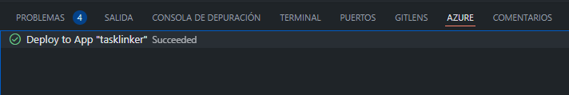

- 4. Verificar el funcionamiento de Swagger en el dominio del App Service

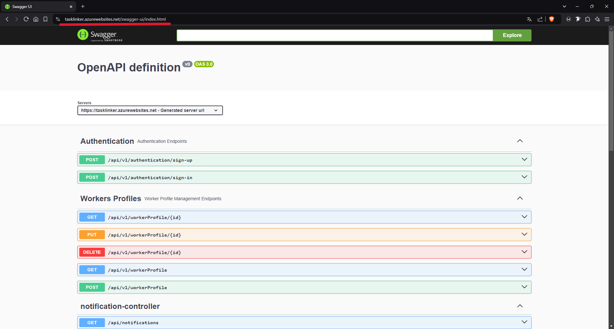

[Link:](https://tasklinker.azurewebsites.net/swagger-ui/index.html) https://tasklinker.azurewebsites.net/swagger-ui/index.html

#### 5.2.3.8. Team Collaboration Insights during Sprint
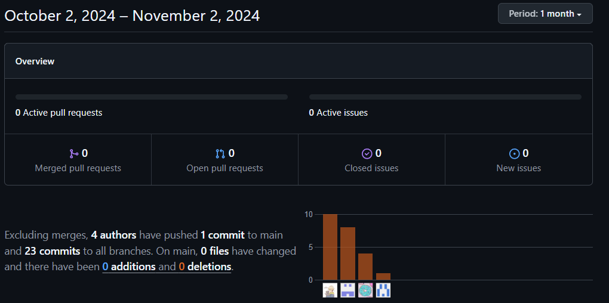

### 5.2.4. Sprint 4
#### 5.2.4.1. Sprint Planning 4
| Sprint # | Sprint 4 |
| -------- | -------- |
|**Sprint Planning Background**|
| Date | 2024-10-23|
| Time | 08:00 PM |
| Location | Discord Virtual Meeting |
| Prepared By | Camila Sanchez, Gianfranco Durand |
|Attendees (to planning meeting) | Camila Sanchez, Gianfranco Durand, Daniel Chávarri , Tony Ramos, Jack Roque
| Sprint 2 Review Summary | Durante el segundo sprint, el equipo se enfocó en la creación de la primera versión del frontend, utilizando Trello para organizar tareas y basándose en las historias de usuario, asegurando su atractivo visual y funcionalidad. |
| Sprint 2 Retrospective Summary | Se identificó la necesidad de mejorar la comunicación para abordar dudas más rápidamente y de aumentar la revisión de pruebas antes del despliegue para asegurar la calidad. |
| **Sprint Goal & User Stories** | 
| Sprint 3 Goal | 	Desplegar la primera versión de Web Services. |
| Sprint 3 Velocity | 11 |
| Sum of Story Points | 43 Story points | 

#### 5.2.4.2. Sprint Backlog 4

link: [Enlace de trello](https://trello.com/b/b8PH3hVt/sprint-3-tb2) https://trello.com/b/b8PH3hVt/sprint-3-tb2

| Sprint 4 |     |     |     |     |     |     |     |
| --- | --- | --- | --- | --- | --- | --- | --- |
| User Story |     | WorkItem/ Task |     |     |     |     |     |
| Id  | Title | Epic Id  | Title | Description | Estimation(Hours) | Assigned To | Status(To do/ In Process/ To Review/Done) |
| US011 | Ver la reputación de los trabajadores | EP010 | Gestión y Clasificación de Tareas | Como empleador, quiero poder ver las calificaciones y comentarios previos de otros empleadores sobre un trabajador antes de contratarlo, para asegurarme de que es confiable y competente. | 8 hours | Diego, Camila | Done |
| US12 | Actualizar la reputación de los trabajadores | EP010 | Gestión y Clasificación de Tareas | Como trabajador, quiero que mi reputación en la plataforma se actualice automáticamente con cada evaluación recibida, para reflejar de manera precisa mi desempeño a lo largo del tiempo | 7 hours | Tony | Done |
| US05 | Subir y actualizar documentos| EP03 | Implementación de un Sistema de Reputación. | Como trabajador, quiero poder subir y actualizar documentos importantes en mi perfil, como certificados de habilidades y documentos de identidad, para que los empleadores puedan evaluar mi idoneidad para los trabajos disponibles. | 8 hours | Tony, Camila | Done |
| US13 | Editar perfil de usuario | EP005 | Panel de Usuario Personalizado | Como usuario registrado, quiero poder editar mi perfil para actualizar mi información personal, habilidades y disponibilidad, para que los empleadores tengan datos precisos sobre mí. | 8 hours | Tony | In process |
| US14 | Visualizar y gestionar mis tareas | EP005 | Panel de Usuario Personalizado	 | Como usuario registrado, quiero poder ver y gestionar las tareas que he aceptado o completado, para hacer seguimiento de mi trabajo y planificar mejor mis actividades. | 8 hours | Camila | In process |
| US15 | Recibir notificaciones de nuevas oportunidades de trabajo | EP006 | Panel de Usuario Personalizado | Como trabajador, quiero recibir notificaciones automáticas cuando se publiquen nuevas oportunidades de trabajo que coincidan con mis preferencias, para poder aplicar rápidamente a tareas relevantes. | 8 hours | Diego | Done |
| US16 | Ver perfil detallados de los trabajadores | EP007 | Gestión de Perfiles y Evaluaciones | Como empleador, quiero poder ver perfiles detallados de los trabajadores, incluyendo experiencia, habilidades y evaluaciones previas, para tomar decisiones informadas antes de contratarlos. | 8 hours | Tony | Done |
| US17 | Actualizar mi perfil como trabajador | EP007 | Gestión de Perfiles y Evaluaciones | Como trabajador, quiero poder actualizar mi perfil con nueva información sobre habilidades, experiencia o certificaciones, para atraer más empleadores y mostrar mi crecimiento profesional. | 8 hours | Franco, Camila | In process |
| US20 | Iniciar sesión con autenticación multifactor activada | EP009 | Implementadón de Autenticación Multifactor		| Como usuario, quiero que al iniciar sesión en mi cuenta, se me solicite una verificación adicional a través de la autenticación multifactor, para asegurar que solo yo pueda acceder a mi cuenta. | 8 hours | Franco | In process |
| US21 | Evaluar a los trabajadores después de un trabajo | EP007 | Gestión de Perfiles y Evaluaciones	| Como empleador, quiero evaluar a los trabajadores una vez que terminen un trabajo, para que pueda contribuir a la reputación y ayudar a otros empleadores a elegir a los mejores candidatos. | 8 hours | Camila | In process |
| US30 | Creación de perfil como trabajador | EP007 | Gestión de Perfiles y Evaluaciones | Como trabajador, quiero crear un perfil en la plataforma para poder ofrecer mis servicios y ser contratado por empleadores. | 8 hours | Franco, Camila | Done |
| US31 | Creación de perfil como empleador | EP007 | Gestión de Perfiles y Evaluaciones | Como empleador, quiero crear un perfil en la plataforma para poder publicar ofertas de trabajo y contratar trabajadores para tareas específicas o temporales. | 8 hours | Franco, Camila | Done |
| US32 | Ver perfil detallado de los empleadores | EP005 | Panel de Usuario Personalizado | Como empleador, quiero poder actualizar mi perfil en la plataforma para reflejar cambios en los datos de la compañía, detalles de contacto, método de pago, rango salarial y número de teléfono, asegurando que la información sea precisa y esté actualizada para atraer a trabajadores potenciales. | 8 hours | Tony | Done |
| US33 | Creación de perfil como empleador | EP005 | Panel de Usuario Personalizado	 | Como empleador, quiero crear un perfil en la plataforma para poder publicar ofertas de trabajo y contratar trabajadores para tareas específicas o temporales. | 8 hours | Tony | Done |

#### 5.2.4.3. Development Evidence for Sprint Review

#### 5.2.4.4. Testing Suite Evidence for Sprint Review

#### 5.2.4.5. Execution Evidence for Sprint Review

#### 5.2.4.6. Services Documentation Evidence for Sprint Review

#### 5.2.4.7. Software Deployment Evidence for Sprint Review

#### 5.2.4.8. Team Collaboration Insights during Sprint

## 5.3. Validation Interviews
En esta sección de nuestro proyecto, nos enfocamos en detectar cuáles son los puntos de mejora de nuestro sitio web para lograr un mayor compromiso con Tasklinker. Esta fase crucial del proyecto implica un diálogo directo con nuestros principales usuarios para recopilar sus opiniones y sugerencias a través de entrevistas.

### 5.3.1. Diseño de Entrevistas
Se decribe la metodología utilizada para diseñar las entrevistas de validación, incluyendo la selección de participantes, la formulación de preguntas y el enfoque adaptaddo para obtener información relevante y precisa sobre la experiencia del usuario con la aplicación Tasklinker:

**Sitio web**

User Goal: Registrar
User persona: Trabajador o Empleador
Explicación del flujo: El usuario accederá a la aplicación y podrá remitir a la aplicación la información necesaria para crear una cuenta. Luego de crear su cuenta le redirigira para registrar su método de pago. Una vez que el proceso de pago es completado exitosamente, se notifica al usuario con un mensaje confirmando el vinculo de su tarjeta con la plataforma

User Goal: Iniciar sesión
User persona: Trabajador o Empleador
Explicación del flujo: El usuario accederá a la aplicación e introducirá su nombre de usuario y contraseña en el formulario de inicio de sesión. Si las credenciales son correctas, el usuario será dirigido al dashboard. En caso contrario, se le solicitará que reintroduzca sus datos.

User Goal: Perfil
User persona: Trabajador o Empleador
Explicación del flujo: Después de iniciar sesión, el usuario podrá dirigirse a la sección Perfil para editar datos personales o la opción de permitir al usuario cambiar de cuenta a una de empleador y utilizar las herramientas de este por la plataforma. 

User Goal: Navegar por el dashboard
User persona: Trabajador o Empleador
Explicación del flujo: Después de iniciar sesión, el usuario será dirigido al dashboard, donde podrá visualizar las últimas tareas publicadas, el botón para publicar, filtros y un panel de su perfil con la sección "Configuración".

### 5.3.2. Registro de Entrevistas

<!DOCTYPE html>
<html lang="es">
<head>
    <meta name="viewport" content="initial-scale=1.0">
    
</head>
<body>
<table>
    <thead>
        <tr>
            <th>Sección</th>
            <th>Características del video</th>
            <th>Sobre el contenido</th>
            <th>Integración y entrega</th>
        </tr>
    </thead>
    <tbody>
        <tr>
            <td>Validation Interviews</td>
            <td>Formato: mp4
             Duración: 3:31 min </td>
            <td>Entrevistado(a) #1: Sebastian Silva 
             Sexo: Hombre
             Edad: 20 años
             Segmento Objetivo: Trabajador  
              Distrito: San Luis </td>
            <td>Screenshot:
              Link: https://upcedupe-my.sharepoint.com/:v:/g/personal/u202210973_upc_edu_pe/Eev7_47SUiZLrBtQ2tE7g3gBOPKTyZ0-0ZzaxTxT4rUDHw?nav=eyJyZWZlcnJhbEluZm8iOnsicmVmZXJyYWxBcHAiOiJTdHJlYW1XZWJBcHAiLCJyZWZlcnJhbFZpZXciOiJTaGFyZURpYWxvZy1MaW5rIiwicmVmZXJyYWxBcHBQbGF0Zm9ybSI6IldlYiIsInJlZmVycmFsTW9kZSI6InZpZXcifX0%3D&e=uEBO4s  </td>
        </tr>
        <tr>
            <td>Validation Interviews</td>
            <td>Formato: mp4
             Duración:  min </td>
            <td>Entrevistado(a) #2:
             Sexo:
             Edad: años
             Segmento Objetivo:   
              Distrito: </td>
            <td>Screenshot:
              Link: </td>
        </tr>
        <tr>
            <td>Validation Interviews</td>
            <td>Formato: mp4
             Duración:  min </td>
            <td>Entrevistado(a) #3:
             Sexo:
             Edad: años
             Segmento Objetivo:   
              Distrito: </td>
            <td>Screenshot:
              Link: </td>
        </tr>
    </tbody>
</table>

</body>
</html>

### 5.3.3. Evaluaciones según heurísticas
Aquí se explican las evaluaciones realizadas utilizando principios heurísticos de usabilidad. Se analizan los resultados obtenidos y se identifican áreas de mejora en la interfaz y la funcionalidad de la aplicación, con el fin de optimizar la experiencia del usuario y asegurar la eficacia del producto.

Site o App a Evaluar: Tasklinker

Tareas a Evaluar: 

1. Iniciar sesión
2. Crear cuenta
3. Cargar tarjeta
4. Mi perfil
5. Subir Archivos
6. Trabajos realizados
7. Historial de trabajos Publicados
8. Panel de control (Dashboard)
9. Aplicación de Filtro
10. Botón Publicar Tarea
11. Postulantes
12. Finalizar Tarea

**Escala de Severidad:** 

Los errores serán puntiados tomando en cuenta la siguiente escala de severidad.

| Nivel | Descripción |
|-------|-------------|
|   1   | Problema superficial: puede ser fácilmente superado por el usuario ó ocurre con muy poco frecuencia. No necesita ser arreglado a no ser que exista disponibilidad de tiempo. |
|   2   | Problema menor: puede ocurrir un poco más frecuentemente o es un poco más difícil de superar para el usuario. Se le debería asignar una prioridad baja de cara resolverlo al siguiente release. |
|   3   | Problema mayor: ocurre frecuentemente o los usuarios no son capaces de resolverlos. Es importante que sean corregidos y se les debe asignar una prioridad alta. |
|   4   | Problema muy grave: un error de gran impacto que impide al usuario continuar con el uso de la herramienta. Es imperativo que sea corregido antes del lanzamiento. |

**Tabla de Resumen:** 

| # | Problema | Escala de Severidad | Heurística/Principio violada(o) |
|---|----------|---------------------|---------------------|
| 1 |  |  |  |
| 2 |  |  |  |
| 3 |  |  |  |

----
 

**Descripción del Problemas:**

- **Problema #1:**
- **Severidad:** 
- **Heurística/Principio violado(a):** 
- **Problema:** 
- **Recomendación:** 

---

- **Problema #2:**
- **Severidad:** 
- **Heurística/Principio violado(a):** 
- **Problema:** 
- **Recomendación:** 

---

- **Problema #3:**
- **Severidad:** 
- **Heurística/Principio violado(a):** 
- **Problema:** 
- **Recomendación:** 
 

# 5.4. Video About-the-Product
En esta sección se presenta un video explicatiovo sobre la aplicación Tasklinker. El video destaca las principales características y beneficios del producto, demostrando cómo satisface las necesidad de los clientes. Este recurso visual es esencial para comunicar de manera efectiva el valor de la apliación a potenciales usuarios e inversores.

Enlace al Video About-The-Product: https://upcedupe-my.sharepoint.com/:v:/g/personal/u20201f640_upc_edu_pe/EfFCppV64GFPupXAacw9P0QBWOfH66q39wxBOzVWZzEUFg?nav=eyJyZWZlcnJhbEluZm8iOnsicmVmZXJyYWxBcHAiOiJTdHJlYW1XZWJBcHAiLCJyZWZlcnJhbFZpZXciOiJTaGFyZURpYWxvZy1MaW5rIiwicmVmZXJyYWxBcHBQbGF0Zm9ybSI6IldlYiIsInJlZmVycmFsTW9kZSI6InZpZXcifX0%3D&e=fzwv4u 

# Conclusiones
## Conclusiones y recomendaciones

Conclusiones

TaskLinker aborda una brecha significativa en el mercado laboral peruano, donde existe una creciente demanda de trabajos temporales y por horas. Actualmente, tanto los trabajadores como los empleadores enfrentan dificultades para conectarse de manera eficiente, lo que resulta en una subutilización de talento y procesos de contratación ineficientes.

La plataforma se adapta a un amplio segmento de la población, como estudiantes, amas de casa, jubilados y personas con empleos parciales, quienes valoran la flexibilidad laboral que ofrece TaskLinker. Esta flexibilidad es clave en un mercado laboral que busca adaptarse a diferentes estilos de vida y necesidades.

TaskLinker resuelve la desconexión existente entre oferta y demanda de empleo temporal mediante una plataforma centralizada, fácil de usar, que permite a los trabajadores encontrar oportunidades laborales y a los empleadores contratar personal de manera rápida y eficiente.

La plataforma tiene el potencial de convertirse en la líder del mercado en Perú para trabajos por horas, mejorando tanto la eficiencia de contratación como la satisfacción de trabajadores y empleadores.

TaskLinker ofrece un modelo de negocio flexible, con una opción gratuita que incluye comisiones por transacción y un plan premium que elimina estas comisiones y ofrece beneficios adicionales. Esto facilita el acceso de usuarios con diferentes necesidades económicas y volúmenes de trabajo.

Recomendaciones

Implementar y promocionar un sistema de evaluaciones y reseñas confiable que genere confianza tanto en empleadores como en trabajadores. Esto mejorará la transparencia y fomentará más transacciones exitosas en la plataforma.

Simplificar aún más el proceso de registro para atraer a más usuarios. Se recomienda medir la tasa de conversión y establecer metas claras para aumentar el número de inscripciones de trabajadores y empleadores.

Considerar la expansión de TaskLinker a nuevas regiones dentro de Perú, particularmente en zonas urbanas donde la demanda de trabajos temporales es alta. Campañas de marketing dirigidas a estas áreas ayudarán a incrementar la base de usuarios.

Para maximizar la eficiencia tanto para empleadores como para trabajadores, se recomienda mejorar las opciones de búsqueda y filtrado en la plataforma, permitiendo que ambos grupos encuentren rápidamente las oportunidades o perfiles adecuados.

Además de enfocarse en PyMEs y particulares, TaskLinker podría explorar alianzas con grandes empresas o instituciones que también puedan necesitar trabajadores temporales para proyectos específicos o eventos.

Es crucial realizar un seguimiento del impacto del modelo de comisiones y el plan premium para asegurar que las tarifas no representen una barrera para la participación. Ajustar el modelo en función del volumen de transacciones y el feedback de los usuarios puede ser clave para optimizar el crecimiento de la plataforma.

Incluir un sistema de notificaciones que informe a los trabajadores sobre oportunidades relevantes para sus habilidades y preferencias, aumentando su participación y el número de trabajos completados.

## Video About-the-Team.
<table>
    <thead>
        <tr>
            <th>Sección</th>
            <th>Características del video</th>
            <th>Sobre el contenido</th>
            <th>Integración y entrega</th>
        </tr>
    </thead>
    <tbody>
        <tr>
            <td>About The Team</td>
            <td>Formato: mp4
             Duración: 7:18 min </td>
            <td>Video relacionado acerca de los integrantes del equipo, el desarrollo de cada integrante y sus conclusiones acerca del proyecto realizado. </td>
            <td> Link: https://upcedupe-my.sharepoint.com/:v:/g/personal/u20201f640_upc_edu_pe/ESjaBnEaSv9KsApVAYRPQHUBDehk1yp3t77m_GzyR9l2SQ?nav=eyJyZWZlcnJhbEluZm8iOnsicmVmZXJyYWxBcHAiOiJTdHJlYW1XZWJBcHAiLCJyZWZlcnJhbFZpZXciOiJTaGFyZURpYWxvZy1MaW5rIiwicmVmZXJyYWxBcHBQbGF0Zm9ybSI6IldlYiIsInJlZmVycmFsTW9kZSI6InZpZXcifX0%3D&e=KhH4LN </td>
        </tr>
    </tbody>
</table>

</body>
</html>

# Bibliografía

MetLife México. (s. f.). Formas de generar ingresos adicionales. MetLife. 
(https://www.metlife.com.mx/blog/bienestar-financiero/formas-de-generar-ingresos-adicionales/)

Universidad San Ignacio de Loyola. (2022, 28 marzo). Formas de contratación de personal de una empresa. Blog USIL Facultad de Ciencias Empresariales. (https://blogs.usil.edu.pe/facultad-ciencias-empresariales/ciencias-empresariales/formas-de-contratacion-de-personal-de-una-empresa)

Shiftbase. (s. f.). Contrato temporal. Shiftbase. (https://www.shiftbase.com/es/glosario/contrato-temporal)

# Anexos

**Anexo 1:**

[Link Frontend:](https://tasklinker.netlify.app/) https://tasklinker.netlify.app/

**Anexo 2:**

[Link Backend:](https://tasklinker.azurewebsites.net/swagger-ui/index.html) https://tasklinker.azurewebsites.net/swagger-ui/index.html

[About The Product:](https://upcedupe-my.sharepoint.com/:v:/g/personal/u20201f640_upc_edu_pe/EfFCppV64GFPupXAacw9P0QBWOfH66q39wxBOzVWZzEUFg?nav=eyJyZWZlcnJhbEluZm8iOnsicmVmZXJyYWxBcHAiOiJTdHJlYW1XZWJBcHAiLCJyZWZlcnJhbFZpZXciOiJTaGFyZURpYWxvZy1MaW5rIiwicmVmZXJyYWxBcHBQbGF0Zm9ybSI6IldlYiIsInJlZmVycmFsTW9kZSI6InZpZXcifX0%3D&e=fzwv4u) https://upcedupe-my.sharepoint.com/:v:/g/personal/u20201f640_upc_edu_pe/EfFCppV64GFPupXAacw9P0QBWOfH66q39wxBOzVWZzEUFg?nav=eyJyZWZlcnJhbEluZm8iOnsicmVmZXJyYWxBcHAiOiJTdHJlYW1XZWJBcHAiLCJyZWZlcnJhbFZpZXciOiJTaGFyZURpYWxvZy1MaW5rIiwicmVmZXJyYWxBcHBQbGF0Zm9ybSI6IldlYiIsInJlZmVycmFsTW9kZSI6InZpZXcifX0%3D&e=fzwv4u

[About The Team:](https://upcedupe-my.sharepoint.com/:v:/g/personal/u20201f640_upc_edu_pe/ESjaBnEaSv9KsApVAYRPQHUBDehk1yp3t77m_GzyR9l2SQ?nav=eyJyZWZlcnJhbEluZm8iOnsicmVmZXJyYWxBcHAiOiJTdHJlYW1XZWJBcHAiLCJyZWZlcnJhbFZpZXciOiJTaGFyZURpYWxvZy1MaW5rIiwicmVmZXJyYWxBcHBQbGF0Zm9ybSI6IldlYiIsInJlZmVycmFsTW9kZSI6InZpZXcifX0%3D&e=KhH4LN) https://upcedupe-my.sharepoint.com/:v:/g/personal/u20201f640_upc_edu_pe/ESjaBnEaSv9KsApVAYRPQHUBDehk1yp3t77m_GzyR9l2SQ?nav=eyJyZWZlcnJhbEluZm8iOnsicmVmZXJyYWxBcHAiOiJTdHJlYW1XZWJBcHAiLCJyZWZlcnJhbFZpZXciOiJTaGFyZURpYWxvZy1MaW5rIiwicmVmZXJyYWxBcHBQbGF0Zm9ybSI6IldlYiIsInJlZmVycmFsTW9kZSI6InZpZXcifX0%3D&e=KhH4LN