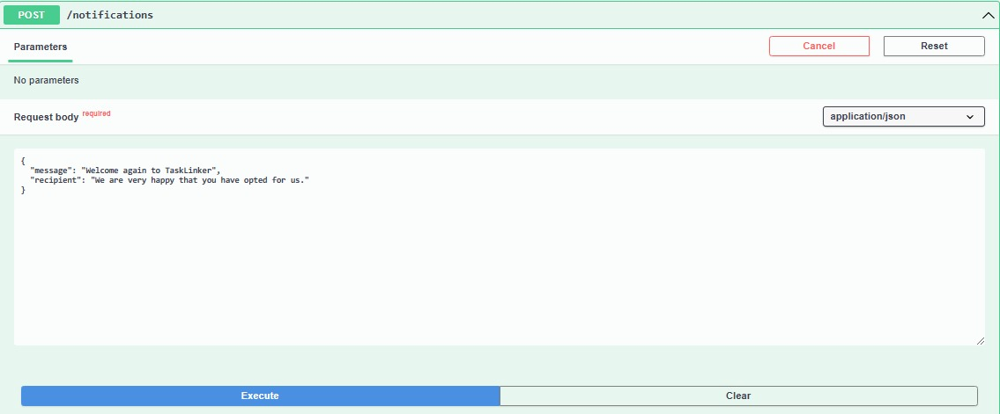

# 
COURSE PROJECT

    <strong>Universidad Peruana de Ciencias Aplicadas</strong> 
    </img> 
    <strong>Ingeniería de Software - 2024-2</strong> 
    <strong>Desarrollo de Aplicaciones Open Source - WX51</strong> 
    <strong>Profesor: Alberto Wilmer Sanchez Seña</strong> 
     <strong>Informe del Trabajo Final</strong>

    <strong>Startup: GPTDevs</strong> 
    <strong>Producto: TaskLinker </strong>

    <h3>Team Members:</h3>
    <table align="center">
        <tr>
            <th style="text-align:center;">Member</th>
            <th style="text-align:center;">Code</th>
        </tr>
        <tr>
            <td>Ramos Najar, Tony Alexander</td>
            <td>U20211A153</td>
        </tr>
        <tr>
            <td>Sanchez Rios, Camila Cristina</td>
            <td>U202210973</td>
        </tr>
        <tr>
            <td>Durand Vera, Gianfranco Angel</td>
            <td>U20201F640</td>
        </tr>
        <tr>
            <td>Chávarri Zarzosa, Daniel Jhared</td>
            <td>U202211108</td>
        </tr>
    </table>

    <strong>Agosto, 2024</strong>

 

<h1 align="center">Registro de versiones del Informe</h1>
 
<table>
        <thead>
            <tr>
                <th>Versión</th>
                <th>Fecha</th>
                <th>Autor</th>
                <th>Descripción de modificaciones</th>
            </tr>
        </thead>
        <tbody>
            <tr>
                <th>TB1</th>
                <td>20/08/2024</td>
                <td>
                    <ul>
          <li>Tony Ramos</li>
          <li>Camila Sanchez</li>
          <li>Gianfranco Durand</li>
          <li>Daniel Chávarri</li>
                    <ul>
           </td>
      <td>            
             <ul>
          <li>Capítulo I: Introducción</li>
          <li>Capítulo II: Requirements Elicitation & Analysis</li>
          <li>Capítulo III: Requirements Specification</li>
          <li>Capítulo IV: Product Design</li>
          <li>Avance del Capítulo V: Product Implementation, Validation & Deployment hasta el punto 5.2.1.8</li>
          <li>Avance de Conclusiones, Bibliografía y Anexos</li>
        </ul>
      </td>
  </tr>
</tbody>
</table>

# Project Report Collaboration Insights

# Contenido
[Student Outcome](#student-outcome)

[Capítulo I: Introducción](#capítulo-i-introducción)
- [1.1. Startup Profile](#11-startup-profile)
  - [1.1.1. Descripción de la Startup](#111-descripción-de-la-startup)
  - [1.1.2. Perfiles de integrantes del equipo](#112-perfiles-de-integrantes-del-equipo)
- [1.2. Solution Profile](#12-solution-profile)
  - [1.2.1 Antecedentes y problemática](#121-antecedentes-y-problemática)
  - [1.2.2 Lean UX Process](#122-lean-ux-process)
    - [1.2.2.1. Lean UX Problem Statements](#1221-lean-ux-problem-statements)
    - [1.2.2.2. Lean UX Assumptions](#1222-lean-ux-assumptions)
    - [1.2.2.3. Lean UX Hypothesis Statements](#1223-lean-ux-hypothesis-statements)
    - [1.2.2.4. Lean UX Canvas](#1224-lean-ux-canvas)
- [1.3. Segmentos objetivo](#13-segmentos-objetivo)

[Capítulo II: Requirements Elicitation & Analysis](#capítulo-ii-requirements-elicitation--analysis)
- [2.1. Competidores](#21-competidores)
  - [2.1.1. Análisis competitivo](#211-análisis-competitivo)
  - [2.1.2. Estrategias y tácticas frente a competidores](#212-estrategias-y-tácticas-frente-a-competidores)
- [2.2. Entrevistas](#22-entrevistas)
  - [2.2.1. Diseño de entrevistas](#221-diseño-de-entrevistas)
  - [2.2.2. Registro de entrevistas](#222-registro-de-entrevistas)
  - [2.2.3. Análisis de entrevistas](#223-análisis-de-entrevistas)
- [2.3. Needfinding](#23-needfinding)
  - [2.3.1. User Personas](#231-user-personas)
  - [2.3.2. User Task Matrix](#232-user-task-matrix)
  - [2.3.3. User Journey Mapping](#233-user-journey-mapping)
  - [2.3.4. Empathy Mapping](#234-empathy-mapping)
  - [2.3.5. As-is Scenario Mapping](#235-as-is-scenario-mapping)
- [2.4. Ubiquitous Language](#24-ubiquitous-language)

[Capítulo III: Requirements Specification](#capítulo-iii-requirements-specification)
- [3.1. To-Be Scenario Mapping](#31-to-be-scenario-mapping)
- [3.2. User Stories](#32-user-stories)
- [3.3. Impact Mapping](#33-impact-mapping)
- [3.4. Product Backlog](#34-product-backlog)

[Capítulo IV: Product Design](#capítulo-iv-product-design)
- [4.1. Style Guidelines](#41-style-guidelines)
  - [4.1.1. General Style Guidelines](#411-general-style-guidelines)
  - [4.1.2. Web Style Guidelines](#412-web-style-guidelines)
- [4.2. Information Architecture](#42-information-architecture)
  - [4.2.1. Organization Systems](#421-organization-systems)
  - [4.2.2. Labeling Systems](#422-labeling-systems)
  - [4.2.3. SEO Tags and Meta Tag](#423-seo-tags-and-meta-tag)
  - [4.2.4. Searching Systems](#424-searching-systems)
  - [4.2.5. Navigation Systems](#425-navigation-systems)
- [4.3. Landing Page UI Design](#43-landing-page-ui-design)
  - [4.3.1. Landing Page Wireframe](#431-landing-page-wireframe)
  - [4.3.2. Landing Page Mock-up](#432-landing-page-mock-up)
- [4.4. Web Applications UX/UI Design](#44-web-applications-uxui-design)
  - [4.4.1. Web Applications Wireframes](#411-general-style-guidelines)
  - [4.4.2. Web Applications Wireflow Diagrams](#442-web-applications-wireflow-diagrams)
  - [4.4.3. Web Applications Mock-ups](#443-web-applications-mock-ups)
  - [4.4.4. Web Applications User Flow Diagrams](#444-web-applications-user-flow-diagrams)
- [4.5. Web Applications Prototyping](#45-web-applications-prototyping)
- [4.6. Domain-Driven Software Architecture](#46-domain-driven-software-architecture)
  - [4.6.1. Software Architecture Context Diagram](#461-software-architecture-context-diagram)
  - [4.6.2. Software Architecture Container Diagrams](#462-software-architecture-container-diagrams)
  - [4.6.3. Software Architecture Components Diagrams](#463-software-architecture-components-diagrams)
- [4.7. Software Object-Oriented Design](#47-software-object-oriented-design)
  - [4.7.1. Class Diagrams](#471-class-diagrams)
  - [4.7.2. Class Dictionary](#472-class-dictionary)
- [4.8. Database Design](#48-database-design)
  - [4.8.1. Database Diagram](#481-database-diagram)

[Capítulo V: Product Implementation, Validation & Deployment](#capítulo-v-product-implementation-validation--deployment)
- [5.1. Software Configuration Management](#51-software-configuration-management)
  - [5.1.1. Software Development Environment Configuration](#511-software-development-environment-configuration)
  - [5.1.2. Source Code Management](#512-source-code-management)
  - [5.1.3. Source Code Style Guide & Conventions](#513-source-code-style-guide--conventions)
  - [5.1.4. Software Deployment Configuration](#514-software-deployment-configuration)
- [5.2. Landing Page, Services & Applications Implementation](#52-landing-page-services--applications-implementation)
  - [5.2.X. Sprint ](#52x-sprint)
    - [5.2.X.1. Sprint Planning n](#52x1-sprint-planning-n)
    - [5.2.X.2. Sprint Backlog n](#52x2-sprint-backlog-n)
    - [5.2.X.3. Development Evidence for Sprint Review](#52x3-development-evidence-for-sprint-review)
    - [5.2.X.4. Testing Suite Evidence for Sprint Review](#52x4-testing-suite-evidence-for-sprint-review)
    - [5.2.X.5. Execution Evidence for Sprint Review](#52x5-execution-evidence-for-sprint-review)
    - [5.2.X.6. Services Documentation Evidence for Sprint Review](#52x6-services-documentation-evidence-for-sprint-review)
    - [5.2.X.7. Software Deployment Evidence for Sprint Review](#52x7-software-deployment-evidence-for-sprint-review)
    - [5.2.X.8. Team Collaboration Insights during Sprint](#52x8-team-collaboration-insights-during-sprint)
- [5.3. Validation Interviews](#53-validation-interviews)
  - [5.3.1. Diseño de Entrevistas](#531-diseño-de-entrevistas)
  - [5.3.2. Registro de Entrevistas](#532-registro-de-entrevistas)
  - [5.3.3. Evaluaciones según heurísticas](#533-evaluaciones-según-heurísticas)
- [5.4. Video About-the-Product](#54-video-about-the-product)

[Conclusiones](#conclusiones)
- [Conclusiones y recomendaciones](#conclusiones-y-recomendaciones)
- [Video About-the-Team](#video-about-the-team)

[Bibliografía](#bibliografía)

[Anexos](#anexos)

# Student Outcome
ABET – EAC - Student Outcome 3

Criterio: Capacidad de comunicarse efectivamente con un rango de audiencias

Criterio: Capacidad de comunicarse efectivamente con un rango de audiencias

<table>
  <tr>
    <td><b>Criterio específico</b></td>
    <td><b>Acciones realizadas</b></td>
    <td><b>Conclusiones</b></td>
  </tr>
    </thead>
  <tbody>
    <tr>
      <td><b>Comunica oralmente con
efectividad a diferentes rangos
de audiencia.</b></td>
      <td>
        
<b>Ramos Najar, Tony Alexander  </b>

        
<b>TB1:</b>

        
Capítulo II: Requirements Elicitation & Analysis y User Stories  Realicé un optimo trabajo en equipo, para crear, visualizar y corregir detalles importantes, además fui flexible con el tiempo de entrega de los capítulos

        
<b>TP1:</b>

        
Para esta entrega, realice correciones al documento general, además de implementar el product backlog en Trello con las historias de usuario correspondientes al sprint 2.

        
<b>TB2:</b>

        
Para esta entrega, se trabajó el Sprint 3 que consta de la implementación de los Web Services o Backend, en mi caso me enfoqúe en el Vounded Context Profiles.

        
<b>TF:</b>

        
Para esta entrega, finalicé con la mejora completa del backend de mi bounded context Profiles y corrigiendo algunos endopoints para la correcta conexión con el frontend, apoyé con la implementación del CORS y verifiqué la validación e integridad de ciertos campos ingresados

        
<b>Sanchez Rios, Camila Cristina</b>

       
<b>TB1:</b>

        
Capítulo IV: Product Design y User Stories

        
<b>TP1:</b>

        
Correcciones al reporte los agregué a los User Stories los Technical Stories y trabajé en el desarrollo del frontend Toolbar y Traduccion. Colaboración en el proyecto cumpliendo con las indicaciones realizadas por el equipo para lograr lo esperado.

        
<b>TB2:</b>

        
Para esta entrega colabore con la parte del web Services Job Post BC y la parte del Capitulo 5 - 5.3. Validation Interviews con algunas correciones.

        
<b>TF:</b>

        
Para esta entrega colabore en el Capitulo 5 con la realizacion de entrevista y documentacion, heuristicas, tambien hacer el trello del sprint 4.

        
<b>Durand Vera, Gianfranco Angel</b>

        
<b>TB1:</b>

        
Capítulo IV: Product Design y User Stories  Coordiné y realicé la reunión inicial del proyecto, explicando claramente los objetivos y el plan de trabajo. Cree diferentes reuniones para clarificar los roles de cada integrante del equipo.      
        

        
<b>TP1:</b>

        
Realicé commits para la web application siguendo las convenciones para una comunicación escrita, realice el deployment de la aplicación de modo que los interesados puedan ver el avance del proyecto y tener un producto en desarrollo que demuestre nuestro avance durante el sprint.

        
<b>TB2:</b>

        
En esta tercera entrega, se desarrolló el Sprint 3 del proyecto. Para ello, realizamos los avances correspondientes en Frontend y Backend.

        
<b>TF:</b>

        
Para esta entrega, implementé mejoras y/o correcciones en el Backend, basándome en el feedback recibido en la entrega anterior.

        
<b>Chávarri Zarzosa, Daniel Jhared</b>

       
<b>TB1:</b>

        
Realicé el Capítulo I, Capítulo II: User Journey Mapping, Capítulo III: Requirements Specification, Capítulo IV: Conclusiones y Recomendaciones.

        
<b>TP1:</b>

        
En resumen, para el Front-end hice el feature/work-done y feature/task, correjí el impact mapping y implementé la presentación del canva.

        
<b>TB2:</b>

        
En esta parte, realicé la parte del back-end, el context NotificationsBC y algunas mejoras con respecto a nuestro proyecto.

        
<b>TF:</b>

        
Continué mejorando el back-end de mi context Notifications-BC, agregando lo que había implementado el profesor, también hice recordatorios a mis compañeros de hacer las actividades pendientes, con el fin de acabar el proyecto de manera satisfactoria.

      </td>
      <td>
        
<strong>TB1:</strong>

        
En conclusión, en esta primera entrega se logró una buena comunicación entre los miembros del equipo. Cada participante estuvo activo y presento sus ideas de manera que todos pudieran entenderse entre sí. Concluimos que aún hay pequeñas dificultades para expresarnos con todos, pero que se puede solucionar con tiempo.

        
<strong>TP1:</strong>

        
En resumen, durante esta etapa del proyecto, implementamos las mejoras sugeridas por el profesor, las cuales incluyeron la mejora de user storires. Además, todos los integrantes del equipo completaron con éxito todas las actividades asignadas en el segundo sprint.

        
<strong>TB2:</strong>

        
En conclusión, para esta entrega se comunicó con los segmentos objetivo para obtener retroalimentación de nuestro avance con los productos de software. Asimismo, se desarrollaron los videos About-The-Product y About-The-Team que muestran como hemos desarrollado nuestra propuesta.

        
<strong>TF:</strong>

        
En conclusión, para esta entrega final nos mantenimos comunicados de forma activa mediante mensajes y la documentación de nuestros avances tanto de los back-ends, landing page, el reporte y la validación de dichos productos.

      </td>
    </tr>
    <tr>
      <td>Comunica por escrito con
efectividad a diferentes rangos
de audiencia.</td>
      <td>
        
<b>Ramos Najar, Tony Alexander  </b>

        
<b>TB1:</b>

        
Capítulo II: Requirements Elicitation & Analysis y User Stories  Realicé correctamente lo establecido para esta entrega, además apoyé en otras definiciones a mi team Collab

        
<b>TP1:</b>

        
Para esta entrega, realice correciones al documento general, además de implementar el product backlog en Trello con las historias de usuario correspondientes al sprint 2.

        
<b>TB2:</b>

        
Para esta entrega, se trabajó el Sprint 3 que consta de la implementación de los Web Services o Backend, en mi caso me enfoqúe en el Vounded Context Profiles.

        
<b>TF:</b>

        
Para el Trabajo Final, enfaticé bastante el trabajo el equipo, la coordinación y la responsabilidad de cada uno de nosotro, en mi caso pude implementar al completo mi backend apoyado en base a las retroalimentaciones posteriores de nuestro profesor, por otra parte logré la interacción del frontend y backend conviertiendo a nuestro startup, un sitio web interactivo y agradable visualmente

        
<b>Sanchez Rios, Camila Cristina</b>

       
<b>TB1:</b>

        
Capítulo IV: Product Design y User Stories

        
<b>TP1:</b>

        
Correcciones al reporte los agregué a los User Stories los Technical Stories y trabajé en el desarrollo del frontend Toolbar y Traduccion. Colaboración en el proyecto cumpliendo con las indicaciones realizadas por el equipo para lograr lo esperado.

        
<b>TB2:</b>

        
Para esta entrega colabore con la parte del web Services Job Post BC y la parte del Capitulo 5 - 5.3. Validation Interviews con algunas correciones.

        
<b>TF:</b>

        
Para esta entrega colabore en el Capitulo 5 con la realizacion de entrevista y documentacion, heuristicas, tambien hacer el trello del sprint 4.

        
<b>Durand Vera, Gianfranco Angel</b>

        
<b>TB1:</b>

        
Capítulo IV: Product Design y User Stories  Cree repositorios para almacenar nuestro informe con un registro de versiones constante, además de comenzar un registro de los puntos que nos falta completar.
        

        
<b>TP1:</b>

        
Realicé commits para la web application siguendo las convenciones para una comunicación escrita, realice el deployment de la aplicación de modo que los interesados puedan ver el avance del proyecto y tener un producto en desarrollo que demuestre nuestro avance durante el sprint.

        
<b>TB2:</b>

        
En esta tercera entrega, se desarrolló el Sprint 3 del proyecto. Para ello, realizamos los avances correspondientes en Frontend y Backend.

        
<b>TF:</b>

        
Para esta entrega, se documentaron las mejoras realizadas al backend en el sprint 4. De este modo, se pudo comunicar de forma clara lo avanzado en este entregable y mostrar evidencia de los resultados obtenidos.

        
<b>Chávarri Zarzosa, Daniel Jhared</b>

       
<b>TB1:</b>

        
Realicé el Capítulo I, Capítulo II: User Journey Mapping, Capítulo III: Requirements Specification, Capítulo IV: Conclusiones y Recomendaciones.

        
<b>TP1:</b>

        
En resumen, para el Front-end hice el feature/work-done y feature/task, correjí el impact mapping y implementé la presentación del canva.

        
<b>TB2:</b>

        
En esta parte, realicé la parte del back-end, el context NotificationsBC y algunas mejoras con respecto a nuestro proyecto.

        
<b>TF:</b>

        
Continué mejorando el back-end de mi context Notifications-BC, agregando lo que había implementado el profesor, también hice recordatorios a mis compañeros de hacer las actividades pendientes, con el fin de acabar el proyecto de manera satisfactoria.

      </td>
       <td>
        
<strong>TB1:</strong>

        
Se participó equitativamente el informe. En conclusión, estamos en camino para desempeñarnos de manera equitativa en el trabajo.

        
<strong>TP1:</strong>

        
En resumen, durante esta etapa del proyecto, implementamos las mejoras sugeridas por el profesor, las cuales incluyeron la mejora de user storires. Además, todos los integrantes del equipo completaron con éxito todas las actividades asignadas en el segundo sprint.

        
<strong>TB2:</strong>

        
En conclusión, para esta entrega se comunicó con los segmentos objetivo para obtener retroalimentación de nuestro avance con los productos de software. Asimismo, se desarrollaron los videos About-The-Product y About-The-Team que muestran como hemos desarrollado nuestra propuesta.

        
<strong>TF:</strong>

        
En conclusión, para esta entrega final nos mantenimos comunicados de forma activa mediante mensajes y la documentación de nuestros avances tanto de los back-ends, landing page, el reporte y la validación de dichos productos.

      </td>
    </tr>
  </tbody>
</table>

# Capítulo I: Introducción
## 1.1. Startup Profile
### 1.1.1. Descripción de la Startup
"TaskLinker" es una innovadora plataforma web que facilita la conexión entre personas que buscan ingresos adicionales laborando por horas y quienes requieren contratar servicios temporales o para tareas específicas. Dirigida a estudiantes, amas de casa, jubilados y cualquier persona interesada en trabajos por horas, TaskLinker actúa como un puente efectivo y confiable entre la oferta y la demanda en el mercado laboral peruano. A través de nuestra plataforma, tanto individuos como organizaciones pueden encontrar soluciones rápidas y eficientes para sus necesidades, optimizando el uso de la fuerza laboral disponible y promoviendo la flexibilidad en el empleo.

La misión de TaskLinker es empoderar a las personas con oportunidades de trabajo flexible, permitiéndoles generar ingresos adicionales en sus propios términos. Al mismo tiempo, buscamos proporcionar a las organizaciones e individuos una herramienta eficiente para encontrar y contratar rápidamente talento adecuado para sus necesidades temporales o específicas.

Nuestra visión es convertirnos en la plataforma líder en Perú para la contratación de trabajos por horas y servicios temporales, siendo reconocidos por nuestra capacidad para conectar de manera efectiva a las personas con oportunidades de ingresos adicionales. Aspiramos a expandir nuestro impacto, promoviendo un mercado laboral más dinámico, inclusivo y flexible, donde cada persona pueda acceder fácilmente a oportunidades laborales que se ajusten a su estilo de vida y necesidades, mientras que las organizaciones logran satisfacer sus demandas con rapidez y precisión.

### 1.1.2. Perfiles de integrantes del equipo
<table>
  <tr>
    <th>
      
    </th>
    <td valign="top">
      
<b>Ramos Najar, Tony Alexander</b>

      

        Mi nombre es Tony Ramos, estoy cursando el 8vo ciclo de la carrera de Ingeniería de Software. Me considero hábil en el ámbito de la programación en los lenguajes, Python, Javascript, y últimamente estoy aprendiendo Angular. Con respeto a mi, me considero una persona responsable, con ganas de aprender y superarme a mí mismo
      

    </td>
  </tr>
  <tr>
    <th>
      
    </th>
    <td valign="top">
      
<b>Sánchez Ríos, Camila Cristina</b>

      

        Soy estudiante de la carrera de Ingeniería de Software en la Universidad Peruana de Ciencias Aplicadas, actualmente me encuentro en el cuarto ciclo. Me gusta escuchar música y leer en los ratos libres y aprender más sobre la carrera.
      

    </td>
  </tr>
  <tr>
    <th>
      
    </th>
    <td valign="top">
      
<b>Durand Vera, Gianfranco Ángel</b>

      

        Soy estudiante de la carrera de Ingeniería de Software en la Universidad Peruana de Ciencias Aplicadas, actualmente me encuentro en el sexto ciclo, escogí esta carrera porque me gusta mucho la programación. Tengo experiencia en lenguajes de programación como C++, C#, Python, Kotlin y JavaScript.
      

    </td>
  </tr>
  <tr>
    <th>
      
    </th>
    <td valign="top">
      
<b>Chávarri Zarzosa, Daniel Jhared</b>

      

       Soy estudiante de la UPC, tengo 19 años. Estoy en la carrera de Ingeniería de Software, ya que, siempre me gustó la tecnología, los videojuegos, las páginas web, pero sobre todo cómo crearlos. Estoy cursando el 5 ciclo de la carrera y mis habilidades son C++, Python, HTML y JavaScript. También soy bueno en ser responsable con cada curso y organizar mi tiempo en ellos.
      

    </td>
  </tr>
</table>
 

## 1.2. Solution Profile
### 1.2.1 Antecedentes y problemática
En el mercado laboral peruano, existe una creciente demanda de trabajos temporales y por horas, impulsada tanto por trabajadores que buscan flexibilidad como por empleadores que requieren soluciones rápidas para tareas específicas. No obstante, la falta de una plataforma centralizada ha dificultado la conexión eficiente entre ambas partes, lo que resulta en una subutilización del talento disponible y en procesos de contratación ineficaces.

**5W y 2H**

- **Who (Quién):** 

Los trabajadores objetivo de TaskLinker incluyen estudiantes, amas de casa, jubilados y personas con empleo parcial que buscan ingresos adicionales sin comprometer sus horarios. Por otro lado, los empleadores incluyen pequeñas y medianas empresas (PyMEs), particulares, organizadores de eventos, y startups que necesitan contratar personal temporal de manera rápida y eficiente.

- **What (Qué):**

TaskLinker es una plataforma web que facilita la conexión entre personas que buscan trabajo temporal por horas y empleadores que necesitan contratar servicios específicos. La plataforma ofrece una solución centralizada que permite a ambas partes encontrar rápidamente lo que necesitan, ya sea una oportunidad de trabajo flexible o personal temporal calificado.

- **Where (Dónde):**

La plataforma opera principalmente en el mercado laboral peruano, donde existe una alta demanda de trabajos temporales y por horas. TaskLinker está diseñada para ser accesible desde cualquier dispositivo con conexión a internet, lo que la hace disponible en cualquier lugar dentro del ámbito nacional.

- **When (Cuándo):**

La necesidad de TaskLinker surge en un contexto donde la economía y el mercado laboral están en constante cambio, con un aumento en la demanda de flexibilidad tanto por parte de trabajadores como de empleadores. Esta plataforma es especialmente útil en momentos de alta demanda laboral temporal, como durante eventos especiales o picos estacionales de trabajo.

- **Why (Por qué):**

La falta de una plataforma centralizada que conecte de manera efectiva a trabajadores temporales con empleadores ha llevado a una subutilización de la fuerza laboral disponible y a ineficiencias en el proceso de contratación. TaskLinker responde a esta problemática proporcionando una solución que simplifica y agiliza la búsqueda de trabajo temporal y la contratación de personal por horas, beneficiando a ambos lados del mercado.

-  **How (Cómo):**

TaskLinker funciona a través de una plataforma en línea intuitiva donde los trabajadores pueden crear perfiles, buscar y postularse a trabajos que se ajusten a sus habilidades y disponibilidad. Los empleadores pueden publicar tareas o proyectos específicos y acceder a una base de trabajadores calificados de manera rápida. La plataforma integra un sistema de evaluaciones y reputación para garantizar la confianza y transparencia en las interacciones. El modelo de negocio se sustenta en dos esquemas principales: una comisión por transacción, que se cobra cuando un trabajador es contratado y completa un trabajo, y un plan de suscripción premium, que elimina las comisiones y ofrece beneficios adicionales como priorización en los listados y acceso a tareas exclusivas.

- **How Much (Cuánto):**

En el esquema de comisión por transacción, TaskLinkera cobra una pequeña comisión proporcional al valor del trabajo, la cual se descuenta automáticamente una vez que el trabajo es completado y pagado. Por otro lado, el plan de suscripción premium tiene un costo fijo que elimina estas comisiones por transacción y brinda acceso a funcionalidades avanzadas, como la priorización en los listados, acceso a tareas exclusivas, y herramientas de gestión mejoradas. Este modelo de negocio está diseñado para ser accesible y rentable, permitiendo a los usuarios elegir la opción que mejor se adapte a sus necesidades y volumen de trabajo.

### 1.2.2 Lean UX Process
#### 1.2.2.1. Lean UX Problem Statements

En el mercado laboral peruano, existe una desconexión significativa entre la oferta y la demanda de trabajos temporales y por horas. Por un lado, los trabajadores buscan flexibilidad para encontrar oportunidades que se ajusten a su disponibilidad. Por otro, los empleadores necesitan contratar personal de manera rápida y eficiente para tareas puntuales o picos de trabajo. Sin embargo, la falta de una plataforma centralizada que facilite esta conexión genera ineficiencias en ambos lados, creando barreras para la optimización del talento disponible y el acceso a oportunidades laborales.

Estudiantes, amas de casa, jubilados y personas con empleo parcial en Perú se enfrentan a un desafío constante: ¿cómo encontrar trabajos temporales o por horas que se ajusten a sus horarios y necesidades específicas? Actualmente, la falta de una plataforma centralizada y eficiente para acceder a estas oportunidades laborales limita su capacidad para generar ingresos adicionales, lo que lleva a una subutilización de su tiempo y potencial.  ¿Qué solución podría ofrecerse para permitirles encontrar trabajos de manera rápida y eficiente, maximizando su tiempo disponible?

La falta de un sistema eficiente que centralice estas oportunidades también deja en desventaja a los trabajadores que desean postularse a trabajos en los que tienen experiencia o competencias específicas. ¿Qué características debe tener una plataforma para asegurar que los trabajadores puedan filtrar y postularse solo a las oportunidades que realmente les interesan, sin comprometer su tiempo ni su disponibilidad para otras responsabilidades personales?

Pequeñas y medianas empresas (PyMEs), startups, organizadores de eventos y particulares en Perú se enfrentan a una necesidad urgente: ¿cómo contratar personal temporal para tareas específicas o picos de trabajo de manera rápida y efectiva? 

La falta de una solución adecuada provoca retrasos operativos, un aumento en los costos de contratación y una menor eficiencia en la gestión de recursos humanos. ¿Qué plataforma puede facilitar este proceso, reduciendo el tiempo de contratación y mejorando la eficiencia en la búsqueda de talento calificado? Además, ¿cómo se puede asegurar que los empleadores puedan acceder a una base confiable de trabajadores con las habilidades necesarias para sus tareas específicas sin incurrir en largos procesos de selección?

#### 1.2.2.2. Lean UX Assumptions
**Business Outcomes:**

1. Si ofrecemos una plataforma fácil de usar con un proceso de registro rápido y accesible, más trabajadores potenciales (estudiantes, amas de casa, jubilados) se inscribirán y utilizarán la plataforma para obtener ingresos adicionales.
2.  Si proporcionamos un sistema eficiente para la contratación rápida y confiable de trabajadores temporales, los empleadores recurrirán a la plataforma para cubrir tareas específicas de manera recurrente.
3.  Si simplificamos el proceso de contratación y comunicación entre empleadores y trabajadores, el número de trabajos realizados a través de la plataforma aumentará.
4.  Si mejoramos las herramientas de búsqueda y filtrado, los empleadores podrán encontrar candidatos adecuados de manera más eficiente.
5.  Si ofrecemos características premium valiosas como eliminación de comisiones, acceso a tareas exclusivas y visibilidad prioritaria, más usuarios optarán por suscribirse al plan premium.
6.  Si implementamos un sistema de evaluación transparente y confiable, tanto trabajadores como empleadores tendrán más confianza al usar la plataforma, lo que aumentará la satisfacción general.
7.  Si notificamos a los trabajadores de nuevas oportunidades relevantes para sus habilidades, aumentaremos su participación activa en la plataforma.
8.  Si lanzamos campañas de marketing dirigidas a nuevas regiones, podemos atraer a trabajadores y empleadores de otras ciudades, ampliando nuestro alcance geográfico.
9.  Si mejoramos la facilidad y seguridad en los métodos de pago, aumentará la confianza y la velocidad en las transacciones entre empleadores y trabajadores.
10. Si facilitamos la interacción entre los usuarios (trabajadores y empleadores) a través de herramientas de mensajería y soporte, mejoraremos la percepción de confianza y colaboración en la plataforma.

#### 1.2.2.3. Lean UX Hypothesis Statements

**Hipótesis 1:**

Creemos que si proporcionamos un proceso de registro rápido y fácil para los trabajadores, aumentará la tasa de inscripción en la plataforma. Sabremos que esto es verdad cuando veamos un  aumento del 25% en las inscripciones de nuevos usuarios dentro de los primeros 3 meses de optimizar el proceso de registro.

**Hipótesis 2:**

Creemos que las personas en Perú (estudiantes, amas de casa, jubilados, etc.) tienen dificultades para encontrar trabajos flexibles y por horas que se ajusten a sus necesidades y horarios. Si ofrecemos una plataforma que centraliza la oferta y demanda de trabajos por horas, las personas podrán encontrar oportunidades laborales de forma rápida y fácil. Observaremos un aumento en el número de personas registradas y en la frecuencia con la que encuentran trabajo a través de la plataforma.

**Hipótesis 3:**

Creemos que las pequeñas y medianas empresas (PyMEs) en Perú necesitan contratar servicios temporales de manera eficiente, pero enfrentan dificultades en el proceso de búsqueda y contratación. Si proporcionamos una plataforma donde puedan publicar tareas y contratar trabajadores de forma rápida, las PyMEs podrán cubrir sus necesidades temporales sin problemas. Veremos una alta tasa de satisfacción entre los empleadores y un aumento en el número de tareas publicadas en la plataforma.

**Hipótesis 4:**

Creemos que muchos usuarios en Perú valoran la flexibilidad y desean acceder a una plataforma gratuita para comenzar a trabajar inmediatamente. Si ofrecemos una opción gratuita con comisiones por tarea realizada y un plan premium que elimina esas comisiones, los usuarios podrán empezar a trabajar sin barreras económicas. Tendremos una alta conversión de usuarios del plan gratuito al plan premium a medida que generen más ingresos.

**Hipótesis 5:**

Creemos que un sistema de evaluaciones y reseñas mejorará la confianza entre empleadores y trabajadores, lo que resultará en más transacciones exitosas. Sabremos que esto es verdad cuando veamos un incremento en las evaluaciones en un 30% más de trabajos finalizados con reseñas positivas dentro del primer año de implementación del sistema de evaluaciones.

#### 1.2.2.4. Lean UX Canvas

*Imagen (N°1). Elaboración propia. Realizado en Canva*

## 1.3. Segmentos objetivo
**1. Trabajadores que buscan ingresos adicionales y flexibilidad:**
Este segmento incluye a estudiantes que necesitan ingresos para cubrir sus estudios o gastos personales sin afectar sus horarios académicos, amas de casa que desean contribuir económicamente sin comprometer sus responsabilidades en el hogar, jubilados que buscan mantenerse activos y generar ingresos extra, y personas con empleo parcial que desean complementar sus ingresos. Todos ellos valoran la flexibilidad que les ofrece TaskLinker, permitiéndoles encontrar oportunidades laborales que se adapten a su tiempo y necesidades específicas.

**2. Empleadores que requieren soluciones laborales temporales:**

Este segmento abarca a pequeñas y medianas empresas (PyMEs) que necesitan personal temporal para cubrir picos de trabajo o tareas específicas, particulares que requieren servicios domésticos, reparaciones, o tareas puntuales sin compromiso a largo plazo, organizadores de eventos que necesitan personal por horas para diferentes funciones como catering o atención al cliente, y startups que demandan flexibilidad en la contratación para adaptarse al ritmo dinámico de su crecimiento. Estos empleadores buscan soluciones rápidas, confiables y eficientes para satisfacer sus necesidades laborales temporales.

# Capítulo II: Requirements Elicitation & Analysis

## 2.1. Competidores
Comprender el panorama competitivo es crucial para el éxito de TaskLinker. En esta sección, identificaremos y describiremos a nuestros principales competidores directos e indirectos que operan en el ámbito de la gestión de deudas y la educación financiera. Analizaremos sus modelos de negocio, estrategias de marketing, productos y servicios, y los canales de distribución que utilizan. Además, realizaremos un análisis comparativo detallado de sus fortalezas, debilidades, oportunidades y amenazas (SWOT) en relación con TaskLinker. Este análisis nos permitirá entender mejor el entorno competitivo y ajustar nuestras estrategias para maximizar nuestra ventaja en el mercado.
### 2.1.1. Análisis competitivo

- **Bumeran**

Bumeran es una de las principales bolsas de trabajo en América Latina, con una fuerte presencia en países como Argentina, México, Perú y otros. La plataforma facilita la búsqueda de empleo en diversas categorías, incluyendo trabajos temporales y por horas.

[Bumeran Perú](https://www.bumeran.com.pe/)

- **Computrabajo**

Computrabajo es una de las bolsas de trabajo más grandes en América Latina, con una sólida presencia en Perú y otros países de la región. La plataforma ofrece una amplia gama de empleos, incluidos trabajos temporales y por horas

[Computrabajo](https://pe.computrabajo.com/)

- **Indeed**

Indeed es una plataforma global de búsqueda de empleo que agrega ofertas de trabajo de diversas fuentes, incluyendo bolsas de trabajo, sitios de empresa y anuncios clasificados. Fundada en 2004, Indeed se ha consolidado como uno de los motores de búsqueda de empleo más grandes del mundo, con una presencia significativa en numerosos países, incluyendo Perú y América Latina.

[Indeed](https://pe.indeed.com/)

#### **Comparativa con Competidores**

|               | TaskLinker                                                     | Bumeran                                                          | Computrabajo                                                      | Indeed                                                            |
|---------------|----------------------------------------------------------------|------------------------------------------------------------------|-------------------------------------------------------------------|-------------------------------------------------------------------|
| **Perfil**    | Plataforma web que conecta a personas que buscan ingresos adicionales con quienes necesitan contratar servicios temporales o específicos. | Bolsa de trabajo líder en América Latina con una amplia base de datos de empleos. | Bolsa de trabajo con fuerte presencia en Perú y otros países de América Latina. | Motor de búsqueda de empleo global con presencia significativa en América Latina. |
| **Overview**  | Facilita la conexión entre individuos interesados en trabajos por horas y organizaciones que requieren servicios temporales. | Plataforma que facilita la búsqueda y publicación de empleos en diversas categorías, incluyendo trabajos temporales y por horas. | Plataforma que ofrece una variedad de empleos, desde trabajos permanentes hasta temporales y por horas. | Agrega ofertas de empleo de diversas fuentes y permite buscar y aplicar a trabajos en una amplia gama de categorías. |
| **Ventaja competitiva** ¿Qué valor ofrece a los clientes? | Especialización en trabajos por horas y temporales, facilitando la conexión directa entre oferta y demanda. | Amplia red de usuarios y empleadores en varios países de América Latina, con una variedad de empleos disponibles. | Herramientas efectivas para empleadores y candidatos con una fuerte presencia local en Perú. | Búsqueda integral de empleos con una amplia base de datos y la capacidad de aplicar a trabajos globalmente. |
| **Perfil de Marketing** |                                                                  |                                                                  |                                                                   |                                                                   |
| **Mercado objetivo** | Estudiantes, amas de casa, jubilados y personas interesadas en trabajos por horas en Perú. | Empresas y candidatos en busca de empleos temporales y por horas en América Latina. | Empresas y candidatos en Perú buscando empleos temporales y por horas. | Candidatos y empleadores globales y locales en busca de una amplia gama de oportunidades laborales. |
| **Estrategias de Marketing** | Promoción a través de redes sociales y colaboraciones con instituciones educativas y organizaciones locales. | Publicidad en medios digitales y colaboraciones con empresas de recursos humanos y consultoras. | Marketing digital enfocado en la búsqueda de empleo local y colaboración con empresas. | Publicidad en línea y optimización para motores de búsqueda, así como herramientas avanzadas para empleadores. |
| **Perfil de Producto** |                                                                  |                                                                  |                                                                   |                                                                   |
| **Productos y Servicios** | Plataforma para encontrar y ofrecer trabajos temporales y por horas, con herramientas de gestión para empleadores y candidatos. | Publicación de ofertas de empleo, búsqueda y filtrado de trabajos en varias categorías. | Publicación de ofertas de empleo, herramientas de gestión para empleadores y alertas de empleo. | Agregación de ofertas de empleo, herramientas para publicación y promoción de anuncios, y recursos adicionales para candidatos. |
| **Precios y Costos** | Modelos de suscripción para empresas y opciones de publicación para trabajos específicos. | Precios varían según el tipo de publicación y servicios adicionales. | Costos para publicación de ofertas y servicios premium para empresas. | Costos de patrocinio de anuncios y servicios premium para empleadores. |
| **Canales de Distribución** | Página web. | Página web, aplicaciones móviles. | Página web, aplicaciones móviles. | Página web, aplicaciones móviles. |
| **Análisis FODA** |                                                                  |                                                                  |                                                                   |                                                                   |
| **Fortalezas** | Especialización en trabajos por horas y temporales, facilitando una conexión directa y eficiente. | Amplia cobertura en América Latina y variedad de empleos disponibles. | Fuerte presencia local en Perú con herramientas efectivas para búsqueda de empleo. | Amplia base de datos global y funcionalidad avanzada para la búsqueda y aplicación de empleos. |
| **Debilidades** | Limitada cobertura comparada con competidores más grandes; dependencia en la adopción local. | Competencia elevada y falta de especialización en trabajos por horas. | Competencia elevada y falta de especialización en nichos específicos. | Alta competencia global y menos enfoque en trabajos temporales específicos. |
| **Oportunidades** | Expansión en el mercado de trabajos temporales en Perú y potencial de crecimiento en América Latina. | Expansión en el mercado de trabajos temporales y por horas en América Latina. | Oportunidades para mejorar la especialización en trabajos temporales y por horas. | Expansión de servicios y optimización para la búsqueda de trabajos específicos por horas y temporales. |
| **Amenazas** | Competencia de plataformas globales y locales que ofrecen servicios similares. | Plataformas globales y locales que ofrecen servicios similares. | Competencia de otras bolsas de trabajo locales y globales. | Competencia de plataformas globales con amplias bases de datos y funcionalidades avanzadas. |

### 2.1.2. Estrategias y tácticas frente a competidores

Para destacar frente a la competencia, TaskLinker se enfocará en proporcionar una visibilidad clara y accesible de oportunidades laborales flexibles, ofrecer un modelo de remuneración competitivo para atraer tanto a trabajadores como a empleadores, colaborar con instituciones y organizaciones locales para ampliar su alcance, resaltar las ofertas más recientes y relevantes en la plataforma, y garantizar la confianza y transparencia mediante un sistema robusto de calificaciones y reseñas.

## 2.2. Entrevistas

### 2.2.1. Diseño de entrevistas

**Preguntas para el segmento objetivo 1: Trabajadores que buscan ingresos adicionales y flexibilidad**

1. ¿Qué tipo de trabajos por horas te interesan más y por qué?  
Objetivo: Identificar las preferencias y áreas de interés laboral.

2. ¿Cuántas horas a la semana estás dispuesto/a a trabajar y qué horarios te resultan más convenientes?  
Objetivo: Entender la disponibilidad y flexibilidad.

3. ¿Qué factores consideras más importantes al elegir un trabajo por horas?  
Objetivo: Conocer los criterios clave en la toma de decisiones laborales.

4. ¿Has utilizado anteriormente plataformas similares para encontrar trabajos por horas? Si es así, ¿qué te gustó o no te gustó de ellas?  
Objetivo: Evaluar la experiencia previa y expectativas sobre plataformas de empleo.

5. ¿Qué tipo de apoyo o recursos te gustaría recibir de una plataforma de trabajos por horas para facilitar tu búsqueda de empleo?  
Objetivo: Identificar necesidades adicionales que podrían mejorar la experiencia.

6. ¿Cuáles son tus principales preocupaciones o desafíos al buscar trabajos por horas?  
Objetivo: Detectar barreras o problemas comunes en la búsqueda de empleo.

7. ¿Qué tan importante es para ti la posibilidad de calificar y dejar reseñas sobre las oportunidades laborales y empleadores?  
Objetivo: Evaluar la importancia de la transparencia y el feedback en la plataforma.

 

**Preguntas para el segmento objetivo 2: Empleadores que requieren soluciones laborales temporales**

1. ¿Qué tipo de servicios temporales o especializados sueles necesitar con mayor frecuencia?  
Objetivo: Identificar los tipos de servicios más demandados.

2. ¿Qué criterios utilizas para seleccionar a un trabajador o proveedor de servicios temporales?  
Objetivo: Comprender los factores clave en la selección de proveedores de servicios.

3. ¿Cuál es tu experiencia previa al contratar servicios temporales a través de plataformas digitales? ¿Qué aspectos fueron positivos o negativos?  
Objetivo: Obtener información sobre experiencias pasadas y expectativas sobre la plataforma.

4. ¿Qué nivel de flexibilidad esperas en cuanto a horarios y disponibilidad de los trabajadores que contratas? 
Objetivo: Entender las expectativas de flexibilidad y adaptabilidad.

5. ¿Qué importancia le das a la capacidad de revisar perfiles y leer reseñas antes de contratar a alguien? 
Objetivo: Evaluar la relevancia de la transparencia y la información de la plataforma.

6. ¿Qué problemas o desafíos has enfrentado al contratar servicios temporales y cómo te gustaría que una plataforma los resolviera? 
Objetivo: Identificar problemas comunes y posibles soluciones que la plataforma podría ofrecer.

7. ¿Cómo prefieres gestionar el proceso de contratación y pago (por ejemplo, a través de la plataforma, de forma directa, etc.)? 
Objetivo: Entender las preferencias en la gestión de la contratación y los pagos.

### 2.2.2. Registro de entrevistas 

**Segmento objetivo perteneciente: Trabajadores que buscan ingresos adicionales y flexibilidad**

**Entrevista #1**
- Nombre: Sebastian Silva
- Edad: 19 años
- Duracion de la entrevista: 5:50 minutos

[Entrevista 1 - video:](https://bit.ly/4dHXCYk) https://bit.ly/4dHXCYk

Resumen:

Sebastián Silva es un estudiante de ingeniero de software y tiene 20 años, debido a que actualmente se encuentra estudiando una carrera universitaria, Sebastián preferiblemente está decidido a buscar un trabajo part-time, para que no se descuide del estudio y pueda ganar experiencia siempre y cuando hayan vacantes de puestos de trabajos en el ámbito de su carrera, está dispuesto a trabajar mínimo 48 horas a la semana full time, y mínimo 24 horas part-time a la semana, considera que el factor mas importante es la actividad a realizar para ver si es conveniente con respecto a la paga, además tiene claro de que no debe arriesgar a aceptar un trabajo sobrexplotado para ganar muy menos de lo remunerado, le gustaría recibir ayuda de una sitio web especial encargado de búsqueda de trabajos por horas, además de la ubicación que sea cercana a su residencia actual. Le preocupa que al no laburar en un lugar tan céntrico, no exista un ámbito agradable y que se encuentre lejos de su hogar. Por ultimo, a él le fascina las opiniones, por ende necesita ver reseñas de una determinada aplicación o sitio web para poder confiar

**Entrevista #2**

- Nombre: Emilio Chávarri
- Edad: 54 años
- Duración de la entrevista: 3:24 minutos

[Entrevista 2 - video](https://shorturl.at/amDex): https://shorturl.at/amDex

Resumen:

Emilio Chávarri, un trabajador que busca ingresos adicionales, nos cuenta que los tipos de trabajos que más le interesan son de diseño de trabajo de plano y seguridad electrónica. Las horas con las que está dispuesto a trabajar a la semana es alrededor de 20 horas, los fines de semana a tiempo completo y en las noches. Los factores importantes al momento de elegir un horario por servicio es el horario a realizar el servicio. El tipo de apoyo que le gustaría recibir de una plataforma de trabajo por hora o servicio para facilitar la búsqueda de empleo es la geolocalización del sitio donde se va a hacer el trabajo como Google Maps. A su vez, las principales precauciones al buscar trabajo por horas o servicios sería el tiempo y el lugar en que se va a realizar. Finalmente, considera muy importante porque las personas pueden dar fé de que es un aplicativo confiable, ya que al ingresar y ver un historial bueno de personas que recibieron o han dado el servicio ayuda a la aplicación y le da confianza de que es una aplicación seria.

**Entrevista #3**

- Nombre: Melanie Oliva
- Edad: 18 años
- Duración de la entrevista: 7:05

[Entrevista 3 - video](https://shorturl.at/02cai): https://shorturl.at/02cai

Resumen:

En la entrevista, Melanie Oliva, un estudiante de 18 años en cuarto ciclo de ingeniería de sistemas, expresa interés en trabajos por horas, especialmente en el área de niñera, debido a su afinidad con los niños y su deseo de ayudarlos en su aprendizaje. Prefiere trabajar en las tardes, con un máximo de cinco horas por semana, ya que tiene clases por la mañana y compromisos universitarios. Entre sus preocupaciones, menciona la necesidad de flexibilidad horaria y la dificultad de encontrar plataformas que ofrezcan trabajos por horas. Valora herramientas de búsqueda que filtren opciones según su disponibilidad y ocupación, así como la posibilidad de dejar reseñas sobre empleadores para ayudar a otros estudiantes.

**Segmento objetivo perteneciente: Empleadores que requieren soluciones laborales temporales**

**Entrevista #4**
- Nombre: Sandy Ingaruca
- Edad: 19 años
- Duración de la entrevista: 5:42

[Entrevista 4 - video](https://shorturl.at/q2F6e): https://shorturl.at/q2F6e

Resumen:

Sandy Ingaruca, empleadora, necesita con frecuencia servicios temporales de soporte administrativo como digitación de datos y atención al cliente durante temporadas altas, personal para eventos corporativos (asistentes logísticos, técnicos de sonido e iluminación), y trabajadores especializados en limpieza profunda o mantenimiento para proyectos específicos. Al seleccionar trabajadores, prioriza la experiencia comprobable, la flexibilidad horaria, la disponibilidad inmediata, y las reseñas positivas de otros empleadores. Su experiencia con plataformas digitales ha sido mixta: valora la facilidad y agilidad del proceso, pero ha enfrentado problemas como la falta de verificación de habilidades y cambios de última hora en la disponibilidad del personal. La flexibilidad es esencial, ya que necesita trabajadores dispuestos a trabajar en horarios no convencionales y a aceptar tareas con poca antelación. También otorga gran importancia a la revisión de perfiles detallados y reseñas antes de contratar. Entre los desafíos enfrentados, menciona la inconsistencia en la calidad del trabajo y la dificultad para gestionar cambios de última hora, por lo que preferiría que la plataforma ofreciera garantías de calidad y opciones de reemplazo. Además, prefiere gestionar la contratación y el pago completamente a través de la plataforma para garantizar seguridad y simplificación del proceso administrativo.

**Entrevista #5**
- Nombre: Monica Garcia
- Edad: 29 años
- Duración de la entrevista: 7:53

[Entrevista 5 - video:](https://shorturl.at/eM4S4) https://shorturl.at/eM4S4

Resumen:

Mónica García, de 29 años, trabaja en el área de Recursos Humanos en una empresa de transporte. Frecuentemente necesita servicios temporales, como conductores con licencia A3C para mover buses a talleres, personal para el comedor, y apoyo administrativo durante operaciones importantes. Al seleccionar trabajadores, Mónica prioriza competencias específicas, como la licencia adecuada para los conductores y estudios universitarios en el caso del personal administrativo. Su experiencia contratando a través de redes sociales ha sido poco efectiva, ya que no ha logrado cubrir la demanda de personal. Mónica considera que una plataforma digital podría facilitar la contratación de personal temporal. Para ella, es fundamental revisar perfiles detallados y reseñas antes de tomar una decisión. Entre los principales retos que ha enfrentado están la falta de personal disponible y los retrasos en las operaciones debido a la escasez de trabajadores. Mónica valora la flexibilidad en los horarios y prefiere gestionar tanto la contratación como el pago a través de la plataforma, buscando una solución más ágil y eficiente.

**Entrevista #6**
- Nombre: Estrella Ticona
- Edad: 19 años
- Duración de la entrevista: 3:35 minutos

 

[Entrevista 5 - video:](https://bit.ly/3ZgruXh) https://bit.ly/3ZgruXh

Resumen:
La persona entrevistada, de 19 años y residente en el distrito de Rímac, menciona que suele contratar servicios temporales, especialmente en áreas técnicas y administrativas, para proyectos específicos o campañas. Los criterios que utiliza para seleccionar a los proveedores incluyen la experiencia previa, referencias, cumplimiento de plazos y una buena comunicación. Aunque su experiencia con plataformas digitales ha sido mayormente positiva, ha enfrentado problemas con la inconsistencia en la calidad del trabajo. Valora la flexibilidad horaria según el proyecto y considera esencial la capacidad de revisar perfiles y reseñas antes de contratar. Sugiere mejoras en la resolución de disputas y en el control de calidad, y prefiere gestionar los pagos a través de las plataformas para mayor seguridad.

### 2.2.3. Análisis de entrevistas

**Segmento objetivo perteneciente:** Trabajadores que buscan ingresos adicionales y flexibilidad

- **Flexibilidad Horaria:** Todos los entrevistados resaltan la necesidad de flexibilidad horaria, ya sea por motivos académicos o personales. Esto resalta la importancia de que TaskLinker facilite la búsqueda de trabajos que se ajusten a horarios específicos.
- **Reseñas y Confianza:** La confianza en la plataforma y los empleadores es clave. Un sistema robusto de reseñas será fundamental para atraer y retener usuarios.
- **Ubicación del Trabajo:** La proximidad del trabajo a la residencia del trabajador es un factor importante, por lo que sería beneficioso integrar herramientas de geolocalización.
- **Diversidad de Ofertas:** Los entrevistados tienen intereses laborales muy diversos, lo que sugiere la importancia de contar con una amplia gama de categorías de trabajo, desde tecnología hasta servicios personales.

**Segmento objetivo perteneciente:** Empleadores que requieren soluciones laborales temporales

- **Necesidad de flexibilidad:** Todas las personas entrevistadas valoran la flexibilidad en los horarios y disponibilidad del personal temporal según el proyecto. Los servicios requeridos abarcan tanto tareas especializadas como administrativas, lo que requiere personal adaptable.
- **Valoración de la experiencia y reseñas:** La revisión de perfiles detallados y las reseñas de otros empleadores son factores clave en la selección de trabajadores. Esta evaluación previa ofrece confianza en el proceso de contratación.
- **Preferencia por plataformas digitales:** Aunque las experiencias con plataformas digitales son mixtas, todas coinciden en que facilitan el acceso a trabajadores, aceleran el proceso de contratación y ofrecen seguridad en la gestión de pagos.
- **Inconsistencia en la calidad:** Un problema recurrente es la inconsistencia en la calidad del trabajo entregado. Todos los entrevistados sugieren que las plataformas deberían mejorar el control de calidad y ofrecer más garantías.
- **Gestión del proceso de contratación:** Los entrevistados prefieren gestionar tanto la contratación como el pago a través de las plataformas, ya que esto ofrece mayor seguridad, transparencia y simplicidad en el proceso administrativo.

## 2.3. Needfinding

### 2.3.1. User Personas
Para esta sección se han creado personajes ficticios, cada uno diseñado para representar a un segmento específico de usuarios. La información utilizada para desarrollar estos "User personas" proviene de entrevistas previas realizadas a cada segmento objetivo. Estas entrevistas tenían como objetivo comprender mejor a las personas a las que se dirige la aplicación. Se consideraron datos demográficos, metas, motivaciones frustraciones, marcas relacionadas con el tema de la aplicación canales digitales más utilizados, entre otros. 

**Segmento Objetivo: Trabajadores que buscan ingresos adicionales**

*Imagen (N°2). Elaboración propia. Realizado en UXPRESSIA*

**Segmento Objetivo: Empleadores que requieren soluciones laborales temporales** 

*Imagen (N°3). Elaboración propia. Realizado en UXPRESSIA*

### 2.3.2. User Task Matrix
En esta sección se presenta el user task matrix, herramienta centrada en los segmentos objetivos, que nos permitirá identificar las tareas y objetivos claves de los usuarios. Además, nos permitirá priorizar características y funcionalidades al momento de realizar el product backlog. Para la frecuencia se han considerado cinco opciones:nunca ,casi nunca, a veces, a menudo ,siempre; y para la importancia tres opciones: bajo, medio, alto". En relación con la matriz de tareas de los usuarios, podemos identificar tanto las tareas de mayor frecuencia como las de mayor importancia, así como las diferencias y similitudes entre los diferentes tipos de usuarios.

**Segmento Objetivo: Trabajadores que buscan ingresos adicionales**

| **User Tasks**                                              | **Prioridad** | **Frecuencia** | **Contexto de Uso**                                             | **Notas**                                                                 |
|-------------------------------------------------------------|---------------|----------------|------------------------------------------------------------------|----------------------------------------------------------------------------|
| **Buscar trabajos de medio tiempo relacionados con su carrera** | Alta          | Frecuente       | En su laptop o móvil, principalmente en su tiempo libre o fines de semana. | Sebastián está constantemente buscando oportunidades que le permitan obtener experiencia relevante sin interferir con sus estudios. |
| **Filtrar ofertas de trabajo por ubicación cercana**        | Alta          | Frecuente       | Al utilizar plataformas de búsqueda de empleo.                   | Prefiere trabajar cerca de su hogar para evitar largos desplazamientos.   |
| **Consultar reseñas de empleos o empleadores**              | Alta          | Frecuente       | Antes de postularse a un empleo, ya sea desde su laptop o móvil. | Confía en las opiniones de otros para asegurarse de que el lugar de trabajo tiene buenas condiciones y ambiente. |
| **Postularse a empleos**                                    | Media         | Ocasional       | Después de haber revisado y seleccionado una oferta adecuada.    | Solo aplica a empleos que cumplen con sus criterios de ubicación, horas y reseñas positivas. |
| **Comparar la remuneración ofrecida con el esfuerzo requerido** | Alta          | Ocasional       | Al revisar una oferta de trabajo.                                | Sebastián evalúa si la paga justifica el esfuerzo y las horas que dedicará al trabajo. |
| **Guardar trabajos interesantes para revisarlos más tarde** | Media         | Ocasional       | Cuando encuentra varias ofertas que le parecen interesantes.     | Le gusta guardar opciones para evaluar con calma y tomar una decisión informada. |
| **Configurar alertas para nuevas ofertas de trabajo**       | Baja          | Ocasional       | Cuando se inscribe en una plataforma de búsqueda de empleo.      | Le gustaría recibir notificaciones de nuevas ofertas que se ajusten a sus criterios. |
| **Investigar más sobre la empresa contratante**             | Media         | Ocasional       | Antes de aplicar o aceptar una oferta de trabajo.                | Quiere asegurarse de que la empresa tiene una buena reputación y ofrece un ambiente laboral saludable. |

**Segmento Objetivo: Empleadores que requieren soluciones laborales temporales**

| **User Task**                                            | **Prioridad** | **Frecuencia** | **Contexto de Uso**                                                                                     | **Notas**                                                                                                                                                    |
|----------------------------------------------------------|---------------|----------------|----------------------------------------------------------------------------------------------------------|--------------------------------------------------------------------------------------------------------------------------------------------------------------|
| **Buscar trabajadores temporales calificados**           | Alta          | Alta           | Al inicio de cada temporada alta, evento o proyecto específico.                                           | Valeria usa plataformas digitales para filtrar candidatos por experiencia, habilidades y reseñas; necesita verificación de habilidades más rigurosa.           |
| **Contratar y coordinar personal temporal**              | Alta          | Alta           | Después de identificar candidatos potenciales; importante durante la planificación de eventos o picos de trabajo. | Requiere una plataforma que permita la coordinación eficiente de detalles como horarios y expectativas. Le gustaría tener opciones para manejar cambios inesperados. |
| **Gestionar pagos y evaluar el servicio**                | Media         | Media          | Una vez finalizado el servicio; crucial para garantizar calidad y eficiencia en los pagos.                 | Valeria prefiere realizar pagos a través de la plataforma, pero necesita un sistema de pago que brinde seguridad ante insatisfacción con el servicio.          |
| **Planificar y ajustar la contratación según necesidades**| Media         | Media          | Durante la planificación de personal para diferentes proyectos o temporadas de trabajo.                    | Necesita una herramienta que facilite la previsión de necesidades y ajuste de contrataciones de forma ágil y flexible.                                        |
| **Evaluar y mejorar el proceso de contratación**         | Baja          | Baja           | Periódicamente, después de varias contrataciones o al final de una temporada alta o evento.                | Requiere tiempo para analizar el proceso de contratación y evaluar experiencias pasadas; prefiere que la plataforma ofrezca resúmenes automáticos y sugerencias.|
| **Monitorear el desempeño durante el servicio**          | Alta          | Media          | Durante la ejecución del servicio, especialmente en eventos o proyectos críticos.                          | Necesita herramientas de seguimiento y reportes en tiempo real para asegurar la calidad del trabajo y corregir problemas rápidamente.                         |
| **Manejar cancelaciones o cambios de última hora**       | Alta          | Media          | Cuando hay cancelaciones inesperadas o cambios en la disponibilidad de los trabajadores.                   | Le gustaría una funcionalidad que facilite la búsqueda rápida de reemplazos y notificaciones automáticas de cambios.                                           |
| **Mantener comunicación constante con los trabajadores** | Media         | Alta           | Durante la contratación y el desarrollo del servicio; importante para coordinación y aclaraciones.         | Valeria valora una comunicación fluida y rápida para evitar malentendidos y asegurar que se cumplan los requisitos del trabajo.                               |
| **Gestionar documentación y contratos**                  | Media         | Baja           | Al contratar trabajadores y al finalizar proyectos; necesario para temas legales y administrativos.         | Necesita funcionalidades en la plataforma que permitan manejar documentación de contratos de forma segura y accesible.                                        |
| **Realizar reportes y análisis post-evento o temporada** | Baja          | Baja           | Al finalizar una temporada alta o evento; útil para planificar futuras contrataciones y mejoras.            | Valeria busca herramientas de análisis y reportes detallados que faciliten la evaluación del desempeño y eficiencia de los trabajadores.                      |

### 2.3.3. User Journey Mapping

En esta sección, explicaremos en detalle los user journey mapping para dos tipos de usuarios distintos: Empleadores que requieren soluciones laborales temporales y Trabajadores que buscan ingresos adicionales y flexibilidad. Estos mapas proporcionarán una visión exhaustiva de cómo cada segmento de usuario interactúa con la plataforma, desde su primer contacto hasta su uso continuo y el análisis de resultados. Mejoraremos la presentación de estos mapas, destacando las etapas clave y las necesidades específicas de cada usuario para garantizar una comprensión clara y concisa de su experiencia a lo largo de su viaje:

**Segmento Objetivo: Trabajadores que buscan ingresos adicionales** 

*Imagen (N°4). Elaboración propia. Realizado en UXPRESSIA*

**Segmento Objetivo: Empleadores que requieren soluciones laborales temporales**

*Imagen (N°5). Elaboración propia. Realizado en UXPRESSIA*

### 2.3.4. Empathy Mapping

**Segmento Objetivo: Trabajadores que buscan ingresos adicionales** 

*Imagen (N°6). Elaboración propia. Realizado en UXPRESSIA*

**Segmento Objetivo: Empleadores que requieren soluciones laborales temporales**

*Imagen (N°7). Elaboración propia. Realizado en UXPRESSIA*

### 2.3.5. As-is Scenario Mapping

**Segmento Objetivo: Trabajadores que buscan ingresos adicionales** 

*Imagen (N°8). Elaboración propia. Realizado en Miro*

**Segmento Objetivo: Empleadores que requieren soluciones laborales temporales**

*Imagen (N°9). Elaboración propia. Realizado en Miro*

## 2.4. Ubiquitous Language

En esta sección se muestra el Ubiquitous Language, el cual es un lenguaje común que se utiliza en el desarrollo de software para garantizar una comunicación efectiva entre los miembros del equipo de desarrollo y los stakeholders. El Ubiquitous Language se basa en un conjunto de términos y conceptos compartidos que se utilizan de manera consistente en todo el proceso de desarrollo de software. A continuación, se presentan algunos términos y conceptos clave relacionados con TaskLinker:

1. **TaskLinker:**
Una plataforma web que conecta a personas que buscan ingresos adicionales laborando por horas con aquellos que necesitan contratar servicios temporales o para tareas específicas. Está dirigida al mercado laboral peruano, especialmente a estudiantes, amas de casa, jubilados y cualquier persona interesada en trabajos por horas.

2. **Task Seeker: (Buscador de Tareas):**
Individuos que buscan oportunidades de trabajo por horas para generar ingresos adicionales, ya sea para complementar sus ingresos actuales o para tener una mayor flexibilidad en su vida laboral.

3. **Task Provider: (Proveedora de Tareas):**
Organizaciones o individuos que necesitan contratar servicios temporales o tareas específicas, buscando soluciones rápidas y eficaces para satisfacer sus necesidades a corto plazo.

4. **Hourly Job: (Trabajo por Horas):**
Tareas o trabajos específicos que se remuneran por el tiempo dedicado, generalmente orientados a periodos cortos y de naturaleza temporal. Estas tareas pueden variar en duración y frecuencia según las necesidades del Task Provider

5. **Flexible Work: (Trabajo Flexible):**
Oportunidades laborales que permiten a los Task Seekers ajustar sus horarios y condiciones laborales según su disponibilidad y preferencias, ofreciendo un equilibrio entre vida personal y trabajo.

6. **Booking: (Reserva):**
El proceso mediante el cual los Task Providers seleccionan y reservan Task Seekers para realizar trabajos específicos, asegurando que el talento adecuado esté disponible cuando sea necesario.

7. **Review System: (Sistema de Reseñas):**
Una característica de TaskLinker que permite a los Task Seekers y Task Providers dejar opiniones y calificaciones sobre sus experiencias, ayudando a otros usuarios a tomar decisiones informadas al contratar o aceptar tareas.

8. **Transaction Fee: (Tarifa por Transacción):**
Una tarifa impuesta por TaskLinker a los Task Providers cada vez que se completa una tarea o se efectúa una contratación a través de la plataforma, garantizando un modelo de negocio sostenible.

9. **Commission Fee: (Tarifa de Comisión):**
Una tarifa aplicada por TaskLinker sobre los ingresos generados por los Task Seekers, asegurando una compensación justa por el uso de la plataforma y los servicios que ofrece.

10. **Job Matching: (Emparejamiento de Trabajos):**
El proceso mediante el cual TaskLinker conecta a los Task Seekers con los Task Providers de acuerdo con sus habilidades, disponibilidad y la naturaleza de las tareas ofrecidas, optimizando el proceso de contratación.

11. **Task Posting: (Publicación de Tareas):**
La acción de los Task Providers al listar tareas o trabajos disponibles en la plataforma, especificando los detalles y requisitos para atraer a los Task Seekers adecuados.

# Capítulo III: Requirements Specification
## 3.1. To-Be Scenario Mapping

**Segmento Objetivo: Trabajadores que buscan ingresos adicionales**

*Imagen (N°10). Elaboración propia. Realizado en Miro*

**Segmento Objetivo: Empleadores que requieren soluciones laborales temporales**

*Imagen (N°11). Elaboración propia. Realizado en Miro*

## 3.2. User Stories

|Story ID |  Title  | Description | Acceptance Criteria |Relacionado con (Epic ID) |
|--------|-----------|----------------|-------------------------|-------|
| 01 |Acceso Rápido a Funciones Principales  | Como usuario, quiero un menú de navegación principal que me permita acceder rápidamente a las funciones más importantes, como buscar trabajos, gestionar mi perfil y ver notificaciones, para optimizar mi tiempo y facilitar mi uso de TaskLinker. | **Escenario 1: "Visualización del Menú de Navegación"**: Dado que estoy en cualquier página de la plataforma TaskLinker, Cuando hago clic en el ícono de menú o accedo a la página principal, Entonces puedo ver un menú de navegación principal que incluye las opciones de "Buscar Trabajos", "Mi Perfil", y "Notificaciones", ubicado de manera visible y accesible en la parte superior de la pantalla. **Escenario 2: "Acceso a Funciones desde el Menú"**: Dado que estoy utilizando el menú de navegación principal, Cuando hago clic en una de las opciones, como "Buscar Trabajos" o "Mi Perfil", Entonces seré redirigido a la página correspondiente dentro de la plataforma de manera inmediata, con la carga de la página en menos de 2 segundos.| 01 | 
| 02 | Filtros Avanzados de Búsqueda | Como usuario, quiero poder utilizar filtros avanzados al buscar trabajos en TaskLinker para encontrar oportunidades laborales que se alineen con mis habilidades, disponibilidad y preferencias de ubicación, de manera rápida y eficiente.  | **Escenario 1: "Aplicación de Filtros en la Búsqueda de Trabajos"**: Dado que estoy en la página de búsqueda de trabajos en TaskLinker, Cuando accedo a la opción de filtros avanzados, Entonces puedo ver y seleccionar múltiples criterios, como tipo de trabajo (temporal, por horas), categoría (limpieza, eventos, reparaciones), ubicación, rango salarial, y disponibilidad de horarios, y los trabajos listados se actualizarán automáticamente según los filtros aplicados. **Escenario 2: "Resultados de Búsqueda Filtrados"**: Dado que he aplicado uno o más filtros a mi búsqueda de trabajos, Cuando reviso los resultados, Entonces solo se mostrarán los trabajos que cumplen con todos los criterios seleccionados, y los resultados aparecerán ordenados de acuerdo con mis preferencias (por ejemplo, los más recientes primero), con cada resultado mostrando claramente cómo cumple con los filtros aplicados.  |02      |
| 03 | Guardar Búsquedas Personalizadas  | Como usuario, quiero poder guardar búsquedas personalizadas en TaskLinker para que pueda acceder fácilmente a mis criterios de búsqueda preferidos sin tener que reconfigurarlos cada vez que quiera buscar trabajos | **Escenario 1: "Guardar una Búsqueda Personalizada"**: Dado que estoy realizando una búsqueda con filtros específicos en TaskLinker, Cuando hago clic en la opción "Guardar Búsqueda" después de aplicar mis filtros, Entonces se me pedirá que asigne un nombre a mi búsqueda personalizada, y esta se guardará en mi perfil para acceso rápido en el futuro. **Escenario 2: "Acceder a una Búsqueda Guardada"**: Dado que he guardado una búsqueda personalizada previamente, Cuando accedo a la sección "Búsquedas Guardadas" desde mi perfil, Entonces puedo seleccionar mi búsqueda guardada, y TaskLinker aplicará automáticamente los mismos filtros y criterios para mostrarme los resultados actualizados, sin necesidad de reconfigurar los filtros manualmente.   |02      |
| 04 | Acceso a Documentos Relevantes  | Como empleador, quiero poder acceder fácilmente a documentos relevantes, como contratos y evaluaciones previas de trabajadores, para poder tomar decisiones informadas antes de contratar a un trabajador a través de TaskLinker.| **Escenario 1: "Visualización de Documentos Adjuntos"**: Dado que estoy revisando el perfil de un trabajador en TaskLinker, Cuando hago clic en la sección de "Documentos Adjuntos" en su perfil, Entonces puedo ver una lista de documentos relevantes (como contratos anteriores, evaluaciones, certificados), y hacer clic en cada uno para visualizar su contenido sin salir de la plataforma. **Escenario 2: "Acceso a Documentos desde el Historial de Contrataciones"**: Dado que he contratado previamente a un trabajador a través de TaskLinker, Cuando accedo al historial de contrataciones en mi perfil, Entonces puedo ver y descargar los documentos asociados a esas contrataciones (por ejemplo, acuerdos de trabajo y reportes de desempeño) para tener un registro detallado y tomar decisiones futuras.|03 |
| 05| Subir y Actualizar Documentos| Como trabajador, quiero poder subir y actualizar documentos importantes en mi perfil, como certificados de habilidades y documentos de identidad, para que los empleadores puedan evaluar mi idoneidad para los trabajos disponibles. | **Escenario 1: "Subida de Nuevos Documentos"**: Dado que estoy en la sección de documentos de mi perfil de TaskLinker, Cuando hago clic en la opción "Subir Nuevo Documento", Entonces se abrirá un formulario que me permitirá seleccionar y subir archivos desde mi dispositivo, añadir una descripción al documento (por ejemplo, "Certificado de Electricista") y guardarlo en mi perfil, donde los empleadores podrán visualizarlo. **Escenario 2: "Actualización de Documentos Existentes"**: Dado que tengo documentos antiguos en mi perfil, Cuando hago clic en la opción de actualizar un documento existente, Entonces puedo reemplazar el archivo anterior con uno nuevo y actualizar la descripción si es necesario, asegurándome de que la versión más reciente del documento esté disponible para los empleadores.     |03|
| 06 |Organización de Documentos por Categorías  | Como trabajador, quiero poder organizar mis documentos en categorías dentro de mi perfil para que los empleadores puedan encontrar rápidamente los documentos que necesitan revisar.  | **Escenario 1: "Creación de Categorías de Documentos"**: Dado que tengo varios documentos subidos en mi perfil, Cuando accedo a la sección de "Gestión de Documentos" y selecciono la opción "Crear Categoría", Entonces puedo crear nuevas categorías (por ejemplo, "Certificaciones", "Identificación", "Referencias Laborales") y mover mis documentos existentes a estas categorías, permitiendo una organización más clara y accesible para los empleadores. **Escenario 2: "Visualización de Documentos por Categoría"**: Dado que los documentos están organizados en categorías, Cuando un empleador visualiza mi perfil, Entonces puede navegar a través de los documentos filtrándolos por categoría, lo que le facilita encontrar el tipo de documento específico que necesita revisar sin tener que desplazarse por una lista desorganizada de archivos. |03 | 
| 07|  Filtrar Tareas por Ubicación  | Como trabajador, quiero poder filtrar las tareas disponibles por ubicación para encontrar trabajos cercanos que me resulten convenientes. | **Escenario 1: "Filtrado Básico por Ubicación"**: Dado que estoy buscando tareas cercanas a mi ubicación, Cuando ingreso al buscador de tareas y selecciono la opción de filtrar por ubicación, Entonces puedo ingresar mi dirección o permitir que la aplicación acceda a mi ubicación actual y ver una lista de tareas disponibles ordenadas por proximidad. **Escenario 2: "Filtrado Avanzado por Rango de Distancia"**: Dado que quiero definir un rango específico de distancia para las tareas, Cuando selecciono la opción de "Rango de Distancia" en el filtro de ubicación, Entonces puedo ajustar un deslizador o ingresar un valor específico (por ejemplo, 5 km, 10 km, etc.) para mostrar solo las tareas que estén dentro del rango definido.|04      |
| 08 | Filtrar Tareas por Horario | Como trabajador, quiero poder filtrar las tareas por horario para encontrar trabajos que se ajusten a mi disponibilidad.  | **Escenario 1: "Filtrado por Horario Específico"**: Dado que tengo un horario limitado para trabajar, Cuando busco tareas en la plataforma y aplico el filtro de horario, Entonces puedo seleccionar horas específicas del día en las que estoy disponible, y la aplicación me mostrará solo las tareas que coincidan con ese horario. **Escenario 2: "Filtrado por Turnos (Mañana/Tarde/Noche)"**: Dado que prefiero trabajar en un turno específico (mañana, tarde o noche), Cuando utilizo el filtro de turnos, Entonces puedo seleccionar el turno de mi preferencia y ver solo las tareas que se ajusten a ese marco horario, facilitando la selección de trabajos compatibles con mi rutina.  |04      |
| 09 | Filtrar Tareas por Tipo de Trabajo | Como trabajador, quiero poder filtrar las tareas disponibles por tipo de trabajo para encontrar fácilmente las que se alineen con mis habilidades y preferencias. | **Escenario 1: "Selección de Categoría de Trabajo"**: Dado que tengo habilidades específicas que quiero aplicar, Cuando ingreso al buscador de tareas y selecciono el filtro de "Tipo de Trabajo", Entonces puedo elegir entre diferentes categorías de trabajo (por ejemplo, "Cuidado de Niños", "Reparaciones", "Limpieza", etc.) y ver solo las tareas que correspondan a la categoría seleccionada.  |04   | 
| 10  |Evaluar a los Trabajadores  | Como empleador, quiero poder evaluar a los trabajadores después de que hayan completado una tarea, para proporcionar retroalimentación y ayudar a otros empleadores a tomar decisiones informadas.  | **Escenario 1: "Evaluación al Finalizar la Tarea"**: Dado que un trabajador ha completado una tarea, Cuando la tarea se marca como completada en la plataforma, Entonces se me solicita automáticamente que evalúe al trabajador en una escala del 1 al 5, y que deje un comentario opcional sobre su desempeño. **Escenario 2: "Publicación de la Evaluación"**: Dado que he evaluado al trabajador, Cuando finalizo la evaluación y la envío, Entonces la calificación y los comentarios se publican en el perfil del trabajador, visibles para otros empleadores que consideren contratarlo en el futuro.  |10 | 
| 11  |  Ver la Reputación de los Trabajadores | Como empleador, quiero poder ver las calificaciones y comentarios previos de otros empleadores sobre un trabajador antes de contratarlo, para asegurarme de que es confiable y competente.  | **Escenario 1: "Acceso a Evaluaciones Previas"**: Dado que estoy revisando el perfil de un trabajador en la plataforma, Cuando veo la sección de "Reputación" en su perfil, Entonces puedo visualizar un promedio de las calificaciones anteriores y leer comentarios específicos dejados por otros empleadores. |10   |
| 12 | Actualizar la Reputación del Trabajador | Como trabajador, quiero que mi reputación en la plataforma se actualice automáticamente con cada evaluación recibida, para reflejar de manera precisa mi desempeño a lo largo del tiempo. | **Escenario 1: "Actualización Automática del Promedio de Calificación"**: Dado que he completado una tarea y recibido una nueva evaluación, Cuando la evaluación se registra en la plataforma, Entonces mi promedio de calificación general se actualiza automáticamente para reflejar la nueva calificación, mostrándose en mi perfil en tiempo real. **Escenario 2: "Notificación de Nueva Evaluación"**: Dado que quiero estar informado sobre las evaluaciones que recibo, Cuando un empleador completa una evaluación sobre mi trabajo, Entonces recibo una notificación en la plataforma y/o por correo electrónico, que me permite revisar la nueva calificación y comentarios agregados a mi perfil.     |10      |
| 13  | Editar Perfil de Usuario | Como usuario registrado, quiero poder editar mi perfil para actualizar mi información personal, habilidades y disponibilidad, de modo que los empleadores tengan datos precisos sobre mí. | **Escenario 1: "Actualización de Información Personal"**: Dado que quiero asegurarme de que mi perfil esté actualizado, Cuando accedo al panel de usuario y selecciono la opción de "Editar Perfil", Entonces puedo modificar mis datos personales (nombre, correo, número de teléfono), y estos cambios se reflejan inmediatamente en mi perfil. **Escenario 2: "Edición de Habilidades y Disponibilidad"**: Dado que mis habilidades o disponibilidad han cambiado, Cuando entro a la sección de habilidades o disponibilidad dentro de mi perfil, Entonces puedo añadir, editar o eliminar habilidades, así como ajustar mis horas de disponibilidad, y la plataforma utilizará esta información para filtrar las tareas adecuadas.|05      |
| 14 |  Visualizar y Gestionar Mis Tareas | Como usuario registrado, quiero poder ver y gestionar las tareas que he aceptado o completado, para hacer seguimiento de mi trabajo y planificar mejor mis actividades. | **Escenario 1: "Visualización de Tareas Activas"**: Dado que necesito revisar las tareas que tengo pendientes, Cuando accedo al panel de usuario y selecciono la sección de "Mis Tareas", Entonces puedo ver una lista de todas las tareas activas con detalles como fecha, hora, ubicación, y estado actual (pendiente, en curso). **Escenario 2: "Gestión de Tareas Completadas"**: Dado que quiero llevar un registro de mi trabajo realizado, Cuando entro a la sección de "Tareas Completadas", Entonces puedo ver el historial de todas las tareas finalizadas, incluyendo reseñas de empleadores, y descargar recibos o informes relacionados con esas tareas. |05      |
| 15 | Recibir Notificaciones de Nuevas Oportunidades de Trabajo | Como trabajador, quiero recibir notificaciones automáticas cuando se publiquen nuevas oportunidades de trabajo que coincidan con mis preferencias, para poder aplicar rápidamente a tareas relevantes. | **Escenario 1: "Notificación de Nueva Tarea"**: Dado que tengo activadas las notificaciones de nuevas oportunidades de trabajo en la plataforma, Cuando un empleador publique una tarea que coincida con mis preferencias de ubicación, categoría de trabajo, o disponibilidad horaria, Entonces recibiré una notificación en tiempo real (ya sea por la app, correo electrónico, o push notification) informándome sobre la nueva tarea y con un enlace directo para ver más detalles o aplicar. **Escenario 2: "Configuración de Preferencias de Notificación"**: Dado que quiero personalizar qué tipo de notificaciones recibir, Cuando accedo a la sección de "Configuración de Notificaciones" en mi perfil, Entonces puedo elegir entre recibir notificaciones instantáneas, diarias o semanales sobre nuevas oportunidades, y definir qué criterios (como ubicación, tipo de trabajo, horario) activan las alertas. |06      |
| 16  |  Ver Perfiles Detallados de los Trabajadores  | Como empleador, quiero poder ver perfiles detallados de los trabajadores, incluyendo experiencia, habilidades, y evaluaciones previas, para tomar decisiones informadas antes de contratarlos. | **Escenario 1: "Visualización del Perfil del Trabajador"**: Dado que soy un empleador que está revisando candidatos para una tarea, Cuando hago clic en el perfil de un trabajador, Entonces puedo ver un perfil detallado que incluye su experiencia laboral, habilidades, certificaciones, calificaciones previas de otros empleadores, y comentarios sobre su desempeño. |07      |
| 17  | Actualizar Mi Perfil Como Trabajador | Como trabajador, quiero poder actualizar mi perfil con nueva información sobre habilidades, experiencia o certificaciones, para atraer más empleadores y mostrar mi crecimiento profesional. | **Escenario 1: "Editar Información del Perfil"**: Dado que quiero actualizar mi perfil con nueva información, Cuando accedo a la sección "Editar Perfil", Entonces puedo modificar mis habilidades, agregar experiencia laboral adicional, y adjuntar nuevas certificaciones, asegurando que mi perfil esté actualizado y visible para los empleadores. **Escenario 2: "Revisión y Guardado de Cambios"**: Dado que he editado mi perfil, Cuando hago clic en "Guardar cambios", Entonces los cambios se reflejan inmediatamente en mi perfil público, y los empleadores pueden ver la nueva información actualizada la próxima vez que accedan a mi perfil.  | 07   |
| 18 |  Publicar Nuevas Tareas de Manera Rápida  | Como empleador, quiero tener acceso a un botón de acción flotante que me permita publicar nuevas tareas de forma rápida y sencilla, para que no tenga que navegar por múltiples menús o secciones.    | **Escenario 1: "Publicación Rápida de una Tarea"**: Dado que soy un empleador que necesita publicar una nueva tarea, Cuando hago clic en el botón de acción flotante en la página principal de la plataforma, Entonces se despliega un formulario simplificado para la creación de la tarea, permitiéndome agregar los detalles esenciales (descripción, fecha, pago) y publicar la tarea en menos de 3 pasos. **Escenario 2: "Validación de Campos Obligatorios"**: Dado que estoy creando una nueva tarea a través del botón de acción flotante, Cuando intento publicar sin completar todos los campos obligatorios, Entonces recibo un mensaje de advertencia indicando qué campos están incompletos y no puedo avanzar hasta que la información requerida esté llena.    |08  |
| 19   | Solicitar Trabajo con Menú Contextual Simplificado |Como trabajador, quiero poder solicitar trabajos directamente desde un menú contextual, para que el proceso sea más rápido y no tenga que navegar por varios pasos para aplicar a un trabajo.| **Escenario 1: "Solicitar Trabajo con un Solo Clic"**: Dado que estoy navegando por las oportunidades laborales en la plataforma, Cuando hago clic derecho (o accedo al menú contextual) sobre una tarea, Entonces puedo ver una opción para "Solicitar trabajo" que, al seleccionarla, me permite enviar mi solicitud sin necesidad de pasar por más de un paso adicional (confirmación). **Escenario 2: "Confirmación de Solicitud Enviada"**: Dado que he solicitado un trabajo desde el menú contextual, Cuando envío mi solicitud, Entonces recibo una confirmación visual inmediata de que mi solicitud ha sido enviada correctamente, y la tarea se marca como "solicitada" en mi panel de control. |08   |
| 20 | Iniciar Sesión con Autenticación Multifactor Activada |Como usuario, quiero que al iniciar sesión en mi cuenta, se me solicite una verificación adicional a través de la autenticación multifactor, para asegurar que solo yo pueda acceder a mi cuenta.| **Escenario 1: "Iniciar Sesión con MFA"**: Dado que tengo la autenticación multifactor activada, Cuando ingreso mi usuario y contraseña en la página de inicio de sesión, Entonces se me solicita un segundo factor de autenticación (como un código enviado por SMS o una aplicación de autenticación) antes de acceder a mi cuenta. **Escenario 2: "Acceso Denegado Sin MFA"**: Dado que he introducido incorrectamente el código de autenticación multifactor, Cuando intento acceder a mi cuenta, Entonces el sistema deniega el acceso y se me solicita reingresar el código correcto o solicitar uno nuevo, sin permitirme acceder a mi cuenta hasta que el código sea verificado correctamente.|09 |
| 21 |  Evaluar a los trabajadores después de un trabajo | Como empleador, quiero evaluar a los trabajadores una vez que terminen un trabajo, para que pueda contribuir a la reputación y ayudar a otros empleadores a elegir a los mejores candidatos. | Escenario 1: "Notificación de solicitud de evaluación al completar el trabajo"  Dado que el trabajo ha sido completado, Cuando el empleador accede a la plataforma, Entonces debe recibir una notificación solicitando que evalúe al trabajador.   Escenario 2: "Evaluación basada en estrellas y comentarios opcionales"  Dado que el empleador desea evaluar al trabajador, Cuando acceda a la sección de evaluaciones, Entonces debe poder seleccionar una puntuación de 1 a 5 estrellas y escribir un comentario opcional. |07      |
| 22  | Crear una tarea desde cualquier página| Como empleador, quiero poder crear una nueva tarea desde cualquier página de la plataforma, para no tener que navegar hasta un área específica antes de poder crear contenido.| Escenario 1: "Botón persistente para crear una tarea"  Dado que estoy en cualquier página de la plataforma, Cuando quiero crear una nueva tarea, Entonces debería haber un botón persistente en la interfaz para iniciar el proceso de creación de la tarea.   Escenario 2: "Acceso al formulario sin cambiar de página"  Dado que hago clic en el botón de crear una tarea, Cuando quiero iniciar el proceso de creación, Entonces debería aparecer un formulario de creación de tarea sin necesidad de redirigirme a otra página.|08      |
| 23 | Recuperar cuenta con 2FA habilitada | Como usuario, quiero poder recuperar mi cuenta si pierdo acceso a mi segundo factor de autenticación, para no quedar bloqueado de la plataforma. | Escenario 1: "Recuperación de cuenta a través de preguntas de seguridad o correo alternativo"  Dado que he perdido el acceso a mi segundo factor, Cuando intento recuperar mi cuenta, Entonces debería poder hacerlo respondiendo preguntas de seguridad o utilizando un correo de verificación alternativo.   Escenario 2: "Proceso seguro para desactivar 2FA temporalmente"  Dado que no puedo acceder a mi segundo factor, Cuando solicito desactivar temporalmente la autenticación multifactor, Entonces debería haber un proceso seguro que me permita desactivar 2FA y acceder a mi cuenta.|09      |
| 24 | Sección: Encontrar un trabajo flexible| Como usuario que busca oportunidades laborales, quiero explorar la sección "Encontrar un trabajo flexible" para conocer las opciones de trabajos por horas disponibles y entender cómo puedo aplicar a ellos de forma rápida y sencilla. | Escenario 1: "Visualización de trabajos disponibles"  Cuando el usuario visita la sección "Encontrar un trabajo flexible", entonces se debe mostrar una lista de trabajos disponibles con descripciones, requisitos, y la opción de aplicar directamente.   Escenario 2: "Aplicación de filtros de búsqueda"  Dado que el usuario ha ingresado a la sección, cuando aplica filtros (como ubicación, tipo de trabajo, pago por hora), entonces los resultados de la lista se deben actualizar para reflejar estos criterios.|011 |
| 25 | Sección: ¿Por qué escoger TaskLinker? | Como usuario potencial, quiero revisar la sección "¿Por qué escoger TaskLinker?" para entender los beneficios de utilizar esta plataforma, incluyendo testimonios, estadísticas de éxito, y ventajas competitivas, que me ayuden a decidirme por usar TaskLinker.| Escenario 1: "Mostrar beneficios"  Cuando el usuario navega a la sección "¿Por qué escoger TaskLinker?", entonces se deben mostrar los beneficios y características principales de la plataforma.|011     |
| 26 |  Sección: Contrata talento temporal | Como empleador o contratista, quiero acceder a la sección "Contrata talento temporal" para entender cómo puedo publicar tareas o trabajos temporales y conectar con profesionales adecuados para mis necesidades específicas. | Escenario 1: "Mostrar guía de publicación de ofertas"  Cuando el empleador visita la sección "Contrata talento temporal", entonces se debe mostrar un formulario o guía que explique cómo publicar una oferta de trabajo temporal. |011     |
| 27  | Sección: Encuentra el trabajo ideal para tus proyectos| Como usuario que busca talento, quiero explorar la sección "Encuentra el trabajo ideal para tus proyectos" para ver los perfiles disponibles y utilizar filtros que me permitan encontrar rápidamente el talento que mejor se ajuste a los requisitos de mis proyectos.| Escenario 1: "Visualización de información"  Cuando el empleador se encuentre en la sección para poder encontrar un trabajo ideal, entonces se mostrarán 3 recomendaciones para él.  |011     | 
| 28  | Sección: ¿Qué opinan nuestros usuarios?  | Como visitante del sitio, quiero leer las opiniones y testimonios de otros usuarios en la sección "¿Qué opinan nuestros usuarios?" para tener una idea clara de la experiencia que puedo esperar al utilizar TaskLinker. | Escenario 1: "Mostrar testimonios de usuarios"  Cuando el usuario accede a la sección "¿Qué opinan nuestros usuarios?", entonces se deben mostrar al menos 2 testimonios de usuarios con sus nombres, tipo de usuario, fotos, y comentarios. |011     |
| 29 | Sección: Contáctanos y Footer | Como usuario con preguntas o dudas, quiero utilizar la sección "Contáctanos" para obtener los medios de comunicación disponibles (correo electrónico, número de teléfono, formulario de contacto) y poder resolver mis inquietudes de manera rápida. Además, quiero que el footer me ofrezca enlaces a redes sociales, información de privacidad, y otros recursos relevantes del sitio.| Escenario 1: "Mostrar formulario de contacto"  Cuando el usuario visita la sección "Contáctanos", entonces se debe mostrar un formulario de contacto con un solo campo obligatorio (correo electrónico) y un botón de "Contáctanos".   Escenario 2: "Visualización del footer"  Cuando el usuario navega al footer, entonces deben estar visibles los enlaces a redes sociales, políticas de privacidad, copyright y año. |011  |
| 30 | Creación de perfil como trabajador | Como trabajador, quiero crear un perfil en la plataforma para poder ofrecer mis servicios y ser contratado por empleadores.| Escenario 1: Un trabajador accede al formulario de creación de perfil y puede ingresar su información personal, habilidades y experiencia laboral.  Dado un trabajador que quiere ofrecer sus servicios, cuando accede a la sección "Crear perfil" en la plataforma, entonces puede llenar el formulario con sus datos personales, descripción de habilidades y experiencia laboral, y cargar una foto de perfil. Escenario 2: Validación de información obligatoria para la creación de perfil.  Dado un trabajador que intenta crear su perfil, cuando no llena los campos obligatorios (nombre, habilidades, experiencia), entonces el sistema muestra mensajes de error indicando los campos faltantes y no permite continuar hasta que se complete toda la información obligatoria.|007  |
| 31 | Creación de perfil como empleador | Como empleador, quiero crear un perfil en la plataforma para poder publicar ofertas de trabajo y contratar trabajadores para tareas específicas o temporales.| Escenario 1: Un empleador accede al formulario de creación de perfil y puede ingresar la información de la empresa y detalles de contacto. Dado un empleador que quiere ofrecer trabajos, cuando accede a la sección "Crear perfil" en la plataforma, entonces puede llenar el formulario con los datos de la empresa, detalles de contacto y cargar el logo de la empresa. Escenario 2: Validación de información obligatoria para la creación de perfil de empleador. Dado un empleador que intenta crear su perfil, cuando no completa los campos obligatorios (nombre de la empresa, contacto), entonces el sistema muestra mensajes de error indicando los campos faltantes y no permite continuar hasta que se complete toda la información obligatoria.|007  |
| 32 | Ver perfil detallado de los empleadores | Como trabajador, quiero ver un perfil detallado de cada empleador para evaluar sus datos personales tales como su empresa, método de pago, industria, calificaciones y comentarios, de manera que pueda tomar una decisión informada antes de aceptar una oferta.|Escenario 1: Visualización del perfil completo de un empleador.  Dado un trabajador que está revisando perfiles de empleadores, cuando selecciona un empleador en la plataforma, entonces puede ver un perfil detallado que incluye el historial de contrataciones, calificaciones de otros trabajadores y comentarios.  Escenario 2: Visualización de la industria y datos de la compañía. Dado un trabajador que desea conocer más detalles sobre la compañía del empleador, cuando accede al perfil del empleador, entonces puede ver la industria a la que pertenece, el tamaño de la compañía y el nombre. |005  |
| 33 |Actulizar mi perfil como empleador | Como empleador, quiero poder actualizar mi perfil en la plataforma para reflejar cambios en los datos de la compañía, detalles de contacto, método de pago, rango salarial y número de teléfono, asegurando que la información sea precisa y esté actualizada para atraer a trabajadores potenciales.| Escenario 1: Actualización de información general del perfil del empleador.  Dado un empleador que desea modificar su perfil, cuando accede a la sección "Actualizar perfil" en la plataforma, entonces puede editar campos como el nombre de la compañía, número de teléfono y detalles de contacto y guardarlos. Escenario 2: Actualización del rango salarial ofrecido. Dado un empleador que desea actualizar el rango salarial de sus ofertas, cuando accede a la sección de perfil para editar el salario, entonces puede ajustar el rango salarial y guardar los cambios para que se reflejen en futuras ofertas.
 |005  |

### Technical Stories
| Story ID | Titulo | Descripción | Criterios de Aceptación | Relacionado con (Epic ID) | 
|---|---|------|------|---|
| TS01 | Acceso al Menú de Navegación Principal |**Como desarrollador**, quiero implementar un menú de navegación principal para que los usuarios puedan acceder rápidamente a las funciones más importantes, como buscar trabajos, gestionar su perfil y ver notificaciones.| **Escenario 1: "Visibilidad del Menú de Navegación"** Dado que el usuario está en cualquier página de la plataforma TaskLinker, cuando haga clic en el ícono del menú o acceda a la página principal, entonces verá el menú de navegación principal, que incluye opciones como "Buscar Trabajos", "Mi Perfil" y "Notificaciones", visible en la parte superior de la pantalla. **Escenario 2: "Acceso a Funciones desde el Menú"** Dado que el usuario está utilizando el menú de navegación principal, cuando haga clic en una de las opciones, como "Buscar Trabajos" o "Mi Perfil", entonces será redirigido a la página correspondiente dentro de la plataforma, y la página se cargará en menos de 2 segundos.  | 01  |
|TS02 |Filtros Avanzados de Búsqueda | **Como desarrollador**, quiero implementar filtros avanzados de búsqueda en la página de búsqueda de trabajos para que los usuarios puedan encontrar rápidamente oportunidades laborales que coincidan con sus habilidades, disponibilidad y preferencias de ubicación.|**Escenario 1: "Aplicar Filtros en la Búsqueda de Trabajos"** Dado que el usuario está en la página de búsqueda de trabajos en TaskLinker, cuando acceda a la opción de filtros avanzados, entonces podrá ver y seleccionar múltiples criterios, como tipo de trabajo (temporal, por horas), categoría (limpieza, eventos, reparaciones), ubicación, rango salarial y disponibilidad, con las ofertas de trabajo actualizándose automáticamente en base a los filtros aplicados. **Escenario 2: "Resultados de Búsqueda Filtrados"** Dado que el usuario ha aplicado uno o más filtros a su búsqueda de trabajos, cuando revise los resultados, entonces solo se mostrarán los trabajos que cumplan con todos los criterios seleccionados, y los resultados se ordenarán según sus preferencias (p. ej., más recientes primero), mostrando claramente cómo cada resultado cumple con los filtros aplicados. | 02  |
|TS03| Guardar Búsquedas Personalizadas| **Como desarrollador**, quiero implementar la capacidad de guardar búsquedas personalizadas para que los usuarios puedan acceder fácilmente a sus criterios de búsqueda preferidos sin necesidad de reconfigurar los filtros cada vez que quieran encontrar trabajos similares.|  **Escenario 1: "Guardar una Búsqueda Personalizada"** Dado que el usuario está realizando una búsqueda con filtros específicos en TaskLinker, cuando haga clic en la opción "Guardar Búsqueda" después de aplicar sus filtros, entonces se le pedirá que asigne un nombre a su búsqueda personalizada, y esta se guardará en su perfil para acceder rápidamente en el futuro.  **Escenario 2: "Acceder a una Búsqueda Guardada"** Dado que el usuario ha guardado previamente una búsqueda personalizada, cuando acceda a la sección "Búsquedas Guardadas" desde su perfil, entonces podrá seleccionar su búsqueda guardada, y TaskLinker aplicará automáticamente los mismos filtros y criterios para mostrar los resultados actualizados sin necesidad de reconfigurar los filtros manualmente.| 02 |
|TS04| Acceso a Documentos Relevantes|**Como desarrollador**, quiero implementar una funcionalidad para que los empleadores accedan a documentos relevantes para que puedan tomar decisiones informadas antes de contratar a un trabajador a través de TaskLinker. | **Escenario 1: "Ver Documentos Adjuntos"** Dado que el empleador está revisando el perfil de un trabajador en TaskLinker, cuando haga clic en la sección de "Documentos Adjuntos" en el perfil del trabajador, entonces verá una lista de documentos relevantes (p. ej., contratos anteriores, evaluaciones, certificados), y podrá hacer clic en cada documento para ver su contenido sin salir de la plataforma.**Escenario 2: "Acceder a Documentos desde el Historial de Contratación"** Dado que el empleador ha contratado previamente a un trabajador a través de TaskLinker, cuando acceda al historial de contrataciones en su perfil, entonces podrá ver y descargar documentos asociados a esas contrataciones (p. ej., acuerdos de trabajo y reportes de desempeño) para mantener un registro detallado y tomar decisiones futuras. | 03 |  
|TS05 |Subir y Actualizar Documentos |**Como desarrollador**, quiero implementar una funcionalidad para que los trabajadores suban y actualicen documentos importantes para que los empleadores puedan evaluar su idoneidad para los trabajos disponibles. |**Escenario 1: "Subir Nuevos Documentos"** Dado que el trabajador está en la sección de documentos de su perfil en TaskLinker, cuando haga clic en la opción "Subir Nuevo Documento", entonces se abrirá un formulario que le permitirá seleccionar y cargar archivos desde su dispositivo, agregar una descripción al documento (p. ej., "Certificado de Electricista") y guardarlo en su perfil, donde los empleadores podrán verlo. **Escenario 2: "Actualizar Documentos Existentes"** Dado que el trabajador tiene documentos desactualizados en su perfil, cuando haga clic en la opción para actualizar un documento existente, entonces podrá reemplazar el archivo antiguo por uno nuevo y actualizar la descripción si es necesario, asegurando que la versión más reciente del documento esté disponible para los empleadores. | 03| 
|TS06| Organizar Documentos por Categoría|**Como desarrollador**, quiero implementar una funcionalidad para que los trabajadores organicen sus documentos en categorías para que los empleadores puedan encontrar rápidamente los documentos que necesitan revisar.|**Escenario 1: "Crear Categorías de Documentos"** Dado que el trabajador tiene múltiples documentos subidos en su perfil, cuando acceda a la sección de "Gestión de Documentos" y seleccione la opción "Crear Categoría", entonces podrá crear nuevas categorías (p. ej., "Certificaciones", "Identificación", "Referencias Laborales") y mover sus documentos existentes a estas categorías, permitiendo una organización más clara y accesible para los empleadores. **Escenario 2: "Ver Documentos por Categoría"** Dado que los documentos están organizados por categorías, cuando un empleador vea el perfil del trabajador, entonces podrá navegar a través de los documentos filtrándolos por categoría, lo que facilitará encontrar el tipo específico de documento que necesita sin tener que desplazarse por una lista desorganizada de archivos. |03  |
| TS07|Filtrar Tareas por Ubicación  | Como desarrollador, deseo implementar un filtro de tareas por ubicación para que los trabajadores puedan encontrar trabajos cercanos y convenientes.| **Escenario 1**: Filtrado básico por ubicación.   Cuando el trabajador selecciona filtrar por ubicación, puede ingresar su dirección o permitir el acceso a su ubicación actual, y verá una lista de tareas ordenadas por proximidad.    **Escenario 2**: Filtrado avanzado por rango de distancia.   Puede ajustar un deslizador o ingresar un valor específico (ej. 5 km, 10 km).   |  04   |
| TS08|Filtrar Tareas por Horario | Como desarrollador, deseo implementar un filtro de tareas por horario para que los trabajadores puedan encontrar trabajos que se ajusten a su disponibilidad. | **Escenario 1**: Filtrado por horario específico.   El trabajador puede seleccionar las horas específicas en las que está disponible, y se mostrarán solo las tareas que coincidan con ese horario.   **Escenario 2**: Filtrado por turnos (mañana/tarde/noche).   El trabajador puede seleccionar un turno y ver solo tareas que se ajusten a ese marco horario.    | 04 |
| TS09  |Filtrar Tareas por Tipo de Trabajo | Como desarrollador, deseo implementar un filtro de tareas por tipo de trabajo para que los trabajadores puedan encontrar trabajos alineados con sus habilidades. | **Escenario 1**: Selección de categoría de trabajo.   El trabajador puede elegir entre diferentes categorías de trabajo (ej. "Cuidado de Niños", "Reparaciones", etc.) y verá solo las tareas de la categoría seleccionada. |04 |
| TS10 |Evaluar a los Trabajadores  | Como desarrollador, deseo implementar la funcionalidad de evaluación de trabajadores para que los empleadores puedan dar retroalimentación sobre su desempeño.  |**Escenario 1**: Evaluación al finalizar la tarea.   Tras completar una tarea, se solicitará al empleador que evalúe al trabajador en una escala del 1 al 5 y deje un comentario opcional.   **Escenario 2**: Publicación de la evaluación.   La calificación y los comentarios se publicarán en el perfil del trabajador para que otros empleadores puedan verlos.     | 10|
| TS11|Ver la Reputación de los Trabajadores | Como desarrollador, deseo implementar la funcionalidad para que los empleadores puedan revisar la reputación del trabajador antes de contratarlo.  | **Escenario 1**: Acceso a evaluaciones previas.   El empleador puede visualizar un promedio de las calificaciones anteriores y leer comentarios específicos dejados por otros empleadores en el perfil del trabajador.   | 10  |
| TS12 |Actualizar la Reputación del Trabajador | Como desarrollador, deseo que la reputación del trabajador se actualice automáticamente para que refleje su desempeño a lo largo del tiempo. | **Escenario 1**: Actualización automática del promedio de calificación.   El promedio de calificación del trabajador se actualizará automáticamente al recibir una nueva evaluación.    **Escenario 2**: Notificación de nueva evaluación.   El trabajador recibirá una notificación en la plataforma y/o por correo electrónico cuando un empleador complete una evaluación.  | 10 |
| TS13 | Editar Perfil de Usuario  |Como desarrollador, deseo implementar la funcionalidad de edición de perfil para que los usuarios puedan actualizar su información personal, habilidades y horario. | **Escenario 1**: Actualización de información personal.   El usuario puede modificar sus datos personales (nombre, correo, etc.), y los cambios se reflejarán de inmediato en su perfil.   **Escenario 2**: Edición de habilidades y disponibilidad.   El usuario puede añadir, editar o eliminar habilidades y ajustar su disponibilidad, lo cual se utilizará para filtrar tareas adecuadas. | 05  |
| TS14 |  Visualizar y Gestionar Mis Tareas | Como desarrollador, deseo implementar la funcionalidad de gestión de tareas para que los usuarios puedan ver y gestionar las tareas aceptadas o completadas. |  **Escenario 1**: Visualización de tareas activas.   El usuario puede ver todas las tareas activas con detalles como fecha, hora, ubicación y estado actual.   **Escenario 2**: Gestión de tareas completadas.   El usuario puede ver el historial de tareas completadas, incluidas reseñas de empleadores, y descargar recibos o informes relacionados.  | 05 |
| TS15 |Recibir Notificaciones de Nuevas Oportunidades de Trabajo | Como desarrollador, deseo implementar un sistema de notificaciones automáticas para nuevas oportunidades de trabajo para que los trabajadores puedan ser notificados en tiempo real. |**Escenario 1**: Notificación de nueva tarea.   Cuando un empleador publique una tarea que coincida con las preferencias del trabajador, recibirá una notificación en tiempo real (app, correo, push notification).   **Escenario 2**: Configuración de preferencias de notificación.   El trabajador podrá elegir recibir notificaciones instantáneas, diarias o semanales y definir qué criterios activan las alertas.   | 06 |
| TS16 | Ver Perfiles Detallados de los Trabajadores | Como desarrollador, deseo implementar la visualización detallada del perfil de los trabajadores para que los empleadores puedan revisar la experiencia y habilidades. |**Escenario 1**: Visualización del perfil del trabajador.   Al hacer clic en el perfil de un trabajador, el empleador podrá ver detalles como experiencia laboral, habilidades, certificaciones, calificaciones previas y comentarios de otros empleadores.   | 07  |
| TS17 |Actualizar Mi Perfil Como Trabajador  | Como desarrollador, deseo implementar la funcionalidad para que los trabajadores puedan actualizar su perfil con información de habilidades, experiencia y certificaciones. | **Escenario 1**: Editar información del perfil.   El trabajador podrá modificar habilidades, agregar experiencia adicional y adjuntar certificaciones.   **Escenario 2**: Revisión y guardado de cambios.   Los cambios se reflejarán inmediatamente en el perfil público del trabajador tras hacer clic en "Guardar cambios".| 07  | 
| TS18 | Publicar Nuevas Tareas de Manera Rápida | Como desarrollador, deseo implementar un botón de acción flotante que permita la publicación rápida de tareas para que los empleadores puedan crear nuevas tareas fácilmente. | 1. **Escenario 1**: Publicación rápida de una tarea.   Al hacer clic en el botón de acción flotante, se desplegará un formulario simplificado para crear la tarea en menos de 3 pasos.   **Escenario 2**: Validación de campos obligatorios.   El empleador recibirá un mensaje de advertencia si intenta publicar sin completar los campos obligatorios.|08|
| TS19 | Solicitar Trabajo con Menú Contextual Simplificado   | Como desarrollador, deseo implementar un menú contextual para la solicitud rápida de trabajos para que los trabajadores puedan aplicar a tareas directamente desde el menú. | **Escenario 1**: Solicitar trabajo con un solo clic.   El trabajador podrá acceder al menú contextual sobre una tarea y aplicar directamente con un solo paso adicional de confirmación.   **Escenario 2**: Confirmación de solicitud enviada.   Tras enviar la solicitud, el trabajador recibirá una confirmación visual inmediata y la tarea se marcará como "solicitada".  |08  |
| TS20 | Iniciar Sesión con Autenticación Multifactor Activada | Como desarrollador, deseo implementar la autenticación multifactor (MFA) para la seguridad del inicio de sesión para que los usuarios puedan proteger su cuenta. | **Escenario 1**: Iniciar sesión con MFA.   El sistema solicitará un segundo factor de autenticación tras ingresar usuario y contraseña.   **Escenario 2**: Acceso denegado sin MFA.   Si el código de autenticación es incorrecto, el sistema denegará el acceso hasta que el código sea verificado correctamente. |09 |
| TS21| Evaluar a los trabajadores después de un trabajo | Como desarrollador, deseo implementar un sistema de evaluación para que los empleadores puedan evaluar a los trabajadores una vez que terminen un trabajo. |**Escenario 1**: Notificación de solicitud de evaluación.   Al completar el trabajo, el empleador recibirá una notificación para evaluar al trabajador.   **Escenario 2**: Evaluación basada en estrellas.   El empleador podrá seleccionar una puntuación de 1 a 5 estrellas y escribir un comentario opcional al evaluar al trabajador. | 07   |
| TS22  | Crear una tarea desde cualquier página | Como desarrollador, deseo implementar un botón persistente para crear tareas desde cualquier página de la plataforma para que los empleadores no tengan que navegar. | **Escenario 1**: Botón persistente para crear una tarea.   Debería haber un botón en la interfaz para iniciar el proceso de creación de la tarea en cualquier página.   **Escenario 2**: Acceso al formulario sin cambiar de página.   Al hacer clic en el botón de crear tarea, debería aparecer un formulario sin necesidad de redirigirme a otra página.  | 08   |
| TS23 | Recuperar cuenta con 2FA habilitada | Como desarrollador, deseo implementar un proceso de recuperación de cuenta para usuarios que pierden acceso a su segundo factor de autenticación. | **Escenario 1**: Recuperación de cuenta a través de preguntas de seguridad o correo alternativo.   Debería poder recuperar mi cuenta respondiendo preguntas o utilizando un correo alternativo.   **Escenario 2**: Proceso seguro para desactivar 2FA temporalmente.   Debería haber un proceso seguro que me permita desactivar 2FA y acceder a mi cuenta si no puedo acceder a mi segundo factor. | 09 |
| TS24 | Sección: Encontrar un trabajo flexible | Como desarrollador, deseo implementar la sección "Encontrar un trabajo flexible" para que los usuarios puedan explorar trabajos por horas y entender cómo aplicar. | **Escenario 1**: Visualización de trabajos disponibles.   Debería mostrarse una lista de trabajos disponibles con descripciones y la opción de aplicar directamente.   **Escenario 2**: Aplicación de filtros de búsqueda.   Al aplicar filtros, los resultados de la lista deberían actualizarse para reflejar estos criterios.  |011 |
| TS25 | Sección: ¿Por qué escoger TaskLinker? |Como desarrollador, deseo implementar la sección "¿Por qué escoger TaskLinker?" para que los usuarios entiendan los beneficios de utilizar esta plataforma. |**Escenario 1**: Mostrar beneficios.   Deberían mostrarse los beneficios y características principales de la plataforma al navegar en esta sección. |011  |
| TS26 | Sección: Contrata talento temporal | Como desarrollador, deseo implementar la sección "Contrata talento temporal" para que los empleadores comprendan cómo publicar tareas temporales |**Escenario 1**: Mostrar guía de publicación de ofertas.   Debería mostrarse un formulario o guía que explique cómo publicar una oferta de trabajo temporal al visitar esta sección. |011 |
| TS27  | Sección: Encuentra el trabajo ideal para tus proyectos | Como desarrollador, deseo implementar la sección "Encuentra el trabajo ideal para tus proyectos" para que los usuarios puedan ver perfiles y filtrar talento.  | **Escenario 1**: Visualización de información.   Se mostrarán 3 recomendaciones al empleador en la sección para encontrar un trabajo | 011  |
| TS28 | Sección: ¿Qué opinan nuestros usuarios? | Como desarrollador, deseo implementar la sección "¿Qué opinan nuestros usuarios?" para que los visitantes puedan leer opiniones sobre TaskLinker.| **Escenario 1**: Mostrar testimonios de usuarios.   Deberían mostrarse al menos 2 testimonios con nombres, tipo de usuario, fotos y comentarios en esta sección. |011 |
| TS29 | Sección: Contáctanos y Footer | Como desarrollador, deseo implementar la sección "Contáctanos" y el footer del sitio para que los usuarios encuentren medios de comunicación disponibles. | **Escenario 1**: Mostrar formulario de contacto.   Debería mostrarse un formulario de contacto con un campo obligatorio (correo electrónico) y un botón de "Contáctanos".   **Escenario 2**: Visualización del footer.   El footer debe mostrar enlaces a redes sociales, políticas de privacidad, copyright y año.  |011 |

## 3.3. Impact Mapping
**Segmento Objetivo: Trabajadores que buscan ingresos adicionales**
 

*Imagen (N°11). Elaboración propia. Realizado en Miro*
 

**Segmento Objetivo: Empleadores que requieren soluciones laborales temporales**

*Imagen (N°12). Elaboración propia. Realizado en Miro*

## 3.4. Product Backlog

Para elaborar nuestro product backlog hemos utilizado la escala lineal (1-8). Esto con el propósito de simplificar la complejidad de las tareas.

|# orden|User Story ID|Titulo|Descripción|Story Points|
| :-: | :-: | :-: | :-: | :-: |
|1|1|Acceso Rápido a Funciones Principales|Como usuario, quiero un menú de navegación principal que me permita acceder rápidamente a las funciones más importantes, como buscar trabajos, gestionar mi perfil y ver notificaciones, para optimizar mi tiempo y facilitar mi uso de TaskLinker.|8|
|2|2|Filtros Avanzados de Búsqueda|Como usuario, quiero poder utilizar filtros avanzados al buscar trabajos en TaskLinker para encontrar oportunidades laborales que se alineen con mis habilidades, disponibilidad y preferencias de ubicación, de manera rápida y eficiente.|7|
|3|10|Evaluar a los Trabajadores|Como empleador, quiero poder evaluar a los trabajadores después de que hayan completado una tarea, para proporcionar retroalimentación y ayudar a otros empleadores a tomar decisiones informadas.|6|
|4|3|Guardar Búsquedas Personalizadas|Como usuario, quiero poder guardar búsquedas personalizadas en TaskLinker para que pueda acceder fácilmente a mis criterios de búsqueda preferidos sin tener que reconfigurarlos cada vez que quiera buscar trabajos similares.|6|
|5|4|Acceso a Documentos Relevantes|Como empleador, quiero poder acceder fácilmente a documentos relevantes, como contratos y evaluaciones previas de trabajadores, para poder tomar decisiones informadas antes de contratar a un trabajador a través de TaskLinker.|6|
|6|5|Subir y Actualizar Documentos|Como trabajador, quiero poder subir y actualizar documentos importantes en mi perfil, como certificados de habilidades y documentos de identidad, para que los empleadores puedan evaluar mi idoneidad para los trabajos disponibles.|5|
|7|22|Crear una tarea desde cualquier página|Como empleador, quiero poder crear una nueva tarea desde cualquier página de la plataforma, para no tener que navegar hasta un área específica antes de poder crear contenido.|5|
|8|11|Ver la Reputación de los Trabajadores|Como empleador, quiero poder ver las calificaciones y comentarios previos de otros empleadores sobre un trabajador antes de contratarlo, para asegurarme de que es confiable y competente.|5|
|9|12|Actualizar la Reputación del Trabajador|Como trabajador, quiero que mi reputación en la plataforma se actualice automáticamente con cada evaluación recibida, para reflejar de manera precisa mi desempeño a lo largo del tiempo.|5|
|10|6|Organización de Documentos por Categorías|Como trabajador, quiero poder organizar mis documentos en categorías dentro de mi perfil para que los empleadores puedan encontrar rápidamente los documentos que necesitan revisar.|4|
|11|21| Evaluar a los trabajadores después de un trabajo|Como empleador, quiero evaluar a los trabajadores una vez que terminen un trabajo, para que pueda contribuir a la reputación y ayudar a otros empleadores a elegir a los mejores candidatos.|4|
|12|7|Filtrar Tareas por Ubicación|Como trabajador, quiero poder filtrar las tareas disponibles por ubicación para encontrar trabajos cercanos que me resulten convenientes.|4|
|13|9|Filtrar Tareas por Tipo de Trabajo|Como trabajador, quiero poder filtrar las tareas disponibles por tipo de trabajo para encontrar fácilmente las que se alineen con mis habilidades y preferencias.|4|
|14|8|Filtrar Tareas por Horario|Como trabajador, quiero poder filtrar las tareas por horario para encontrar trabajos que se ajusten a mi disponibilidad.|4|
|15|13|Editar Perfil de Usuario|Como usuario registrado, quiero poder editar mi perfil para actualizar mi información personal, habilidades y disponibilidad, de modo que los empleadores tengan datos precisos sobre mí.|3|
|16|14|Visualizar y Gestionar Mis Tareas|Como usuario registrado, quiero poder ver y gestionar las tareas que he aceptado o completado, para hacer seguimiento de mi trabajo y planificar mejor mis actividades.|3|
|17|18|Publicar Nuevas Tareas de Manera Rápida|Como empleador, quiero tener acceso a un botón de acción flotante que me permita publicar nuevas tareas de forma rápida y sencilla, para que no tenga que navegar por múltiples menús o secciones.|3|
|18|16|Ver Perfiles Detallados de los Trabajadores|Como empleador, quiero poder ver perfiles detallados de los trabajadores, incluyendo experiencia, habilidades y evaluaciones previas, para tomar decisiones informadas antes de contratarlos.|3|
|19|15|Recibir Notificaciones de Nuevas Oportunidades de Trabajo|Como trabajador, quiero recibir notificaciones automáticas cuando se publiquen nuevas oportunidades de trabajo que coincidan con mis preferencias, para poder aplicar rápidamente a tareas relevantes.|3|
|20|17|Actualizar Mi Perfil Como Trabajador|Como trabajador, quiero poder actualizar mi perfil con nueva información sobre habilidades, experiencia o certificaciones, para atraer más empleadores y mostrar mi crecimiento profesional.|2|
|21|19|Solicitar Trabajo con Menú Contextual Simplificado|Como trabajador, quiero poder solicitar trabajos directamente desde un menú contextual, para que el proceso sea más rápido y no tenga que navegar por varios pasos para aplicar a un trabajo.|2|
|22|20|Iniciar Sesión con Autenticación Multifactor Activada|Como usuario, quiero que al iniciar sesión en mi cuenta, se me solicite una verificación adicional a través de la autenticación multifactor, para asegurar que solo yo pueda acceder a mi cuenta.|1|
|23|23|Recuperar cuenta con 2FA habilitada|Como usuario, quiero poder recuperar mi cuenta si pierdo acceso a mi segundo factor de autenticación, para no quedar bloqueado de la plataforma.|1|
|24|24| Sección: Encontrar un trabajo flexible | Como usuario que busca oportunidades laborales, quiero explorar la sección "Encontrar un trabajo flexible" para conocer las opciones de trabajos por horas disponibles y entender cómo puedo aplicar a ellos de forma rápida y sencilla. |6|
|25|26| Sección: Contrata talento temporal | Como empleador o contratista, quiero acceder a la sección "Contrata talento temporal" para entender cómo puedo publicar tareas o trabajos temporales y conectar con profesionales adecuados para mis necesidades específicas. |6|
|26|27| Sección: Encuentra el trabajo ideal para tus proyectos  | Como usuario que busca talento, quiero explorar la sección "Encuentra el trabajo ideal para tus proyectos" para ver los perfiles disponibles y utilizar filtros que me permitan encontrar rápidamente el talento que mejor se ajuste a los requisitos de mis proyectos. |5|
|27|25| Sección: ¿Por qué escoger TaskLinker? | Como usuario potencial, quiero revisar la sección "¿Por qué escoger TaskLinker?" para entender los beneficios de utilizar esta plataforma, incluyendo testimonios, estadísticas de éxito, y ventajas competitivas, que me ayuden a decidirme por usar TaskLinker. |5|
|28|28| Sección: ¿Qué opinan nuestros usuarios? | Como visitante del sitio, quiero leer las opiniones y testimonios de otros usuarios en la sección "¿Qué opinan nuestros usuarios?" para tener una idea clara de la experiencia que puedo esperar al utilizar TaskLinker. |5|
|29|29| Sección: Contáctanos y Footer | Como usuario con preguntas o dudas, quiero utilizar la sección "Contáctanos" para obtener los medios de comunicación disponibles (correo electrónico, número de teléfono, formulario de contacto) y poder resolver mis inquietudes de manera rápida. Además, quiero que el footer me ofrezca enlaces a redes sociales, información de privacidad, y otros recursos relevantes del sitio. |2|

# Capítulo IV: Product Design
## 4.1. Style Guidelines
Un "style guideline" o guía de estilo es un conjunto de reglas y pautas que establecen la forma en que se deben escribir, diseñar
o presentar documentos, contenido web, software, o cualquier otro tipo de trabajo creativo. A continuación, se otorga
especificación a los parámetros implementados en la estructura del proyecto:

### 4.1.1. General Style Guidelines
**Branding**

TaskLinker es una plataforma web que facilita la conexión eficiente entre trabajadores que buscan ingresos adicionales y empleadores que requieren personal temporal para tareas específicas. La marca se posiciona como un puente confiable y moderno en el mercado laboral, centralizando la oferta y demanda de trabajos por horas y promoviendo la flexibilidad, eficiencia y transparencia en cada interacción. Nuestro enfoque está en empoderar tanto a trabajadores como a empleadores, permitiendo que encuentren lo que necesitan de manera rápida, sencilla y segura.

**Logotipo**

El logotipo de TaskLinker es un elemento central de la identidad visual de la marca. Está compuesto por una tipografía moderna y estilizada que refleja la eficiencia y la profesionalidad de la plataforma. El diseño presenta las letras "T" y "L" en una disposición vertical, seguidas del nombre completo *"TASKLINKER"* en un tipo de letra audaz y alineado debajo.

  

 

**Tono de Comunicacion:**

El tono de TaskLinker es accesible, profesional y confiable. Nos dirigimos a nuestros usuarios de manera directa y respetuosa, con un lenguaje claro y positivo. Queremos transmitir una sensación de seguridad y eficiencia, mientras mantenemos una comunicación cercana y amigable.

**Lenguaje (Language):**

TaskLinker se comunica en un lenguaje inclusivo y sencillo, evitando jergas técnicas y términos complejos. La prioridad es que cualquier usuario, independientemente de su nivel de experiencia tecnológica, pueda entender y utilizar la plataforma con facilidad.

**Colores** 

La paleta de colores de TaskLinker ha sido cuidadosamente seleccionada para transmitir profesionalismo, confianza y accesibilidad. Cada color tiene un propósito específico y se utilizará de manera consistente en toda la identidad visual de la marca.

- **#295264 (Teal profundo):** Este color se utilizará como el tono principal de la marca, predominando en el logotipo, encabezados y elementos clave de la interfaz. Representa estabilidad y profesionalismo, dando una sensación de confianza y seriedad.

- **#FAD9A6 (Beige claro):** Este color complementa el tono principal al proporcionar un fondo suave y acogedor. Será usado en áreas de descanso visual, como fondos de secciones y tarjetas de información, aportando calidez y accesibilidad.

- **#BD2F28 (Rojo terracota):** Este tono vibrante servirá para destacar llamadas a la acción (CTA), botones y elementos interactivos. Representa dinamismo y urgencia, incentivando a los usuarios a actuar.

- **#89373D (Rojo vino):** Se utilizará para acentos y detalles menores que requieren énfasis pero sin ser tan prominentes como el rojo terracota. Es ideal para subtítulos, enlaces o elementos que necesiten un enfoque discreto pero efectivo.

- **#142433 (Azul oscuro):** Este color profundo y sobrio se empleará en textos principales y áreas de navegación, garantizando legibilidad y una presencia sólida y confiable. También puede utilizarse como fondo en secciones que necesitan un contraste fuerte con el contenido.
  

  

 

**Tipografía**

La elección tipográfica para TaskLinker es un componente esencial que complementa la identidad visual de la marca. Se han seleccionado tres familias tipográficas que juntas ofrecen versatilidad y coherencia, asegurando que la comunicación sea clara y efectiva en todos los medios.

**Escala:**
  
- Base: 16px
- Tipografía: Helvetica Neue y Sansation
- Interlineado: 1.1
- Weights: Bold - Medium - Regular - Light

 

### 4.1.2. Web Style Guidelines
## 4.2. Information Architecture
### 4.2.1. Organization Systems
### 4.2.2. Labeling Systems
### 4.2.3. SEO Tags and Meta Tag
### 4.2.4. Searching Systems
### 4.2.5. Navigation Systems
## 4.3. Landing Page UI Design
### 4.3.1. Landing Page Wireframe
### 4.3.2. Landing Page Mock-up
## 4.4. Web Applications UX/UI Design
### 4.4.1. Web Applications Wireframes
### 4.4.2. Web Applications Wireflow Diagrams
### 4.4.3. Web Applications Mock-ups
### 4.4.4. Web Applications User Flow Diagrams
## 4.5. Web Applications Prototyping
## 4.6. Domain-Driven Software Architecture
### 4.6.1. Software Architecture Context Diagram
### 4.6.2. Software Architecture Container Diagrams
### 4.6.3. Software Architecture Components Diagrams
## 4.7. Software Object-Oriented Design
### 4.7.1. Class Diagrams
### 4.7.2. Class Dictionary
## 4.8. Database Design
## 4.8.1. Database Diagram
# Capítulo V: Product Implementation, Validation & Deployment
## 5.1. Software Configuration Management
### 5.1.1. Software Development Environment Configuration
### 5.1.2. Source Code Management
### 5.1.3. Source Code Style Guide & Conventions

### 5.1.4. Software Deployment Configuration
## 5.2. Landing Page, Services & Applications Implementation
### 5.2.1. Sprint 1
#### 5.2.1.1. Sprint Planning 1
#### 5.2.1.2. Sprint Backlog 1
#### 5.2.1.3. Development Evidence for Sprint Review
#### 5.2.1.4. Testing Suite Evidence for Sprint Review
#### 5.2.1.5. Execution Evidence for Sprint Review
#### 5.2.1.6. Services Documentation Evidence for Sprint Review

#### 5.2.1.7. Software Deployment Evidence for Sprint Review
#### 5.2.1.8. Team Collaboration Insights during Sprint
### 5.2.2. Sprint 2
#### 5.2.2.1. Sprint Planning 2
#### 5.2.2.2. Sprint Backlog 2
#### 5.2.2.3. Development Evidence for Sprint Review
#### 5.2.2.4. Testing Suite Evidence for Sprint Review
#### 5.2.2.5. Execution Evidence for Sprint Review
#### 5.2.2.6. Services Documentation Evidence for Sprint Review

#### 5.2.2.7. Software Deployment Evidence for Sprint Review
#### 5.2.2.8. Team Collaboration Insights during Sprint
### 5.2.3. Sprint 3

#### 5.2.3.1. Sprint Planning 3

| Sprint # | Sprint 3 |
| -------- | -------- |
|**Sprint Planning Background**|
| Date | 2024-10-23|
| Time | 08:00 PM |
| Location | Discord Virtual Meeting |
| Prepared By | Camila Sanchez, Gianfranco Durand |
|Attendees (to planning meeting) | Camila Sanchez, Gianfranco Durand, Daniel Chávarri , Tony Ramos, Jack Roque
| Sprint 2 Review Summary | Durante el segundo sprint, el equipo se enfocó en la creación de la primera versión del frontend, utilizando Trello para organizar tareas y basándose en las historias de usuario, asegurando su atractivo visual y funcionalidad. |
| Sprint 2 Retrospective Summary | Se identificó la necesidad de mejorar la comunicación para abordar dudas más rápidamente y de aumentar la revisión de pruebas antes del despliegue para asegurar la calidad. |
| **Sprint Goal & User Stories** | 
| Sprint 3 Goal | 	Desplegar la primera versión de Web Services. |
| Sprint 3 Velocity | 11 |
| Sum of Story Points | 43 Story points | 

#### 5.2.3.2. Sprint Backlog 3

En este Sprint 3, trabajaremos en los servicios clave del backend, incluyendo la autenticación para el acceso seguro, la creación y edición de perfiles de trabajadores y empleadores, la funcionalidad para que los empleadores puedan publicar ofertas de trabajo, y el sistema de notificaciones que enviará alertas importantes por correo y mensajería interna. Estos elementos asegurarán que la plataforma ofrezca una experiencia fluida y conecte eficazmente a todos los usuarios.

link: [Enlace de trello](https://trello.com/b/b8PH3hVt/sprint-3-tb2) https://trello.com/b/b8PH3hVt/sprint-3-tb2

| Sprint 3 |     |     |     |     |     |     |     |
| --- | --- | --- | --- | --- | --- | --- | --- |
| User Story |     | WorkItem/ Task |     |     |     |     |     |
| Id  | Title | Epic Id  | Title | Description | Estimation(Hours) | Assigned To | Status(To do/ In Process/ To Review/Done) |
| US011 | Ver la reputación de los trabajadores | EP010 | Gestión y Clasificación de Tareas | Como empleador, quiero poder ver las calificaciones y comentarios previos de otros empleadores sobre un trabajador antes de contratarlo, para asegurarme de que es confiable y competente. | 8 hours | Diego, Camila | Done |
| US12 | Actualizar la reputación de los trabajadores | EP010 | Gestión y Clasificación de Tareas | Como trabajador, quiero que mi reputación en la plataforma se actualice automáticamente con cada evaluación recibida, para reflejar de manera precisa mi desempeño a lo largo del tiempo | 7 hours | Tony | Done |
| US05 | Subir y actualizar documentos| EP03 | Implementación de un Sistema de Reputación. | Como trabajador, quiero poder subir y actualizar documentos importantes en mi perfil, como certificados de habilidades y documentos de identidad, para que los empleadores puedan evaluar mi idoneidad para los trabajos disponibles. | 8 hours | Tony, Camila | Done |
| US13 | Editar perfil de usuario | EP005 | Panel de Usuario Personalizado | Como usuario registrado, quiero poder editar mi perfil para actualizar mi información personal, habilidades y disponibilidad, para que los empleadores tengan datos precisos sobre mí. | 8 hours | Tony | Done |
| US14 | Visualizar y gestionar mis tareas | EP005 | Panel de Usuario Personalizado	 | Como usuario registrado, quiero poder ver y gestionar las tareas que he aceptado o completado, para hacer seguimiento de mi trabajo y planificar mejor mis actividades. | 8 hours | Camila | Done |
| US15 | Recibir notificaciones de nuevas oportunidades de trabajo | EP006 | Panel de Usuario Personalizado | Como trabajador, quiero recibir notificaciones automáticas cuando se publiquen nuevas oportunidades de trabajo que coincidan con mis preferencias, para poder aplicar rápidamente a tareas relevantes. | 8 hours | Diego | Done |
| US16 | Ver perfil detallados de los trabajadores | EP007 | Gestión de Perfiles y Evaluaciones | Como empleador, quiero poder ver perfiles detallados de los trabajadores, incluyendo experiencia, habilidades y evaluaciones previas, para tomar decisiones informadas antes de contratarlos. | 8 hours | Tony | Done |
| US17 | Actualizar mi perfil como trabajador | EP007 | Gestión de Perfiles y Evaluaciones | Como trabajador, quiero poder actualizar mi perfil con nueva información sobre habilidades, experiencia o certificaciones, para atraer más empleadores y mostrar mi crecimiento profesional. | 8 hours | Franco, Camila | Done |
| US20 | Iniciar sesión con autenticación multifactor activada | EP009 | Implementadón de Autenticación Multifactor		| Como usuario, quiero que al iniciar sesión en mi cuenta, se me solicite una verificación adicional a través de la autenticación multifactor, para asegurar que solo yo pueda acceder a mi cuenta. | 8 hours | Franco | Done |
| US21 | Evaluar a los trabajadores después de un trabajo | EP007 | Gestión de Perfiles y Evaluaciones	| Como empleador, quiero evaluar a los trabajadores una vez que terminen un trabajo, para que pueda contribuir a la reputación y ayudar a otros empleadores a elegir a los mejores candidatos. | 8 hours | Camila | Done |
| US30 | Creación de perfil como trabajador | EP007 | Gestión de Perfiles y Evaluaciones | Como trabajador, quiero crear un perfil en la plataforma para poder ofrecer mis servicios y ser contratado por empleadores. | 8 hours | Franco, Camila | Done |
| US31 | Creación de perfil como empleador | EP007 | Gestión de Perfiles y Evaluaciones | Como empleador, quiero crear un perfil en la plataforma para poder publicar ofertas de trabajo y contratar trabajadores para tareas específicas o temporales. | 8 hours | Franco, Camila | Done |
| US32 | Ver perfil detallado de los empleadores | EP005 | Panel de Usuario Personalizado | Como empleador, quiero poder actualizar mi perfil en la plataforma para reflejar cambios en los datos de la compañía, detalles de contacto, método de pago, rango salarial y número de teléfono, asegurando que la información sea precisa y esté actualizada para atraer a trabajadores potenciales. | 8 hours | Tony | Done |
| US33 | Creación de perfil como empleador | EP005 | Panel de Usuario Personalizado	 | Como empleador, quiero crear un perfil en la plataforma para poder publicar ofertas de trabajo y contratar trabajadores para tareas específicas o temporales. | 8 hours | Tony | Done |

#### 5.2.3.3. Development Evidence for Sprint Review

| Branch | Commit Id | Commit Message                       | Committed on (Dated) |
|--------|-----------|--------------------------------------|-----------------------|
| feature/iam   | 875c43d   | feat: add authentication controller, resources, transforms | 25/10/24             |
| feature/iam   | ed5db1e   | feat: add user command query service and implementatio  | 25/10/24             |
| feature/iam   | e9ebefd   | feat: add user repository                               | 25/10/24             |
| feature/iam   | e48c722   | feat: add getUserByEmail query                          | 25/10/24             |
| feature/iam   | 83ef41a   | feat: add sign in sign up commands                      | 25/10/24             |
| feature/iam   | bafa219   | feat: add user model, paymentcard entity, phonenumber value object | 25/10/24             |
| feature/jobPostBC      | e225f4b   | feat: add infrastructure                | 02/11/24             |
| feature/jobPostBC      | b4e97b5   | feat: add domain model and services     | 02/11/24             |
| feature/jobPostBC      | a222da1   | chore: jobPost                          | 25/10/24             |
| feature/jobPostBC      | 702acf9   | chore: jobpost                          | 25/10/24             |
| feature/notificationBC    | 124383d   | Chore: (TasklinkerApplicationTests.java)     | 18/10/24             |
| feature/notificationBC    | 9632251   | Chore: (application.properties)              | 18/10/24             |
| feature/notificationBC    | 43b6397   | Chore: (TasklinkerApplication.java)          | 18/10/24             |
| feature/notificationBC    | 743e5c6   | Chore: (NotificationService.java)            | 18/10/24             |
| feature/notificationBC    | b48e366   | Chore: (NotificationRepository.java)         | 18/10/24             |
| feature/notificationBC    | 062790a   | Chore: (Notification.java)                   | 18/10/24             |
| feature/notificationBC    | 0c2fd67   | Chore:(NotificationController.java)          | 18/10/24             |
| feature/notificationBC    | dca090e   | Chore: (pom.xml)                             | 18/10/24             |
| feature/profileCreateBC  | 9b5c63e   | chore: profile create bounded context added   | 21/10/24             |
| feature/shared | eba6185   | feat: add snake case naming          | 22/10/24             |
| feature/shared | 3db1b41   | feat: add auditable aggregate, model | 22/10/24             |

#### 5.2.3.4. Testing Suite Evidence for Sprint Review

#### 5.2.3.5. Execution Evidence for Sprint Review
La realización de estas tareas refleja un enfoque estructurado para el desarrollo de la aplicación web. Cada tarea aborda un componente crucial del producto, lo que asegura que se cubran tanto aspectos visuales como funcionales. Este enfoque modular permite no solo mantener un orden en el proceso de desarrollo, sino también garantizar que cada sección cumple con las funcionalidades.  
Para la presente entrega, enfatizamos nuestro enfoque en los Web Services o Back-end de nuestro sitio web, logramos definir y ejecutar satisfactoriamente varios endpoints de nuestros bounded contexts, pero a continucación se proporcionará algunas evidencias de ejecución del servicio de los bounded contexts mas relevantes.

##### Bounded Context Profiles

##### Notifications 

POST

GET

##### Worker Profile

POST

GET

GET BY ID

DELETE

##### Employer Profile

POST

GET

#### 5.2.3.6. Service Documentation Evidence for Sprint Review

En esta sección, se destacarán los principales endpoints de los bounded context , detallando sus funcionalidades y cómo respaldan las operaciones esenciales del servicio. Se describirá el propósito y la utilidad de cada endpoint, enfocándose en acciones como la creación, consulta, actualización y eliminación de perfiles de trabajadores y empleadores. Por otra parte, con respecto a la utilidad del bounded context Notifications, la creación y consulta requerida.

##### Notification

| Endpoint Route                 | Action                              | HTTP Verb | Required Parameters                               | Call Example | Response |
|--------------------------------|-------------------------------------|-----------|---------------------------------------------------|--------------|----------|
| `/api/notifications` |  Create a new notification  |     POST      |   `email` string required,  `message` string required                |    `POST /api/notifications` with JSON body        |  `200 OK`     |
| `/api/notifications` |  Get all notifications      |     GET       |                None                    |    `GET /api/notifications`           |     `200 OK`     |

##### Worker

| Endpoint Route               | Action                            | HTTP Verb | Required Parameters                          | Call Example                                                                                                                                       | Response                                                                                                                                                                       |
|------------------------------|-----------------------------------|-----------|----------------------------------------------|-----------------------------------------------------------------------------------------------------------------------------------------------------|--------------------------------------------------------------------------------------------------------------------------------------------------------------------------------|
| `/api/v1/workerProfile`      | Create a new worker profile      | POST      | `CreateWorkerResource` in the request body   | `POST /api/v1/workerProfile` with JSON body                | `201 Created` with `WorkerResource` JSON body if successful                                                                                |
| `/api/v1/workerProfile/{id}` | Get a worker profile by ID       | GET       | `id` as path variable                       | `GET /api/v1/workerProfile/1`                                                                                                                     | `200 OK` with `WorkerResource` JSON body if found                                                                                         |
| `/api/v1/workerProfile`      | Get all worker profiles          | GET       | None                                         | `GET /api/v1/workerProfile`                                                                                                                       | `200 OK` with array of `WorkerResource` JSON objects if profiles exist                                                                    |
| `/api/v1/workerProfile/{id}` | Update a worker profile by ID    | PUT       | `id` as path variable, `UpdateWorkerByIdCommand` in the request body | `PUT /api/v1/workerProfile/1` with JSON body | `200 OK` with updated `Worker` JSON object if successful                                                               |
| `/api/v1/workerProfile/{id}` | Delete a worker profile by ID    | DELETE    | `id` as path variable                       | `DELETE /api/v1/workerProfile/1`                                                                                                                  | `200 OK` if deleted successfully                                                                                  |

##### Employer

| Endpoint Route                 | Action                              | HTTP Verb | Required Parameters                               | Call Example                                                                                                                                                                      | Response                                                                                                                                                                                       |
|--------------------------------|-------------------------------------|-----------|---------------------------------------------------|------------------------------------------------------------------------------------------------------------------------------------------------------------------------------------|------------------------------------------------------------------------------------------------------------------------------------------------------------------------------------------------|
| `/api/v1/employerProfile`      | Create a new employer profile       | POST      | `CreateEmployerResource` in the request body      | `POST /api/v1/employerProfile` with JSON body                                                     | `201 Created` with `EmployerResource` JSON body if successful                                                                                           |
| `/api/v1/employerProfile/{id}` | Get an employer profile by ID       | GET       | `id` as path variable                             | `GET /api/v1/employerProfile/1`                                                                                                                                                   | `200 OK` with `EmployerResource` JSON body if found                                                                                                           |
| `/api/v1/employerProfile`      | Get all employer profiles           | GET       | None                                              | `GET /api/v1/employerProfile`                                                                                                                                                     | `200 OK` with an array of `EmployerResource` JSON objects if profiles exist                                                                             |
| `/api/v1/employerProfile/{id}` | Update an employer profile by ID    | PUT       | `id` as path variable, `UpdateEmployerByIdCommand` in the request body | `PUT /api/v1/employerProfile/1` with JSON body                | `200 OK` with updated `Employer` JSON object if successful                                                                            |
| `/api/v1/employerProfile/{id}` | Delete an employer profile by ID    | DELETE    | `id` as path variable                             | `DELETE /api/v1/employerProfile/1`                                                                                                                                                 | `200 OK` if deleted successfully                                                                                                         |

#### 5.2.3.7. Software Deployment Evidence for Sprint Review
Durante este sprint, se utilizó Azure como plataforma de despliegue para la aplicación web.

- 1. Crear un recurso de *Azure App Service*

- 2. Escoger el entorno de **Java 21** y configurar un nombre para el dominio

- 3. Actualizar la conexión a la base de datos

- 4. En el menú del recurso de Azure seleccionar *Deploy to Web App* 

- 4. Verificar el funcionamiento de Swagger en el dominio del App Service

[Link:](https://tasklinker.azurewebsites.net/swagger-ui/index.html) https://tasklinker.azurewebsites.net/swagger-ui/index.html

#### 5.2.3.8. Team Collaboration Insights during Sprint

### 5.2.4. Sprint 4
#### 5.2.4.1. Sprint Planning 4

En la siguiente sección, se presentará el sprint #4 con la versión de la aplicación web e implementación total del back-end.  Mostrando la organización, distribución y resultados de la aplicación web y los web services.

| Sprint # | Sprint 4 |
| -------- | -------- |
|**Sprint Planning Background**|
| Date | 2024-10-23|
| Time | 08:00 PM |
| Location | Discord Virtual Meeting |
| Prepared By | Camila Sanchez, Gianfranco Durand |
|Attendees (to planning meeting) | Camila Sanchez, Gianfranco Durand, Daniel Chávarri , Tony Ramos, Jack Roque
| Sprint 2 Review Summary | Durante el segundo sprint, el equipo se enfocó en la creación de la primera versión del frontend, utilizando Trello para organizar tareas y basándose en las historias de usuario, asegurando su atractivo visual y funcionalidad. |
| Sprint 2 Retrospective Summary | Se identificó la necesidad de mejorar la comunicación para abordar dudas más rápidamente y de aumentar la revisión de pruebas antes del despliegue para asegurar la calidad. |
| **Sprint Goal & User Stories** | 
| Sprint 3 Goal | 	Desplegar la primera versión de Web Services. |
| Sprint 3 Velocity | 11 |
| Sum of Story Points | 43 Story points | 

#### 5.2.4.2. Sprint Backlog 4

Para el Sprint #4 nos trazamos como objetivo desarrollar y desplegar de manera total el back end de la aplicación web.

link: [Enlace de trello](https://trello.com/b/KfGgUYBW/sprint-4) https://trello.com/b/KfGgUYBW/sprint-4

| Sprint 4 |     |     |     |     |     |     |     |
| --- | --- | --- | --- | --- | --- | --- | --- |
| User Story |     | WorkItem/ Task |     |     |     |     |     |
| Id  | Title | Epic Id  | Title | Description | Estimation(Hours) | Assigned To | Status(To do/ In Process/ To Review/Done) |
| US011 | Ver la reputación de los trabajadores | EP010 | Gestión y Clasificación de Tareas | Como empleador, quiero poder ver las calificaciones y comentarios previos de otros empleadores sobre un trabajador antes de contratarlo, para asegurarme de que es confiable y competente. | 4 hours | Diego, Camila | Done |
| US12 | Actualizar la reputación de los trabajadores | EP010 | Gestión y Clasificación de Tareas | Como trabajador, quiero que mi reputación en la plataforma se actualice automáticamente con cada evaluación recibida, para reflejar de manera precisa mi desempeño a lo largo del tiempo | 4 hours | Tony | Done |
| US05 | Subir y actualizar documentos| EP03 | Implementación de un Sistema de Reputación. | Como trabajador, quiero poder subir y actualizar documentos importantes en mi perfil, como certificados de habilidades y documentos de identidad, para que los empleadores puedan evaluar mi idoneidad para los trabajos disponibles. | 4 hours | Tony, Camila | Done |
| US13 | Editar perfil de usuario | EP005 | Panel de Usuario Personalizado | Como usuario registrado, quiero poder editar mi perfil para actualizar mi información personal, habilidades y disponibilidad, para que los empleadores tengan datos precisos sobre mí. | 4 hours | Tony | Done |
| US14 | Visualizar y gestionar mis tareas | EP005 | Panel de Usuario Personalizado	 | Como usuario registrado, quiero poder ver y gestionar las tareas que he aceptado o completado, para hacer seguimiento de mi trabajo y planificar mejor mis actividades. | 4 hours | Camila | Done |
| US15 | Recibir notificaciones de nuevas oportunidades de trabajo | EP006 | Panel de Usuario Personalizado | Como trabajador, quiero recibir notificaciones automáticas cuando se publiquen nuevas oportunidades de trabajo que coincidan con mis preferencias, para poder aplicar rápidamente a tareas relevantes. | 4 hours | Diego | Done |
| US16 | Ver perfil detallados de los trabajadores | EP007 | Gestión de Perfiles y Evaluaciones | Como empleador, quiero poder ver perfiles detallados de los trabajadores, incluyendo experiencia, habilidades y evaluaciones previas, para tomar decisiones informadas antes de contratarlos. | 4 hours | Tony | Done |
| US17 | Actualizar mi perfil como trabajador | EP007 | Gestión de Perfiles y Evaluaciones | Como trabajador, quiero poder actualizar mi perfil con nueva información sobre habilidades, experiencia o certificaciones, para atraer más empleadores y mostrar mi crecimiento profesional. | 4 hours | Franco, Camila | Done |
| US20 | Iniciar sesión con autenticación multifactor activada | EP009 | Implementadón de Autenticación Multifactor		| Como usuario, quiero que al iniciar sesión en mi cuenta, se me solicite una verificación adicional a través de la autenticación multifactor, para asegurar que solo yo pueda acceder a mi cuenta. | 4 hours | Franco | Done |
| US21 | Evaluar a los trabajadores después de un trabajo | EP007 | Gestión de Perfiles y Evaluaciones	| Como empleador, quiero evaluar a los trabajadores una vez que terminen un trabajo, para que pueda contribuir a la reputación y ayudar a otros empleadores a elegir a los mejores candidatos. | 4 hours | Camila | Done |
| US30 | Creación de perfil como trabajador | EP007 | Gestión de Perfiles y Evaluaciones | Como trabajador, quiero crear un perfil en la plataforma para poder ofrecer mis servicios y ser contratado por empleadores. | 4 hours | Franco, Camila | Done |
| US31 | Creación de perfil como empleador | EP007 | Gestión de Perfiles y Evaluaciones | Como empleador, quiero crear un perfil en la plataforma para poder publicar ofertas de trabajo y contratar trabajadores para tareas específicas o temporales. | 4 hours | Franco, Camila | Done |
| US32 | Ver perfil detallado de los empleadores | EP005 | Panel de Usuario Personalizado | Como empleador, quiero poder actualizar mi perfil en la plataforma para reflejar cambios en los datos de la compañía, detalles de contacto, método de pago, rango salarial y número de teléfono, asegurando que la información sea precisa y esté actualizada para atraer a trabajadores potenciales. | 4 hours | Tony | Done |
| US33 | Creación de perfil como empleador | EP005 | Panel de Usuario Personalizado	 | Como empleador, quiero crear un perfil en la plataforma para poder publicar ofertas de trabajo y contratar trabajadores para tareas específicas o temporales. | 4 hours | Tony | Done |

#### 5.2.4.3. Development Evidence for Sprint Review
En este punto abarcaremos las funcionalidades y la evidencia de que pudimos completar exitosamente las tareas planteadas en el Sprint Planning 4, mostrando los principales commits y merges del proyecto:

| Branch | Commit Id | Commit Message                       | Committed on (Dated) |
|--------|-----------|--------------------------------------|-----------------------|
| feature/JobPostBC  | e225f4b7   | feat: add infrastructure  | 2/11/24        |
| feature/JobPostBC   | e1e231ed   | feat: add controller               | 21/11/24     |
| feature/profileCreateBC   | 77eadf77  | feat: update syntax of employer and worker | 21/11/24 |
| feature/iam   | d0ed88af  | feat: add hashing service | 21/11/24 |
| feature/iam   | 08978c6a  | feat: remove name and phone number fields from User model and related resources | 21/11/24 |
| origin/main   | a940232f  | eat: update .gitignore | 21/11/24 |
| origin/develop   | 42e77c20  | feat: add JWT expiration configuration to application properties | 21/11/24 |
| origin/develop  |  b4594db2  | feat: add JWT dependencies and clean up pom.xml | 21/11/24 |

#### 5.2.4.4. Testing Suite Evidence for Sprint Review
En este cuarto Sprint, veremos los archivos .feature relacionados a los user tasks que hemos desarrollado, subidos en el repositorio.
Repositorio: https://github.com/upc-pre-si729-2402-wx51-G6-GPTDevs/acceptance-testing 

#### 5.2.4.5. Execution Evidence for Sprint Review

A continuación se mostrarán capturas de pantallas así como el vídeo de la ejecución el Web Service, ya que la Landing Page y la Aplicación web fueron terminadas en el anterior sprint:

Evidencia de Web Service:

Funcion de Notification:

Método Post:

Método Get:

Base de Datos actualizada:

Funcion de Job Posts:

Funcion de Profile create:

Link del video (Backend):

#### 5.2.4.6. Services Documentation Evidence for Sprint Review
Para este cuarto sprint usamos la versión de nuestro servicio desarrollado.

| Endpoint | Details | 
| ------ | --------- | 
| Notification | Se implementaron los métodos HTTP GET, POST para el endpoint /api/Notification. En el caso del método GET, se desarrollo para obtener los datos de un usuario específico mediante su id, mientras que el método POST se utiliza para crear un nuevo mensaje  enviando los datos necesarios en el cuerpo de la solicitud (request body). |
|Job Posts | Se implementaron los métodos HTTP GET, POST para el endpoint /api/jobposts. En el caso del método GET, se desarrollo para obtener los datos de un usuario específico mediante su id, mientras que el método POST se utiliza para crear un nuevo trabajo enviando los datos necesarios en el cuerpo de la solicitud (request body). |
|Profile create | Se implementaron los métodos HTTP GET, POST, PUT y DELETE para el endpoint /api/workerProfile. En el caso del método GET, se desarrollo para obtener los datos de un usuario específico mediante su id. El método PUT permite actualizar la información de un usuario mediante su id, mientras que el método POST se utiliza para agregar un nuevo usuario enviando los datos correspondientes en el cuerpo de la solicitud (request body).Por último, el método DELETE permite eliminar un usuario específico mediante su id. Se implementaron los métodos HTTP GET, POST, PUT y DELETE para el endpoint /api/employerProfile. En el caso del método GET, se desarrollo para obtener los datos de un usuario específico mediante su id. El método PUT permite actualizar la información de un usuario mediante su id, mientras que el método POST se utiliza para agregar un nuevo usuario enviando los datos correspondientes en el cuerpo de la solicitud (request body).Por último, el método DELETE permite eliminar un usuario específico mediante su id.|

#### 5.2.4.7. Software Deployment Evidence for Sprint Review

#### 5.2.4.8. Team Collaboration Insights during Sprint

## 5.3. Validation Interviews
En esta sección de nuestro proyecto, nos enfocamos en detectar cuáles son los puntos de mejora de nuestro sitio web para lograr un mayor compromiso con Tasklinker. Esta fase crucial del proyecto implica un diálogo directo con nuestros principales usuarios para recopilar sus opiniones y sugerencias a través de entrevistas.

### 5.3.1. Diseño de Entrevistas
Se decribe la metodología utilizada para diseñar las entrevistas de validación, incluyendo la selección de participantes, la formulación de preguntas y el enfoque adaptaddo para obtener información relevante y precisa sobre la experiencia del usuario con la aplicación Tasklinker:

**Sitio web**

User Goal: Registrar
User persona: Trabajador o Empleador
Explicación del flujo: El usuario accederá a la aplicación y podrá remitir a la aplicación la información necesaria para crear una cuenta. Luego de crear su cuenta le redirigira para registrar su método de pago. Una vez que el proceso de pago es completado exitosamente, se notifica al usuario con un mensaje confirmando el vinculo de su tarjeta con la plataforma

User Goal: Iniciar sesión
User persona: Trabajador o Empleador
Explicación del flujo: El usuario accederá a la aplicación e introducirá su nombre de usuario y contraseña en el formulario de inicio de sesión. Si las credenciales son correctas, el usuario será dirigido al dashboard. En caso contrario, se le solicitará que reintroduzca sus datos.

User Goal: Perfil
User persona: Trabajador o Empleador
Explicación del flujo: Después de iniciar sesión, el usuario podrá dirigirse a la sección Perfil para editar datos personales o la opción de permitir al usuario cambiar de cuenta a una de empleador y utilizar las herramientas de este por la plataforma. 

User Goal: Navegar por el dashboard
User persona: Trabajador o Empleador
Explicación del flujo: Después de iniciar sesión, el usuario será dirigido al dashboard, donde podrá visualizar las últimas tareas publicadas, el botón para publicar, filtros y un panel de su perfil con la sección "Configuración".

### 5.3.2. Registro de Entrevistas

<!DOCTYPE html>
<html lang="es">
<head>
    <meta name="viewport" content="initial-scale=1.0">
    
</head>
<body>
<table>
    <thead>
        <tr>
            <th>Sección</th>
            <th>Características del video</th>
            <th>Sobre el contenido</th>
            <th>Integración y entrega</th>
        </tr>
    </thead>
    <tbody>
        <tr>
            <td>Validation Interviews</td>
            <td>Formato: mp4
             Duración: 3:31 min </td>
            <td>Entrevistado(a) #1: Sebastian Silva 
             Sexo: Hombre
             Edad: 20 años
             Segmento Objetivo: Trabajador  
              Distrito: San Luis </td>
            <td>Screenshot: 
              Link: https://upcedupe-my.sharepoint.com/:v:/g/personal/u202210973_upc_edu_pe/Eev7_47SUiZLrBtQ2tE7g3gBOPKTyZ0-0ZzaxTxT4rUDHw?nav=eyJyZWZlcnJhbEluZm8iOnsicmVmZXJyYWxBcHAiOiJTdHJlYW1XZWJBcHAiLCJyZWZlcnJhbFZpZXciOiJTaGFyZURpYWxvZy1MaW5rIiwicmVmZXJyYWxBcHBQbGF0Zm9ybSI6IldlYiIsInJlZmVycmFsTW9kZSI6InZpZXcifX0%3D&e=uEBO4s  </td>
        </tr>
        <tr>
            <td>Validation Interviews</td>
            <td>Formato: mp4
             Duración: 5:11 min </td>
            <td>Entrevistado(a) #2: Emilio Chávarri
             Sexo: Hombre
             Edad: 54 años
             Segmento Objetivo: Trabajadores que buscan ingresos adicionales y flexibilidad   
              Distrito: San Juan de Lurigancho </td>
            <td>Screenshot:
              Link:https://upcedupe-my.sharepoint.com/:v:/g/personal/u202211108_upc_edu_pe/EW3Q191xFBdBlOrMEYImNg0BGAM3HUAtjohztBQCGPnKuA?e=U8untD&nav=eyJyZWZlcnJhbEluZm8iOnsicmVmZXJyYWxBcHAiOiJTdHJlYW1XZWJBcHAiLCJyZWZlcnJhbFZpZXciOiJTaGFyZURpYWxvZy1MaW5rIiwicmVmZXJyYWxBcHBQbGF0Zm9ybSI6IldlYiIsInJlZmVycmFsTW9kZSI6InZpZXcifX0%3D  </td>
        </tr>
            <tr>
            <td>Validation Interviews</td>
            <td>Formato: mvk
             Duración: 9:36 min </td>
            <td>Entrevistado(a) #3: Sandy Ingaruca
             Sexo: Mujer
             Edad: 25 años
             Segmento Objetivo: Empleadora que busca trabajadores eficientes   
              Distrito: Ate Vitarte </td>
            <td>Screenshot:
              Link:https://upcedupe-my.sharepoint.com/:v:/g/personal/u20211a153_upc_edu_pe/EUZxNR44tyNLv2ukTiRnzfsBmm3YvOMYBj0h2JMgmRdW7w?e=2oZx8A  </td>
        </tr>
    </tbody>
</table>

</body>
</html>

### 5.3.3. Evaluaciones según heurísticas
Aquí se explican las evaluaciones realizadas utilizando principios heurísticos de usabilidad. Se analizan los resultados obtenidos y se identifican áreas de mejora en la interfaz y la funcionalidad de la aplicación, con el fin de optimizar la experiencia del usuario y asegurar la eficacia del producto.

Site o App a Evaluar: Tasklinker

Tareas a Evaluar: 

1. Iniciar sesión
2. Crear cuenta
3. Cargar tarjeta
4. Mi perfil
5. Subir Archivos
6. Trabajos realizados
7. Historial de trabajos Publicados
8. Panel de control (Dashboard)
9. Aplicación de Filtro
10. Botón Publicar Tarea
11. Postulantes
12. Finalizar Tarea

**Escala de Severidad:** 

Los errores serán puntiados tomando en cuenta la siguiente escala de severidad.

| Nivel | Descripción |
|-------|-------------|
|   1   | Problema superficial: puede ser fácilmente superado por el usuario ó ocurre con muy poco frecuencia. No necesita ser arreglado a no ser que exista disponibilidad de tiempo. |
|   2   | Problema menor: puede ocurrir un poco más frecuentemente o es un poco más difícil de superar para el usuario. Se le debería asignar una prioridad baja de cara resolverlo al siguiente release. |
|   3   | Problema mayor: ocurre frecuentemente o los usuarios no son capaces de resolverlos. Es importante que sean corregidos y se les debe asignar una prioridad alta. |
|   4   | Problema muy grave: un error de gran impacto que impide al usuario continuar con el uso de la herramienta. Es imperativo que sea corregido antes del lanzamiento. |

**Tabla de Resumen:** 

| # | Problema | Escala de Severidad | Heurística/Principio violada(o) |
|---|----------|---------------------|---------------------|
| 1 | Edicion de una barra de herramientas adicional en el toolbar | 2 |Visibilidad del estado del sistema  |
| 2 | Acceso directo a la lista de usuarios | 3 |Control y libertad del usuario  |
| 3 | Contexto adicional de los perfiles | 2 | Consistencia y estándares |
| 4 | Falta de intuición en algunas funciones | 2 | Visibilidad del estado del sistema |

----
 

**Descripción del Problemas:**

- **Problema #1:** Edicion de una barra de herramientas adicional en el toolbar
- **Severidad:** 2 
- **Heurística/Principio violado(a):** Visibilidad del estado del sistema
- **Problema:** El entrevistado sugirió que la plataforma podría beneficiarse de mejoras en la interfaz, como una barra de herramientas adicional y una mejor organización de las pestañas,  la necesidad de simplificar el proceso de publicación y gestión de tareas para hacerlo más accesible.

- **Recomendación:** Incluir una barra de herramientas en la parte superior que permita un acceso rápido a las funciones más utilizadas, como "Publicar Tarea", "Ver Historial" y "Configuraciones".

---

- **Problema #2:** Acceso directo a la lista de usuarios 
- **Severidad:** 3 
- **Heurística/Principio violado(a):** Control y libertad del usuario
- **Problema:** La falta de un listado previo de trabajadores o empleadores dificulta la navegación, obligando al usuario a explorar perfiles uno por uno.

- **Recomendación:** Agregar una lista previa de trabajadores o empleadores antes de mostrar sus perfiles completos. Esto puede incluir un resumen básico, como nombres, ocupaciones principales, y un botón para ver más detalles.

---

- **Problema #3:** Contexto adicional de los perfiles
- **Severidad:** 2
- **Heurística/Principio violado(a):** Consistencia y estándares
- **Problema:** No se proporciona información de contexto, como la empresa asociada a cada empleador o detalles clave que permitan a los usuarios filtrar y enfocar su búsqueda.
  

- **Recomendación:** Permitir a los usuarios buscar y filtrar trabajadores y empleadores por parámetros específicos, como habilidades, ubicación, o empresa. Mostrar la razón social o información breve de la empresa al lado de cada empleador para facilitar la identificación y selección.
 

---

- **Problema #4:** Falta de intuición en algunas funciones
- **Severidad:** 2
- **Heurística/Principio violado(a):** Visibilidad del estado del sistema 
- **Problema:** Publicar trabajos y algunas acciones específicas no son completamente intuitivas para nuevos usuarios.
  

- **Recomendación:** Usar iconos y mensajes claros para indicar cómo completar tareas clave como publicar trabajos o registrarse.
 

# 5.4. Video About-the-Product
En esta sección se presenta un video explicatiovo sobre la aplicación Tasklinker. El video destaca las principales características y beneficios del producto, demostrando cómo satisface las necesidad de los clientes. Este recurso visual es esencial para comunicar de manera efectiva el valor de la apliación a potenciales usuarios e inversores.

Enlace al Video About-The-Product: https://upcedupe-my.sharepoint.com/:v:/g/personal/u20201f640_upc_edu_pe/EfFCppV64GFPupXAacw9P0QBWOfH66q39wxBOzVWZzEUFg?nav=eyJyZWZlcnJhbEluZm8iOnsicmVmZXJyYWxBcHAiOiJTdHJlYW1XZWJBcHAiLCJyZWZlcnJhbFZpZXciOiJTaGFyZURpYWxvZy1MaW5rIiwicmVmZXJyYWxBcHBQbGF0Zm9ybSI6IldlYiIsInJlZmVycmFsTW9kZSI6InZpZXcifX0%3D&e=fzwv4u 

# Conclusiones
## Conclusiones y recomendaciones

Conclusiones

TaskLinker aborda una brecha significativa en el mercado laboral peruano, donde existe una creciente demanda de trabajos temporales y por horas. Actualmente, tanto los trabajadores como los empleadores enfrentan dificultades para conectarse de manera eficiente, lo que resulta en una subutilización de talento y procesos de contratación ineficientes.

La plataforma se adapta a un amplio segmento de la población, como estudiantes, amas de casa, jubilados y personas con empleos parciales, quienes valoran la flexibilidad laboral que ofrece TaskLinker. Esta flexibilidad es clave en un mercado laboral que busca adaptarse a diferentes estilos de vida y necesidades.

TaskLinker resuelve la desconexión existente entre oferta y demanda de empleo temporal mediante una plataforma centralizada, fácil de usar, que permite a los trabajadores encontrar oportunidades laborales y a los empleadores contratar personal de manera rápida y eficiente.

La plataforma tiene el potencial de convertirse en la líder del mercado en Perú para trabajos por horas, mejorando tanto la eficiencia de contratación como la satisfacción de trabajadores y empleadores.

TaskLinker ofrece un modelo de negocio flexible, con una opción gratuita que incluye comisiones por transacción y un plan premium que elimina estas comisiones y ofrece beneficios adicionales. Esto facilita el acceso de usuarios con diferentes necesidades económicas y volúmenes de trabajo.

**Recomendaciones**

Implementar y promocionar un sistema de evaluaciones y reseñas confiable que genere confianza tanto en empleadores como en trabajadores. Esto mejorará la transparencia y fomentará más transacciones exitosas en la plataforma.

Simplificar aún más el proceso de registro para atraer a más usuarios. Se recomienda medir la tasa de conversión y establecer metas claras para aumentar el número de inscripciones de trabajadores y empleadores.

Considerar la expansión de TaskLinker a nuevas regiones dentro de Perú, particularmente en zonas urbanas donde la demanda de trabajos temporales es alta. Campañas de marketing dirigidas a estas áreas ayudarán a incrementar la base de usuarios.

Para maximizar la eficiencia tanto para empleadores como para trabajadores, se recomienda mejorar las opciones de búsqueda y filtrado en la plataforma, permitiendo que ambos grupos encuentren rápidamente las oportunidades o perfiles adecuados.

Además de enfocarse en PyMEs y particulares, TaskLinker podría explorar alianzas con grandes empresas o instituciones que también puedan necesitar trabajadores temporales para proyectos específicos o eventos.

Es crucial realizar un seguimiento del impacto del modelo de comisiones y el plan premium para asegurar que las tarifas no representen una barrera para la participación. Ajustar el modelo en función del volumen de transacciones y el feedback de los usuarios puede ser clave para optimizar el crecimiento de la plataforma.

Incluir un sistema de notificaciones que informe a los trabajadores sobre oportunidades relevantes para sus habilidades y preferencias, aumentando su participación y el número de trabajos completados.

## Video About-the-Team.
<table>
    <thead>
        <tr>
            <th>Sección</th>
            <th>Características del video</th>
            <th>Sobre el contenido</th>
            <th>Integración y entrega</th>
        </tr>
    </thead>
    <tbody>
        <tr>
            <td>About The Team</td>
            <td>Formato: mp4
             Duración: 7:18 min </td>
            <td>Video relacionado acerca de los integrantes del equipo, el desarrollo de cada integrante y sus conclusiones acerca del proyecto realizado. </td>
            <td> Link: https://upcedupe-my.sharepoint.com/:v:/g/personal/u20201f640_upc_edu_pe/ESjaBnEaSv9KsApVAYRPQHUBDehk1yp3t77m_GzyR9l2SQ?nav=eyJyZWZlcnJhbEluZm8iOnsicmVmZXJyYWxBcHAiOiJTdHJlYW1XZWJBcHAiLCJyZWZlcnJhbFZpZXciOiJTaGFyZURpYWxvZy1MaW5rIiwicmVmZXJyYWxBcHBQbGF0Zm9ybSI6IldlYiIsInJlZmVycmFsTW9kZSI6InZpZXcifX0%3D&e=KhH4LN </td>
        </tr>
    </tbody>
</table>

</body>
</html>

# Bibliografía

MetLife México. (s. f.). Formas de generar ingresos adicionales. MetLife. 
(https://www.metlife.com.mx/blog/bienestar-financiero/formas-de-generar-ingresos-adicionales/)

Universidad San Ignacio de Loyola. (2022, 28 marzo). Formas de contratación de personal de una empresa. Blog USIL Facultad de Ciencias Empresariales. (https://blogs.usil.edu.pe/facultad-ciencias-empresariales/ciencias-empresariales/formas-de-contratacion-de-personal-de-una-empresa)

Shiftbase. (s. f.). Contrato temporal. Shiftbase. (https://www.shiftbase.com/es/glosario/contrato-temporal)

# Anexos

**Anexo 1:**

[Link Frontend:](https://tasklinker.netlify.app/) https://tasklinker.netlify.app/

**Anexo 2:**

[Link Backend:](https://tasklinker.azurewebsites.net/swagger-ui/index.html) https://tasklinker.azurewebsites.net/swagger-ui/index.html

[About The Product:](https://upcedupe-my.sharepoint.com/:v:/g/personal/u20201f640_upc_edu_pe/EfFCppV64GFPupXAacw9P0QBWOfH66q39wxBOzVWZzEUFg?nav=eyJyZWZlcnJhbEluZm8iOnsicmVmZXJyYWxBcHAiOiJTdHJlYW1XZWJBcHAiLCJyZWZlcnJhbFZpZXciOiJTaGFyZURpYWxvZy1MaW5rIiwicmVmZXJyYWxBcHBQbGF0Zm9ybSI6IldlYiIsInJlZmVycmFsTW9kZSI6InZpZXcifX0%3D&e=fzwv4u) https://upcedupe-my.sharepoint.com/:v:/g/personal/u20201f640_upc_edu_pe/EfFCppV64GFPupXAacw9P0QBWOfH66q39wxBOzVWZzEUFg?nav=eyJyZWZlcnJhbEluZm8iOnsicmVmZXJyYWxBcHAiOiJTdHJlYW1XZWJBcHAiLCJyZWZlcnJhbFZpZXciOiJTaGFyZURpYWxvZy1MaW5rIiwicmVmZXJyYWxBcHBQbGF0Zm9ybSI6IldlYiIsInJlZmVycmFsTW9kZSI6InZpZXcifX0%3D&e=fzwv4u

[About The Team:](https://upcedupe-my.sharepoint.com/:v:/g/personal/u20201f640_upc_edu_pe/ESjaBnEaSv9KsApVAYRPQHUBDehk1yp3t77m_GzyR9l2SQ?nav=eyJyZWZlcnJhbEluZm8iOnsicmVmZXJyYWxBcHAiOiJTdHJlYW1XZWJBcHAiLCJyZWZlcnJhbFZpZXciOiJTaGFyZURpYWxvZy1MaW5rIiwicmVmZXJyYWxBcHBQbGF0Zm9ybSI6IldlYiIsInJlZmVycmFsTW9kZSI6InZpZXcifX0%3D&e=KhH4LN) https://upcedupe-my.sharepoint.com/:v:/g/personal/u20201f640_upc_edu_pe/ESjaBnEaSv9KsApVAYRPQHUBDehk1yp3t77m_GzyR9l2SQ?nav=eyJyZWZlcnJhbEluZm8iOnsicmVmZXJyYWxBcHAiOiJTdHJlYW1XZWJBcHAiLCJyZWZlcnJhbFZpZXciOiJTaGFyZURpYWxvZy1MaW5rIiwicmVmZXJyYWxBcHBQbGF0Zm9ybSI6IldlYiIsInJlZmVycmFsTW9kZSI6InZpZXcifX0%3D&e=KhH4LN

