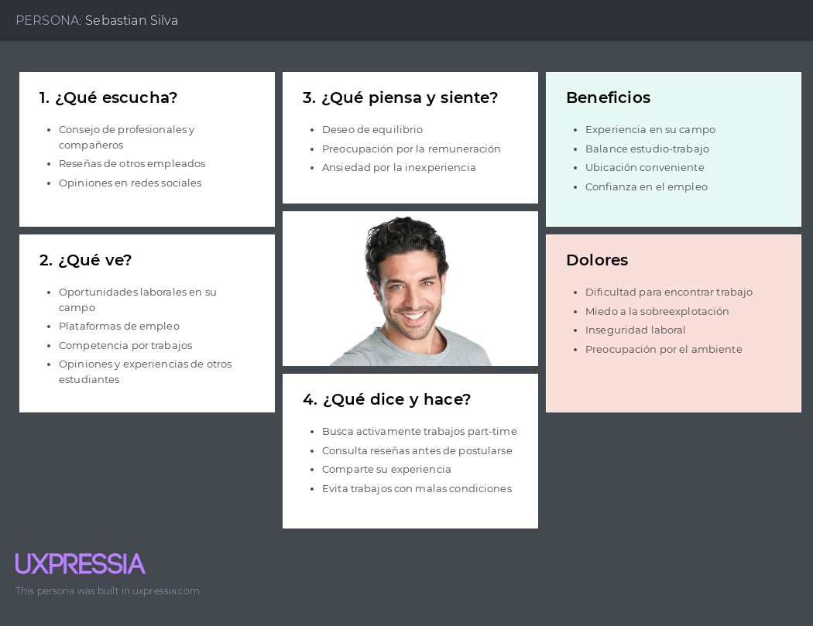
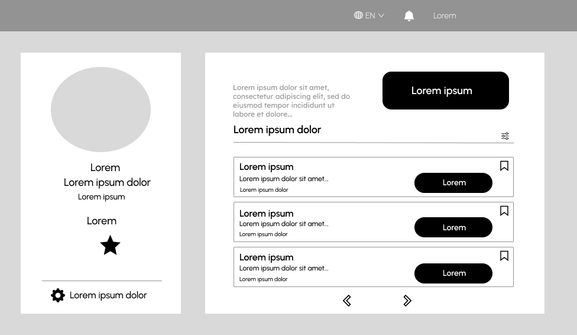
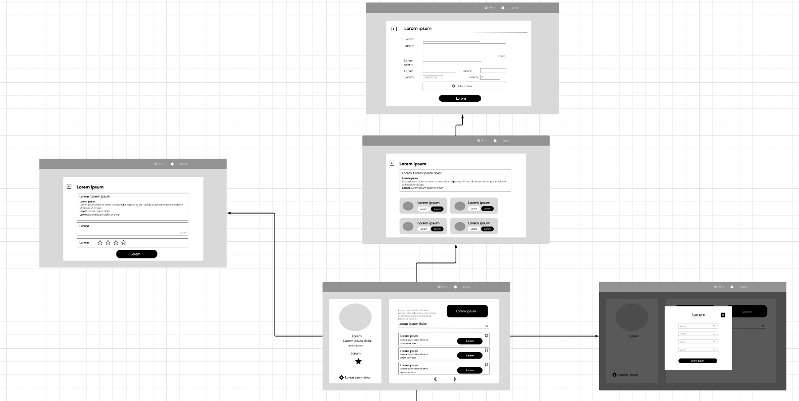

# <center>COURSE PROJECT</center>

<p align="center">
    <strong>Universidad Peruana de Ciencias Aplicadas</strong><br>
    </img><br>
    <strong>Ingeniería de Software - 2024-2</strong><br>
    <strong>Desarrollo de Aplicaciones Open Source - WX51</strong><br>
    <strong>Profesor: Alberto Wilmer Sanchez Seña</strong><br>
    <br><strong>Informe del Trabajo Final</strong>
</p>

</p>

<p align="center">
    <strong>Startup: GPTDevs</strong><br>
    <strong>Producto: TaskLinker </strong>
</p>

<div style="text-align:center;">
    <h3>Team Members:</h3>
    <table align="center">
        <tr>
            <th style="text-align:center;">Member</th>
            <th style="text-align:center;">Code</th>
        </tr>
        <tr>
            <td>Ramos Najar, Tony Alexander</td>
            <td>U20211A153</td>
        </tr>
        <tr>
            <td>Sanchez Rios, Camila Cristina</td>
            <td>U202210973</td>
        </tr>
        <tr>
            <td>Durand Vera, Gianfranco Angel</td>
            <td>U20201F640</td>
        </tr>
        <tr>
            <td>Chávarri Zarzosa, Daniel Jhared</td>
            <td>U202211108</td>
        </tr>
         <tr>
            <td>Roque Tello, Jack Eddie</td>
            <td>U20221C448</td>
         </tr>
    </table>
</div>

<p align="center">
    <strong>Agosto, 2024</strong>
</p>
<br>

<h1 align="center">Registro de versiones del Informe</h1>
</br>
<table>
        <thead>
            <tr>
                <th>Versión</th>
                <th>Fecha</th>
                <th>Autor</th>
                <th>Descripción de modificaciones</th>
            </tr>
        </thead>
        <tbody>
            <tr>
                <th>TB1</th>
                <td>20/08/2024</td>
                <td>
                    <ul>
          <li>Tony Ramos</li>
          <li>Camila Sanchez</li>
          <li>Gianfranco Durand</li>
          <li>Daniel Chávarri</li>
          <li>Jack Roque</li>
                    <ul>
           </td>
      <td>            
             <ul>
          <li>Capítulo I: Introducción</li>
          <li>Capítulo II: Requirements Elicitation & Analysis</li>
          <li>Capítulo III: Requirements Specification</li>
          <li>Capítulo IV: Product Design</li>
          <li>Avance del Capítulo V: Product Implementation, Validation & Deployment hasta el punto 5.2.1.8</li>
          <li>Avance de Conclusiones, Bibliografía y Anexos</li>
        </ul>
      </td>
  </tr>
</tbody>
</table>

# Project Report Collaboration Insights

# Contenido
[Student Outcome](#student-outcome)

[Capítulo I: Introducción](#capítulo-i-introducción)
- [1.1. Startup Profile](#11-startup-profile)
  - [1.1.1. Descripción de la Startup](#111-descripción-de-la-startup)
  - [1.1.2. Perfiles de integrantes del equipo](#112-perfiles-de-integrantes-del-equipo)
- [1.2. Solution Profile](#12-solution-profile)
  - [1.2.1 Antecedentes y problemática](#121-antecedentes-y-problemática)
  - [1.2.2 Lean UX Process](#122-lean-ux-process)
    - [1.2.2.1. Lean UX Problem Statements](#1221-lean-ux-problem-statements)
    - [1.2.2.2. Lean UX Assumptions](#1222-lean-ux-assumptions)
    - [1.2.2.3. Lean UX Hypothesis Statements](#1223-lean-ux-hypothesis-statements)
    - [1.2.2.4. Lean UX Canvas](#1224-lean-ux-canvas)
- [1.3. Segmentos objetivo](#13-segmentos-objetivo)

[Capítulo II: Requirements Elicitation & Analysis](#capítulo-ii-requirements-elicitation--analysis)
- [2.1. Competidores](#21-competidores)
  - [2.1.1. Análisis competitivo](#211-análisis-competitivo)
  - [2.1.2. Estrategias y tácticas frente a competidores](#212-estrategias-y-tácticas-frente-a-competidores)
- [2.2. Entrevistas](#22-entrevistas)
  - [2.2.1. Diseño de entrevistas](#221-diseño-de-entrevistas)
  - [2.2.2. Registro de entrevistas](#222-registro-de-entrevistas)
  - [2.2.3. Análisis de entrevistas](#223-análisis-de-entrevistas)
- [2.3. Needfinding](#23-needfinding)
  - [2.3.1. User Personas](#231-user-personas)
  - [2.3.2. User Task Matrix](#232-user-task-matrix)
  - [2.3.3. User Journey Mapping](#233-user-journey-mapping)
  - [2.3.4. Empathy Mapping](#234-empathy-mapping)
  - [2.3.5. As-is Scenario Mapping](#235-as-is-scenario-mapping)
- [2.4. Ubiquitous Language](#24-ubiquitous-language)

[Capítulo III: Requirements Specification](#capítulo-iii-requirements-specification)
- [3.1. To-Be Scenario Mapping](#31-to-be-scenario-mapping)
- [3.2. User Stories](#32-user-stories)
- [3.3. Impact Mapping](#33-impact-mapping)
- [3.4. Product Backlog](#34-product-backlog)

[Capítulo IV: Product Design](#capítulo-iv-product-design)
- [4.1. Style Guidelines](#41-style-guidelines)
  - [4.1.1. General Style Guidelines](#411-general-style-guidelines)
  - [4.1.2. Web Style Guidelines](#412-web-style-guidelines)
- [4.2. Information Architecture](#42-information-architecture)
  - [4.2.1. Organization Systems](#421-organization-systems)
  - [4.2.2. Labeling Systems](#422-labeling-systems)
  - [4.2.3. SEO Tags and Meta Tag](#423-seo-tags-and-meta-tag)
  - [4.2.4. Searching Systems](#424-searching-systems)
  - [4.2.5. Navigation Systems](#425-navigation-systems)
- [4.3. Landing Page UI Design](#43-landing-page-ui-design)
  - [4.3.1. Landing Page Wireframe](#431-landing-page-wireframe)
  - [4.3.2. Landing Page Mock-up](#432-landing-page-mock-up)
- [4.4. Web Applications UX/UI Design](#44-web-applications-uxui-design)
  - [4.4.1. Web Applications Wireframes](#411-general-style-guidelines)
  - [4.4.2. Web Applications Wireflow Diagrams](#442-web-applications-wireflow-diagrams)
  - [4.4.3. Web Applications Mock-ups](#443-web-applications-mock-ups)
  - [4.4.4. Web Applications User Flow Diagrams](#444-web-applications-user-flow-diagrams)
- [4.5. Web Applications Prototyping](#45-web-applications-prototyping)
- [4.6. Domain-Driven Software Architecture](#46-domain-driven-software-architecture)
  - [4.6.1. Software Architecture Context Diagram](#461-software-architecture-context-diagram)
  - [4.6.2. Software Architecture Container Diagrams](#462-software-architecture-container-diagrams)
  - [4.6.3. Software Architecture Components Diagrams](#463-software-architecture-components-diagrams)
- [4.7. Software Object-Oriented Design](#47-software-object-oriented-design)
  - [4.7.1. Class Diagrams](#471-class-diagrams)
  - [4.7.2. Class Dictionary](#472-class-dictionary)
- [4.8. Database Design](#48-database-design)
  - [4.8.1. Database Diagram](#481-database-diagram)

[Capítulo V: Product Implementation, Validation & Deployment](#capítulo-v-product-implementation-validation--deployment)
- [5.1. Software Configuration Management](#51-software-configuration-management)
  - [5.1.1. Software Development Environment Configuration](#511-software-development-environment-configuration)
  - [5.1.2. Source Code Management](#512-source-code-management)
  - [5.1.3. Source Code Style Guide & Conventions](#513-source-code-style-guide--conventions)
  - [5.1.4. Software Deployment Configuration](#514-software-deployment-configuration)
- [5.2. Landing Page, Services & Applications Implementation](#52-landing-page-services--applications-implementation)
  - [5.2.X. Sprint ](#52x-sprint)
    - [5.2.X.1. Sprint Planning n](#52x1-sprint-planning-n)
    - [5.2.X.2. Sprint Backlog n](#52x2-sprint-backlog-n)
    - [5.2.X.3. Development Evidence for Sprint Review](#52x3-development-evidence-for-sprint-review)
    - [5.2.X.4. Testing Suite Evidence for Sprint Review](#52x4-testing-suite-evidence-for-sprint-review)
    - [5.2.X.5. Execution Evidence for Sprint Review](#52x5-execution-evidence-for-sprint-review)
    - [5.2.X.6. Services Documentation Evidence for Sprint Review](#52x6-services-documentation-evidence-for-sprint-review)
    - [5.2.X.7. Software Deployment Evidence for Sprint Review](#52x7-software-deployment-evidence-for-sprint-review)
    - [5.2.X.8. Team Collaboration Insights during Sprint](#52x8-team-collaboration-insights-during-sprint)
- [5.3. Validation Interviews](#53-validation-interviews)
  - [5.3.1. Diseño de Entrevistas](#531-diseño-de-entrevistas)
  - [5.3.2. Registro de Entrevistas](#532-registro-de-entrevistas)
  - [5.3.3. Evaluaciones según heurísticas](#533-evaluaciones-según-heurísticas)
- [5.4. Video About-the-Product](#54-video-about-the-product)

[Conclusiones](#conclusiones)
- [Conclusiones y recomendaciones](#conclusiones-y-recomendaciones)
- [Video About-the-Team](#video-about-the-team)

[Bibliografía](#bibliografía)

[Anexos](#anexos)

# Student Outcome
ABET – EAC - Student Outcome 3

Criterio: Capacidad de comunicarse efectivamente con un rango de audiencias

Criterio: Capacidad de comunicarse efectivamente con un rango de audiencias

<table>
  <tr>
    <td><b>Criterio específico</b></td>
    <td><b>Acciones realizadas</b></td>
    <td><b>Conclusiones</b></td>
  </tr>
    </thead>
  <tbody>
    <tr>
      <td><b>Comunica oralmente con
efectividad a diferentes rangos
de audiencia.</b></td>
      <td>
        <p><b>Ramos Najar, Tony Alexander  </b></p>
        <p><b>TB1:</b></p>
        <p>Capítulo II: Requirements Elicitation & Analysis y User Stories<br> Realicé un optimo trabajo en equipo, para crear, visualizar y corregir detalles importantes, además fui flexible con el tiempo de entrega de los capítulos</p>
        <p><b>TP1:</b></p>
        <p>.</p>
        <p><b>TB2:</b></p>
        <p>.</p>
        <p><b>TF:</b></p>
        <p>.</p>
        <p><b>Sanchez Rios, Camila Cristina</b></p>
       <p><b>TB1:</b></p>
        <p>Capítulo IV: Product Design y User Stories</p>
        <p><b>TP1:</b></p>
        <p>Correcciones al reporte los agregué a los User Stories los Technical Stories y trabajé en el desarrollo del frontend Toolbar y Traduccion. Colaboración en el proyecto cumpliendo con las indicaciones realizadas por el equipo para lograr lo esperado.</p>
        <p><b>TB2:</b></p>
        <p>.</p>
        <p><b>TF:</b></p>
        <p>.</p>
        <p><b>Durand Vera, Gianfranco Angel</b></p>
        <p><b>TB1:</b></p>
        <p>Capítulo IV: Product Design y User Stories <br>Coordiné y realicé la reunión inicial del proyecto, explicando claramente los objetivos y el plan de trabajo. Cree diferentes reuniones para clarificar los roles de cada integrante del equipo.      
        </p>
        <p><b>TP1:</b></p>
        <p>Realicé commits para la web application siguendo las convenciones para una comunicación escrita, realice el deployment de la aplicación de modo que los interesados puedan ver el avance del proyecto y tener un producto en desarrollo que demuestre nuestro avance durante el sprint.</p>
        <p><b>TB2:</b></p>
        <p>.</p>
        <p><b>TF:</b></p>
        <p>.</p>
        <p><b>Chávarri Zarzosa, Daniel Jhared</b></p>
       <p><b>TB1:</b></p>
        <p>Realicé el Capítulo I, Capítulo II: User Journey Mapping, Capítulo III: Requirements Specification, Capítulo IV: Conclusiones y Recomendaciones.</p>
        <p><b>TP1:</b></p>
        <p>En resumen, para el Front-end hice el feature/work-done y feature/task, correjí el impact mapping y implementé la presentación del canva .</p>
        <p><b>TB2:</b></p>
        <p>.</p>
        <p><b>TF:</b></p>
        <p>.</p>
        <p><b>Roque Tello, Jack Eddie</b></p>
       <p><b>TB1:</b></p>
        <p>Capítulo I: Introducción y User Stories</p>
        <p><b>TP1:</b></p>
        <p>.</p>
        <p><b>TB2:</b></p>
        <p>.</p>
        <p><b>TF:</b></p>
        <p>.</p>
      </td>
      <td>
        <p><strong>TB1:</strong></p>
        <p>En conclusión, en esta primera entrega se logró una buena comunicación entre los miembros del equipo. Cada participante estuvo activo y presento sus ideas de manera que todos pudieran entenderse entre sí. Concluimos que aún hay pequeñas dificultades para expresarnos con todos, pero que se puede solucionar con tiempo.</p>
        <p><strong>TP1:</strong></p>
        <p>En resumen, durante esta etapa del proyecto, implementamos las mejoras sugeridas por el profesor, las cuales incluyeron la mejora de user storires. Además, todos los integrantes del equipo completaron con éxito todas las actividades asignadas en el segundo sprint.</p>
        <p><strong>TB2:</strong></p>
        <p>En conclusión, </p>
        <p><strong>TF:</strong></p>
        <p>En conclusión, .</p>
      </td>
    </tr>
    <tr>
      <td>Comunica por escrito con
efectividad a diferentes rangos
de audiencia.</td>
      <td>
        <p><b>Ramos Najar, Tony Alexander  </b></p>
        <p><b>TB1:</b></p>
        <p>Capítulo II: Requirements Elicitation & Analysis y User Stories<br> Realicé correctamente lo establecido para esta entrega, además apoyé en otras definiciones a mi team Collab</p>
        <p><b>TP1:</b></p>
        <p>.</p>
        <p><b>TB2:</b></p>
        <p>.</p>
        <p><b>TF:</b></p>
        <p>.</p>
        <p><b>Sanchez Rios, Camila Cristina</b></p>
       <p><b>TB1:</b></p>
        <p>Capítulo IV: Product Design y User Stories</p>
        <p><b>TP1:</b></p>
        <p>Correcciones al reporte los agregué a los User Stories los Technical Stories y trabajé en el desarrollo del frontend Toolbar y Traduccion. Colaboración en el proyecto cumpliendo con las indicaciones realizadas por el equipo para lograr lo esperado.</p>
        <p><b>TB2:</b></p>
        <p>.</p>
        <p><b>TF:</b></p>
        <p>.</p>
        <p><b>Durand Vera, Gianfranco Angel</b></p>
        <p><b>TB1:</b></p>
        <p>Capítulo IV: Product Design y User Stories <br>Cree repositorios para almacenar nuestro informe con un registro de versiones constante, además de comenzar un registro de los puntos que nos falta completar.
        </p>
        <p><b>TP1:</b></p>
        <p>Durante el desarrollo para esta entrega, se puso énfasis en abordar los puntos a mejorar en el feedback del trabajo anterior, como lo fueron el mejorar la redacción de
algunas user stories</p>
        <p><b>TB2:</b></p>
        <p>.</p>
        <p><b>TF:</b></p>
        <p>.</p>
        <p><b>Chávarri Zarzosa, Daniel Jhared</b></p>
       <p><b>TB1:</b></p>
        <p>Realicé el Capítulo I, Capítulo II: User Journey Mapping, Capítulo III: Requirements Specification, Capítulo IV: Conclusiones y Recomendaciones.</p>
        <p><b>TP1:</b></p>
        <p>En resumen, para el Front-end hice el feature/work-done y feature/task, correjí el impact mapping y implementé la presentación del canva .</p>
        <p><b>TB2:</b></p>
        <p>.</p>
        <p><b>TF:</b></p>
        <p>.</p>
        <p><b>Roque Tello, Jack Eddie</b></p>
       <p><b>TB1:</b></p>
        <p>Capítulo I: Introducción y User Stories</p>
        <p><b>TP1:</b></p>
        <p>.</p>
        <p><b>TB2:</b></p>
        <p>.</p>
        <p><b>TF:</b></p>
        <p>.</p>
      </td>
       <td>
        <p><strong>TB1:</strong></p>
        <p>Se participó equitativamente el informe. En conclusión, estamos en camino para desempeñarnos de manera equitativa en el trabajo.</p>
        <p><strong>TP1:</strong></p>
        <p>En resumen, para esta entrega se enfatizó en mejorar mediante el feedback proporcionado por el profesor y un autoanálisis. Por lo tanto, nos comunicamos de forma escrita en el
informe del proyecto, buscando mejorar tanto el formato como el contenido para mostrar nuestras ideas de manera más objetiva.</p>
        <p><strong>TB2:</strong></p>
        <p>En conclusión, </p>
        <p><strong>TF:</strong></p>
        <p>En conclusión, .</p>
      </td>
    </tr>
  </tbody>
</table>

# Capítulo I: Introducción
## 1.1. Startup Profile
### 1.1.1. Descripción de la Startup
"TaskLinker" es una innovadora plataforma web que facilita la conexión entre personas que buscan ingresos adicionales laborando por horas y quienes requieren contratar servicios temporales o para tareas específicas. Dirigida a estudiantes, amas de casa, jubilados y cualquier persona interesada en trabajos por horas, TaskLinker actúa como un puente efectivo y confiable entre la oferta y la demanda en el mercado laboral peruano. A través de nuestra plataforma, tanto individuos como organizaciones pueden encontrar soluciones rápidas y eficientes para sus necesidades, optimizando el uso de la fuerza laboral disponible y promoviendo la flexibilidad en el empleo.

La misión de TaskLinker es empoderar a las personas con oportunidades de trabajo flexible, permitiéndoles generar ingresos adicionales en sus propios términos. Al mismo tiempo, buscamos proporcionar a las organizaciones e individuos una herramienta eficiente para encontrar y contratar rápidamente talento adecuado para sus necesidades temporales o específicas.

Nuestra visión es convertirnos en la plataforma líder en Perú para la contratación de trabajos por horas y servicios temporales, siendo reconocidos por nuestra capacidad para conectar de manera efectiva a las personas con oportunidades de ingresos adicionales. Aspiramos a expandir nuestro impacto, promoviendo un mercado laboral más dinámico, inclusivo y flexible, donde cada persona pueda acceder fácilmente a oportunidades laborales que se ajusten a su estilo de vida y necesidades, mientras que las organizaciones logran satisfacer sus demandas con rapidez y precisión.

### 1.1.2. Perfiles de integrantes del equipo
<table>
  <tr>
    <th>
      
    </th>
    <td valign="top">
      <p><b>Ramos Najar, Tony Alexander</b></p>
      <p>
        Mi nombre es Tony Ramos, estoy cursando el 8vo ciclo de la carrera de Ingeniería de Software. Me considero hábil en el ámbito de la programación en los lenguajes, Python, Javascript, y últimamente estoy aprendiendo Angular. Con respeto a mi, me considero una persona responsable, con ganas de aprender y superarme a mí mismo
      </p>
    </td>
  </tr>
  <tr>
    <th>
      
    </th>
    <td valign="top">
      <p><b>Sánchez Ríos, Camila Cristina</b></p>
      <p>
        Soy estudiante de la carrera de Ingeniería de Software en la Universidad Peruana de Ciencias Aplicadas, actualmente me encuentro en el cuarto ciclo. Me gusta escuchar música y leer en los ratos libres y aprender más sobre la carrera.
      </p>
    </td>
  </tr>
  <tr>
    <th>
      
    </th>
    <td valign="top">
      <p><b>Durand Vera, Gianfranco Ángel</b></p>
      <p>
        Soy estudiante de la carrera de Ingeniería de Software en la Universidad Peruana de Ciencias Aplicadas, actualmente me encuentro en el sexto ciclo, escogí esta carrera porque me gusta mucho la programación. Tengo experiencia en lenguajes de programación como C++, C#, Python, Kotlin y JavaScript.
      </p>
    </td>
  </tr>
  <tr>
    <th>
      
    </th>
    <td valign="top">
      <p><b>Chávarri Zarzosa, Daniel Jhared</b></p>
      <p>
       Soy estudiante de la UPC, tengo 19 años. Estoy en la carrera de Ingeniería de Software, ya que, siempre me gustó la tecnología, los videojuegos, las páginas web, pero sobre todo cómo crearlos. Estoy cursando el 5 ciclo de la carrera y mis habilidades son C++, Python, HTML y JavaScript. También soy bueno en ser responsable con cada curso y organizar mi tiempo en ellos.
      </p>
    </td>
  </tr>
  <tr>
    <th>
      
    </th>
    <td valign="top">
      <p><b>Roque Tello, Jack Eddie</b></p>
      <p>
        Mi nombre es Jack Eddie Roque Tello y tengo 20 años. Soy estudiante de la carrera de Ingeniería de Software en la Universidad Peruana de Ciencias Aplicadas (UPC) actualmente estoy en el quinto ciclo. Soy una persona competitiva, siempre en busca de nuevos aprendizajes, con un enfoque en la mejora continua. Tengo conocimientos en varios lenguajes de programación, incluyendo C++, JavaScript y Ruby.             <br>Fuera del ámbito académico, disfruto ver películas, leer y viajar, lo que me ayuda a expandir mis perspectivas y a mantener un equilibrio entre mis responsabilidades y mis pasiones. En este curso, estaré atento a cualquier eventualidad que surja, dispuesto a colaborar y aportar para el éxito del proyecto, siempre en beneficio de mi equipo y mi crecimiento profesional.
      </p>
    </td>
  </tr>
</table>
<br>

## 1.2. Solution Profile
### 1.2.1 Antecedentes y problemática
En el mercado laboral peruano, existe una creciente demanda de trabajos temporales y por horas, impulsada tanto por trabajadores que buscan flexibilidad como por empleadores que requieren soluciones rápidas para tareas específicas. No obstante, la falta de una plataforma centralizada ha dificultado la conexión eficiente entre ambas partes, lo que resulta en una subutilización del talento disponible y en procesos de contratación ineficaces.

**5W y 2H**

- **Who (Quién):** 

Los trabajadores objetivo de TaskLinker incluyen estudiantes, amas de casa, jubilados y personas con empleo parcial que buscan ingresos adicionales sin comprometer sus horarios. Por otro lado, los empleadores incluyen pequeñas y medianas empresas (PyMEs), particulares, organizadores de eventos, y startups que necesitan contratar personal temporal de manera rápida y eficiente.

- **What (Qué):**

TaskLinker es una plataforma web que facilita la conexión entre personas que buscan trabajo temporal por horas y empleadores que necesitan contratar servicios específicos. La plataforma ofrece una solución centralizada que permite a ambas partes encontrar rápidamente lo que necesitan, ya sea una oportunidad de trabajo flexible o personal temporal calificado.

- **Where (Dónde):**

La plataforma opera principalmente en el mercado laboral peruano, donde existe una alta demanda de trabajos temporales y por horas. TaskLinker está diseñada para ser accesible desde cualquier dispositivo con conexión a internet, lo que la hace disponible en cualquier lugar dentro del ámbito nacional.

- **When (Cuándo):**

La necesidad de TaskLinker surge en un contexto donde la economía y el mercado laboral están en constante cambio, con un aumento en la demanda de flexibilidad tanto por parte de trabajadores como de empleadores. Esta plataforma es especialmente útil en momentos de alta demanda laboral temporal, como durante eventos especiales o picos estacionales de trabajo.

- **Why (Por qué):**

La falta de una plataforma centralizada que conecte de manera efectiva a trabajadores temporales con empleadores ha llevado a una subutilización de la fuerza laboral disponible y a ineficiencias en el proceso de contratación. TaskLinker responde a esta problemática proporcionando una solución que simplifica y agiliza la búsqueda de trabajo temporal y la contratación de personal por horas, beneficiando a ambos lados del mercado.

-  **How (Cómo):**

TaskLinker funciona a través de una plataforma en línea intuitiva donde los trabajadores pueden crear perfiles, buscar y postularse a trabajos que se ajusten a sus habilidades y disponibilidad. Los empleadores pueden publicar tareas o proyectos específicos y acceder a una base de trabajadores calificados de manera rápida. La plataforma integra un sistema de evaluaciones y reputación para garantizar la confianza y transparencia en las interacciones. El modelo de negocio se sustenta en dos esquemas principales: una comisión por transacción, que se cobra cuando un trabajador es contratado y completa un trabajo, y un plan de suscripción premium, que elimina las comisiones y ofrece beneficios adicionales como priorización en los listados y acceso a tareas exclusivas.

- **How Much (Cuánto):**

En el esquema de comisión por transacción, TaskLinkera cobra una pequeña comisión proporcional al valor del trabajo, la cual se descuenta automáticamente una vez que el trabajo es completado y pagado. Por otro lado, el plan de suscripción premium tiene un costo fijo que elimina estas comisiones por transacción y brinda acceso a funcionalidades avanzadas, como la priorización en los listados, acceso a tareas exclusivas, y herramientas de gestión mejoradas. Este modelo de negocio está diseñado para ser accesible y rentable, permitiendo a los usuarios elegir la opción que mejor se adapte a sus necesidades y volumen de trabajo.

### 1.2.2 Lean UX Process
#### 1.2.2.1. Lean UX Problem Statements

En el mercado laboral peruano, existe una desconexión significativa entre la oferta y la demanda de trabajos temporales y por horas. Por un lado, los trabajadores buscan flexibilidad para encontrar oportunidades que se ajusten a su disponibilidad. Por otro, los empleadores necesitan contratar personal de manera rápida y eficiente para tareas puntuales o picos de trabajo. Sin embargo, la falta de una plataforma centralizada que facilite esta conexión genera ineficiencias en ambos lados, creando barreras para la optimización del talento disponible y el acceso a oportunidades laborales.

Estudiantes, amas de casa, jubilados y personas con empleo parcial en Perú se enfrentan a un desafío constante: ¿cómo encontrar trabajos temporales o por horas que se ajusten a sus horarios y necesidades específicas? Actualmente, la falta de una plataforma centralizada y eficiente para acceder a estas oportunidades laborales limita su capacidad para generar ingresos adicionales, lo que lleva a una subutilización de su tiempo y potencial.  ¿Qué solución podría ofrecerse para permitirles encontrar trabajos de manera rápida y eficiente, maximizando su tiempo disponible?

La falta de un sistema eficiente que centralice estas oportunidades también deja en desventaja a los trabajadores que desean postularse a trabajos en los que tienen experiencia o competencias específicas. ¿Qué características debe tener una plataforma para asegurar que los trabajadores puedan filtrar y postularse solo a las oportunidades que realmente les interesan, sin comprometer su tiempo ni su disponibilidad para otras responsabilidades personales?

Pequeñas y medianas empresas (PyMEs), startups, organizadores de eventos y particulares en Perú se enfrentan a una necesidad urgente: ¿cómo contratar personal temporal para tareas específicas o picos de trabajo de manera rápida y efectiva? 

La falta de una solución adecuada provoca retrasos operativos, un aumento en los costos de contratación y una menor eficiencia en la gestión de recursos humanos. ¿Qué plataforma puede facilitar este proceso, reduciendo el tiempo de contratación y mejorando la eficiencia en la búsqueda de talento calificado? Además, ¿cómo se puede asegurar que los empleadores puedan acceder a una base confiable de trabajadores con las habilidades necesarias para sus tareas específicas sin incurrir en largos procesos de selección?

#### 1.2.2.2. Lean UX Assumptions
**Business Outcomes:**

1. Si ofrecemos una plataforma fácil de usar con un proceso de registro rápido y accesible, más trabajadores potenciales (estudiantes, amas de casa, jubilados) se inscribirán y utilizarán la plataforma para obtener ingresos adicionales.
2.  Si proporcionamos un sistema eficiente para la contratación rápida y confiable de trabajadores temporales, los empleadores recurrirán a la plataforma para cubrir tareas específicas de manera recurrente.
3.  Si simplificamos el proceso de contratación y comunicación entre empleadores y trabajadores, el número de trabajos realizados a través de la plataforma aumentará.
4.  Si mejoramos las herramientas de búsqueda y filtrado, los empleadores podrán encontrar candidatos adecuados de manera más eficiente.
5.  Si ofrecemos características premium valiosas como eliminación de comisiones, acceso a tareas exclusivas y visibilidad prioritaria, más usuarios optarán por suscribirse al plan premium.
6.  Si implementamos un sistema de evaluación transparente y confiable, tanto trabajadores como empleadores tendrán más confianza al usar la plataforma, lo que aumentará la satisfacción general.
7.  Si notificamos a los trabajadores de nuevas oportunidades relevantes para sus habilidades, aumentaremos su participación activa en la plataforma.
8.  Si lanzamos campañas de marketing dirigidas a nuevas regiones, podemos atraer a trabajadores y empleadores de otras ciudades, ampliando nuestro alcance geográfico.
9.  Si mejoramos la facilidad y seguridad en los métodos de pago, aumentará la confianza y la velocidad en las transacciones entre empleadores y trabajadores.
10. Si facilitamos la interacción entre los usuarios (trabajadores y empleadores) a través de herramientas de mensajería y soporte, mejoraremos la percepción de confianza y colaboración en la plataforma.

#### 1.2.2.3. Lean UX Hypothesis Statements

**Hipótesis 1:**

Creemos que si proporcionamos un proceso de registro rápido y fácil para los trabajadores, aumentará la tasa de inscripción en la plataforma. Sabremos que esto es verdad cuando veamos un  aumento del 25% en las inscripciones de nuevos usuarios dentro de los primeros 3 meses de optimizar el proceso de registro.

**Hipótesis 2:**

Creemos que las personas en Perú (estudiantes, amas de casa, jubilados, etc.) tienen dificultades para encontrar trabajos flexibles y por horas que se ajusten a sus necesidades y horarios. Si ofrecemos una plataforma que centraliza la oferta y demanda de trabajos por horas, las personas podrán encontrar oportunidades laborales de forma rápida y fácil. Observaremos un aumento en el número de personas registradas y en la frecuencia con la que encuentran trabajo a través de la plataforma.

**Hipótesis 3:**

Creemos que las pequeñas y medianas empresas (PyMEs) en Perú necesitan contratar servicios temporales de manera eficiente, pero enfrentan dificultades en el proceso de búsqueda y contratación. Si proporcionamos una plataforma donde puedan publicar tareas y contratar trabajadores de forma rápida, las PyMEs podrán cubrir sus necesidades temporales sin problemas. Veremos una alta tasa de satisfacción entre los empleadores y un aumento en el número de tareas publicadas en la plataforma.

**Hipótesis 4:**

Creemos que muchos usuarios en Perú valoran la flexibilidad y desean acceder a una plataforma gratuita para comenzar a trabajar inmediatamente. Si ofrecemos una opción gratuita con comisiones por tarea realizada y un plan premium que elimina esas comisiones, los usuarios podrán empezar a trabajar sin barreras económicas. Tendremos una alta conversión de usuarios del plan gratuito al plan premium a medida que generen más ingresos.

**Hipótesis 5:**

Creemos que un sistema de evaluaciones y reseñas mejorará la confianza entre empleadores y trabajadores, lo que resultará en más transacciones exitosas. Sabremos que esto es verdad cuando veamos un incremento en las evaluaciones en un 30% más de trabajos finalizados con reseñas positivas dentro del primer año de implementación del sistema de evaluaciones.

#### 1.2.2.4. Lean UX Canvas


*Imagen (N°1). Elaboración propia. Realizado en Canva*

## 1.3. Segmentos objetivo
**1. Trabajadores que buscan ingresos adicionales y flexibilidad:**
Este segmento incluye a estudiantes que necesitan ingresos para cubrir sus estudios o gastos personales sin afectar sus horarios académicos, amas de casa que desean contribuir económicamente sin comprometer sus responsabilidades en el hogar, jubilados que buscan mantenerse activos y generar ingresos extra, y personas con empleo parcial que desean complementar sus ingresos. Todos ellos valoran la flexibilidad que les ofrece TaskLinker, permitiéndoles encontrar oportunidades laborales que se adapten a su tiempo y necesidades específicas.

**2. Empleadores que requieren soluciones laborales temporales:**

Este segmento abarca a pequeñas y medianas empresas (PyMEs) que necesitan personal temporal para cubrir picos de trabajo o tareas específicas, particulares que requieren servicios domésticos, reparaciones, o tareas puntuales sin compromiso a largo plazo, organizadores de eventos que necesitan personal por horas para diferentes funciones como catering o atención al cliente, y startups que demandan flexibilidad en la contratación para adaptarse al ritmo dinámico de su crecimiento. Estos empleadores buscan soluciones rápidas, confiables y eficientes para satisfacer sus necesidades laborales temporales.

# Capítulo II: Requirements Elicitation & Analysis

## 2.1. Competidores
Comprender el panorama competitivo es crucial para el éxito de TaskLinker. En esta sección, identificaremos y describiremos a nuestros principales competidores directos e indirectos que operan en el ámbito de la gestión de deudas y la educación financiera. Analizaremos sus modelos de negocio, estrategias de marketing, productos y servicios, y los canales de distribución que utilizan. Además, realizaremos un análisis comparativo detallado de sus fortalezas, debilidades, oportunidades y amenazas (SWOT) en relación con TaskLinker. Este análisis nos permitirá entender mejor el entorno competitivo y ajustar nuestras estrategias para maximizar nuestra ventaja en el mercado.
### 2.1.1. Análisis competitivo

- **Bumeran**

Bumeran es una de las principales bolsas de trabajo en América Latina, con una fuerte presencia en países como Argentina, México, Perú y otros. La plataforma facilita la búsqueda de empleo en diversas categorías, incluyendo trabajos temporales y por horas.

[Bumeran Perú](https://www.bumeran.com.pe/)

- **Computrabajo**

Computrabajo es una de las bolsas de trabajo más grandes en América Latina, con una sólida presencia en Perú y otros países de la región. La plataforma ofrece una amplia gama de empleos, incluidos trabajos temporales y por horas

[Computrabajo](https://pe.computrabajo.com/)

- **Indeed**

Indeed es una plataforma global de búsqueda de empleo que agrega ofertas de trabajo de diversas fuentes, incluyendo bolsas de trabajo, sitios de empresa y anuncios clasificados. Fundada en 2004, Indeed se ha consolidado como uno de los motores de búsqueda de empleo más grandes del mundo, con una presencia significativa en numerosos países, incluyendo Perú y América Latina.

[Indeed](https://pe.indeed.com/)

#### **Comparativa con Competidores**

|               | TaskLinker                                                     | Bumeran                                                          | Computrabajo                                                      | Indeed                                                            |
|---------------|----------------------------------------------------------------|------------------------------------------------------------------|-------------------------------------------------------------------|-------------------------------------------------------------------|
| **Perfil**    | Plataforma web que conecta a personas que buscan ingresos adicionales con quienes necesitan contratar servicios temporales o específicos. | Bolsa de trabajo líder en América Latina con una amplia base de datos de empleos. | Bolsa de trabajo con fuerte presencia en Perú y otros países de América Latina. | Motor de búsqueda de empleo global con presencia significativa en América Latina. |
| **Overview**  | Facilita la conexión entre individuos interesados en trabajos por horas y organizaciones que requieren servicios temporales. | Plataforma que facilita la búsqueda y publicación de empleos en diversas categorías, incluyendo trabajos temporales y por horas. | Plataforma que ofrece una variedad de empleos, desde trabajos permanentes hasta temporales y por horas. | Agrega ofertas de empleo de diversas fuentes y permite buscar y aplicar a trabajos en una amplia gama de categorías. |
| **Ventaja competitiva** ¿Qué valor ofrece a los clientes? | Especialización en trabajos por horas y temporales, facilitando la conexión directa entre oferta y demanda. | Amplia red de usuarios y empleadores en varios países de América Latina, con una variedad de empleos disponibles. | Herramientas efectivas para empleadores y candidatos con una fuerte presencia local en Perú. | Búsqueda integral de empleos con una amplia base de datos y la capacidad de aplicar a trabajos globalmente. |
| **Perfil de Marketing** |                                                                  |                                                                  |                                                                   |                                                                   |
| **Mercado objetivo** | Estudiantes, amas de casa, jubilados y personas interesadas en trabajos por horas en Perú. | Empresas y candidatos en busca de empleos temporales y por horas en América Latina. | Empresas y candidatos en Perú buscando empleos temporales y por horas. | Candidatos y empleadores globales y locales en busca de una amplia gama de oportunidades laborales. |
| **Estrategias de Marketing** | Promoción a través de redes sociales y colaboraciones con instituciones educativas y organizaciones locales. | Publicidad en medios digitales y colaboraciones con empresas de recursos humanos y consultoras. | Marketing digital enfocado en la búsqueda de empleo local y colaboración con empresas. | Publicidad en línea y optimización para motores de búsqueda, así como herramientas avanzadas para empleadores. |
| **Perfil de Producto** |                                                                  |                                                                  |                                                                   |                                                                   |
| **Productos y Servicios** | Plataforma para encontrar y ofrecer trabajos temporales y por horas, con herramientas de gestión para empleadores y candidatos. | Publicación de ofertas de empleo, búsqueda y filtrado de trabajos en varias categorías. | Publicación de ofertas de empleo, herramientas de gestión para empleadores y alertas de empleo. | Agregación de ofertas de empleo, herramientas para publicación y promoción de anuncios, y recursos adicionales para candidatos. |
| **Precios y Costos** | Modelos de suscripción para empresas y opciones de publicación para trabajos específicos. | Precios varían según el tipo de publicación y servicios adicionales. | Costos para publicación de ofertas y servicios premium para empresas. | Costos de patrocinio de anuncios y servicios premium para empleadores. |
| **Canales de Distribución** | Página web. | Página web, aplicaciones móviles. | Página web, aplicaciones móviles. | Página web, aplicaciones móviles. |
| **Análisis FODA** |                                                                  |                                                                  |                                                                   |                                                                   |
| **Fortalezas** | Especialización en trabajos por horas y temporales, facilitando una conexión directa y eficiente. | Amplia cobertura en América Latina y variedad de empleos disponibles. | Fuerte presencia local en Perú con herramientas efectivas para búsqueda de empleo. | Amplia base de datos global y funcionalidad avanzada para la búsqueda y aplicación de empleos. |
| **Debilidades** | Limitada cobertura comparada con competidores más grandes; dependencia en la adopción local. | Competencia elevada y falta de especialización en trabajos por horas. | Competencia elevada y falta de especialización en nichos específicos. | Alta competencia global y menos enfoque en trabajos temporales específicos. |
| **Oportunidades** | Expansión en el mercado de trabajos temporales en Perú y potencial de crecimiento en América Latina. | Expansión en el mercado de trabajos temporales y por horas en América Latina. | Oportunidades para mejorar la especialización en trabajos temporales y por horas. | Expansión de servicios y optimización para la búsqueda de trabajos específicos por horas y temporales. |
| **Amenazas** | Competencia de plataformas globales y locales que ofrecen servicios similares. | Plataformas globales y locales que ofrecen servicios similares. | Competencia de otras bolsas de trabajo locales y globales. | Competencia de plataformas globales con amplias bases de datos y funcionalidades avanzadas. |

### 2.1.2. Estrategias y tácticas frente a competidores

Para destacar frente a la competencia, TaskLinker se enfocará en proporcionar una visibilidad clara y accesible de oportunidades laborales flexibles, ofrecer un modelo de remuneración competitivo para atraer tanto a trabajadores como a empleadores, colaborar con instituciones y organizaciones locales para ampliar su alcance, resaltar las ofertas más recientes y relevantes en la plataforma, y garantizar la confianza y transparencia mediante un sistema robusto de calificaciones y reseñas.

## 2.2. Entrevistas

### 2.2.1. Diseño de entrevistas

**Preguntas para el segmento objetivo 1: Trabajadores que buscan ingresos adicionales y flexibilidad**

1. ¿Qué tipo de trabajos por horas te interesan más y por qué? <br>
Objetivo: Identificar las preferencias y áreas de interés laboral.

2. ¿Cuántas horas a la semana estás dispuesto/a a trabajar y qué horarios te resultan más convenientes? <br>
Objetivo: Entender la disponibilidad y flexibilidad.

3. ¿Qué factores consideras más importantes al elegir un trabajo por horas? <br>
Objetivo: Conocer los criterios clave en la toma de decisiones laborales.

4. ¿Has utilizado anteriormente plataformas similares para encontrar trabajos por horas? Si es así, ¿qué te gustó o no te gustó de ellas? <br>
Objetivo: Evaluar la experiencia previa y expectativas sobre plataformas de empleo.

5. ¿Qué tipo de apoyo o recursos te gustaría recibir de una plataforma de trabajos por horas para facilitar tu búsqueda de empleo? <br>
Objetivo: Identificar necesidades adicionales que podrían mejorar la experiencia.

6. ¿Cuáles son tus principales preocupaciones o desafíos al buscar trabajos por horas? <br>
Objetivo: Detectar barreras o problemas comunes en la búsqueda de empleo.

7. ¿Qué tan importante es para ti la posibilidad de calificar y dejar reseñas sobre las oportunidades laborales y empleadores? <br>
Objetivo: Evaluar la importancia de la transparencia y el feedback en la plataforma.

<br>

**Preguntas para el segmento objetivo 2: Empleadores que requieren soluciones laborales temporales**

1. ¿Qué tipo de servicios temporales o especializados sueles necesitar con mayor frecuencia? <br>
Objetivo: Identificar los tipos de servicios más demandados.

2. ¿Qué criterios utilizas para seleccionar a un trabajador o proveedor de servicios temporales? <br>
Objetivo: Comprender los factores clave en la selección de proveedores de servicios.

3. ¿Cuál es tu experiencia previa al contratar servicios temporales a través de plataformas digitales? ¿Qué aspectos fueron positivos o negativos? <br>
Objetivo: Obtener información sobre experiencias pasadas y expectativas sobre la plataforma.

4. ¿Qué nivel de flexibilidad esperas en cuanto a horarios y disponibilidad de los trabajadores que contratas?<br>
Objetivo: Entender las expectativas de flexibilidad y adaptabilidad.

5. ¿Qué importancia le das a la capacidad de revisar perfiles y leer reseñas antes de contratar a alguien?<br>
Objetivo: Evaluar la relevancia de la transparencia y la información de la plataforma.

6. ¿Qué problemas o desafíos has enfrentado al contratar servicios temporales y cómo te gustaría que una plataforma los resolviera?<br>
Objetivo: Identificar problemas comunes y posibles soluciones que la plataforma podría ofrecer.

7. ¿Cómo prefieres gestionar el proceso de contratación y pago (por ejemplo, a través de la plataforma, de forma directa, etc.)?<br>
Objetivo: Entender las preferencias en la gestión de la contratación y los pagos.

### 2.2.2. Registro de entrevistas 

**Segmento objetivo perteneciente: Trabajadores que buscan ingresos adicionales y flexibilidad**

**Entrevista #1**
- Nombre: Sebastian Silva
- Edad: 19 años
- Duracion de la entrevista: 5:50 minutos


[Entrevista 1 - video:](https://bit.ly/4dHXCYk) https://bit.ly/4dHXCYk

Resumen:

Sebastián Silva es un estudiante de ingeniero de software y tiene 20 años, debido a que actualmente se encuentra estudiando una carrera universitaria, Sebastián preferiblemente está decidido a buscar un trabajo part-time, para que no se descuide del estudio y pueda ganar experiencia siempre y cuando hayan vacantes de puestos de trabajos en el ámbito de su carrera, está dispuesto a trabajar mínimo 48 horas a la semana full time, y mínimo 24 horas part-time a la semana, considera que el factor mas importante es la actividad a realizar para ver si es conveniente con respecto a la paga, además tiene claro de que no debe arriesgar a aceptar un trabajo sobrexplotado para ganar muy menos de lo remunerado, le gustaría recibir ayuda de una sitio web especial encargado de búsqueda de trabajos por horas, además de la ubicación que sea cercana a su residencia actual. Le preocupa que al no laburar en un lugar tan céntrico, no exista un ámbito agradable y que se encuentre lejos de su hogar. Por ultimo, a él le fascina las opiniones, por ende necesita ver reseñas de una determinada aplicación o sitio web para poder confiar

**Entrevista #2**

- Nombre: Emilio Chávarri
- Edad: 54 años
- Duración de la entrevista: 3:24 minutos


[Entrevista 2 - video](https://shorturl.at/amDex): https://shorturl.at/amDex

Resumen:

Emilio Chávarri, un trabajador que busca ingresos adicionales, nos cuenta que los tipos de trabajos que más le interesan son de diseño de trabajo de plano y seguridad electrónica. Las horas con las que está dispuesto a trabajar a la semana es alrededor de 20 horas, los fines de semana a tiempo completo y en las noches. Los factores importantes al momento de elegir un horario por servicio es el horario a realizar el servicio. El tipo de apoyo que le gustaría recibir de una plataforma de trabajo por hora o servicio para facilitar la búsqueda de empleo es la geolocalización del sitio donde se va a hacer el trabajo como Google Maps. A su vez, las principales precauciones al buscar trabajo por horas o servicios sería el tiempo y el lugar en que se va a realizar. Finalmente, considera muy importante porque las personas pueden dar fé de que es un aplicativo confiable, ya que al ingresar y ver un historial bueno de personas que recibieron o han dado el servicio ayuda a la aplicación y le da confianza de que es una aplicación seria.


**Entrevista #3**

- Nombre: Melanie Oliva
- Edad: 18 años
- Duración de la entrevista: 7:05


[Entrevista 3 - video](https://shorturl.at/02cai): https://shorturl.at/02cai

Resumen:

En la entrevista, Melanie Oliva, un estudiante de 18 años en cuarto ciclo de ingeniería de sistemas, expresa interés en trabajos por horas, especialmente en el área de niñera, debido a su afinidad con los niños y su deseo de ayudarlos en su aprendizaje. Prefiere trabajar en las tardes, con un máximo de cinco horas por semana, ya que tiene clases por la mañana y compromisos universitarios. Entre sus preocupaciones, menciona la necesidad de flexibilidad horaria y la dificultad de encontrar plataformas que ofrezcan trabajos por horas. Valora herramientas de búsqueda que filtren opciones según su disponibilidad y ocupación, así como la posibilidad de dejar reseñas sobre empleadores para ayudar a otros estudiantes.

**Segmento objetivo perteneciente: Empleadores que requieren soluciones laborales temporales**

**Entrevista #4**
- Nombre: Sandy Ingaruca
- Edad: 19 años
- Duración de la entrevista: 5:42


[Entrevista 4 - video](https://shorturl.at/q2F6e): https://shorturl.at/q2F6e

Resumen:

Sandy Ingaruca, empleadora, necesita con frecuencia servicios temporales de soporte administrativo como digitación de datos y atención al cliente durante temporadas altas, personal para eventos corporativos (asistentes logísticos, técnicos de sonido e iluminación), y trabajadores especializados en limpieza profunda o mantenimiento para proyectos específicos. Al seleccionar trabajadores, prioriza la experiencia comprobable, la flexibilidad horaria, la disponibilidad inmediata, y las reseñas positivas de otros empleadores. Su experiencia con plataformas digitales ha sido mixta: valora la facilidad y agilidad del proceso, pero ha enfrentado problemas como la falta de verificación de habilidades y cambios de última hora en la disponibilidad del personal. La flexibilidad es esencial, ya que necesita trabajadores dispuestos a trabajar en horarios no convencionales y a aceptar tareas con poca antelación. También otorga gran importancia a la revisión de perfiles detallados y reseñas antes de contratar. Entre los desafíos enfrentados, menciona la inconsistencia en la calidad del trabajo y la dificultad para gestionar cambios de última hora, por lo que preferiría que la plataforma ofreciera garantías de calidad y opciones de reemplazo. Además, prefiere gestionar la contratación y el pago completamente a través de la plataforma para garantizar seguridad y simplificación del proceso administrativo.

**Entrevista #5**
- Nombre: Monica Garcia
- Edad: 29 años
- Duración de la entrevista: 7:53


[Entrevista 5 - video:](https://shorturl.at/eM4S4) https://shorturl.at/eM4S4

Resumen:

Mónica García, de 29 años, trabaja en el área de Recursos Humanos en una empresa de transporte. Frecuentemente necesita servicios temporales, como conductores con licencia A3C para mover buses a talleres, personal para el comedor, y apoyo administrativo durante operaciones importantes. Al seleccionar trabajadores, Mónica prioriza competencias específicas, como la licencia adecuada para los conductores y estudios universitarios en el caso del personal administrativo. Su experiencia contratando a través de redes sociales ha sido poco efectiva, ya que no ha logrado cubrir la demanda de personal. Mónica considera que una plataforma digital podría facilitar la contratación de personal temporal. Para ella, es fundamental revisar perfiles detallados y reseñas antes de tomar una decisión. Entre los principales retos que ha enfrentado están la falta de personal disponible y los retrasos en las operaciones debido a la escasez de trabajadores. Mónica valora la flexibilidad en los horarios y prefiere gestionar tanto la contratación como el pago a través de la plataforma, buscando una solución más ágil y eficiente.

**Entrevista #6**
- Nombre: Estrella Ticona
- Edad: 19 años
- Duración de la entrevista: 3:35 minutos

 

[Entrevista 5 - video:](https://bit.ly/3ZgruXh) https://bit.ly/3ZgruXh

Resumen:
La persona entrevistada, de 19 años y residente en el distrito de Rímac, menciona que suele contratar servicios temporales, especialmente en áreas técnicas y administrativas, para proyectos específicos o campañas. Los criterios que utiliza para seleccionar a los proveedores incluyen la experiencia previa, referencias, cumplimiento de plazos y una buena comunicación. Aunque su experiencia con plataformas digitales ha sido mayormente positiva, ha enfrentado problemas con la inconsistencia en la calidad del trabajo. Valora la flexibilidad horaria según el proyecto y considera esencial la capacidad de revisar perfiles y reseñas antes de contratar. Sugiere mejoras en la resolución de disputas y en el control de calidad, y prefiere gestionar los pagos a través de las plataformas para mayor seguridad.

### 2.2.3. Análisis de entrevistas

**Segmento objetivo perteneciente:** Trabajadores que buscan ingresos adicionales y flexibilidad

- **Flexibilidad Horaria:** Todos los entrevistados resaltan la necesidad de flexibilidad horaria, ya sea por motivos académicos o personales. Esto resalta la importancia de que TaskLinker facilite la búsqueda de trabajos que se ajusten a horarios específicos.
- **Reseñas y Confianza:** La confianza en la plataforma y los empleadores es clave. Un sistema robusto de reseñas será fundamental para atraer y retener usuarios.
- **Ubicación del Trabajo:** La proximidad del trabajo a la residencia del trabajador es un factor importante, por lo que sería beneficioso integrar herramientas de geolocalización.
- **Diversidad de Ofertas:** Los entrevistados tienen intereses laborales muy diversos, lo que sugiere la importancia de contar con una amplia gama de categorías de trabajo, desde tecnología hasta servicios personales.

**Segmento objetivo perteneciente:** Empleadores que requieren soluciones laborales temporales

- **Necesidad de flexibilidad:** Todas las personas entrevistadas valoran la flexibilidad en los horarios y disponibilidad del personal temporal según el proyecto. Los servicios requeridos abarcan tanto tareas especializadas como administrativas, lo que requiere personal adaptable.
- **Valoración de la experiencia y reseñas:** La revisión de perfiles detallados y las reseñas de otros empleadores son factores clave en la selección de trabajadores. Esta evaluación previa ofrece confianza en el proceso de contratación.
- **Preferencia por plataformas digitales:** Aunque las experiencias con plataformas digitales son mixtas, todas coinciden en que facilitan el acceso a trabajadores, aceleran el proceso de contratación y ofrecen seguridad en la gestión de pagos.
- **Inconsistencia en la calidad:** Un problema recurrente es la inconsistencia en la calidad del trabajo entregado. Todos los entrevistados sugieren que las plataformas deberían mejorar el control de calidad y ofrecer más garantías.
- **Gestión del proceso de contratación:** Los entrevistados prefieren gestionar tanto la contratación como el pago a través de las plataformas, ya que esto ofrece mayor seguridad, transparencia y simplicidad en el proceso administrativo.


## 2.3. Needfinding

### 2.3.1. User Personas
Para esta sección se han creado personajes ficticios, cada uno diseñado para representar a un segmento específico de usuarios. La información utilizada para desarrollar estos "User personas" proviene de entrevistas previas realizadas a cada segmento objetivo. Estas entrevistas tenían como objetivo comprender mejor a las personas a las que se dirige la aplicación. Se consideraron datos demográficos, metas, motivaciones frustraciones, marcas relacionadas con el tema de la aplicación canales digitales más utilizados, entre otros. 

**Segmento Objetivo: Trabajadores que buscan ingresos adicionales**


*Imagen (N°2). Elaboración propia. Realizado en UXPRESSIA*

**Segmento Objetivo: Empleadores que requieren soluciones laborales temporales** 


*Imagen (N°3). Elaboración propia. Realizado en UXPRESSIA*

### 2.3.2. User Task Matrix
En esta sección se presenta el user task matrix, herramienta centrada en los segmentos objetivos, que nos permitirá identificar las tareas y objetivos claves de los usuarios. Además, nos permitirá priorizar características y funcionalidades al momento de realizar el product backlog. Para la frecuencia se han considerado cinco opciones:nunca ,casi nunca, a veces, a menudo ,siempre; y para la importancia tres opciones: bajo, medio, alto". En relación con la matriz de tareas de los usuarios, podemos identificar tanto las tareas de mayor frecuencia como las de mayor importancia, así como las diferencias y similitudes entre los diferentes tipos de usuarios.

**Segmento Objetivo: Trabajadores que buscan ingresos adicionales**

| **User Tasks**                                              | **Prioridad** | **Frecuencia** | **Contexto de Uso**                                             | **Notas**                                                                 |
|-------------------------------------------------------------|---------------|----------------|------------------------------------------------------------------|----------------------------------------------------------------------------|
| **Buscar trabajos de medio tiempo relacionados con su carrera** | Alta          | Frecuente       | En su laptop o móvil, principalmente en su tiempo libre o fines de semana. | Sebastián está constantemente buscando oportunidades que le permitan obtener experiencia relevante sin interferir con sus estudios. |
| **Filtrar ofertas de trabajo por ubicación cercana**        | Alta          | Frecuente       | Al utilizar plataformas de búsqueda de empleo.                   | Prefiere trabajar cerca de su hogar para evitar largos desplazamientos.   |
| **Consultar reseñas de empleos o empleadores**              | Alta          | Frecuente       | Antes de postularse a un empleo, ya sea desde su laptop o móvil. | Confía en las opiniones de otros para asegurarse de que el lugar de trabajo tiene buenas condiciones y ambiente. |
| **Postularse a empleos**                                    | Media         | Ocasional       | Después de haber revisado y seleccionado una oferta adecuada.    | Solo aplica a empleos que cumplen con sus criterios de ubicación, horas y reseñas positivas. |
| **Comparar la remuneración ofrecida con el esfuerzo requerido** | Alta          | Ocasional       | Al revisar una oferta de trabajo.                                | Sebastián evalúa si la paga justifica el esfuerzo y las horas que dedicará al trabajo. |
| **Guardar trabajos interesantes para revisarlos más tarde** | Media         | Ocasional       | Cuando encuentra varias ofertas que le parecen interesantes.     | Le gusta guardar opciones para evaluar con calma y tomar una decisión informada. |
| **Configurar alertas para nuevas ofertas de trabajo**       | Baja          | Ocasional       | Cuando se inscribe en una plataforma de búsqueda de empleo.      | Le gustaría recibir notificaciones de nuevas ofertas que se ajusten a sus criterios. |
| **Investigar más sobre la empresa contratante**             | Media         | Ocasional       | Antes de aplicar o aceptar una oferta de trabajo.                | Quiere asegurarse de que la empresa tiene una buena reputación y ofrece un ambiente laboral saludable. |

**Segmento Objetivo: Empleadores que requieren soluciones laborales temporales**

| **User Task**                                            | **Prioridad** | **Frecuencia** | **Contexto de Uso**                                                                                     | **Notas**                                                                                                                                                    |
|----------------------------------------------------------|---------------|----------------|----------------------------------------------------------------------------------------------------------|--------------------------------------------------------------------------------------------------------------------------------------------------------------|
| **Buscar trabajadores temporales calificados**           | Alta          | Alta           | Al inicio de cada temporada alta, evento o proyecto específico.                                           | Valeria usa plataformas digitales para filtrar candidatos por experiencia, habilidades y reseñas; necesita verificación de habilidades más rigurosa.           |
| **Contratar y coordinar personal temporal**              | Alta          | Alta           | Después de identificar candidatos potenciales; importante durante la planificación de eventos o picos de trabajo. | Requiere una plataforma que permita la coordinación eficiente de detalles como horarios y expectativas. Le gustaría tener opciones para manejar cambios inesperados. |
| **Gestionar pagos y evaluar el servicio**                | Media         | Media          | Una vez finalizado el servicio; crucial para garantizar calidad y eficiencia en los pagos.                 | Valeria prefiere realizar pagos a través de la plataforma, pero necesita un sistema de pago que brinde seguridad ante insatisfacción con el servicio.          |
| **Planificar y ajustar la contratación según necesidades**| Media         | Media          | Durante la planificación de personal para diferentes proyectos o temporadas de trabajo.                    | Necesita una herramienta que facilite la previsión de necesidades y ajuste de contrataciones de forma ágil y flexible.                                        |
| **Evaluar y mejorar el proceso de contratación**         | Baja          | Baja           | Periódicamente, después de varias contrataciones o al final de una temporada alta o evento.                | Requiere tiempo para analizar el proceso de contratación y evaluar experiencias pasadas; prefiere que la plataforma ofrezca resúmenes automáticos y sugerencias.|
| **Monitorear el desempeño durante el servicio**          | Alta          | Media          | Durante la ejecución del servicio, especialmente en eventos o proyectos críticos.                          | Necesita herramientas de seguimiento y reportes en tiempo real para asegurar la calidad del trabajo y corregir problemas rápidamente.                         |
| **Manejar cancelaciones o cambios de última hora**       | Alta          | Media          | Cuando hay cancelaciones inesperadas o cambios en la disponibilidad de los trabajadores.                   | Le gustaría una funcionalidad que facilite la búsqueda rápida de reemplazos y notificaciones automáticas de cambios.                                           |
| **Mantener comunicación constante con los trabajadores** | Media         | Alta           | Durante la contratación y el desarrollo del servicio; importante para coordinación y aclaraciones.         | Valeria valora una comunicación fluida y rápida para evitar malentendidos y asegurar que se cumplan los requisitos del trabajo.                               |
| **Gestionar documentación y contratos**                  | Media         | Baja           | Al contratar trabajadores y al finalizar proyectos; necesario para temas legales y administrativos.         | Necesita funcionalidades en la plataforma que permitan manejar documentación de contratos de forma segura y accesible.                                        |
| **Realizar reportes y análisis post-evento o temporada** | Baja          | Baja           | Al finalizar una temporada alta o evento; útil para planificar futuras contrataciones y mejoras.            | Valeria busca herramientas de análisis y reportes detallados que faciliten la evaluación del desempeño y eficiencia de los trabajadores.                      |

### 2.3.3. User Journey Mapping

En esta sección, explicaremos en detalle los user journey mapping para dos tipos de usuarios distintos: Empleadores que requieren soluciones laborales temporales y Trabajadores que buscan ingresos adicionales y flexibilidad. Estos mapas proporcionarán una visión exhaustiva de cómo cada segmento de usuario interactúa con la plataforma, desde su primer contacto hasta su uso continuo y el análisis de resultados. Mejoraremos la presentación de estos mapas, destacando las etapas clave y las necesidades específicas de cada usuario para garantizar una comprensión clara y concisa de su experiencia a lo largo de su viaje:

**Segmento Objetivo: Trabajadores que buscan ingresos adicionales** 


*Imagen (N°4). Elaboración propia. Realizado en UXPRESSIA*

**Segmento Objetivo: Empleadores que requieren soluciones laborales temporales**


*Imagen (N°5). Elaboración propia. Realizado en UXPRESSIA*

### 2.3.4. Empathy Mapping

**Segmento Objetivo: Trabajadores que buscan ingresos adicionales** 


*Imagen (N°6). Elaboración propia. Realizado en UXPRESSIA*

**Segmento Objetivo: Empleadores que requieren soluciones laborales temporales**


*Imagen (N°7). Elaboración propia. Realizado en UXPRESSIA*

### 2.3.5. As-is Scenario Mapping

**Segmento Objetivo: Trabajadores que buscan ingresos adicionales** 


*Imagen (N°8). Elaboración propia. Realizado en Miro*

**Segmento Objetivo: Empleadores que requieren soluciones laborales temporales**


*Imagen (N°9). Elaboración propia. Realizado en Miro*

## 2.4. Ubiquitous Language

En esta sección se muestra el Ubiquitous Language, el cual es un lenguaje común que se utiliza en el desarrollo de software para garantizar una comunicación efectiva entre los miembros del equipo de desarrollo y los stakeholders. El Ubiquitous Language se basa en un conjunto de términos y conceptos compartidos que se utilizan de manera consistente en todo el proceso de desarrollo de software. A continuación, se presentan algunos términos y conceptos clave relacionados con TaskLinker:

1. **TaskLinker:**
Una plataforma web que conecta a personas que buscan ingresos adicionales laborando por horas con aquellos que necesitan contratar servicios temporales o para tareas específicas. Está dirigida al mercado laboral peruano, especialmente a estudiantes, amas de casa, jubilados y cualquier persona interesada en trabajos por horas.

2. **Task Seeker: (Buscador de Tareas):**
Individuos que buscan oportunidades de trabajo por horas para generar ingresos adicionales, ya sea para complementar sus ingresos actuales o para tener una mayor flexibilidad en su vida laboral.

3. **Task Provider: (Proveedora de Tareas):**
Organizaciones o individuos que necesitan contratar servicios temporales o tareas específicas, buscando soluciones rápidas y eficaces para satisfacer sus necesidades a corto plazo.

4. **Hourly Job: (Trabajo por Horas):**
Tareas o trabajos específicos que se remuneran por el tiempo dedicado, generalmente orientados a periodos cortos y de naturaleza temporal. Estas tareas pueden variar en duración y frecuencia según las necesidades del Task Provider

5. **Flexible Work: (Trabajo Flexible):**
Oportunidades laborales que permiten a los Task Seekers ajustar sus horarios y condiciones laborales según su disponibilidad y preferencias, ofreciendo un equilibrio entre vida personal y trabajo.

6. **Booking: (Reserva):**
El proceso mediante el cual los Task Providers seleccionan y reservan Task Seekers para realizar trabajos específicos, asegurando que el talento adecuado esté disponible cuando sea necesario.

7. **Review System: (Sistema de Reseñas):**
Una característica de TaskLinker que permite a los Task Seekers y Task Providers dejar opiniones y calificaciones sobre sus experiencias, ayudando a otros usuarios a tomar decisiones informadas al contratar o aceptar tareas.

8. **Transaction Fee: (Tarifa por Transacción):**
Una tarifa impuesta por TaskLinker a los Task Providers cada vez que se completa una tarea o se efectúa una contratación a través de la plataforma, garantizando un modelo de negocio sostenible.

9. **Commission Fee: (Tarifa de Comisión):**
Una tarifa aplicada por TaskLinker sobre los ingresos generados por los Task Seekers, asegurando una compensación justa por el uso de la plataforma y los servicios que ofrece.

10. **Job Matching: (Emparejamiento de Trabajos):**
El proceso mediante el cual TaskLinker conecta a los Task Seekers con los Task Providers de acuerdo con sus habilidades, disponibilidad y la naturaleza de las tareas ofrecidas, optimizando el proceso de contratación.

11. **Task Posting: (Publicación de Tareas):**
La acción de los Task Providers al listar tareas o trabajos disponibles en la plataforma, especificando los detalles y requisitos para atraer a los Task Seekers adecuados.

# Capítulo III: Requirements Specification
## 3.1. To-Be Scenario Mapping

**Segmento Objetivo: Trabajadores que buscan ingresos adicionales**

*Imagen (N°10). Elaboración propia. Realizado en Miro*

**Segmento Objetivo: Empleadores que requieren soluciones laborales temporales**


*Imagen (N°11). Elaboración propia. Realizado en Miro*

## 3.2. User Stories

|Story ID |  Title  | Description | Acceptance Criteria |Relacionado con (Epic ID) |
|--------|-----------|----------------|-------------------------|-------|
| 01 |Acceso Rápido a Funciones Principales  | Como usuario, quiero un menú de navegación principal que me permita acceder rápidamente a las funciones más importantes, como buscar trabajos, gestionar mi perfil y ver notificaciones, para optimizar mi tiempo y facilitar mi uso de TaskLinker. | **Escenario 1: "Visualización del Menú de Navegación"**: Dado que estoy en cualquier página de la plataforma TaskLinker, Cuando hago clic en el ícono de menú o accedo a la página principal, Entonces puedo ver un menú de navegación principal que incluye las opciones de "Buscar Trabajos", "Mi Perfil", y "Notificaciones", ubicado de manera visible y accesible en la parte superior de la pantalla.<br>**Escenario 2: "Acceso a Funciones desde el Menú"**: Dado que estoy utilizando el menú de navegación principal, Cuando hago clic en una de las opciones, como "Buscar Trabajos" o "Mi Perfil", Entonces seré redirigido a la página correspondiente dentro de la plataforma de manera inmediata, con la carga de la página en menos de 2 segundos.| 01 | 
| 02 | Filtros Avanzados de Búsqueda | Como usuario, quiero poder utilizar filtros avanzados al buscar trabajos en TaskLinker para encontrar oportunidades laborales que se alineen con mis habilidades, disponibilidad y preferencias de ubicación, de manera rápida y eficiente.  | **Escenario 1: "Aplicación de Filtros en la Búsqueda de Trabajos"**: Dado que estoy en la página de búsqueda de trabajos en TaskLinker, Cuando accedo a la opción de filtros avanzados, Entonces puedo ver y seleccionar múltiples criterios, como tipo de trabajo (temporal, por horas), categoría (limpieza, eventos, reparaciones), ubicación, rango salarial, y disponibilidad de horarios, y los trabajos listados se actualizarán automáticamente según los filtros aplicados.<br>**Escenario 2: "Resultados de Búsqueda Filtrados"**: Dado que he aplicado uno o más filtros a mi búsqueda de trabajos, Cuando reviso los resultados, Entonces solo se mostrarán los trabajos que cumplen con todos los criterios seleccionados, y los resultados aparecerán ordenados de acuerdo con mis preferencias (por ejemplo, los más recientes primero), con cada resultado mostrando claramente cómo cumple con los filtros aplicados.  |02      |
| 03 | Guardar Búsquedas Personalizadas  | Como usuario, quiero poder guardar búsquedas personalizadas en TaskLinker para que pueda acceder fácilmente a mis criterios de búsqueda preferidos sin tener que reconfigurarlos cada vez que quiera buscar trabajos | **Escenario 1: "Guardar una Búsqueda Personalizada"**: Dado que estoy realizando una búsqueda con filtros específicos en TaskLinker, Cuando hago clic en la opción "Guardar Búsqueda" después de aplicar mis filtros, Entonces se me pedirá que asigne un nombre a mi búsqueda personalizada, y esta se guardará en mi perfil para acceso rápido en el futuro.<br>**Escenario 2: "Acceder a una Búsqueda Guardada"**: Dado que he guardado una búsqueda personalizada previamente, Cuando accedo a la sección "Búsquedas Guardadas" desde mi perfil, Entonces puedo seleccionar mi búsqueda guardada, y TaskLinker aplicará automáticamente los mismos filtros y criterios para mostrarme los resultados actualizados, sin necesidad de reconfigurar los filtros manualmente.   |02      |
| 04 | Acceso a Documentos Relevantes  | Como empleador, quiero poder acceder fácilmente a documentos relevantes, como contratos y evaluaciones previas de trabajadores, para poder tomar decisiones informadas antes de contratar a un trabajador a través de TaskLinker.| **Escenario 1: "Visualización de Documentos Adjuntos"**: Dado que estoy revisando el perfil de un trabajador en TaskLinker, Cuando hago clic en la sección de "Documentos Adjuntos" en su perfil, Entonces puedo ver una lista de documentos relevantes (como contratos anteriores, evaluaciones, certificados), y hacer clic en cada uno para visualizar su contenido sin salir de la plataforma.<br>**Escenario 2: "Acceso a Documentos desde el Historial de Contrataciones"**: Dado que he contratado previamente a un trabajador a través de TaskLinker, Cuando accedo al historial de contrataciones en mi perfil, Entonces puedo ver y descargar los documentos asociados a esas contrataciones (por ejemplo, acuerdos de trabajo y reportes de desempeño) para tener un registro detallado y tomar decisiones futuras.|03 |
| 05| Subir y Actualizar Documentos| Como trabajador, quiero poder subir y actualizar documentos importantes en mi perfil, como certificados de habilidades y documentos de identidad, para que los empleadores puedan evaluar mi idoneidad para los trabajos disponibles. | **Escenario 1: "Subida de Nuevos Documentos"**: Dado que estoy en la sección de documentos de mi perfil de TaskLinker, Cuando hago clic en la opción "Subir Nuevo Documento", Entonces se abrirá un formulario que me permitirá seleccionar y subir archivos desde mi dispositivo, añadir una descripción al documento (por ejemplo, "Certificado de Electricista") y guardarlo en mi perfil, donde los empleadores podrán visualizarlo.<br>**Escenario 2: "Actualización de Documentos Existentes"**: Dado que tengo documentos antiguos en mi perfil, Cuando hago clic en la opción de actualizar un documento existente, Entonces puedo reemplazar el archivo anterior con uno nuevo y actualizar la descripción si es necesario, asegurándome de que la versión más reciente del documento esté disponible para los empleadores.     |03|
| 06 |Organización de Documentos por Categorías  | Como trabajador, quiero poder organizar mis documentos en categorías dentro de mi perfil para que los empleadores puedan encontrar rápidamente los documentos que necesitan revisar.  | **Escenario 1: "Creación de Categorías de Documentos"**: Dado que tengo varios documentos subidos en mi perfil, Cuando accedo a la sección de "Gestión de Documentos" y selecciono la opción "Crear Categoría", Entonces puedo crear nuevas categorías (por ejemplo, "Certificaciones", "Identificación", "Referencias Laborales") y mover mis documentos existentes a estas categorías, permitiendo una organización más clara y accesible para los empleadores.<br>**Escenario 2: "Visualización de Documentos por Categoría"**: Dado que los documentos están organizados en categorías, Cuando un empleador visualiza mi perfil, Entonces puede navegar a través de los documentos filtrándolos por categoría, lo que le facilita encontrar el tipo de documento específico que necesita revisar sin tener que desplazarse por una lista desorganizada de archivos. |03 | 
| 07|  Filtrar Tareas por Ubicación  | Como trabajador, quiero poder filtrar las tareas disponibles por ubicación para encontrar trabajos cercanos que me resulten convenientes. | **Escenario 1: "Filtrado Básico por Ubicación"**: Dado que estoy buscando tareas cercanas a mi ubicación, Cuando ingreso al buscador de tareas y selecciono la opción de filtrar por ubicación, Entonces puedo ingresar mi dirección o permitir que la aplicación acceda a mi ubicación actual y ver una lista de tareas disponibles ordenadas por proximidad.<br>**Escenario 2: "Filtrado Avanzado por Rango de Distancia"**: Dado que quiero definir un rango específico de distancia para las tareas, Cuando selecciono la opción de "Rango de Distancia" en el filtro de ubicación, Entonces puedo ajustar un deslizador o ingresar un valor específico (por ejemplo, 5 km, 10 km, etc.) para mostrar solo las tareas que estén dentro del rango definido.|04      |
| 08 | Filtrar Tareas por Horario | Como trabajador, quiero poder filtrar las tareas por horario para encontrar trabajos que se ajusten a mi disponibilidad.  | **Escenario 1: "Filtrado por Horario Específico"**: Dado que tengo un horario limitado para trabajar, Cuando busco tareas en la plataforma y aplico el filtro de horario, Entonces puedo seleccionar horas específicas del día en las que estoy disponible, y la aplicación me mostrará solo las tareas que coincidan con ese horario.<br>**Escenario 2: "Filtrado por Turnos (Mañana/Tarde/Noche)"**: Dado que prefiero trabajar en un turno específico (mañana, tarde o noche), Cuando utilizo el filtro de turnos, Entonces puedo seleccionar el turno de mi preferencia y ver solo las tareas que se ajusten a ese marco horario, facilitando la selección de trabajos compatibles con mi rutina.  |04      |
| 09 | Filtrar Tareas por Tipo de Trabajo | Como trabajador, quiero poder filtrar las tareas disponibles por tipo de trabajo para encontrar fácilmente las que se alineen con mis habilidades y preferencias. | **Escenario 1: "Selección de Categoría de Trabajo"**: Dado que tengo habilidades específicas que quiero aplicar, Cuando ingreso al buscador de tareas y selecciono el filtro de "Tipo de Trabajo", Entonces puedo elegir entre diferentes categorías de trabajo (por ejemplo, "Cuidado de Niños", "Reparaciones", "Limpieza", etc.) y ver solo las tareas que correspondan a la categoría seleccionada.  |04   | 
| 10  |Evaluar a los Trabajadores  | Como empleador, quiero poder evaluar a los trabajadores después de que hayan completado una tarea, para proporcionar retroalimentación y ayudar a otros empleadores a tomar decisiones informadas.  | **Escenario 1: "Evaluación al Finalizar la Tarea"**: Dado que un trabajador ha completado una tarea, Cuando la tarea se marca como completada en la plataforma, Entonces se me solicita automáticamente que evalúe al trabajador en una escala del 1 al 5, y que deje un comentario opcional sobre su desempeño.<br>**Escenario 2: "Publicación de la Evaluación"**: Dado que he evaluado al trabajador, Cuando finalizo la evaluación y la envío, Entonces la calificación y los comentarios se publican en el perfil del trabajador, visibles para otros empleadores que consideren contratarlo en el futuro.  |10 | 
| 11  |  Ver la Reputación de los Trabajadores | Como empleador, quiero poder ver las calificaciones y comentarios previos de otros empleadores sobre un trabajador antes de contratarlo, para asegurarme de que es confiable y competente.  | **Escenario 1: "Acceso a Evaluaciones Previas"**: Dado que estoy revisando el perfil de un trabajador en la plataforma, Cuando veo la sección de "Reputación" en su perfil, Entonces puedo visualizar un promedio de las calificaciones anteriores y leer comentarios específicos dejados por otros empleadores. |10   |
| 12 | Actualizar la Reputación del Trabajador | Como trabajador, quiero que mi reputación en la plataforma se actualice automáticamente con cada evaluación recibida, para reflejar de manera precisa mi desempeño a lo largo del tiempo. | **Escenario 1: "Actualización Automática del Promedio de Calificación"**: Dado que he completado una tarea y recibido una nueva evaluación, Cuando la evaluación se registra en la plataforma, Entonces mi promedio de calificación general se actualiza automáticamente para reflejar la nueva calificación, mostrándose en mi perfil en tiempo real.<br>**Escenario 2: "Notificación de Nueva Evaluación"**: Dado que quiero estar informado sobre las evaluaciones que recibo, Cuando un empleador completa una evaluación sobre mi trabajo, Entonces recibo una notificación en la plataforma y/o por correo electrónico, que me permite revisar la nueva calificación y comentarios agregados a mi perfil.     |10      |
| 13  | Editar Perfil de Usuario | Como usuario registrado, quiero poder editar mi perfil para actualizar mi información personal, habilidades y disponibilidad, de modo que los empleadores tengan datos precisos sobre mí. | **Escenario 1: "Actualización de Información Personal"**: Dado que quiero asegurarme de que mi perfil esté actualizado, Cuando accedo al panel de usuario y selecciono la opción de "Editar Perfil", Entonces puedo modificar mis datos personales (nombre, correo, número de teléfono), y estos cambios se reflejan inmediatamente en mi perfil.<br>**Escenario 2: "Edición de Habilidades y Disponibilidad"**: Dado que mis habilidades o disponibilidad han cambiado, Cuando entro a la sección de habilidades o disponibilidad dentro de mi perfil, Entonces puedo añadir, editar o eliminar habilidades, así como ajustar mis horas de disponibilidad, y la plataforma utilizará esta información para filtrar las tareas adecuadas.|05      |
| 14 |  Visualizar y Gestionar Mis Tareas | Como usuario registrado, quiero poder ver y gestionar las tareas que he aceptado o completado, para hacer seguimiento de mi trabajo y planificar mejor mis actividades. | **Escenario 1: "Visualización de Tareas Activas"**: Dado que necesito revisar las tareas que tengo pendientes, Cuando accedo al panel de usuario y selecciono la sección de "Mis Tareas", Entonces puedo ver una lista de todas las tareas activas con detalles como fecha, hora, ubicación, y estado actual (pendiente, en curso).<br>**Escenario 2: "Gestión de Tareas Completadas"**: Dado que quiero llevar un registro de mi trabajo realizado, Cuando entro a la sección de "Tareas Completadas", Entonces puedo ver el historial de todas las tareas finalizadas, incluyendo reseñas de empleadores, y descargar recibos o informes relacionados con esas tareas. |05      |
| 15 | Recibir Notificaciones de Nuevas Oportunidades de Trabajo | Como trabajador, quiero recibir notificaciones automáticas cuando se publiquen nuevas oportunidades de trabajo que coincidan con mis preferencias, para poder aplicar rápidamente a tareas relevantes. | **Escenario 1: "Notificación de Nueva Tarea"**: Dado que tengo activadas las notificaciones de nuevas oportunidades de trabajo en la plataforma, Cuando un empleador publique una tarea que coincida con mis preferencias de ubicación, categoría de trabajo, o disponibilidad horaria, Entonces recibiré una notificación en tiempo real (ya sea por la app, correo electrónico, o push notification) informándome sobre la nueva tarea y con un enlace directo para ver más detalles o aplicar.<br>**Escenario 2: "Configuración de Preferencias de Notificación"**: Dado que quiero personalizar qué tipo de notificaciones recibir, Cuando accedo a la sección de "Configuración de Notificaciones" en mi perfil, Entonces puedo elegir entre recibir notificaciones instantáneas, diarias o semanales sobre nuevas oportunidades, y definir qué criterios (como ubicación, tipo de trabajo, horario) activan las alertas. |06      |
| 16  |  Ver Perfiles Detallados de los Trabajadores  | Como empleador, quiero poder ver perfiles detallados de los trabajadores, incluyendo experiencia, habilidades, y evaluaciones previas, para tomar decisiones informadas antes de contratarlos. | **Escenario 1: "Visualización del Perfil del Trabajador"**: Dado que soy un empleador que está revisando candidatos para una tarea, Cuando hago clic en el perfil de un trabajador, Entonces puedo ver un perfil detallado que incluye su experiencia laboral, habilidades, certificaciones, calificaciones previas de otros empleadores, y comentarios sobre su desempeño. |07      |
| 17  | Actualizar Mi Perfil Como Trabajador | Como trabajador, quiero poder actualizar mi perfil con nueva información sobre habilidades, experiencia o certificaciones, para atraer más empleadores y mostrar mi crecimiento profesional. | **Escenario 1: "Editar Información del Perfil"**: Dado que quiero actualizar mi perfil con nueva información, Cuando accedo a la sección "Editar Perfil", Entonces puedo modificar mis habilidades, agregar experiencia laboral adicional, y adjuntar nuevas certificaciones, asegurando que mi perfil esté actualizado y visible para los empleadores.<br>**Escenario 2: "Revisión y Guardado de Cambios"**: Dado que he editado mi perfil, Cuando hago clic en "Guardar cambios", Entonces los cambios se reflejan inmediatamente en mi perfil público, y los empleadores pueden ver la nueva información actualizada la próxima vez que accedan a mi perfil.  | 07   |
| 18 |  Publicar Nuevas Tareas de Manera Rápida  | Como empleador, quiero tener acceso a un botón de acción flotante que me permita publicar nuevas tareas de forma rápida y sencilla, para que no tenga que navegar por múltiples menús o secciones.    | **Escenario 1: "Publicación Rápida de una Tarea"**: Dado que soy un empleador que necesita publicar una nueva tarea, Cuando hago clic en el botón de acción flotante en la página principal de la plataforma, Entonces se despliega un formulario simplificado para la creación de la tarea, permitiéndome agregar los detalles esenciales (descripción, fecha, pago) y publicar la tarea en menos de 3 pasos.<br>**Escenario 2: "Validación de Campos Obligatorios"**: Dado que estoy creando una nueva tarea a través del botón de acción flotante, Cuando intento publicar sin completar todos los campos obligatorios, Entonces recibo un mensaje de advertencia indicando qué campos están incompletos y no puedo avanzar hasta que la información requerida esté llena.    |08  |
| 19   | Solicitar Trabajo con Menú Contextual Simplificado |Como trabajador, quiero poder solicitar trabajos directamente desde un menú contextual, para que el proceso sea más rápido y no tenga que navegar por varios pasos para aplicar a un trabajo.| **Escenario 1: "Solicitar Trabajo con un Solo Clic"**: Dado que estoy navegando por las oportunidades laborales en la plataforma, Cuando hago clic derecho (o accedo al menú contextual) sobre una tarea, Entonces puedo ver una opción para "Solicitar trabajo" que, al seleccionarla, me permite enviar mi solicitud sin necesidad de pasar por más de un paso adicional (confirmación).<br>**Escenario 2: "Confirmación de Solicitud Enviada"**: Dado que he solicitado un trabajo desde el menú contextual, Cuando envío mi solicitud, Entonces recibo una confirmación visual inmediata de que mi solicitud ha sido enviada correctamente, y la tarea se marca como "solicitada" en mi panel de control. |08   |
| 20 | Iniciar Sesión con Autenticación Multifactor Activada |Como usuario, quiero que al iniciar sesión en mi cuenta, se me solicite una verificación adicional a través de la autenticación multifactor, para asegurar que solo yo pueda acceder a mi cuenta.| **Escenario 1: "Iniciar Sesión con MFA"**: Dado que tengo la autenticación multifactor activada, Cuando ingreso mi usuario y contraseña en la página de inicio de sesión, Entonces se me solicita un segundo factor de autenticación (como un código enviado por SMS o una aplicación de autenticación) antes de acceder a mi cuenta.<br>**Escenario 2: "Acceso Denegado Sin MFA"**: Dado que he introducido incorrectamente el código de autenticación multifactor, Cuando intento acceder a mi cuenta, Entonces el sistema deniega el acceso y se me solicita reingresar el código correcto o solicitar uno nuevo, sin permitirme acceder a mi cuenta hasta que el código sea verificado correctamente.|09 |
| 21 |  Evaluar a los trabajadores después de un trabajo | Como empleador, quiero evaluar a los trabajadores una vez que terminen un trabajo, para que pueda contribuir a la reputación y ayudar a otros empleadores a elegir a los mejores candidatos. | Escenario 1: "Notificación de solicitud de evaluación al completar el trabajo"<br> Dado que el trabajo ha sido completado, Cuando el empleador accede a la plataforma, Entonces debe recibir una notificación solicitando que evalúe al trabajador.<br><br> Escenario 2: "Evaluación basada en estrellas y comentarios opcionales"<br> Dado que el empleador desea evaluar al trabajador, Cuando acceda a la sección de evaluaciones, Entonces debe poder seleccionar una puntuación de 1 a 5 estrellas y escribir un comentario opcional. |07      |
| 22  | Crear una tarea desde cualquier página| Como empleador, quiero poder crear una nueva tarea desde cualquier página de la plataforma, para no tener que navegar hasta un área específica antes de poder crear contenido.| Escenario 1: "Botón persistente para crear una tarea"<br> Dado que estoy en cualquier página de la plataforma, Cuando quiero crear una nueva tarea, Entonces debería haber un botón persistente en la interfaz para iniciar el proceso de creación de la tarea.<br><br> Escenario 2: "Acceso al formulario sin cambiar de página"<br> Dado que hago clic en el botón de crear una tarea, Cuando quiero iniciar el proceso de creación, Entonces debería aparecer un formulario de creación de tarea sin necesidad de redirigirme a otra página.|08      |
| 23 | Recuperar cuenta con 2FA habilitada | Como usuario, quiero poder recuperar mi cuenta si pierdo acceso a mi segundo factor de autenticación, para no quedar bloqueado de la plataforma. | Escenario 1: "Recuperación de cuenta a través de preguntas de seguridad o correo alternativo"<br> Dado que he perdido el acceso a mi segundo factor, Cuando intento recuperar mi cuenta, Entonces debería poder hacerlo respondiendo preguntas de seguridad o utilizando un correo de verificación alternativo.<br><br> Escenario 2: "Proceso seguro para desactivar 2FA temporalmente"<br> Dado que no puedo acceder a mi segundo factor, Cuando solicito desactivar temporalmente la autenticación multifactor, Entonces debería haber un proceso seguro que me permita desactivar 2FA y acceder a mi cuenta.|09      |
| 24 | Sección: Encontrar un trabajo flexible| Como usuario que busca oportunidades laborales, quiero explorar la sección "Encontrar un trabajo flexible" para conocer las opciones de trabajos por horas disponibles y entender cómo puedo aplicar a ellos de forma rápida y sencilla. | Escenario 1: "Visualización de trabajos disponibles"<br> Cuando el usuario visita la sección "Encontrar un trabajo flexible", entonces se debe mostrar una lista de trabajos disponibles con descripciones, requisitos, y la opción de aplicar directamente.<br><br> Escenario 2: "Aplicación de filtros de búsqueda"<br> Dado que el usuario ha ingresado a la sección, cuando aplica filtros (como ubicación, tipo de trabajo, pago por hora), entonces los resultados de la lista se deben actualizar para reflejar estos criterios.|011 |
| 25 | Sección: ¿Por qué escoger TaskLinker? | Como usuario potencial, quiero revisar la sección "¿Por qué escoger TaskLinker?" para entender los beneficios de utilizar esta plataforma, incluyendo testimonios, estadísticas de éxito, y ventajas competitivas, que me ayuden a decidirme por usar TaskLinker.| Escenario 1: "Mostrar beneficios"<br> Cuando el usuario navega a la sección "¿Por qué escoger TaskLinker?", entonces se deben mostrar los beneficios y características principales de la plataforma.|011     |
| 26 |  Sección: Contrata talento temporal | Como empleador o contratista, quiero acceder a la sección "Contrata talento temporal" para entender cómo puedo publicar tareas o trabajos temporales y conectar con profesionales adecuados para mis necesidades específicas. | Escenario 1: "Mostrar guía de publicación de ofertas"<br> Cuando el empleador visita la sección "Contrata talento temporal", entonces se debe mostrar un formulario o guía que explique cómo publicar una oferta de trabajo temporal. |011     |
| 27  | Sección: Encuentra el trabajo ideal para tus proyectos| Como usuario que busca talento, quiero explorar la sección "Encuentra el trabajo ideal para tus proyectos" para ver los perfiles disponibles y utilizar filtros que me permitan encontrar rápidamente el talento que mejor se ajuste a los requisitos de mis proyectos.| Escenario 1: "Visualización de información"<br> Cuando el empleador se encuentre en la sección para poder encontrar un trabajo ideal, entonces se mostrarán 3 recomendaciones para él.  |011     | 
| 28  | Sección: ¿Qué opinan nuestros usuarios?  | Como visitante del sitio, quiero leer las opiniones y testimonios de otros usuarios en la sección "¿Qué opinan nuestros usuarios?" para tener una idea clara de la experiencia que puedo esperar al utilizar TaskLinker. | Escenario 1: "Mostrar testimonios de usuarios"<br> Cuando el usuario accede a la sección "¿Qué opinan nuestros usuarios?", entonces se deben mostrar al menos 2 testimonios de usuarios con sus nombres, tipo de usuario, fotos, y comentarios. |011     |
| 29 | Sección: Contáctanos y Footer | Como usuario con preguntas o dudas, quiero utilizar la sección "Contáctanos" para obtener los medios de comunicación disponibles (correo electrónico, número de teléfono, formulario de contacto) y poder resolver mis inquietudes de manera rápida. Además, quiero que el footer me ofrezca enlaces a redes sociales, información de privacidad, y otros recursos relevantes del sitio.| Escenario 1: "Mostrar formulario de contacto"<br> Cuando el usuario visita la sección "Contáctanos", entonces se debe mostrar un formulario de contacto con un solo campo obligatorio (correo electrónico) y un botón de "Contáctanos".<br><br> Escenario 2: "Visualización del footer"<br> Cuando el usuario navega al footer, entonces deben estar visibles los enlaces a redes sociales, políticas de privacidad, copyright y año. |011  |


### Technical Stories
| Story ID | Titulo | Descripción | Criterios de Aceptación | Relacionado con (Epic ID) | 
|---|---|------|------|---|
| TS01 | Acceso al Menú de Navegación Principal |**Como desarrollador**, quiero implementar un menú de navegación principal para que los usuarios puedan acceder rápidamente a las funciones más importantes, como buscar trabajos, gestionar su perfil y ver notificaciones.| **Escenario 1: "Visibilidad del Menú de Navegación"** Dado que el usuario está en cualquier página de la plataforma TaskLinker, cuando haga clic en el ícono del menú o acceda a la página principal, entonces verá el menú de navegación principal, que incluye opciones como "Buscar Trabajos", "Mi Perfil" y "Notificaciones", visible en la parte superior de la pantalla. **Escenario 2: "Acceso a Funciones desde el Menú"** Dado que el usuario está utilizando el menú de navegación principal, cuando haga clic en una de las opciones, como "Buscar Trabajos" o "Mi Perfil", entonces será redirigido a la página correspondiente dentro de la plataforma, y la página se cargará en menos de 2 segundos.  | 01  |
|TS02 |Filtros Avanzados de Búsqueda | **Como desarrollador**, quiero implementar filtros avanzados de búsqueda en la página de búsqueda de trabajos para que los usuarios puedan encontrar rápidamente oportunidades laborales que coincidan con sus habilidades, disponibilidad y preferencias de ubicación.|**Escenario 1: "Aplicar Filtros en la Búsqueda de Trabajos"** Dado que el usuario está en la página de búsqueda de trabajos en TaskLinker, cuando acceda a la opción de filtros avanzados, entonces podrá ver y seleccionar múltiples criterios, como tipo de trabajo (temporal, por horas), categoría (limpieza, eventos, reparaciones), ubicación, rango salarial y disponibilidad, con las ofertas de trabajo actualizándose automáticamente en base a los filtros aplicados. **Escenario 2: "Resultados de Búsqueda Filtrados"** Dado que el usuario ha aplicado uno o más filtros a su búsqueda de trabajos, cuando revise los resultados, entonces solo se mostrarán los trabajos que cumplan con todos los criterios seleccionados, y los resultados se ordenarán según sus preferencias (p. ej., más recientes primero), mostrando claramente cómo cada resultado cumple con los filtros aplicados. | 02  |
|TS03| Guardar Búsquedas Personalizadas| **Como desarrollador**, quiero implementar la capacidad de guardar búsquedas personalizadas para que los usuarios puedan acceder fácilmente a sus criterios de búsqueda preferidos sin necesidad de reconfigurar los filtros cada vez que quieran encontrar trabajos similares.|  **Escenario 1: "Guardar una Búsqueda Personalizada"** Dado que el usuario está realizando una búsqueda con filtros específicos en TaskLinker, cuando haga clic en la opción "Guardar Búsqueda" después de aplicar sus filtros, entonces se le pedirá que asigne un nombre a su búsqueda personalizada, y esta se guardará en su perfil para acceder rápidamente en el futuro.  **Escenario 2: "Acceder a una Búsqueda Guardada"** Dado que el usuario ha guardado previamente una búsqueda personalizada, cuando acceda a la sección "Búsquedas Guardadas" desde su perfil, entonces podrá seleccionar su búsqueda guardada, y TaskLinker aplicará automáticamente los mismos filtros y criterios para mostrar los resultados actualizados sin necesidad de reconfigurar los filtros manualmente.| 02 |
|TS04| Acceso a Documentos Relevantes|**Como desarrollador**, quiero implementar una funcionalidad para que los empleadores accedan a documentos relevantes para que puedan tomar decisiones informadas antes de contratar a un trabajador a través de TaskLinker. | **Escenario 1: "Ver Documentos Adjuntos"** Dado que el empleador está revisando el perfil de un trabajador en TaskLinker, cuando haga clic en la sección de "Documentos Adjuntos" en el perfil del trabajador, entonces verá una lista de documentos relevantes (p. ej., contratos anteriores, evaluaciones, certificados), y podrá hacer clic en cada documento para ver su contenido sin salir de la plataforma.**Escenario 2: "Acceder a Documentos desde el Historial de Contratación"** Dado que el empleador ha contratado previamente a un trabajador a través de TaskLinker, cuando acceda al historial de contrataciones en su perfil, entonces podrá ver y descargar documentos asociados a esas contrataciones (p. ej., acuerdos de trabajo y reportes de desempeño) para mantener un registro detallado y tomar decisiones futuras. | 03 |  
|TS05 |Subir y Actualizar Documentos |**Como desarrollador**, quiero implementar una funcionalidad para que los trabajadores suban y actualicen documentos importantes para que los empleadores puedan evaluar su idoneidad para los trabajos disponibles. |**Escenario 1: "Subir Nuevos Documentos"** Dado que el trabajador está en la sección de documentos de su perfil en TaskLinker, cuando haga clic en la opción "Subir Nuevo Documento", entonces se abrirá un formulario que le permitirá seleccionar y cargar archivos desde su dispositivo, agregar una descripción al documento (p. ej., "Certificado de Electricista") y guardarlo en su perfil, donde los empleadores podrán verlo. **Escenario 2: "Actualizar Documentos Existentes"** Dado que el trabajador tiene documentos desactualizados en su perfil, cuando haga clic en la opción para actualizar un documento existente, entonces podrá reemplazar el archivo antiguo por uno nuevo y actualizar la descripción si es necesario, asegurando que la versión más reciente del documento esté disponible para los empleadores. | 03| 
|TS06| Organizar Documentos por Categoría|**Como desarrollador**, quiero implementar una funcionalidad para que los trabajadores organicen sus documentos en categorías para que los empleadores puedan encontrar rápidamente los documentos que necesitan revisar.|**Escenario 1: "Crear Categorías de Documentos"** Dado que el trabajador tiene múltiples documentos subidos en su perfil, cuando acceda a la sección de "Gestión de Documentos" y seleccione la opción "Crear Categoría", entonces podrá crear nuevas categorías (p. ej., "Certificaciones", "Identificación", "Referencias Laborales") y mover sus documentos existentes a estas categorías, permitiendo una organización más clara y accesible para los empleadores. **Escenario 2: "Ver Documentos por Categoría"** Dado que los documentos están organizados por categorías, cuando un empleador vea el perfil del trabajador, entonces podrá navegar a través de los documentos filtrándolos por categoría, lo que facilitará encontrar el tipo específico de documento que necesita sin tener que desplazarse por una lista desorganizada de archivos. |03  |
| TS07|Filtrar Tareas por Ubicación  | Como desarrollador, deseo implementar un filtro de tareas por ubicación para que los trabajadores puedan encontrar trabajos cercanos y convenientes.| **Escenario 1**: Filtrado básico por ubicación. <br> Cuando el trabajador selecciona filtrar por ubicación, puede ingresar su dirección o permitir el acceso a su ubicación actual, y verá una lista de tareas ordenadas por proximidad. <br>  **Escenario 2**: Filtrado avanzado por rango de distancia. <br> Puede ajustar un deslizador o ingresar un valor específico (ej. 5 km, 10 km).   |  04   |
| TS08|Filtrar Tareas por Horario | Como desarrollador, deseo implementar un filtro de tareas por horario para que los trabajadores puedan encontrar trabajos que se ajusten a su disponibilidad. | **Escenario 1**: Filtrado por horario específico. <br> El trabajador puede seleccionar las horas específicas en las que está disponible, y se mostrarán solo las tareas que coincidan con ese horario. <br> **Escenario 2**: Filtrado por turnos (mañana/tarde/noche). <br> El trabajador puede seleccionar un turno y ver solo tareas que se ajusten a ese marco horario.    | 04 |
| TS09  |Filtrar Tareas por Tipo de Trabajo | Como desarrollador, deseo implementar un filtro de tareas por tipo de trabajo para que los trabajadores puedan encontrar trabajos alineados con sus habilidades. | **Escenario 1**: Selección de categoría de trabajo. <br> El trabajador puede elegir entre diferentes categorías de trabajo (ej. "Cuidado de Niños", "Reparaciones", etc.) y verá solo las tareas de la categoría seleccionada. |04 |
| TS10 |Evaluar a los Trabajadores  | Como desarrollador, deseo implementar la funcionalidad de evaluación de trabajadores para que los empleadores puedan dar retroalimentación sobre su desempeño.  |**Escenario 1**: Evaluación al finalizar la tarea. <br> Tras completar una tarea, se solicitará al empleador que evalúe al trabajador en una escala del 1 al 5 y deje un comentario opcional. <br> **Escenario 2**: Publicación de la evaluación. <br> La calificación y los comentarios se publicarán en el perfil del trabajador para que otros empleadores puedan verlos.     | 10|
| TS11|Ver la Reputación de los Trabajadores | Como desarrollador, deseo implementar la funcionalidad para que los empleadores puedan revisar la reputación del trabajador antes de contratarlo.  | **Escenario 1**: Acceso a evaluaciones previas. <br> El empleador puede visualizar un promedio de las calificaciones anteriores y leer comentarios específicos dejados por otros empleadores en el perfil del trabajador.   | 10  |
| TS12 |Actualizar la Reputación del Trabajador | Como desarrollador, deseo que la reputación del trabajador se actualice automáticamente para que refleje su desempeño a lo largo del tiempo. | **Escenario 1**: Actualización automática del promedio de calificación. <br> El promedio de calificación del trabajador se actualizará automáticamente al recibir una nueva evaluación. <br>  **Escenario 2**: Notificación de nueva evaluación. <br> El trabajador recibirá una notificación en la plataforma y/o por correo electrónico cuando un empleador complete una evaluación.  | 10 |
| TS13 | Editar Perfil de Usuario  |Como desarrollador, deseo implementar la funcionalidad de edición de perfil para que los usuarios puedan actualizar su información personal, habilidades y horario. | **Escenario 1**: Actualización de información personal. <br> El usuario puede modificar sus datos personales (nombre, correo, etc.), y los cambios se reflejarán de inmediato en su perfil. <br> **Escenario 2**: Edición de habilidades y disponibilidad. <br> El usuario puede añadir, editar o eliminar habilidades y ajustar su disponibilidad, lo cual se utilizará para filtrar tareas adecuadas. | 05  |
| TS14 |  Visualizar y Gestionar Mis Tareas | Como desarrollador, deseo implementar la funcionalidad de gestión de tareas para que los usuarios puedan ver y gestionar las tareas aceptadas o completadas. |  **Escenario 1**: Visualización de tareas activas. <br> El usuario puede ver todas las tareas activas con detalles como fecha, hora, ubicación y estado actual. <br> **Escenario 2**: Gestión de tareas completadas. <br> El usuario puede ver el historial de tareas completadas, incluidas reseñas de empleadores, y descargar recibos o informes relacionados.  | 05 |
| TS15 |Recibir Notificaciones de Nuevas Oportunidades de Trabajo | Como desarrollador, deseo implementar un sistema de notificaciones automáticas para nuevas oportunidades de trabajo para que los trabajadores puedan ser notificados en tiempo real. |**Escenario 1**: Notificación de nueva tarea. <br> Cuando un empleador publique una tarea que coincida con las preferencias del trabajador, recibirá una notificación en tiempo real (app, correo, push notification). <br> **Escenario 2**: Configuración de preferencias de notificación. <br> El trabajador podrá elegir recibir notificaciones instantáneas, diarias o semanales y definir qué criterios activan las alertas.   | 06 |
| TS16 | Ver Perfiles Detallados de los Trabajadores | Como desarrollador, deseo implementar la visualización detallada del perfil de los trabajadores para que los empleadores puedan revisar la experiencia y habilidades. |**Escenario 1**: Visualización del perfil del trabajador. <br> Al hacer clic en el perfil de un trabajador, el empleador podrá ver detalles como experiencia laboral, habilidades, certificaciones, calificaciones previas y comentarios de otros empleadores.   | 07  |
| TS17 |Actualizar Mi Perfil Como Trabajador  | Como desarrollador, deseo implementar la funcionalidad para que los trabajadores puedan actualizar su perfil con información de habilidades, experiencia y certificaciones. | **Escenario 1**: Editar información del perfil. <br> El trabajador podrá modificar habilidades, agregar experiencia adicional y adjuntar certificaciones. <br> **Escenario 2**: Revisión y guardado de cambios. <br> Los cambios se reflejarán inmediatamente en el perfil público del trabajador tras hacer clic en "Guardar cambios".| 07  | 
| TS18 | Publicar Nuevas Tareas de Manera Rápida | Como desarrollador, deseo implementar un botón de acción flotante que permita la publicación rápida de tareas para que los empleadores puedan crear nuevas tareas fácilmente. | 1. **Escenario 1**: Publicación rápida de una tarea. <br> Al hacer clic en el botón de acción flotante, se desplegará un formulario simplificado para crear la tarea en menos de 3 pasos. <br> **Escenario 2**: Validación de campos obligatorios. <br> El empleador recibirá un mensaje de advertencia si intenta publicar sin completar los campos obligatorios.|08|
| TS19 | Solicitar Trabajo con Menú Contextual Simplificado   | Como desarrollador, deseo implementar un menú contextual para la solicitud rápida de trabajos para que los trabajadores puedan aplicar a tareas directamente desde el menú. | **Escenario 1**: Solicitar trabajo con un solo clic. <br> El trabajador podrá acceder al menú contextual sobre una tarea y aplicar directamente con un solo paso adicional de confirmación. <br> **Escenario 2**: Confirmación de solicitud enviada. <br> Tras enviar la solicitud, el trabajador recibirá una confirmación visual inmediata y la tarea se marcará como "solicitada".  |08  |
| TS20 | Iniciar Sesión con Autenticación Multifactor Activada | Como desarrollador, deseo implementar la autenticación multifactor (MFA) para la seguridad del inicio de sesión para que los usuarios puedan proteger su cuenta. | **Escenario 1**: Iniciar sesión con MFA. <br> El sistema solicitará un segundo factor de autenticación tras ingresar usuario y contraseña. <br> **Escenario 2**: Acceso denegado sin MFA. <br> Si el código de autenticación es incorrecto, el sistema denegará el acceso hasta que el código sea verificado correctamente. |09 |
| TS21| Evaluar a los trabajadores después de un trabajo | Como desarrollador, deseo implementar un sistema de evaluación para que los empleadores puedan evaluar a los trabajadores una vez que terminen un trabajo. |**Escenario 1**: Notificación de solicitud de evaluación. <br> Al completar el trabajo, el empleador recibirá una notificación para evaluar al trabajador. <br> **Escenario 2**: Evaluación basada en estrellas. <br> El empleador podrá seleccionar una puntuación de 1 a 5 estrellas y escribir un comentario opcional al evaluar al trabajador. | 07   |
| TS22  | Crear una tarea desde cualquier página | Como desarrollador, deseo implementar un botón persistente para crear tareas desde cualquier página de la plataforma para que los empleadores no tengan que navegar. | **Escenario 1**: Botón persistente para crear una tarea. <br> Debería haber un botón en la interfaz para iniciar el proceso de creación de la tarea en cualquier página. <br> **Escenario 2**: Acceso al formulario sin cambiar de página. <br> Al hacer clic en el botón de crear tarea, debería aparecer un formulario sin necesidad de redirigirme a otra página.  | 08   |
| TS23 | Recuperar cuenta con 2FA habilitada | Como desarrollador, deseo implementar un proceso de recuperación de cuenta para usuarios que pierden acceso a su segundo factor de autenticación. | **Escenario 1**: Recuperación de cuenta a través de preguntas de seguridad o correo alternativo. <br> Debería poder recuperar mi cuenta respondiendo preguntas o utilizando un correo alternativo. <br> **Escenario 2**: Proceso seguro para desactivar 2FA temporalmente. <br> Debería haber un proceso seguro que me permita desactivar 2FA y acceder a mi cuenta si no puedo acceder a mi segundo factor. | 09 |
| TS24 | Sección: Encontrar un trabajo flexible | Como desarrollador, deseo implementar la sección "Encontrar un trabajo flexible" para que los usuarios puedan explorar trabajos por horas y entender cómo aplicar. | **Escenario 1**: Visualización de trabajos disponibles. <br> Debería mostrarse una lista de trabajos disponibles con descripciones y la opción de aplicar directamente. <br> **Escenario 2**: Aplicación de filtros de búsqueda. <br> Al aplicar filtros, los resultados de la lista deberían actualizarse para reflejar estos criterios.  |011 |
| TS25 | Sección: ¿Por qué escoger TaskLinker? |Como desarrollador, deseo implementar la sección "¿Por qué escoger TaskLinker?" para que los usuarios entiendan los beneficios de utilizar esta plataforma. |**Escenario 1**: Mostrar beneficios. <br> Deberían mostrarse los beneficios y características principales de la plataforma al navegar en esta sección. |011  |
| TS26 | Sección: Contrata talento temporal | Como desarrollador, deseo implementar la sección "Contrata talento temporal" para que los empleadores comprendan cómo publicar tareas temporales |**Escenario 1**: Mostrar guía de publicación de ofertas. <br> Debería mostrarse un formulario o guía que explique cómo publicar una oferta de trabajo temporal al visitar esta sección. |011 |
| TS27  | Sección: Encuentra el trabajo ideal para tus proyectos | Como desarrollador, deseo implementar la sección "Encuentra el trabajo ideal para tus proyectos" para que los usuarios puedan ver perfiles y filtrar talento.  | **Escenario 1**: Visualización de información. <br> Se mostrarán 3 recomendaciones al empleador en la sección para encontrar un trabajo | 011  |
| TS28 | Sección: ¿Qué opinan nuestros usuarios? | Como desarrollador, deseo implementar la sección "¿Qué opinan nuestros usuarios?" para que los visitantes puedan leer opiniones sobre TaskLinker.| **Escenario 1**: Mostrar testimonios de usuarios. <br> Deberían mostrarse al menos 2 testimonios con nombres, tipo de usuario, fotos y comentarios en esta sección. |011 |
| TS29 | Sección: Contáctanos y Footer | Como desarrollador, deseo implementar la sección "Contáctanos" y el footer del sitio para que los usuarios encuentren medios de comunicación disponibles. | **Escenario 1**: Mostrar formulario de contacto. <br> Debería mostrarse un formulario de contacto con un campo obligatorio (correo electrónico) y un botón de "Contáctanos". <br> **Escenario 2**: Visualización del footer. <br> El footer debe mostrar enlaces a redes sociales, políticas de privacidad, copyright y año.  |011 |


## 3.3. Impact Mapping
**Segmento Objetivo: Trabajadores que buscan ingresos adicionales**
<br>

*Imagen (N°11). Elaboración propia. Realizado en Miro*
</br>

**Segmento Objetivo: Empleadores que requieren soluciones laborales temporales**


*Imagen (N°12). Elaboración propia. Realizado en Miro*

## 3.4. Product Backlog

Para elaborar nuestro product backlog hemos utilizado la escala lineal (1-8). Esto con el propósito de simplificar la complejidad de las tareas.

|# orden|User Story ID|Titulo|Descripción|Story Points|
| :-: | :-: | :-: | :-: | :-: |
|1|1|Acceso Rápido a Funciones Principales|Como usuario, quiero un menú de navegación principal que me permita acceder rápidamente a las funciones más importantes, como buscar trabajos, gestionar mi perfil y ver notificaciones, para optimizar mi tiempo y facilitar mi uso de TaskLinker.|8|
|2|2|Filtros Avanzados de Búsqueda|Como usuario, quiero poder utilizar filtros avanzados al buscar trabajos en TaskLinker para encontrar oportunidades laborales que se alineen con mis habilidades, disponibilidad y preferencias de ubicación, de manera rápida y eficiente.|7|
|3|10|Evaluar a los Trabajadores|Como empleador, quiero poder evaluar a los trabajadores después de que hayan completado una tarea, para proporcionar retroalimentación y ayudar a otros empleadores a tomar decisiones informadas.|6|
|4|3|Guardar Búsquedas Personalizadas|Como usuario, quiero poder guardar búsquedas personalizadas en TaskLinker para que pueda acceder fácilmente a mis criterios de búsqueda preferidos sin tener que reconfigurarlos cada vez que quiera buscar trabajos similares.|6|
|5|4|Acceso a Documentos Relevantes|Como empleador, quiero poder acceder fácilmente a documentos relevantes, como contratos y evaluaciones previas de trabajadores, para poder tomar decisiones informadas antes de contratar a un trabajador a través de TaskLinker.|6|
|6|5|Subir y Actualizar Documentos|Como trabajador, quiero poder subir y actualizar documentos importantes en mi perfil, como certificados de habilidades y documentos de identidad, para que los empleadores puedan evaluar mi idoneidad para los trabajos disponibles.|5|
|7|22|Crear una tarea desde cualquier página|Como empleador, quiero poder crear una nueva tarea desde cualquier página de la plataforma, para no tener que navegar hasta un área específica antes de poder crear contenido.|5|
|8|11|Ver la Reputación de los Trabajadores|Como empleador, quiero poder ver las calificaciones y comentarios previos de otros empleadores sobre un trabajador antes de contratarlo, para asegurarme de que es confiable y competente.|5|
|9|12|Actualizar la Reputación del Trabajador|Como trabajador, quiero que mi reputación en la plataforma se actualice automáticamente con cada evaluación recibida, para reflejar de manera precisa mi desempeño a lo largo del tiempo.|5|
|10|6|Organización de Documentos por Categorías|Como trabajador, quiero poder organizar mis documentos en categorías dentro de mi perfil para que los empleadores puedan encontrar rápidamente los documentos que necesitan revisar.|4|
|11|21| Evaluar a los trabajadores después de un trabajo|Como empleador, quiero evaluar a los trabajadores una vez que terminen un trabajo, para que pueda contribuir a la reputación y ayudar a otros empleadores a elegir a los mejores candidatos.|4|
|12|7|Filtrar Tareas por Ubicación|Como trabajador, quiero poder filtrar las tareas disponibles por ubicación para encontrar trabajos cercanos que me resulten convenientes.|4|
|13|9|Filtrar Tareas por Tipo de Trabajo|Como trabajador, quiero poder filtrar las tareas disponibles por tipo de trabajo para encontrar fácilmente las que se alineen con mis habilidades y preferencias.|4|
|14|8|Filtrar Tareas por Horario|Como trabajador, quiero poder filtrar las tareas por horario para encontrar trabajos que se ajusten a mi disponibilidad.|4|
|15|13|Editar Perfil de Usuario|Como usuario registrado, quiero poder editar mi perfil para actualizar mi información personal, habilidades y disponibilidad, de modo que los empleadores tengan datos precisos sobre mí.|3|
|16|14|Visualizar y Gestionar Mis Tareas|Como usuario registrado, quiero poder ver y gestionar las tareas que he aceptado o completado, para hacer seguimiento de mi trabajo y planificar mejor mis actividades.|3|
|17|18|Publicar Nuevas Tareas de Manera Rápida|Como empleador, quiero tener acceso a un botón de acción flotante que me permita publicar nuevas tareas de forma rápida y sencilla, para que no tenga que navegar por múltiples menús o secciones.|3|
|18|16|Ver Perfiles Detallados de los Trabajadores|Como empleador, quiero poder ver perfiles detallados de los trabajadores, incluyendo experiencia, habilidades y evaluaciones previas, para tomar decisiones informadas antes de contratarlos.|3|
|19|15|Recibir Notificaciones de Nuevas Oportunidades de Trabajo|Como trabajador, quiero recibir notificaciones automáticas cuando se publiquen nuevas oportunidades de trabajo que coincidan con mis preferencias, para poder aplicar rápidamente a tareas relevantes.|3|
|20|17|Actualizar Mi Perfil Como Trabajador|Como trabajador, quiero poder actualizar mi perfil con nueva información sobre habilidades, experiencia o certificaciones, para atraer más empleadores y mostrar mi crecimiento profesional.|2|
|21|19|Solicitar Trabajo con Menú Contextual Simplificado|Como trabajador, quiero poder solicitar trabajos directamente desde un menú contextual, para que el proceso sea más rápido y no tenga que navegar por varios pasos para aplicar a un trabajo.|2|
|22|20|Iniciar Sesión con Autenticación Multifactor Activada|Como usuario, quiero que al iniciar sesión en mi cuenta, se me solicite una verificación adicional a través de la autenticación multifactor, para asegurar que solo yo pueda acceder a mi cuenta.|1|
|23|23|Recuperar cuenta con 2FA habilitada|Como usuario, quiero poder recuperar mi cuenta si pierdo acceso a mi segundo factor de autenticación, para no quedar bloqueado de la plataforma.|1|
|24|24| Sección: Encontrar un trabajo flexible | Como usuario que busca oportunidades laborales, quiero explorar la sección "Encontrar un trabajo flexible" para conocer las opciones de trabajos por horas disponibles y entender cómo puedo aplicar a ellos de forma rápida y sencilla. |6|
|25|26| Sección: Contrata talento temporal | Como empleador o contratista, quiero acceder a la sección "Contrata talento temporal" para entender cómo puedo publicar tareas o trabajos temporales y conectar con profesionales adecuados para mis necesidades específicas. |6|
|26|27| Sección: Encuentra el trabajo ideal para tus proyectos  | Como usuario que busca talento, quiero explorar la sección "Encuentra el trabajo ideal para tus proyectos" para ver los perfiles disponibles y utilizar filtros que me permitan encontrar rápidamente el talento que mejor se ajuste a los requisitos de mis proyectos. |5|
|27|25| Sección: ¿Por qué escoger TaskLinker? | Como usuario potencial, quiero revisar la sección "¿Por qué escoger TaskLinker?" para entender los beneficios de utilizar esta plataforma, incluyendo testimonios, estadísticas de éxito, y ventajas competitivas, que me ayuden a decidirme por usar TaskLinker. |5|
|28|28| Sección: ¿Qué opinan nuestros usuarios? | Como visitante del sitio, quiero leer las opiniones y testimonios de otros usuarios en la sección "¿Qué opinan nuestros usuarios?" para tener una idea clara de la experiencia que puedo esperar al utilizar TaskLinker. |5|
|29|29| Sección: Contáctanos y Footer | Como usuario con preguntas o dudas, quiero utilizar la sección "Contáctanos" para obtener los medios de comunicación disponibles (correo electrónico, número de teléfono, formulario de contacto) y poder resolver mis inquietudes de manera rápida. Además, quiero que el footer me ofrezca enlaces a redes sociales, información de privacidad, y otros recursos relevantes del sitio. |2|


# Capítulo IV: Product Design
## 4.1. Style Guidelines
Un "style guideline" o guía de estilo es un conjunto de reglas y pautas que establecen la forma en que se deben escribir, diseñar
o presentar documentos, contenido web, software, o cualquier otro tipo de trabajo creativo. A continuación, se otorga
especificación a los parámetros implementados en la estructura del proyecto:

### 4.1.1. General Style Guidelines
**Branding**

TaskLinker es una plataforma web que facilita la conexión eficiente entre trabajadores que buscan ingresos adicionales y empleadores que requieren personal temporal para tareas específicas. La marca se posiciona como un puente confiable y moderno en el mercado laboral, centralizando la oferta y demanda de trabajos por horas y promoviendo la flexibilidad, eficiencia y transparencia en cada interacción. Nuestro enfoque está en empoderar tanto a trabajadores como a empleadores, permitiendo que encuentren lo que necesitan de manera rápida, sencilla y segura.

**Logotipo**

El logotipo de TaskLinker es un elemento central de la identidad visual de la marca. Está compuesto por una tipografía moderna y estilizada que refleja la eficiencia y la profesionalidad de la plataforma. El diseño presenta las letras "T" y "L" en una disposición vertical, seguidas del nombre completo *"TASKLINKER"* en un tipo de letra audaz y alineado debajo.

<center>  </center>
<br>

**Tono de Comunicacion:**

El tono de TaskLinker es accesible, profesional y confiable. Nos dirigimos a nuestros usuarios de manera directa y respetuosa, con un lenguaje claro y positivo. Queremos transmitir una sensación de seguridad y eficiencia, mientras mantenemos una comunicación cercana y amigable.

**Lenguaje (Language):**

TaskLinker se comunica en un lenguaje inclusivo y sencillo, evitando jergas técnicas y términos complejos. La prioridad es que cualquier usuario, independientemente de su nivel de experiencia tecnológica, pueda entender y utilizar la plataforma con facilidad.

**Colores** 

La paleta de colores de TaskLinker ha sido cuidadosamente seleccionada para transmitir profesionalismo, confianza y accesibilidad. Cada color tiene un propósito específico y se utilizará de manera consistente en toda la identidad visual de la marca.

- **#295264 (Teal profundo):** Este color se utilizará como el tono principal de la marca, predominando en el logotipo, encabezados y elementos clave de la interfaz. Representa estabilidad y profesionalismo, dando una sensación de confianza y seriedad.

- **#FAD9A6 (Beige claro):** Este color complementa el tono principal al proporcionar un fondo suave y acogedor. Será usado en áreas de descanso visual, como fondos de secciones y tarjetas de información, aportando calidez y accesibilidad.

- **#BD2F28 (Rojo terracota):** Este tono vibrante servirá para destacar llamadas a la acción (CTA), botones y elementos interactivos. Representa dinamismo y urgencia, incentivando a los usuarios a actuar.

- **#89373D (Rojo vino):** Se utilizará para acentos y detalles menores que requieren énfasis pero sin ser tan prominentes como el rojo terracota. Es ideal para subtítulos, enlaces o elementos que necesiten un enfoque discreto pero efectivo.

- **#142433 (Azul oscuro):** Este color profundo y sobrio se empleará en textos principales y áreas de navegación, garantizando legibilidad y una presencia sólida y confiable. También puede utilizarse como fondo en secciones que necesitan un contraste fuerte con el contenido.
  
<center>  </center>
<br>

**Tipografía**

La elección tipográfica para TaskLinker es un componente esencial que complementa la identidad visual de la marca. Se han seleccionado tres familias tipográficas que juntas ofrecen versatilidad y coherencia, asegurando que la comunicación sea clara y efectiva en todos los medios.

**Escala:**
  
- Base: 16px
- Tipografía: Helvetica Neue y Sansation
- Interlineado: 1.1
- Weights: Bold - Medium - Regular - Light

<center> </center>

### 4.1.2. Web Style Guidelines
La guía de estilo de un sitio web es un documento detallado que se basa en el diseño y la marca del sitio. Su propósito es crear una guía de estilo mucho más completa que abarca el uso de elementos en varios contextos, incluyendo medios impresos y otros medios. Es importante destacar que un sistema de diseño no siempre equivale a una guía de estilo.

**Paleta de Colores** 

Utiliza la paleta de colores de TaskLinker para todos los elementos de la web, asegurando consistencia y coherencia visual.

**Primarios:**

- #295264 (Azul petróleo): Para encabezados, enlaces importantes y botones de acción principal.
- #FAD9A6 (Beige claro): Para fondos de secciones, detalles, y texto destacado en fondos oscuros.

**Secundarios:**
- #BD2F28 (Rojo terracota): Para acentos, alertas, y botones de llamada a la acción.
- #89373D (Borgoña): Para subtítulos, bordes y elementos de soporte visual.
- #142433 (Azul oscuro): Para el texto principal, íconos, y elementos que necesiten un fuerte contraste.

<center>  </center>
<br>

**Fuentes:**

**Lexend Deca Regular:**
Esta fuente se utilizará principalmente para títulos y encabezados. Su diseño moderno y limpio refuerza la profesionalidad y accesibilidad de la marca, garantizando una excelente legibilidad incluso en tamaños grandes.

**Roboto Regular & Roboto Bold:**
Roboto será la fuente principal para el cuerpo de texto y subtítulos en toda la plataforma. La versión Regular se usará para la mayoría del contenido, mientras que Bold será ideal para resaltar secciones importantes o llamadas a la acción dentro del texto. Roboto es una tipografía versátil y altamente legible, perfecta para aplicaciones tanto digitales como impresas.

**Big Shoulders Display Thin:**
Esta fuente se utilizará para elementos destacados y gráficos que necesiten un estilo más impactante. Su diseño estilizado y condensado es ideal para banners, eslóganes o cualquier contenido donde se necesite una presencia fuerte y memorable.

**Encabezados y Jerarquía de Contenido:**

Mantén una jerarquía clara para los diferentes niveles de encabezados (H1, H2, H3) para guiar al usuario a través del contenido.

- H1: Lexend Deca, 36px, color #295264
- H2: Lexend Deca, 30px, color #142433
- H3: Roboto Bold, 24px, color #295264
- Párrafo (Body Text): Roboto Regular, 16px, color #142433
  
<center>  </center>
<br>

**Botones y Llamadas a la Acción (CTAs):**

Los botones deben ser claramente distinguibles y usar colores de la paleta para indicar su función.

- Botón Principal: Fondo #BD2F28, texto en blanco #FFFFFF. Usado para las acciones más importantes (como "Registrarse" o "Informacion").
- Botón Secundario: Fondo #295264, texto en blanco #FFFFFF o beige claro #FAD9A6. Usado para acciones secundarias.
- Hover States: Los botones deben cambiar de color ligeramente cuando se pasa el cursor por encima, por ejemplo, un tono más oscuro del color de fondo.

**Imágenes y Multimedia:**

Las imágenes deben ser de alta calidad y alinearse con el tono visual de TaskLinker.

- Imágenes de Cabecera
- Imágenes en Contenido

**Responsividad:**

La web debe estar optimizada para múltiples dispositivos, desde móviles hasta pantallas de escritorio grandes.

- Mobile First: El diseño debe priorizar la experiencia móvil, con un enfoque en la simplicidad y accesibilidad.
- Breakpoints:
  - Mobile: 320px - 767px
  - Tablet: 768px - 1024px
  - Desktop: 1025px en adelante

**Footers y Headers:**

- Header: Fijo en la parte superior con el logotipo y las opciones de navegación principales.
- Footer: Incluir enlaces secundarios, información de contacto, y redes sociales. Fondo en #142433 con texto en #FAD9A6.

## 4.2. Information Architecture
La arquitectura de la información, también conocida como Information Architecture (IA), implica la organización de la información de manera clara y lógica, de modo que los usuarios puedan comprender su ubicación, lo que han descubierto, qué pueden esperar y qué está disponible a su alrededor. Esto tiene como objetivo permitir a los usuarios encontrar con facilidad lo que están buscando, y a los clientes, comprender las capacidades de la plataforma. Además, la arquitectura de la información posibilita la incorporación de nuevas funciones y la expansión del producto sin generar una estructura compleja o de difícil comprensión (Rosenfeld, Morville & Arango 2015). 

### 4.2.1. Organization Systems
Los usuarios podrán percibir la interfaz de forma lógica e intuitiva gracias a la estructura organizativa
prevista para TaskLinker.

<div style="text-align:center;">
    <h3></h3>
    <table align="center" border="1" cellpadding="10">
        <tr>
            <th style="text-align:center;">Tópico</th>
            <th style="text-align:center;">Definición</th>
        </tr>
        <tr>
            <td>Job Listings</td>
            <td>Publicación y visualización de oportunidades de trabajo temporales, categorizadas por industria, ubicación, y habilidades requeridas.</td>
        </tr>
        <tr>
            <td>Profile Management</td>
            <td>Gestión de perfiles de trabajadores y empleadores, incluyendo la actualización de habilidades, experiencias, y preferencias de trabajo.</td>
        </tr>
        <tr>
            <td>Task Matching</td>
            <td>Implementación de algoritmos para conectar a trabajadores con empleadores basándose en criterios específicos como disponibilidad, habilidades, y ubicación.</td>
        </tr>
        <tr>
            <td>Transaction Handling</td>
            <td>Procesamiento seguro y eficiente de pagos y comisiones a través de la plataforma, asegurando transparencia en todas las transacciones entre usuarios.</td>
        </tr>
        <tr>
            <td>User Reviews</td>
            <td>Sistema de evaluaciones y comentarios para permitir a los usuarios compartir sus experiencias y calificar a los trabajadores y empleadores después de completar tareas.</td>
        </tr>
        <tr>
            <td>Notifications</td>
            <td>Envío de notificaciones y alertas personalizadas a usuarios sobre nuevas oportunidades, mensajes, y actualizaciones en tiempo real.</td>
        </tr>
        <tr>
            <td>Task Analytics</td>
            <td>Generación de informes sobre la actividad en la plataforma, incluyendo estadísticas de tareas completadas, tiempos de respuesta, y satisfacción de usuarios.</td>
        </tr>
        <tr>
            <td>Security Protocols</td>
            <td>Implementación de medidas de seguridad robustas para proteger la información personal y transaccional de los usuarios, asegurando la confidencialidad de los datos.</td>
        </tr>
        <tr>
            <td>Customer Support</td>
            <td>Provisión de asistencia al usuario mediante chat en vivo, soporte por correo electrónico y una base de conocimientos accesible para resolver problemas comunes.</td>
        </tr>
        <tr>
            <td>Platform Updates</td>
            <td>Actualizaciones regulares de la plataforma con nuevas funciones, mejoras de rendimiento, y soluciones de errores para asegurar una experiencia de usuario optimizada.</td>
        </tr>
    </table>
</div>

### 4.2.2. Labeling Systems
El conjunto de información TaskLinker será representado por el sistema mediante las siguientes
etiquetas.

<div style="text-align:center;">
    <h3></h3>
    <table align="center" border="1" cellpadding="10">
        <tr>
            <th style="text-align:center;">Etiqueta</th>
            <th style="text-align:center;">Descripción</th>
        </tr>
        <tr>
            <td>Task Category</td>
            <td>Etiqueta utilizada para clasificar las tareas según el tipo de servicio ofrecido, como limpieza, reparaciones, o asistencia administrativa.</td>
        </tr>
        <tr>
            <td>Availability Status</td>
            <td>Etiqueta que indica la disponibilidad del trabajador o empleador para aceptar nuevas tareas o contrataciones.</td>
        </tr>
        <tr>
            <td>Deadline</td>
            <td>Etiqueta que indica la fecha límite para la finalización de una tarea o proyecto.</td>
        </tr>
        <tr>
            <td>Urgency Level</td>
            <td>Etiqueta que señala la prioridad o nivel de urgencia de una tarea, ayudando a los trabajadores a priorizar su tiempo y esfuerzo.</td>
        </tr>
        <tr>
            <td>Task Status</td>
            <td>Etiqueta que indica la fase actual de una tarea, como "En progreso", "Completada", o "Pendiente de revisión".</td>
        </tr>
        <tr>
            <td>Skill Set Required</td>
            <td>Etiqueta que resalta las habilidades o competencias específicas necesarias para realizar una tarea en particular.</td>
        </tr>
        <tr>
            <td>Payment Status</td>
            <td>Etiqueta que indica si el pago por una tarea ha sido completado, está pendiente, o en proceso de verificación.</td>
        </tr>
        <tr>
            <td>Location</td>
            <td>Etiqueta que especifica la ubicación donde se debe realizar la tarea, ya sea una dirección física o una opción remota.</td>
        </tr>
        <tr>
            <td>Review Status</td>
            <td>Etiqueta que indica si una tarea o un trabajador ha sido evaluado y verificado por otros usuarios, asegurando la calidad del servicio.</td>
        </tr>
        <tr>
            <td>Contract Type</td>
            <td>Etiqueta que clasifica la tarea según el tipo de contrato, ya sea por horas, a tiempo parcial, o bajo un proyecto fijo.</td>
        </tr>
    </table>
</div>

### 4.2.3. SEO Tags and Meta Tag

**SEO Tags**

SEO (Search Engine Optimization) Tags son elementos de HTML que ayudan a los motores de búsqueda a entender el contenido y la estructura de una página web. Estos tags influyen en cómo los motores de búsqueda indexan y clasifican tu sitio en los resultados de búsqueda. 

**Algunos ejemplos importantes de SEO Tags incluyen:**

**Title Tag:**

Es el título de la página web que aparece en la pestaña del navegador y como el título del enlace en los resultados de búsqueda. Importancia: Es crucial porque es uno de los factores más influyentes en el ranking de la página. Debe ser relevante, contener palabras clave, y tener una longitud de entre 50 y 60 caracteres. 

*Ejemplo:* 
``` html
<title>Compra Ropa de Moda Online - Tienda XYZ</title>
``` 

**Header Tags (H1, H2, H3, etc.):** 

Son etiquetas utilizadas para definir los encabezados y subencabezados dentro del contenido de la página. El H1 es el encabezado principal y es el más importante en términos de SEO. Importancia: Ayudan a organizar el contenido y permiten a los motores de búsqueda comprender la jerarquía y el tema principal de la página. 

*Ejemplo:*
```html
<h1>Las Mejores Ofertas en Ropa de Moda</h1>
```

**Alt Tags:**

Son atributos utilizados en imágenes para describir su contenido. Aunque los usuarios no pueden ver este texto directamente, los motores de búsqueda lo utilizan para entender el contenido de la imagen. Importancia: Mejoran la accesibilidad y también son importantes para el SEO, especialmente en la búsqueda de imágenes.

**Meta Tags**

Los Meta Tags son fragmentos de texto que describen el contenido de la página; no aparecen en la página misma, pero se encuentran en el código HTML de la página. Los motores de búsqueda y los navegadores utilizan estos tags para obtener información adicional sobre la página. Algunos de los Meta Tags más relevantes para SEO son:

**Meta Description Tag:**

Proporciona un resumen breve del contenido de la página. Aunque no afecta directamente al ranking de búsqueda, es importante porque aparece en los resultados de búsqueda bajo el título de la página. Importancia: Una meta descripción atractiva puede aumentar la tasa de clics (CTR) desde los motores de búsqueda. 

Originalmente, se utilizaba para listar palabras clave relevantes para la página. Sin embargo, hoy en día, la mayoría de los motores de búsqueda ya no utilizan este tag para el ranking. Importancia: Es menos relevante en la actualidad, pero puede ser utilizado por algunos motores de búsqueda secundarios. 

**Meta Robots Tag:**

Indica a los motores de búsqueda cómo deben indexar o seguir los enlaces en la página. Importancia: Se utiliza para controlar la indexación de la página. Por ejemplo, si no quieres que una página específica sea indexada, puedes usar este tag. 

*Ejemplo:*
```
 Viewport Tag
```
 Especifica cómo se ajustará la página a la pantalla del dispositivo (especialmente importante para dispositivos móviles). 
 
 Importancia: Crucial para la optimización móvil, ya que garantiza que el sitio web se visualice correctamente en dispositivos de diferentes tamaños.

### 4.2.4. Searching Systems

Searching System es una herramienta informática que permite buscar y recuperar información relevante almacenada en una base de datos o en internet. Su objetivo es proporcionar respuestas precisas y relevantes a las consultas de los usuarios.

<div style="text-align:center;">
    <h3></h3>
    <table align="center" border="1" cellpadding="10">
        <tr>
            <th style="text-align:center;">Criterio de Búsqueda</th>
            <th style="text-align:center;">Descripción</th>
        </tr>
        <tr>
            <td>Keyword Search</td>
            <td>Búsqueda basada en palabras clave específicas ingresadas por el usuario, permitiendo encontrar tareas, trabajadores, o empleadores relacionados con esas palabras.</td>
        </tr>
        <tr>
            <td>Task Category Filter</td>
            <td>Filtro que permite a los usuarios buscar tareas o servicios dentro de categorías específicas como limpieza, reparaciones, administración, entre otros.</td>
        </tr>
        <tr>
            <td>Location-Based Search</td>
            <td>Permite a los usuarios buscar tareas o trabajadores según la ubicación geográfica, con opciones para definir un radio de búsqueda cercano o específico.</td>
        </tr>
        <tr>
            <td>Availability Filter</td>
            <td>Filtro que permite buscar trabajadores o tareas según su disponibilidad inmediata o en fechas específicas.</td>
        </tr>
        <tr>
            <td>Skill Set Filter</td>
            <td>Búsqueda que permite filtrar tareas o trabajadores según las habilidades o competencias requeridas o ofrecidas.</td>
        </tr>
        <tr>
            <td>Task Status Search</td>
            <td>Búsqueda basada en el estado de las tareas, como "En progreso", "Completada", o "Pendiente de revisión", para una mejor gestión de proyectos en curso o finalizados.</td>
        </tr>
        <tr>
            <td>Contract Type Filter</td>
            <td>Filtro que permite buscar tareas según el tipo de contrato, ya sea por horas, a tiempo parcial, o bajo un proyecto fijo, según las necesidades del usuario.</td>
        </tr>
    </table>
</div>

### 4.2.5. Navigation Systems

 Este sistema está diseñado para garantizar que los usuarios puedan moverse fácilmente a través de la plataforma y encontrar la información que necesitan de manera eficiente.

<div style="text-align:center;">
    <h3></h3>
    <table align="center" border="1" cellpadding="10">
        <tr>
            <th style="text-align:center;">Elemento de Navegación</th>
            <th style="text-align:center;">Descripción</th>
        </tr>
        <tr>
            <td>Menú Principal</td>
            <td>Un menú fijo en la parte superior de la página que incluye las secciones más importantes: Inicio, Buscar Trabajos, Buscar Trabajadores, Mi Perfil, Notificaciones, y Ayuda. Este menú es accesible desde cualquier página de la plataforma.</td>
        </tr>
        <tr>
            <td>Barra de Búsqueda Global</td>
            <td>Una barra de búsqueda visible en la parte superior de cada página que permite a los usuarios realizar búsquedas rápidas y directas de tareas, trabajadores, o empleadores desde cualquier sección de la plataforma.</td>
        </tr>
        <tr>
            <td>Menú de Categorías</td>
            <td>Un menú desplegable que organiza las tareas y servicios en categorías como Hogar, Reparaciones, Administración, Eventos, etc. Facilita la exploración específica dentro de las áreas de interés.</td>
        </tr>
        <tr>
            <td>Panel de Usuario</td>
            <td>Un menú lateral que se despliega al hacer clic en el avatar del usuario, ofreciendo acceso rápido a Mi Perfil, Mis Tareas, Historial, Configuración, y Cerrar Sesión. Este panel se adapta según el tipo de usuario (trabajador o empleador).</td>
        </tr>
        <tr>
            <td>Breadcrumb Navigation</td>
            <td>Rastro de migas de pan que aparece en la parte superior de las páginas secundarias, mostrando la ruta de navegación y permitiendo a los usuarios volver fácilmente a las secciones anteriores.</td>
        </tr>
        <tr>
            <td>Panel de Notificaciones</td>
            <td>Un ícono de campana en el menú principal que al hacer clic despliega un panel con notificaciones recientes, incluyendo mensajes, nuevas oportunidades, y actualizaciones de tareas.</td>
        </tr>
        <tr>
            <td>Footer</td>
            <td>El pie de página contiene enlaces a Sobre Nosotros, Términos y Condiciones, Política de Privacidad, Contacto, y enlaces a redes sociales. Este espacio también puede incluir enlaces a recursos adicionales como blogs o guías de usuario.</td>
        </tr>
        <tr>
            <td>Navegación Contextual</td>
            <td>En páginas detalladas de tareas o perfiles de trabajadores, se incluyen enlaces y botones contextuales que permiten al usuario realizar acciones relacionadas, como Contactar, Contratar Ahora, Ver Evaluaciones, o Guardar.</td>
        </tr>
    </table>
</div>

## 4.3. Landing Page UI Design
### 4.3.1. Landing Page Wireframe

El prototipado de la landing page cuenta diversas secciones:

- Header: Incluye botones para facilitar la navegación
- Hero: Con 2 CTA, uno para cada segmento objetivo, un título y una imagen de fondo.
- Segmentos y beneficios: Para cada segmento se tiene un título, una breve descripción, un CTA y una imagen. Debajo de cada sección se detallan los beneficios que se ofrecen.
- Testimonios: Consta de un título y subtítulo, así como de unos testimonios de usuarios de cada segmento, lo que aumenta la confianza en los potenciales clientes.
- Contacto: Tiene un título y subtítulo, un pequeño input para la introducción de un email y un botón para el envio del correo.
- Footer: Sección que da fin a la landing page, cuenta con las redes sociales de la plataforma.

**Wireframe Desktop**
<div align="center">


*Imagen (N°13). Elaboración propia. Realizado en Figma*
</div>
<br>

**Wireframe Mobile**

En la versión mobile el navbar se reemplaza por un menu desplegable.
<div align="center">


*Imagen (N°14). Elaboración propia. Realizado en Figma*
</div>
<br>

### 4.3.2. Landing Page Mock-up

Siguiendo los wireframes de la landing page se realizaron los mockups:

- Header y Segmentos: Se utilizan los colores primarios de la plataforma especificados.
- Hero: Cuenta con una imagen relacionada a la plataforma, además se tiene dos CTA en versiones alternativas para la diferenciación.
- Beneficios: Incluye iconos relacionados con los beneficios ofrecidos y con el color principal, además el fondo es claro alternando con la sección de Segmentos para una mejor separación.
- Testimonios: Con un fondo de color principal para constrastar con las tarjetas de cada testimonio.
- Contacto: Se tiene un CTA en color primario, siendo notorio al estar en un fondo claro.
- Footer: Al igual que el header, utiliza los colores primarios de la plataforma para dar un fin estético a la página.

**Mock-up Desktop**
<div align="center">


*Imagen (N°15). Elaboración propia. Realizado en Figma*
</div>
<br>

**Mock-up Mobile**

En la versión mobile el navbar se reemplaza por un menu desplegable.

<div align="center">


*Imagen (N°16). Elaboración propia. Realizado en Figma*
</div>
<br>

## 4.4. Web Applications UX/UI Design
El diseño UX/UI para aplicaciones web se centra en crear interfaces intuitivas y experiencias de usuario fluidas que maximicen la satisfacción y eficiencia al interactuar con una plataforma. Este enfoque combina la funcionalidad con la estética, asegurando que cada elemento visual no solo sea atractivo, sino que también facilite la navegación y el cumplimiento de los objetivos del usuario. En un entorno digital competitivo, un diseño UX/UI bien ejecutado es crucial para captar y retener usuarios, mejorando tanto la usabilidad como la percepción general de la aplicación.
### 4.4.1. Web Applications Wireframes
Los wireframes ayudan a los diseñadores y desarrolladores a planificar la arquitectura y la funcionalidad de la aplicación, permitiendo visualizar cómo los usuarios interactuarán con ella. Son esenciales en las primeras etapas de desarrollo, ya que facilitan la comunicación de ideas, la identificación de problemas potenciales y la alineación de todos los involucrados en el proyecto antes de pasar al diseño detallado y la programación.

**Iniciar sesión**

La siguiente imagen evidencia el wireframe de la sección de “inicio de sesión” desde la vista desktop web browser. En ella, los usuarios deberán ingresar las credenciales necesarias para poder acceder a la aplicación, siempre y cuando posean con una cuenta previamente creada.

<div align="center">


*Imagen(N°17). Elaboración propia. Realizado en figma*
</div>
<br>

**Crear cuenta**

La siguiente imagen presenta la sección de “registro de usuario”, a través de la cual los administradores podrán remitir a la aplicación la información necesaria para crear una cuenta.
<div align="center">


*Imagen(N°18). Elaboración propia. Realizado en figma*
</div>
<br>

**Cargar tarjeta**

La siguiente imagen corresponde a la sección “Pasarela de pagos” donde los usuarios son dirigidas a un formulario para seleccionar y registrar su método de pago. Una vez que el proceso de pago es completado exitosamente, se notifica al usuario con un mensaje confirmando el vinculo de su tarjeta con la plataforma. Del mismo modo, si el usuario desea retirar su información o actualizar lo podra hacer a travéz de su perfil.

<div align="center">


*Imagen(N°19). Elaboración propia. Realizado en figma*
</div>
<br>

**Mi perfil**

La sección titulada “Mi perfil” solicita al usuario que complete información en cuatro categorías para registrar o editar sus datos. Adicionalmente, la categoría "cambiar cuenta" ofrece la opción de permitir al usuario cambiar de cuenta a una de empleador y utilizar las herramientas de este por la plataforma.

*Perfil Trabajador*

En este perfil, el usuario puede ver a la derecha sus herramientas correpondientes a su cuenta.
<div align="center">


*Imagen(N°20). Elaboración propia. Realizado en figma*
</div>
<br>

*Perfil Empleador*

En este perfil, el usuario puede ver a la derecha sus herramientas correpondientes a su cuenta.
<div align="center">


*Imagen(N°21). Elaboración propia. Realizado en figma*
</div>
<br>

**Subir Archivos**

En la herramienta del perfil "Trabajador", el usuario podra subir un nuevo documento con su descripción y categoria.
<div align="center">


*Imagen(N°22). Elaboración propia. Realizado en figma*
</div>
<br>


**Trabajos realizados**

En la herramienta "Trabajos realizados" perteneciente al perfil "Trabajador", mostrara un historial laboral con acceso a detalles.  
<div align="center">


*Imagen(N°23). Elaboración propia. Realizado en figma*
</div>
<br>

*Opción Detalles*

En esta sección, se mostrara en la pantalla la Evaluación de desempeño por parte del empleador. 

<div align="center">


*Imagen(N°24). Elaboración propia. Realizado en figma*
</div>
<br>

**Historial de trabajos Publicados**

En esta sección, pertence al perfil "Empleador". 

<div align="center">


*Imagen(N°25). Elaboración propia. Realizado en figma*
</div>
<br>

*Opción Detalles*

En esta sección, se mostrara en la pantalla la información del trabajo publicado y el perfil del trabajor con la breve reseña echa por el empleador.
<div align="center">


*Imagen(N°26). Elaboración propia. Realizado en figma*
</div>
<br>

**Panel de control (Dashboard)**

El dashboard de la aplicación representa la vista para el usuario. En esta sección, podrán visualizar las últimas tareas publicadas, el botón para publicar y un panel de su perfil con la sección "Configuración".
<div align="center">


*Imagen(N°27). Elaboración propia. Realizado en figma*
</div>
<br>

**Aplicación de Filtro**

Puede seleccionar 4 categorias, Filtrar Tareas por "Ubicación", "Categoria", "Fecha" y "Tipo de Contrato".
<div align="center">


*Imagen(N°28). Elaboración propia. Realizado en figma*
</div>
<br>

**Botón Publicar Tarea**

En esta sección el usuario podrá publicar una nueva tarea con el perfil "Empleador". Adicionalmente, tendra que llenar un formulario con la información correspondiente para luego registrar la tarea. Dicha tarea aparecera en la pantalla principal. 

<div align="center">


*Imagen(N°29). Elaboración propia. Realizado en figma*
</div>
<br>

**Postulantes**

En esta sección, el "Empleador" podra visualizar los detalles de la tarea y de los Trabajadores y evaluarlos según su perfil, si el empleador acepta a un postulante podra contratarlo.
<div align="center">


*Imagen(N°30). Elaboración propia. Realizado en figma*
</div>
<br>

**Finalizar Tarea**

En esta sección, cuando el "Trabajador" haya finalizado su tarea el empleador a travez de la plataforma podra dar su "Reseña" y seleccionar su "Puntaje" según su criterio. Con ello finalizará el proceso de trabajo y la "tarea" se borrara del panel principal.  
<div align="center">


*Imagen(N°31). Elaboración propia. Realizado en figma*
</div>
<br>


### 4.4.2. Web Applications Wireflow Diagrams
Los Web Applications Wireflow Diagrams son una combinación de wireframes y flujos de usuario (user flows) que ilustran no solo la estructura y disposición de las páginas de una aplicación web, sino también cómo los usuarios navegarán entre ellas. Estos diagramas proporcionan una visión detallada del recorrido del usuario, mostrando las interacciones clave y las transiciones de una página a otra dentro de la aplicación.

Los wireflow diagrams son fundamentales en el proceso de diseño, ya que permiten a los equipos de desarrollo y diseño evaluar la lógica de navegación y la experiencia del usuario antes de la implementación completa. Al representar visualmente tanto la estructura como el flujo, estos diagramas aseguran que todos los involucrados tengan una comprensión clara del comportamiento de la aplicación y pueden ayudar a identificar y resolver problemas de usabilidad tempranamente.

**User Goal: Registrar**
<div align="center">


*Imagen(N°32). Elaboración propia. Realizado en Lucidchart*
</div>
<br>

**User Goal: Iniciar sesión**
<div align="center">


*Imagen(N°33). Elaboración propia. Realizado en Lucidchart*
</div>
<br>

**User Goal: Perfil**
<div align="center">


*Imagen(N°34). Elaboración propia. Realizado en Lucidchart*
</div>
<br>

**User Goal: Navegar por el dashboard**
<div align="center">


*Imagen(N°35). Elaboración propia. Realizado en Lucidchart*
</div>
<br>

### 4.4.3. Web Applications Mock-ups
Los Web Applications Mock-ups son representaciones visuales detalladas y de alta fidelidad del diseño de una aplicación web. A diferencia de los wireframes, que son más esquemáticos, los mock-ups incorporan colores, tipografías, imágenes y otros elementos de diseño, ofreciéndonos una vista previa realista de cómo se verá la interfaz de usuario final.

Al crear mock-ups, tenemos la oportunidad de visualizar y evaluar la apariencia y la funcionalidad del producto antes de la codificación. Esto nos permite realizar ajustes en el diseño, asegurar la coherencia visual y comunicar la visión final de nuestro brand.

**Web Application para Desktop Web Browser**

**Iniciar sesión**
<div align="center">


*Imagen(N°36). Elaboración propia. Realizado en figma*
</div>
<br>

**Crear cuenta**
<div align="center">


*Imagen(N°37). Elaboración propia. Realizado en figma*
</div>
<br>

**Cargar tarjeta**
<div align="center">


*Imagen(N°38). Elaboración propia. Realizado en figma*
</div>
<br>

**Mi perfil**

*Perfil Trabajador*
<div align="center">


*Imagen(N°39). Elaboración propia. Realizado en figma*
</div>
<br>

*Perfil Empleador*
<div align="center">


*Imagen(N°40). Elaboración propia. Realizado en figma*
</div>
<br>

**Subir Archivos**
<div align="center">


*Imagen(N°41). Elaboración propia. Realizado en figma*
</div>
<br>

**Trabajos realizados**
<div align="center">


*Imagen(N°42). Elaboración propia. Realizado en figma*
</div>
<br>

*Opción Detalles*
<div align="center">


*Imagen(N°43). Elaboración propia. Realizado en figma*
</div>
<br>

**Historial de trabajos Publicados**
<div align="center">


*Imagen(N°44). Elaboración propia. Realizado en figma*
</div>
<br>

*Opción Detalles*
<div align="center">


*Imagen(N°45). Elaboración propia. Realizado en figma*
</div>
<br>

**Panel de control (Dashboard)**
<div align="center">


*Imagen(N°46). Elaboración propia. Realizado en figma*
</div>
<br>

**Aplicación de Filtro**
<div align="center">


*Imagen(N°47). Elaboración propia. Realizado en figma*
</div>
<br>

**Botón Publicar Tarea**
<div align="center">


*Imagen(N°48). Elaboración propia. Realizado en figma*
</div>
<br>

**Postulantes**
<div align="center">


*Imagen(N°49). Elaboración propia. Realizado en figma*
</div>
<br>

**Finalizar Tarea**
<div align="center">


*Imagen(N°50). Elaboración propia. Realizado en figma*
</div>
<br>

**Web Application para Mobile Web Browser**

**Iniciar sesión**
<div align="center">


*Imagen(N°). Elaboración propia. Realizado en figma*
</div>
<br>

**Crear cuenta**
<div align="center">


*Imagen(N°). Elaboración propia. Realizado en figma*
</div>
<br>

**Cargar tarjeta**
<div align="center">


*Imagen(N°). Elaboración propia. Realizado en figma*
</div>
<br>

**Mi perfil**

*Perfil Trabajador*
<div align="center">


*Imagen(N°). Elaboración propia. Realizado en figma*
</div>
<br>

*Perfil Empleador*
<div align="center">


*Imagen(N°). Elaboración propia. Realizado en figma*
</div>
<br>

**Subir Archivos**
<div align="center">


*Imagen(N°). Elaboración propia. Realizado en figma*
</div>
<br>

**Trabajos realizados**
<div align="center">


*Imagen(N°). Elaboración propia. Realizado en figma*
</div>
<br>

*Opción Detalles*
<div align="center">


*Imagen(N°). Elaboración propia. Realizado en figma*
</div>
<br>

**Historial de trabajos Publicados**
<div align="center">


*Imagen(N°). Elaboración propia. Realizado en figma*
</div>
<br>

*Opción Detalles*
<div align="center">


*Imagen(N°). Elaboración propia. Realizado en figma*
</div>
<br>

**Panel de control (Dashboard)**
<div align="center">


*Imagen(N°). Elaboración propia. Realizado en figma*
</div>
<br>

**Aplicación de Filtro**
<div align="center">


*Imagen(N°). Elaboración propia. Realizado en figma*
</div>
<br>

**Botón Publicar Tarea**
<div align="center">


*Imagen(N°). Elaboración propia. Realizado en figma*
</div>
<br>

**Postulantes**
<div align="center">


*Imagen(N°). Elaboración propia. Realizado en figma*
</div>
<br>

**Finalizar Tarea**
<div align="center">


*Imagen(N°). Elaboración propia. Realizado en figma*
</div>
<br>


### 4.4.4. Web Applications User Flow Diagrams
Los Web Applications User Flow Diagrams son diagramas que mapean el recorrido que un usuario sigue al interactuar con una aplicación web, desde el punto de entrada hasta la secuencia de una tarea específica. Estos diagramas permiten visualizar cada paso que toma el usuario, ayudándo a entender cómo navegan por la aplicación y cómo interactúan con las diferentes páginas y funciones.

Al diseñar user flow diagrams, puedo identificar posibles puntos de fricción o áreas donde la experiencia del usuario podría mejorarse. Al comprender el flujo completo, puedo optimizar el diseño y la estructura de la aplicación, garantizando una experiencia de usuario fluida y coherente.

**User Goal: Registrar**
<div align="center">


*Imagen(N°51). Elaboración propia. Realizado en Lucidchart*
</div>
<br>

**User Goal: Iniciar sesión**
<div align="center">


*Imagen(N°52). Elaboración propia. Realizado en Lucidchart*
</div>
<br>

**User Goal: Perfil**
<div align="center">


*Imagen(N°53). Elaboración propia. Realizado en Lucidchart*
</div>
<br>

**User Goal: Navegar por el dashboard**
<div align="center">


*Imagen(N°54). Elaboración propia. Realizado en Lucidchart*
</div>
<br>

## 4.5. Web Applications Prototyping

Para poder elaborar los prototipos de la interfaz de usuario destinados a Desktop se siguieron una serie de criterios fundamentales, entre ellos:

- Claridad y Facilidad: El enfoque fue lograr que la navegación en la aplicación sea intuitiva y comprensible, con el objetivo de que los usuarios puedan comprender plenamente las funciones de la aplicación. visualización de reportes estadísticos.
- Diseño Responsive: Se ha tenido en cuenta la importancia del diseño "responsive" para garantizar que la aplicación web sea compatible con una variedad tamaños de pantalla, de tal manera que los usuarios no se vean limitados por el dispositivo que utilicen.
- Priorización de Información Relevante: El diseño de la aplicación se enfoca en mostrar únicamente la información más importante para los usuarios pertenecientes al segmento objetivo.

## 4.6. Domain-Driven Software Architecture
### 4.6.1. Software Architecture Context Diagram


### 4.6.2. Software Architecture Container Diagrams


### 4.6.3. Software Architecture Components Diagrams


## 4.7. Software Object-Oriented Design
### 4.7.1. Class Diagrams
### 4.7.2. Class Dictionary
## 4.8. Database Design
## 4.8.1. Database Diagram

# Capítulo V: Product Implementation, Validation & Deployment
## 5.1. Software Configuration Management
### 5.1.1. Software Development Environment Configuration
En la siguiente sección se describe la ruta de referencia de cada uno de los productos de software para
que cualquier miembro del equipo pueda desarrollar cada punto del trabajo.

- **UXPressia:** Plataforma colaborativa que nos permitirá crear user personas e integrados con los
múltiples mapas para evaluar sus prioridades.
- **Figma:** Herramienta colaborativa que nos permitirá desarrollar wireframes y mockups.
- **Vertabelo:** Plataforma colaborativa que nos permitirá crear nuestro diagrama de base de datos.
- **LucidChart:** Aplicación web destinada a la elaboración de Wireflows, Users Flows y diagramas
de clases.
- **WebStorm:** IDE que utilizaremos para trabajar con javascript y desarrollar la landing page y web
application.

### 5.1.2. Source Code Management
El proyecto seguirá las convenciones de flujo de trabajo establecidas por el modelo GitFlow para el control de versiones, utilizando GitHub como plataforma y sistema de control de versiones. A continuación, se detallará cómo se implementará GitFlow como Workflow de control de versiones, además de proporcionar los URL de los repositorios de GitHub para cada producto: Landing Page, Web Services y Frontend Web Applications.

-  [**Repositorio Landing Page:**](https://github.com/upc-pre-si729-2402-wx51-G6-GPTDevs/Landing-Page)  https://github.com/upc-pre-si729-2402-wx51-G6-GPTDevs/Landing-Page
-  [**Repositorio Web Services:**](https://github.com/upc-pre-si729-2402-wx51-G6-GPTDevs/Web-Services) https://github.com/upc-pre-si729-2402-wx51-G6-GPTDevs/Web-Services
-  [**Repositorio Frontend Web Applications:**](https://github.com/upc-pre-si729-2402-wx51-G6-GPTDevs/Frontend-Web-Applications) https://github.com/upc-pre-si729-2402-wx51-G6-GPTDevs/Frontend-Web-Applications

**GitFlow**

Estructura de branches (Ramas):

**1. Master branch (Rama principal):** Esta rama será considerada como la principal para la aplicación, y contendrá versiones
estables y finales del desarrollo. Solo se permitirán cambios que hayan sido previamente probados y verificados en otras
ramas de prueba.

**2. Develop branch (Rama de desarrollo):** El propósito de esta rama es llevar a cabo los avances del proyecto en equipo y
de mantener los archivos centrales del desarrollo continuo.

**3. Feature branches (Ramas de funcionalidad):** Cada funcionalidad desarrollada por el equipo o separada del enfoque
actual del desarrollo tendrá su propia rama. Una vez que una funcionalidad esté completamente trabajada, se fusionará
con la rama de desarrollo del proyecto. Las convenciones para nombrar las ramas de funcionalidad seguirán un patrón
descriptivo y único, por ejemplo, "feature/nombre-de-la-funcionalidad".

**4. Release branches (Ramas de lanzamiento):** Estas ramas se utilizarán para mantener una instancia de la rama develop
que esté próxima a ser incluida en la rama principal. Se seguirá el sistema de versionamiento semántico (Semantic
Versioning) para nombrar las Releases.

**5. Hotfix branches (Ramas de corrección):** Se crearán para abordar de manera puntual y eficiente la corrección de errores
identificados en la rama principal que afecten significativamente la experiencia de los usuarios.

**Versionamiento Semántico:** Para nombrar las Releases, se aplicará el sistema de versionamiento semántico (Semantic
Versioning 2.0.0).

**Convenciones de Commits:** Para los mensajes de los commits realizados, se utilizará la especificación Conventional Commits
basada en Angular Commit Guidelines. La estructura a seguir será la siguiente:


```bash
git commit -m "<type>[optional scope]:<title>" -m"<description>"
```

### 5.1.3. Source Code Style Guide & Conventions

**HTML:** Algunas de las prácticas que deben de seguirse para alcanzar un código coherente, sostenible y ordenado son las
siguientes:
1. Cerrar todos los elementos HTML. Por ejemplo:
``` html
<p>Esto es un párrafo.</p>
```

2. A pesar de que HTML permite combinar mayúsculas y minúsculas en los nombrs de los elementos y atributos, se limitará
al uso de minúsculas para mantener el orden y garantizar la legibilidad.

3. Utilizar comillas en caso de que los atributos contengan espacios entre sí.

4. Procurar especificar el texto alt y las dimensiones width y height de las imágenes, ya que de esta manera se facilitará la
disponibilidad del contenido. Por ejemplo:
``` html
 
```

**CSS:** Entre las prácticas empleadas se mencionan:

1. Los nombres de las clases deben de ser breves y autodescriptivos.

2. Separar los nombres de las clases y ID con un guión. Por ejemplo:
```css
#video-id .hero-shadow
```

3. Evitar especificar la unidad de medida luego de usar el valor 0.

4. Separar las declaraciones y selectores en nuevas líneas para agilizar la legibilidad.

**Gherkin:** Es un lenguaje de dominio específico, el cual busca solucionar un problema concreto, la comunicación entre los
negocios y la parte técnica al trabajar con Behavior Driven Development, abreviado por sus siglas en ingles como BBD. En busca
de una buena práctica, se ocuparon los saltos de línea para mejorar el orden de los diversos tipos de escenarios y diferenciarlos
de forma más óptima. Adicionalmente, se utilizaron las palabras clave "Given", "When", "Then" y "And" para estructurar los
escenarios.

### 5.1.4. Software Deployment Configuration

**Landing Page**

Para poder desplegar la Landing Page resulta necesario contar con una serie de requisitos, entre ellos, es necesario contar con
una cuenta personal, una organización y un repositorio al cual cargar los documentos. A partir de lo anterior, es posible
comenzar el despliegue de la landing page. A continuación se enuncian los pasos a seguir:

1. Crear un repositorio para alojar el Landing Page.

2. Asegurarse de que los archivos sigan las nomenclaturas "index.html", para el contenido de la landing page; "style.css" para los estilos. Se tendra una carpeta "assets" y dentro estaran las carpetas "styles" y "img".

3. Cargar los archivos al repositorio mediante un commit.

4. Dirigirse a Settings > Pages y seleccionar la branch correspondiente dentro de la cual se encuentra el proyecto,
generalmente se trata de "main" o "master".

5. Esperar a que GitHub realice las comprobaciones necesarias. Una vez culminado el proceso, se obtendrá un enlace que
llevará al Landing Page desplegado.

## 5.2. Landing Page, Services & Applications Implementation
### 5.2.1. Sprint 1
#### 5.2.1.1. Sprint Planning 1

| Sprint # | Sprint 1 |
| -------- | -------- |
|**Sprint Planning Background**|
| Date | 2024-09-02|
| Time | 08:00 PM |
| Location | Discord Virtual Meeting |
| Prepared By | Camila Sanchez, Gianfranco Durand |
|Attendees (to planning meeting) | Camila Sanchez, Gianfranco Durand, Daniel Chávarri , Tony Ramos, Jack Roque
| Sprint n – 1 Review Summary | No hubo sprint anterior |
| Sprint n – 1 Retrospective Summary | No hubo sprint anterior |
| **Sprint Goal & User Stories** | 
| Sprint 1 Goal | Realizar la Landing Page |
| Sprint 1 Velocity | 20 |
| Sum of Story Points | 23 | 

#### 5.2.1.2. Sprint Backlog 1

Durante el primer sprint, el equipo tuvo como meta comenzar y concluir la creación de la página de inicio (Landing Page), utilizando Trello para organizar y distribuir las tareas derivadas de las historias de usuario según las competencias de cada integrante. El objetivo clave del sprint fue desarrollar la landing page de manera integral, garantizando tanto su atractivo visual como su funcionalidad.

<div align="center">

</div>

link: [Enlace de trello](https://trello.com/invite/b/66dcba9fa4d344f1d0edba45/ATTI3a1423d1b856e4c0a5d2b247b6610d6f7A7492ED/sprint-tb1) https://trello.com/invite/b/66dcba9fa4d344f1d0edba45/ATTI3a1423d1b856e4c0a5d2b247b6610d6f7A7492ED/sprint-tb1

| Sprint 1 |     |     |     |     |     |     |     |
| --- | --- | --- | --- | --- | --- | --- | --- |
| User Story |     | WorkItem/ Task |     |     |     |     |     |
| Id  | Title | Id  | Title | Description | Estimation(Hours) | Assigned To | Status(To do/ In Process/ To Review/Done) |
| US24 | Sección: Encontrar un trabajo flexible | EP011 | Interfaz de presentación del sitio web. | Sección en el cual el usuario trabajador podrá buscar un trabajo acorde a lo requerido  | 1 horas | Camila Sanchez | Terminado |
| US25 | Sección: ¿Por qué escoger TaskLinker? | EP011 | Interfaz de presentación del sitio web. | Sección en la cual se presentan datos por la cual el usuario puede escoger nuestra startup | 2 horas | Franco Durand | Terminado |
| US26 | Sección: Contrata talento temporal | EP011 | Interfaz de presentación del sitio web. | Sección en la cual el empleador podrá buscar trabajadores que coincidan con lo requerido. | 1 horas | Jack Tello | Terminado |
| US27 | Sección: Encuentra el trabajo ideal para tus proyectos | EP011 | Interfaz de presentación del sitio web. | Sección en la cual se mostrarán recomendaciones para que usted como trabajador, pueda encontrar lo idónea | 2 horas | Franco Durand | Terminado |
| US28 | Sección: ¿Qué opinan nuestros usuarios? | EP011 | Interfaz de presentación del sitio web. | Sección en donde se mostrarán testimonios de trabajadores o empleadores con respecto al uso | 1 horas | Tony Ramos | Terminado |
| US29 | Sección: Contáctanos y Footer | EP011 | Interfaz de presentación del sitio web. |Aquí se mostrará la sección para contacto directo con nosostros, y además del footer de lo mas relevante para contacto o información como nuestras redes sociales | 1 horas | Daniel Chávarri | Terminado |

#### 5.2.1.3. Development Evidence for Sprint Review

En este Sprint 1, el principal enfoque ha sido el desarrollo e implementación de la Landing Page para nuestra startup, TaskLinker. Este avance representa el primer punto de contacto con nuestros usuarios, diseñado para captar la atención de visitantes potenciales y comunicar de manera efectiva nuestra propuesta de valor. Durante este sprint, se realizaron diversos commits en el repositorio del proyecto, los cuales reflejan las tareas completadas y los ajustes realizados para optimizar la presentación visual, la funcionalidad y la experiencia de usuario de la Landing Page. A continuación, se detalla una tabla que muestra los commits relevantes realizados en este sprint.


| Repository | Branch | Commit Id | Commit Message | Commit Message Body | Committed on (Dated) |
| --- | --- | --- | --- | --- | --- |
| [https://github.com/upc-pre-202401-si729-ws51-eventwear/LandingPage](https://github.com/upc-pre-si729-2402-wx51-G6-GPTDevs/Landing-Page.git) | develop | cbdbf20f93acf052f14249c04a31a477d409b37d | first commit | first commit | 06/09/2024 |
|     |  develop   | 22da688441ef8fc92da4947d90f127952289871b | feat | add globals | 06/09/2024 |
|     |  develop   | 8421a48f7a22443880b411c5801ac01b9786ad61 | feat | update global css | 06/09/2024 |
|     |  feature/testimonials   | 1bf631b6bb65571f23cde29c30e41eb518195507 | feat | update global | 07/09/2024 |
|     |  feature/header-hero   | 0f3ef5c68d997953be0b20387c4a7bdc14aeecaa | feat | add header, hero | 07/09/2024 |
|     |  feature/header-hero   | cb5e69eb3e36f71118f081d151e2a63a624430ce | feat | add styles | 07/09/2024 |
|     |  feature/header-hero   | 4d5a52c1476f8ecb46e4531d6f38b6a4bf8118c6 | feat | add script | 07/09/2024 |
|     |  feature/testimonials   | af8b0b837b273da9e87baf64fac2919c870a594a | Add files via upload | Add files via upload | 07/09/2024 |
|     |  feature/testimonials   | a7121338708570e17368486a891c211278d2cef9 | add | assets | 07/09/2024 |
|     |  feature/testimonials   | 6cbd0340035eb553f6badef31a7fbec9dc9c6c53 | add | index.html | 07/09/2024 |
|     |  develop   | 1d11caedd9d8479052b833c93fe6b1a07b40b499 | feat | add seg1 | 07/09/2024 |
|     |  feature/segment-1   | 4f647b0fbf3d98d99cb4b04b5ff039cde6608d14 | feat | add style | 07/09/2024 |
|     |  develop  | 89f3fdc67935fbdb28ac087c1b4d381007754115 | Merge Branch | 'feature/header-hero' into develop | 07/09/2024 |
|     |  develop  | a11619091b02385eb70ee9bbfa1b9fd79d473023 | Merge Branch | 'feature/segment-1' into develop | 07/09/2024 |
|     |  develop   | 9ac102a1e0a3095a21aa6914b7ae0c17c2cdf953 | Merge Branch | 'feature/testimonials' into develop | 07/09/2024 |
|     |  feature/contact-footer   | 3f7ceb0fc2c9b1d8deb2ebb57fcdec40581fdd0d | Add files via upload | Add files via upload | 07/09/2024 |
|     |  feature/contact-footer   | 06005b42bf3bb76932a91cb30a94b4067d9b64f7 | Add files via upload | Add files via upload | 07/09/2024 |
|     |  feature/contact-footer   | 03fe5f2404c9f3cd0e116585367ec4d980f60c3f | Update | index.html | 07/09/2024 |
|     |  develop   | c75ee84b7108c30369e1558843a29302a41d6824 | Merge Branch | 'feature/contact-footer' into develop | 07/09/2024 |
|     |  feature/segment-2   | e61c6e73974314fe15df3467a64367ec0b618520 |feat: add segment2 | 08/09/2024 |

#### 5.2.1.4. Testing Suite Evidence for Sprint Review

Para el sprint 1 desarrollamos el acceptance test en gherkin de las user stories más importantes que se implementaron en nuestra Landing Page.

| Repository | Branch | Commit Id | Commit Message | Commit Message Body | Committed on (Dated) |
| --- | --- | --- | --- | --- | --- |
| [https://github.com/upc-pre-si729-2402-wx51-G6-GPTDevs/acceptance-testing.git](https://github.com/upc-pre-si729-2402-wx51-G6-GPTDevs/acceptance-testing.git) | main | 9e969b3b514bb37875e823719070902950fb04b4 | add | add:create US24 gherkin | 08/09/2024 |
|     |     | 7005982bf59ee9693cf78743f51afd794da40327 | add | add:create US25 gherkin | 08/09/2024 |
|     |     | 7327f3405904f5fe23e1ea62dba90404d4756268 | add | add:create US26 gherkin | 08/09/2024 |
|     |     | 4ab2d1c3221e0348a6dce9e2e1ddb4755b1606db | add | add:create US27 gherkin | 08/09/2024 |
|     |     | 0f8d88d9f5c23b111062a7073b36a759fe229f10 | add | add:create US28 gherkin | 08/09/2024 |
|     |     | 7015a97b16fe0c643579e953eb2f888be2e0e8c7 | add | add:create US29 gherkin | 08/09/2024 |

#### 5.2.1.5. Execution Evidence for Sprint Review

Durante este Sprint, completamos la implementación de la Landing Page de TaskLinker, enfocándonos en un diseño atractivo y responsivo que mejora la experiencia del usuario. A continuación, se muestran capturas de las principales vistas que ilustra la visualización y navegación logradas.

<div align="center">

</div>

Sección para usuarios que buscan trabajo

<div align="center">

</div>

<div align="center">

</div>

Sección para empleadores que buscan trabajadores

<div align="center">

</div>

<div align="center">

</div>

Sección sobre comentarios de nuestros usuarios

<div align="center">

</div>

Sección para contartar con nosotros 

<div align="center">

</div>

#### 5.2.1.6. Services Documentation Evidence for Sprint Review

No se implementaron servicios en este sprint 1

#### 5.2.1.7. Software Deployment Evidence for Sprint Review
Para realizar el despliegue de la Landing Page se realizaron lo siguientes pasos:

- 1: Hacer merges de las ramas *feature* en la rama *develop* y finalmente merge en la rama *main*


- 2: Ir a la configuración del repositorio, luego a la seccion *Pages* y seleccionar la rama *main* para el despliegue


[Link Landing Page:](https://upc-pre-si729-2402-wx51-g6-gptdevs.github.io/Landing-Page/) https://upc-pre-si729-2402-wx51-g6-gptdevs.github.io/Landing-Page/

#### 5.2.1.8. Team Collaboration Insights during Sprint

<!-- En esta sección, el equipo presenta un resumen de las actividades de implementación realizadas durante el Sprint, destacando la colaboración y el progreso en GitHub. -->


<!-- ## Documentation

<div align="center">

</div>

## Landing Page

<div align="center">

</div>

<div align="center">

</div>

<div align="center">

</div>

<div align="center">

</div>

<div align="center">

</div> -->

### 5.2.2. Sprint 2
#### 5.2.2.1. Sprint Planning 2

| Sprint 2 | Sprint 2 |
| -------- | -------- |
|**Sprint Planning Background**|
| Date | 2024-09-25|
| Time | 06:00 PM |
| Location | Discord Virtual Meeting |
| Prepared By | Camila Sanchez, Gianfranco Durand |
|Attendees (to planning meeting) | Camila Sanchez, Gianfranco Durand, Daniel Chávarri , Tony Ramos, Jack Roque
| Sprint n – 2 Review Summary | Durante el segundo sprint, el equipo se enfocó en finalizar la creación de la página de inicio (Landing Page), utilizando Trello para organizar tareas y basándose en las historias de usuario, asegurando su atractivo visual y funcionalidad. |
| Sprint n – 2 Retrospective Summary | Se identificó la necesidad de mejorar la comunicación para abordar dudas más rápidamente y de aumentar la revisión de pruebas antes del despliegue para asegurar la calidad. |
| **Sprint Goal & User Stories** | 
| Sprint 2 Goal | Realizar El Front End |
| Sprint 2 Velocity | x |
| Sum of Story Points | x | 

#### 5.2.2.2. Sprint Backlog 2

Durante el segundo sprint, el equipo tuvo como meta implementar el frontend de TaskLinker utilizando Node.js, Angular CLI y JSON Server. El enfoque se centró en desarrollar funcionalidades clave en varias páginas. Además, el equipo se enfocó en las historias de usuario relacionadas con este desarrollo, asegurando que cada nueva característica no solo fuera funcional, sino también alineada con las necesidades de los usuarios. Se utilizó Trello para organizar y distribuir las tareas, permitiendo que cada integrante del equipo se especializara en áreas que se correspondían con sus competencias, lo que facilitó un avance eficiente y coordinado hacia el objetivo del sprint.

<div align="center">

</div>

link: [Enlace de trello](https://trello.com/invite/b/66dcba9fa4d344f1d0edba45/ATTI3a1423d1b856e4c0a5d2b247b6610d6f7A7492ED/sprint-2-tp) https://trello.com/invite/b/66dcba9fa4d344f1d0edba45/ATTI3a1423d1b856e4c0a5d2b247b6610d6f7A7492ED/sprint-2-tp

| Sprint 2 |     |     |     |     |     |     |     |
| --- | --- | --- | --- | --- | --- | --- | --- |
| User Story |     | WorkItem/ Task |     |     |     |     |     |
| Id  | Title | Id  | Title | Description | Estimation(Hours) | Assigned To | Status(To do/ In Process/ To Review/Done) |
|  |  |  |  |  |  |  |  |
|  |  |  |  |  |  |  |  |
|  |  |  |  |  |  |  |  |
|  |  |  |  |  |  |  |  |
|  |  |  |  |  |  |  |  |
|  |  |  |  |  |  |  |  |
|  |  |  |  |  |  |  |  |
|  |  |  |  |  |  |  |  |


#### 5.2.2.3. Development Evidence for Sprint Review
| Branch                     | Commit Id | Commit Message                                    | Committed on (Dated) |
|----------------------------|-----------|---------------------------------------------------|----------------------|
| feature/public              | 628c0cb   | feat: add toolbar                                 | 27/09/24             |
| feature/public              | 33dc778   | feat: add fake api                                | 27/09/24             |
| feature/routes              | 91db854   | feat: add route                                   | 27/09/24             |
| feature/routes              | 1cd2215   | feat: add routes                                  | 27/09/24             |
| feature/task                | 59b155f   | feat: add ngif                                    | 27/09/24             |
| feature/task                | 9dc9b48   | Update styles.css                                 | 27/09/24             |
| feature/task                | 9c9f993   | Update index.html                                 | 27/09/24             |
| feature/task                | e84e811   | Update app.routes.ts                              | 27/09/24             |
| feature/task                | 57c6e45   | Update app.config.ts                              | 27/09/24             |
| feature/task                | 7ddb11b   | Update app.component.ts                           | 27/09/24             |
| feature/task                | 24de688   | Update app.component.html                         | 27/09/24             |
| feature/task                | dcf825    | Create publish-task.component.css                 | 27/09/24             |
| feature/task                | 34afb4e   | Create publish-task.component.html                | 27/09/24             |
| feature/task                | 66b02da   | Create publish-task-component.spec.ts             | 27/09/24             |
| feature/task                | 2d8b8c4   | Create publish-task.component.ts                  | 27/09/24             |
| feature/works-done          | dcd3191   | Update styles.css                                 | 27/09/24             |
| feature/works-done          | d48ba8d   | Update app.component.html                         | 27/09/24             |
| feature/works-done          | d87bb55   | Update app.component.ts                           | 27/09/24             |
| feature/works-done          | 4e4da95   | Update app.config.ts                              | 27/09/24             |
| feature/works-done          | d5f6ea0   | Create app.module.ts                              | 27/09/24             |
| feature/works-done          | 7fc19d6   | Update app.routes.ts                              | 27/09/24             |
| feature/works-done          | 9e1d0b7   | Create work-done.component.css                    | 27/09/24             |
| feature/works-done          | ccc87c0   | Create work-done.component.html                   | 27/09/24             |
| feature/works-done          | 36f50e0   | Create work-done.component.spec.ts                | 27/09/24             |
| feature/works-done          | 711f5ce   | Create work-done.component.ts                     | 27/09/24             |
| feature/profiles-dashboard  | 687a8ed   | add: worker-profile, employer-profile & dashboard | 27/09/24             |
| feature/iam                 | 64d9e66   | feat: add login register functionality            | 27/09/24             |
| feature/iam                 | 8477f02   | feat: add auth service                            | 27/09/24             |
| feature/iam                 | 8331bc2   | feat: update user model                           | 27/09/24             |
| feature/iam                 | a461a37   | feat: add user model                              | 27/09/24             |
| feature/iam                 | 7f487a7   | feat: add register component                      | 27/09/24             |
| feature/iam                 | 7dacd14   | feat: add login component                         | 27/09/24             |
| feature/iam                 | fa8c2e2   | feat: update global styles                        | 27/09/24             |


#### 5.2.2.4. Testing Suite Evidence for Sprint Review


#### 5.2.2.5. Execution Evidence for Sprint Review

- Login y register


- Menu principal


- Perfiles


- Historial de trabajos


- Publicar tarea


#### 5.2.2.6. Services Documentation Evidence for Sprint Review
No se implementaron servicios en este sprint 1

#### 5.2.2.7. Software Deployment Evidence for Sprint Review
Para realizar el despliegue del Frontend se realizaron lo siguientes pasos:

- 1: Hacer merges de las ramas *feature* en la rama *develop* y finalmente merge en la rama *main*


- 2: Ir a Netlify, seleccionar *Add new site*, seguidamente seleccionar *Import an existing project* 


- 3: Seleccionar el repositorio del Frontend


- 4: Ingresar un nombre disponible para la página del frontend y seleccionar la rama *main*


[Link Frontend:](https://tasklinker.netlify.app/) https://tasklinker.netlify.app/


#### 5.2.2.8. Team Collaboration Insights during Sprint


## 5.3. Validation Interviews
### 5.3.1. Diseño de Entrevistas
### 5.3.2. Registro de Entrevistas
### 5.3.3. Evaluaciones según heurísticas
# 5.4. Video About-the-Product

# Conclusiones
## Conclusiones y recomendaciones

Conclusiones

TaskLinker aborda una brecha significativa en el mercado laboral peruano, donde existe una creciente demanda de trabajos temporales y por horas. Actualmente, tanto los trabajadores como los empleadores enfrentan dificultades para conectarse de manera eficiente, lo que resulta en una subutilización de talento y procesos de contratación ineficientes.

La plataforma se adapta a un amplio segmento de la población, como estudiantes, amas de casa, jubilados y personas con empleos parciales, quienes valoran la flexibilidad laboral que ofrece TaskLinker. Esta flexibilidad es clave en un mercado laboral que busca adaptarse a diferentes estilos de vida y necesidades.

TaskLinker resuelve la desconexión existente entre oferta y demanda de empleo temporal mediante una plataforma centralizada, fácil de usar, que permite a los trabajadores encontrar oportunidades laborales y a los empleadores contratar personal de manera rápida y eficiente.

La plataforma tiene el potencial de convertirse en la líder del mercado en Perú para trabajos por horas, mejorando tanto la eficiencia de contratación como la satisfacción de trabajadores y empleadores.

TaskLinker ofrece un modelo de negocio flexible, con una opción gratuita que incluye comisiones por transacción y un plan premium que elimina estas comisiones y ofrece beneficios adicionales. Esto facilita el acceso de usuarios con diferentes necesidades económicas y volúmenes de trabajo.

Recomendaciones

Implementar y promocionar un sistema de evaluaciones y reseñas confiable que genere confianza tanto en empleadores como en trabajadores. Esto mejorará la transparencia y fomentará más transacciones exitosas en la plataforma.

Simplificar aún más el proceso de registro para atraer a más usuarios. Se recomienda medir la tasa de conversión y establecer metas claras para aumentar el número de inscripciones de trabajadores y empleadores.

Considerar la expansión de TaskLinker a nuevas regiones dentro de Perú, particularmente en zonas urbanas donde la demanda de trabajos temporales es alta. Campañas de marketing dirigidas a estas áreas ayudarán a incrementar la base de usuarios.

Para maximizar la eficiencia tanto para empleadores como para trabajadores, se recomienda mejorar las opciones de búsqueda y filtrado en la plataforma, permitiendo que ambos grupos encuentren rápidamente las oportunidades o perfiles adecuados.

Además de enfocarse en PyMEs y particulares, TaskLinker podría explorar alianzas con grandes empresas o instituciones que también puedan necesitar trabajadores temporales para proyectos específicos o eventos.

Es crucial realizar un seguimiento del impacto del modelo de comisiones y el plan premium para asegurar que las tarifas no representen una barrera para la participación. Ajustar el modelo en función del volumen de transacciones y el feedback de los usuarios puede ser clave para optimizar el crecimiento de la plataforma.

Incluir un sistema de notificaciones que informe a los trabajadores sobre oportunidades relevantes para sus habilidades y preferencias, aumentando su participación y el número de trabajos completados.

## Video About-the-Team.
[https://www.canva.com/design/DAGQIj-Tkfg/WHWlL_BYakwbvWddA1CqOQ/edit](https://www.canva.com/design/DAGQIj-Tkfg/WHWlL_BYakwbvWddA1CqOQ/edit)

# Bibliografía

MetLife México. (s. f.). Formas de generar ingresos adicionales. MetLife. 
(https://www.metlife.com.mx/blog/bienestar-financiero/formas-de-generar-ingresos-adicionales/)

Universidad San Ignacio de Loyola. (2022, 28 marzo). Formas de contratación de personal de una empresa. Blog USIL Facultad de Ciencias Empresariales. (https://blogs.usil.edu.pe/facultad-ciencias-empresariales/ciencias-empresariales/formas-de-contratacion-de-personal-de-una-empresa)

Shiftbase. (s. f.). Contrato temporal. Shiftbase. (https://www.shiftbase.com/es/glosario/contrato-temporal)

# Anexos


[Link Frontend:](https://tasklinker.netlify.app/) https://tasklinker.netlify.app/