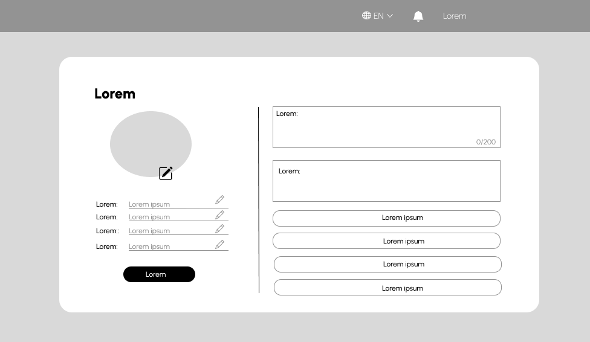

# 
COURSE PROJECT

    <strong>Universidad Peruana de Ciencias Aplicadas</strong> 
    </img> 
    <strong>Ingeniería de Software - 2024-2</strong> 
    <strong>Desarrollo de Aplicaciones Open Source - WX51</strong> 
    <strong>Profesor: Alberto Wilmer Sanchez Seña</strong> 
     <strong>Informe del Trabajo Final</strong>

    <strong>Startup: GPTDevs</strong> 
    <strong>Producto: TaskLinker </strong>

    <h3>Team Members:</h3>
    <table align="center">
        <tr>
            <th style="text-align:center;">Member</th>
            <th style="text-align:center;">Code</th>
        </tr>
        <tr>
            <td>Ramos Najar, Tony Alexander</td>
            <td>U20211A153</td>
        </tr>
        <tr>
            <td>Sanchez Rios, Camila Cristina</td>
            <td>U202210973</td>
        </tr>
        <tr>
            <td>Durand Vera, Gianfranco Angel</td>
            <td>U20201F640</td>
        </tr>
        <tr>
            <td>Chávarri Zarzosa, Daniel Jhared</td>
            <td>U202211108</td>
        </tr>
         <tr>
            <td>Roque Tello, Jack Eddie</td>
            <td>U20221C448</td>
         </tr>
    </table>

    <strong>Agosto, 2024</strong>

 

<h1 align="center">Registro de versiones del Informe</h1>
 
<table>
        <thead>
            <tr>
                <th>Versión</th>
                <th>Fecha</th>
                <th>Autor</th>
                <th>Descripción de modificaciones</th>
            </tr>
        </thead>
        <tbody>
            <tr>
                <th>TB1</th>
                <td>20/08/2024</td>
                <td>
                    <ul>
          <li>Tony Ramos</li>
          <li>Camila Sanchez</li>
          <li>Gianfranco Durand</li>
          <li>Daniel Chávarri</li>
          <li>Jack Roque</li>
                    <ul>
           </td>
      <td>            
             <ul>
          <li>Capítulo I: Introducción</li>
          <li>Capítulo II: Requirements Elicitation & Analysis</li>
          <li>Capítulo III: Requirements Specification</li>
          <li>Capítulo IV: Product Design</li>
          <li>Avance del Capítulo V: Product Implementation, Validation & Deployment hasta el punto 5.2.1.8</li>
          <li>Avance de Conclusiones, Bibliografía y Anexos</li>
        </ul>
      </td>
  </tr>
</tbody>
</table>

# Project Report Collaboration Insights

# Contenido
[Student Outcome](#student-outcome)

[Capítulo I: Introducción](#capítulo-i-introducción)
- [1.1. Startup Profile](#11-startup-profile)
  - [1.1.1. Descripción de la Startup](#111-descripción-de-la-startup)
  - [1.1.2. Perfiles de integrantes del equipo](#112-perfiles-de-integrantes-del-equipo)
- [1.2. Solution Profile](#12-solution-profile)
  - [1.2.1 Antecedentes y problemática](#121-antecedentes-y-problemática)
  - [1.2.2 Lean UX Process](#122-lean-ux-process)
    - [1.2.2.1. Lean UX Problem Statements](#1221-lean-ux-problem-statements)
    - [1.2.2.2. Lean UX Assumptions](#1222-lean-ux-assumptions)
    - [1.2.2.3. Lean UX Hypothesis Statements](#1223-lean-ux-hypothesis-statements)
    - [1.2.2.4. Lean UX Canvas](#1224-lean-ux-canvas)
- [1.3. Segmentos objetivo](#13-segmentos-objetivo)

[Capítulo II: Requirements Elicitation & Analysis](#capítulo-ii-requirements-elicitation--analysis)
- [2.1. Competidores](#21-competidores)
  - [2.1.1. Análisis competitivo](#211-análisis-competitivo)
  - [2.1.2. Estrategias y tácticas frente a competidores](#212-estrategias-y-tácticas-frente-a-competidores)
- [2.2. Entrevistas](#22-entrevistas)
  - [2.2.1. Diseño de entrevistas](#221-diseño-de-entrevistas)
  - [2.2.2. Registro de entrevistas](#222-registro-de-entrevistas)
  - [2.2.3. Análisis de entrevistas](#223-análisis-de-entrevistas)
- [2.3. Needfinding](#23-needfinding)
  - [2.3.1. User Personas](#231-user-personas)
  - [2.3.2. User Task Matrix](#232-user-task-matrix)
  - [2.3.3. User Journey Mapping](#233-user-journey-mapping)
  - [2.3.4. Empathy Mapping](#234-empathy-mapping)
  - [2.3.5. As-is Scenario Mapping](#235-as-is-scenario-mapping)
- [2.4. Ubiquitous Language](#24-ubiquitous-language)

[Capítulo III: Requirements Specification](#capítulo-iii-requirements-specification)
- [3.1. To-Be Scenario Mapping](#31-to-be-scenario-mapping)
- [3.2. User Stories](#32-user-stories)
- [3.3. Impact Mapping](#33-impact-mapping)
- [3.4. Product Backlog](#34-product-backlog)

[Capítulo IV: Product Design](#capítulo-iv-product-design)
- [4.1. Style Guidelines](#41-style-guidelines)
  - [4.1.1. General Style Guidelines](#411-general-style-guidelines)
  - [4.1.2. Web Style Guidelines](#412-web-style-guidelines)
- [4.2. Information Architecture](#42-information-architecture)
  - [4.2.1. Organization Systems](#421-organization-systems)
  - [4.2.2. Labeling Systems](#422-labeling-systems)
  - [4.2.3. SEO Tags and Meta Tag](#423-seo-tags-and-meta-tag)
  - [4.2.4. Searching Systems](#424-searching-systems)
  - [4.2.5. Navigation Systems](#425-navigation-systems)
- [4.3. Landing Page UI Design](#43-landing-page-ui-design)
  - [4.3.1. Landing Page Wireframe](#431-landing-page-wireframe)
  - [4.3.2. Landing Page Mock-up](#432-landing-page-mock-up)
- [4.4. Web Applications UX/UI Design](#44-web-applications-uxui-design)
  - [4.4.1. Web Applications Wireframes](#411-general-style-guidelines)
  - [4.4.2. Web Applications Wireflow Diagrams](#442-web-applications-wireflow-diagrams)
  - [4.4.3. Web Applications Mock-ups](#443-web-applications-mock-ups)
  - [4.4.4. Web Applications User Flow Diagrams](#444-web-applications-user-flow-diagrams)
- [4.5. Web Applications Prototyping](#45-web-applications-prototyping)
- [4.6. Domain-Driven Software Architecture](#46-domain-driven-software-architecture)
  - [4.6.1. Software Architecture Context Diagram](#461-software-architecture-context-diagram)
  - [4.6.2. Software Architecture Container Diagrams](#462-software-architecture-container-diagrams)
  - [4.6.3. Software Architecture Components Diagrams](#463-software-architecture-components-diagrams)
- [4.7. Software Object-Oriented Design](#47-software-object-oriented-design)
  - [4.7.1. Class Diagrams](#471-class-diagrams)
  - [4.7.2. Class Dictionary](#472-class-dictionary)
- [4.8. Database Design](#48-database-design)
  - [4.8.1. Database Diagram](#481-database-diagram)

[Capítulo V: Product Implementation, Validation & Deployment](#capítulo-v-product-implementation-validation--deployment)
- [5.1. Software Configuration Management](#51-software-configuration-management)
  - [5.1.1. Software Development Environment Configuration](#511-software-development-environment-configuration)
  - [5.1.2. Source Code Management](#512-source-code-management)
  - [5.1.3. Source Code Style Guide & Conventions](#513-source-code-style-guide--conventions)
  - [5.1.4. Software Deployment Configuration](#514-software-deployment-configuration)
- [5.2. Landing Page, Services & Applications Implementation](#52-landing-page-services--applications-implementation)
  - [5.2.X. Sprint ](#52x-sprint)
    - [5.2.X.1. Sprint Planning n](#52x1-sprint-planning-n)
    - [5.2.X.2. Sprint Backlog n](#52x2-sprint-backlog-n)
    - [5.2.X.3. Development Evidence for Sprint Review](#52x3-development-evidence-for-sprint-review)
    - [5.2.X.4. Testing Suite Evidence for Sprint Review](#52x4-testing-suite-evidence-for-sprint-review)
    - [5.2.X.5. Execution Evidence for Sprint Review](#52x5-execution-evidence-for-sprint-review)
    - [5.2.X.6. Services Documentation Evidence for Sprint Review](#52x6-services-documentation-evidence-for-sprint-review)
    - [5.2.X.7. Software Deployment Evidence for Sprint Review](#52x7-software-deployment-evidence-for-sprint-review)
    - [5.2.X.8. Team Collaboration Insights during Sprint](#52x8-team-collaboration-insights-during-sprint)
- [5.3. Validation Interviews](#53-validation-interviews)
  - [5.3.1. Diseño de Entrevistas](#531-diseño-de-entrevistas)
  - [5.3.2. Registro de Entrevistas](#532-registro-de-entrevistas)
  - [5.3.3. Evaluaciones según heurísticas](#533-evaluaciones-según-heurísticas)
- [5.4. Video About-the-Product](#54-video-about-the-product)

[Conclusiones](#conclusiones)
- [Conclusiones y recomendaciones](#conclusiones-y-recomendaciones)
- [Video About-the-Team](#video-about-the-team)

[Bibliografía](#bibliografía)

[Anexos](#anexos)

# Student Outcome

# Capítulo I: Introducción
## 1.1. Startup Profile
### 1.1.1. Descripción de la Startup
### 1.1.2. Perfiles de integrantes del equipo
## 1.2. Solution Profile
### 1.2.1 Antecedentes y problemática
#### 1.2.2.3. Lean UX Hypothesis Statements
#### 1.2.2.4. Lean UX Canvas
## 1.3. Segmentos objetivo

# Capítulo II: Requirements Elicitation & Analysis
## 2.1. Competidores
### 2.1.1. Análisis competitivo
### 2.1.2. Estrategias y tácticas frente a competidores
## 2.2. Entrevistas
### 2.2.1. Diseño de entrevistas
### 2.2.2. Registro de entrevistas
### 2.2.3. Análisis de entrevistas
## 2.3. Needfinding
### 2.3.1. User Personas
### 2.3.2. User Task Matrix
### 2.3.3. User Journey Mapping
### 2.3.4. Empathy Mapping
### 2.3.5. As-is Scenario Mapping
## 2.4. Ubiquitous Language

# Capítulo III: Requirements Specification
## 3.1. To-Be Scenario Mapping
## 3.2. User Stories
## 3.3. Impact Mapping
## 3.4. Product Backlog

# Capítulo IV: Product Design
## 4.1. Style Guidelines
Un "style guideline" o guía de estilo es un conjunto de reglas y pautas que establecen la forma en que se deben escribir, diseñar
o presentar documentos, contenido web, software, o cualquier otro tipo de trabajo creativo. A continuación, se otorga
especificación a los parámetros implementados en la estructura del proyecto:

### 4.1.1. General Style Guidelines
**Branding**

TaskLinker es una plataforma web que facilita la conexión eficiente entre trabajadores que buscan ingresos adicionales y empleadores que requieren personal temporal para tareas específicas. La marca se posiciona como un puente confiable y moderno en el mercado laboral, centralizando la oferta y demanda de trabajos por horas y promoviendo la flexibilidad, eficiencia y transparencia en cada interacción. Nuestro enfoque está en empoderar tanto a trabajadores como a empleadores, permitiendo que encuentren lo que necesitan de manera rápida, sencilla y segura.

**Logotipo**

El logotipo de TaskLinker es un elemento central de la identidad visual de la marca. Está compuesto por una tipografía moderna y estilizada que refleja la eficiencia y la profesionalidad de la plataforma. El diseño presenta las letras "T" y "L" en una disposición vertical, seguidas del nombre completo *"TASKLINKER"* en un tipo de letra audaz y alineado debajo.

  

 

**Tono de Comunicacion:**

El tono de TaskLinker es accesible, profesional y confiable. Nos dirigimos a nuestros usuarios de manera directa y respetuosa, con un lenguaje claro y positivo. Queremos transmitir una sensación de seguridad y eficiencia, mientras mantenemos una comunicación cercana y amigable.

**Lenguaje (Language):**

TaskLinker se comunica en un lenguaje inclusivo y sencillo, evitando jergas técnicas y términos complejos. La prioridad es que cualquier usuario, independientemente de su nivel de experiencia tecnológica, pueda entender y utilizar la plataforma con facilidad.

**Colores** 

La paleta de colores de TaskLinker ha sido cuidadosamente seleccionada para transmitir profesionalismo, confianza y accesibilidad. Cada color tiene un propósito específico y se utilizará de manera consistente en toda la identidad visual de la marca.

- **#295264 (Teal profundo):** Este color se utilizará como el tono principal de la marca, predominando en el logotipo, encabezados y elementos clave de la interfaz. Representa estabilidad y profesionalismo, dando una sensación de confianza y seriedad.

- **#FAD9A6 (Beige claro):** Este color complementa el tono principal al proporcionar un fondo suave y acogedor. Será usado en áreas de descanso visual, como fondos de secciones y tarjetas de información, aportando calidez y accesibilidad.

- **#BD2F28 (Rojo terracota):** Este tono vibrante servirá para destacar llamadas a la acción (CTA), botones y elementos interactivos. Representa dinamismo y urgencia, incentivando a los usuarios a actuar.

- **#89373D (Rojo vino):** Se utilizará para acentos y detalles menores que requieren énfasis pero sin ser tan prominentes como el rojo terracota. Es ideal para subtítulos, enlaces o elementos que necesiten un enfoque discreto pero efectivo.

- **#142433 (Azul oscuro):** Este color profundo y sobrio se empleará en textos principales y áreas de navegación, garantizando legibilidad y una presencia sólida y confiable. También puede utilizarse como fondo en secciones que necesitan un contraste fuerte con el contenido.
  

  

 

**Tipografía**

La elección tipográfica para TaskLinker es un componente esencial que complementa la identidad visual de la marca. Se han seleccionado tres familias tipográficas que juntas ofrecen versatilidad y coherencia, asegurando que la comunicación sea clara y efectiva en todos los medios.

**Escala:**
  
- Base: 16px
- Tipografía: Helvetica Neue y Sansation
- Interlineado: 1.1
- Weights: Bold - Medium - Regular - Light

 

### 4.1.2. Web Style Guidelines
La guía de estilo de un sitio web es un documento detallado que se basa en el diseño y la marca del sitio. Su propósito es crear una guía de estilo mucho más completa que abarca el uso de elementos en varios contextos, incluyendo medios impresos y otros medios. Es importante destacar que un sistema de diseño no siempre equivale a una guía de estilo.

**Paleta de Colores** 

Utiliza la paleta de colores de TaskLinker para todos los elementos de la web, asegurando consistencia y coherencia visual.

**Primarios:**

- #295264 (Azul petróleo): Para encabezados, enlaces importantes y botones de acción principal.
- #FAD9A6 (Beige claro): Para fondos de secciones, detalles, y texto destacado en fondos oscuros.

**Secundarios:**
- #BD2F28 (Rojo terracota): Para acentos, alertas, y botones de llamada a la acción.
- #89373D (Borgoña): Para subtítulos, bordes y elementos de soporte visual.
- #142433 (Azul oscuro): Para el texto principal, íconos, y elementos que necesiten un fuerte contraste.

  

 

**Fuentes:**

**Lexend Deca Regular:**
Esta fuente se utilizará principalmente para títulos y encabezados. Su diseño moderno y limpio refuerza la profesionalidad y accesibilidad de la marca, garantizando una excelente legibilidad incluso en tamaños grandes.

**Roboto Regular & Roboto Bold:**
Roboto será la fuente principal para el cuerpo de texto y subtítulos en toda la plataforma. La versión Regular se usará para la mayoría del contenido, mientras que Bold será ideal para resaltar secciones importantes o llamadas a la acción dentro del texto. Roboto es una tipografía versátil y altamente legible, perfecta para aplicaciones tanto digitales como impresas.

**Big Shoulders Display Thin:**
Esta fuente se utilizará para elementos destacados y gráficos que necesiten un estilo más impactante. Su diseño estilizado y condensado es ideal para banners, eslóganes o cualquier contenido donde se necesite una presencia fuerte y memorable.

**Encabezados y Jerarquía de Contenido:**

Mantén una jerarquía clara para los diferentes niveles de encabezados (H1, H2, H3) para guiar al usuario a través del contenido.

- H1: Lexend Deca, 36px, color #295264
- H2: Lexend Deca, 30px, color #142433
- H3: Roboto Bold, 24px, color #295264
- Párrafo (Body Text): Roboto Regular, 16px, color #142433
  

  

 

**Botones y Llamadas a la Acción (CTAs):**

Los botones deben ser claramente distinguibles y usar colores de la paleta para indicar su función.

- Botón Principal: Fondo #BD2F28, texto en blanco #FFFFFF. Usado para las acciones más importantes (como "Registrarse" o "Informacion").
- Botón Secundario: Fondo #295264, texto en blanco #FFFFFF o beige claro #FAD9A6. Usado para acciones secundarias.
- Hover States: Los botones deben cambiar de color ligeramente cuando se pasa el cursor por encima, por ejemplo, un tono más oscuro del color de fondo.

**Imágenes y Multimedia:**

Las imágenes deben ser de alta calidad y alinearse con el tono visual de TaskLinker.

- Imágenes de Cabecera
- Imágenes en Contenido

**Responsividad:**

La web debe estar optimizada para múltiples dispositivos, desde móviles hasta pantallas de escritorio grandes.

- Mobile First: El diseño debe priorizar la experiencia móvil, con un enfoque en la simplicidad y accesibilidad.
- Breakpoints:
  - Mobile: 320px - 767px
  - Tablet: 768px - 1024px
  - Desktop: 1025px en adelante

**Footers y Headers:**

- Header: Fijo en la parte superior con el logotipo y las opciones de navegación principales.
- Footer: Incluir enlaces secundarios, información de contacto, y redes sociales. Fondo en #142433 con texto en #FAD9A6.

## 4.2. Information Architecture
La arquitectura de la información, también conocida como Information Architecture (IA), implica la organización de la información de manera clara y lógica, de modo que los usuarios puedan comprender su ubicación, lo que han descubierto, qué pueden esperar y qué está disponible a su alrededor. Esto tiene como objetivo permitir a los usuarios encontrar con facilidad lo que están buscando, y a los clientes, comprender las capacidades de la plataforma. Además, la arquitectura de la información posibilita la incorporación de nuevas funciones y la expansión del producto sin generar una estructura compleja o de difícil comprensión (Rosenfeld, Morville & Arango 2015). 

### 4.2.1. Organization Systems
Los usuarios podrán percibir la interfaz de forma lógica e intuitiva gracias a la estructura organizativa
prevista para TaskLinker.

    <h3></h3>
    <table align="center" border="1" cellpadding="10">
        <tr>
            <th style="text-align:center;">Tópico</th>
            <th style="text-align:center;">Definición</th>
        </tr>
        <tr>
            <td>Job Listings</td>
            <td>Publicación y visualización de oportunidades de trabajo temporales, categorizadas por industria, ubicación, y habilidades requeridas.</td>
        </tr>
        <tr>
            <td>Profile Management</td>
            <td>Gestión de perfiles de trabajadores y empleadores, incluyendo la actualización de habilidades, experiencias, y preferencias de trabajo.</td>
        </tr>
        <tr>
            <td>Task Matching</td>
            <td>Implementación de algoritmos para conectar a trabajadores con empleadores basándose en criterios específicos como disponibilidad, habilidades, y ubicación.</td>
        </tr>
        <tr>
            <td>Transaction Handling</td>
            <td>Procesamiento seguro y eficiente de pagos y comisiones a través de la plataforma, asegurando transparencia en todas las transacciones entre usuarios.</td>
        </tr>
        <tr>
            <td>User Reviews</td>
            <td>Sistema de evaluaciones y comentarios para permitir a los usuarios compartir sus experiencias y calificar a los trabajadores y empleadores después de completar tareas.</td>
        </tr>
        <tr>
            <td>Notifications</td>
            <td>Envío de notificaciones y alertas personalizadas a usuarios sobre nuevas oportunidades, mensajes, y actualizaciones en tiempo real.</td>
        </tr>
        <tr>
            <td>Task Analytics</td>
            <td>Generación de informes sobre la actividad en la plataforma, incluyendo estadísticas de tareas completadas, tiempos de respuesta, y satisfacción de usuarios.</td>
        </tr>
        <tr>
            <td>Security Protocols</td>
            <td>Implementación de medidas de seguridad robustas para proteger la información personal y transaccional de los usuarios, asegurando la confidencialidad de los datos.</td>
        </tr>
        <tr>
            <td>Customer Support</td>
            <td>Provisión de asistencia al usuario mediante chat en vivo, soporte por correo electrónico y una base de conocimientos accesible para resolver problemas comunes.</td>
        </tr>
        <tr>
            <td>Platform Updates</td>
            <td>Actualizaciones regulares de la plataforma con nuevas funciones, mejoras de rendimiento, y soluciones de errores para asegurar una experiencia de usuario optimizada.</td>
        </tr>
    </table>

### 4.2.2. Labeling Systems
El conjunto de información TaskLinker será representado por el sistema mediante las siguientes
etiquetas.

    <h3></h3>
    <table align="center" border="1" cellpadding="10">
        <tr>
            <th style="text-align:center;">Etiqueta</th>
            <th style="text-align:center;">Descripción</th>
        </tr>
        <tr>
            <td>Task Category</td>
            <td>Etiqueta utilizada para clasificar las tareas según el tipo de servicio ofrecido, como limpieza, reparaciones, o asistencia administrativa.</td>
        </tr>
        <tr>
            <td>Availability Status</td>
            <td>Etiqueta que indica la disponibilidad del trabajador o empleador para aceptar nuevas tareas o contrataciones.</td>
        </tr>
        <tr>
            <td>Deadline</td>
            <td>Etiqueta que indica la fecha límite para la finalización de una tarea o proyecto.</td>
        </tr>
        <tr>
            <td>Urgency Level</td>
            <td>Etiqueta que señala la prioridad o nivel de urgencia de una tarea, ayudando a los trabajadores a priorizar su tiempo y esfuerzo.</td>
        </tr>
        <tr>
            <td>Task Status</td>
            <td>Etiqueta que indica la fase actual de una tarea, como "En progreso", "Completada", o "Pendiente de revisión".</td>
        </tr>
        <tr>
            <td>Skill Set Required</td>
            <td>Etiqueta que resalta las habilidades o competencias específicas necesarias para realizar una tarea en particular.</td>
        </tr>
        <tr>
            <td>Payment Status</td>
            <td>Etiqueta que indica si el pago por una tarea ha sido completado, está pendiente, o en proceso de verificación.</td>
        </tr>
        <tr>
            <td>Location</td>
            <td>Etiqueta que especifica la ubicación donde se debe realizar la tarea, ya sea una dirección física o una opción remota.</td>
        </tr>
        <tr>
            <td>Review Status</td>
            <td>Etiqueta que indica si una tarea o un trabajador ha sido evaluado y verificado por otros usuarios, asegurando la calidad del servicio.</td>
        </tr>
        <tr>
            <td>Contract Type</td>
            <td>Etiqueta que clasifica la tarea según el tipo de contrato, ya sea por horas, a tiempo parcial, o bajo un proyecto fijo.</td>
        </tr>
    </table>

### 4.2.3. SEO Tags and Meta Tag

### 4.2.4. Searching Systems

Searching System es una herramienta informática que permite buscar y recuperar información relevante almacenada en una base de datos o en internet. Su objetivo es proporcionar respuestas precisas y relevantes a las consultas de los usuarios.

    <h3></h3>
    <table align="center" border="1" cellpadding="10">
        <tr>
            <th style="text-align:center;">Criterio de Búsqueda</th>
            <th style="text-align:center;">Descripción</th>
        </tr>
        <tr>
            <td>Keyword Search</td>
            <td>Búsqueda basada en palabras clave específicas ingresadas por el usuario, permitiendo encontrar tareas, trabajadores, o empleadores relacionados con esas palabras.</td>
        </tr>
        <tr>
            <td>Task Category Filter</td>
            <td>Filtro que permite a los usuarios buscar tareas o servicios dentro de categorías específicas como limpieza, reparaciones, administración, entre otros.</td>
        </tr>
        <tr>
            <td>Location-Based Search</td>
            <td>Permite a los usuarios buscar tareas o trabajadores según la ubicación geográfica, con opciones para definir un radio de búsqueda cercano o específico.</td>
        </tr>
        <tr>
            <td>Availability Filter</td>
            <td>Filtro que permite buscar trabajadores o tareas según su disponibilidad inmediata o en fechas específicas.</td>
        </tr>
        <tr>
            <td>Skill Set Filter</td>
            <td>Búsqueda que permite filtrar tareas o trabajadores según las habilidades o competencias requeridas o ofrecidas.</td>
        </tr>
        <tr>
            <td>Task Status Search</td>
            <td>Búsqueda basada en el estado de las tareas, como "En progreso", "Completada", o "Pendiente de revisión", para una mejor gestión de proyectos en curso o finalizados.</td>
        </tr>
        <tr>
            <td>Contract Type Filter</td>
            <td>Filtro que permite buscar tareas según el tipo de contrato, ya sea por horas, a tiempo parcial, o bajo un proyecto fijo, según las necesidades del usuario.</td>
        </tr>
    </table>

### 4.2.5. Navigation Systems

 Este sistema está diseñado para garantizar que los usuarios puedan moverse fácilmente a través de la plataforma y encontrar la información que necesitan de manera eficiente.

    <h3></h3>
    <table align="center" border="1" cellpadding="10">
        <tr>
            <th style="text-align:center;">Elemento de Navegación</th>
            <th style="text-align:center;">Descripción</th>
        </tr>
        <tr>
            <td>Menú Principal</td>
            <td>Un menú fijo en la parte superior de la página que incluye las secciones más importantes: Inicio, Buscar Trabajos, Buscar Trabajadores, Mi Perfil, Notificaciones, y Ayuda. Este menú es accesible desde cualquier página de la plataforma.</td>
        </tr>
        <tr>
            <td>Barra de Búsqueda Global</td>
            <td>Una barra de búsqueda visible en la parte superior de cada página que permite a los usuarios realizar búsquedas rápidas y directas de tareas, trabajadores, o empleadores desde cualquier sección de la plataforma.</td>
        </tr>
        <tr>
            <td>Menú de Categorías</td>
            <td>Un menú desplegable que organiza las tareas y servicios en categorías como Hogar, Reparaciones, Administración, Eventos, etc. Facilita la exploración específica dentro de las áreas de interés.</td>
        </tr>
        <tr>
            <td>Panel de Usuario</td>
            <td>Un menú lateral que se despliega al hacer clic en el avatar del usuario, ofreciendo acceso rápido a Mi Perfil, Mis Tareas, Historial, Configuración, y Cerrar Sesión. Este panel se adapta según el tipo de usuario (trabajador o empleador).</td>
        </tr>
        <tr>
            <td>Breadcrumb Navigation</td>
            <td>Rastro de migas de pan que aparece en la parte superior de las páginas secundarias, mostrando la ruta de navegación y permitiendo a los usuarios volver fácilmente a las secciones anteriores.</td>
        </tr>
        <tr>
            <td>Panel de Notificaciones</td>
            <td>Un ícono de campana en el menú principal que al hacer clic despliega un panel con notificaciones recientes, incluyendo mensajes, nuevas oportunidades, y actualizaciones de tareas.</td>
        </tr>
        <tr>
            <td>Footer</td>
            <td>El pie de página contiene enlaces a Sobre Nosotros, Términos y Condiciones, Política de Privacidad, Contacto, y enlaces a redes sociales. Este espacio también puede incluir enlaces a recursos adicionales como blogs o guías de usuario.</td>
        </tr>
        <tr>
            <td>Navegación Contextual</td>
            <td>En páginas detalladas de tareas o perfiles de trabajadores, se incluyen enlaces y botones contextuales que permiten al usuario realizar acciones relacionadas, como Contactar, Contratar Ahora, Ver Evaluaciones, o Guardar.</td>
        </tr>
    </table>

## 4.3. Landing Page UI Design
### 4.3.1. Landing Page Wireframe

El prototipado de la landing page cuenta diversas secciones:

- Header: Incluye botones para facilitar la navegación
- Hero: Con 2 CTA, uno para cada segmento objetivo, un título y una imagen de fondo.
- Segmentos y beneficios: Para cada segmento se tiene un título, una breve descripción, un CTA y una imagen. Debajo de cada sección se detallan los beneficios que se ofrecen.
- Testimonios: Consta de un título y subtítulo, así como de unos testimonios de usuarios de cada segmento, lo que aumenta la confianza en los potenciales clientes.
- Contacto: Tiene un título y subtítulo, un pequeño input para la introducción de un email y un botón para el envio del correo.
- Footer: Sección que da fin a la landing page, cuenta con las redes sociales de la plataforma.

**Wireframe Desktop**

*Imagen (N°13). Elaboración propia. Realizado en Figma*

 

**Wireframe Mobile**

En la versión mobile el navbar se reemplaza por un menu desplegable.

*Imagen (N°14). Elaboración propia. Realizado en Figma*

 

### 4.3.2. Landing Page Mock-up

Siguiendo los wireframes de la landing page se realizaron los mockups:

- Header y Segmentos: Se utilizan los colores primarios de la plataforma especificados.
- Hero: Cuenta con una imagen relacionada a la plataforma, además se tiene dos CTA en versiones alternativas para la diferenciación.
- Beneficios: Incluye iconos relacionados con los beneficios ofrecidos y con el color principal, además el fondo es claro alternando con la sección de Segmentos para una mejor separación.
- Testimonios: Con un fondo de color principal para constrastar con las tarjetas de cada testimonio.
- Contacto: Se tiene un CTA en color primario, siendo notorio al estar en un fondo claro.
- Footer: Al igual que el header, utiliza los colores primarios de la plataforma para dar un fin estético a la página.

**Mock-up Desktop**

*Imagen (N°15). Elaboración propia. Realizado en Figma*

 

**Mock-up Mobile**

En la versión mobile el navbar se reemplaza por un menu desplegable.

*Imagen (N°16). Elaboración propia. Realizado en Figma*

 

## 4.4. Web Applications UX/UI Design
El diseño UX/UI para aplicaciones web se centra en crear interfaces intuitivas y experiencias de usuario fluidas que maximicen la satisfacción y eficiencia al interactuar con una plataforma. Este enfoque combina la funcionalidad con la estética, asegurando que cada elemento visual no solo sea atractivo, sino que también facilite la navegación y el cumplimiento de los objetivos del usuario. En un entorno digital competitivo, un diseño UX/UI bien ejecutado es crucial para captar y retener usuarios, mejorando tanto la usabilidad como la percepción general de la aplicación.
### 4.4.1. Web Applications Wireframes
Los wireframes ayudan a los diseñadores y desarrolladores a planificar la arquitectura y la funcionalidad de la aplicación, permitiendo visualizar cómo los usuarios interactuarán con ella. Son esenciales en las primeras etapas de desarrollo, ya que facilitan la comunicación de ideas, la identificación de problemas potenciales y la alineación de todos los involucrados en el proyecto antes de pasar al diseño detallado y la programación.

**Iniciar sesión**

La siguiente imagen evidencia el wireframe de la sección de “inicio de sesión” desde la vista desktop web browser. En ella, los usuarios deberán ingresar las credenciales necesarias para poder acceder a la aplicación, siempre y cuando posean con una cuenta previamente creada.

*Imagen(N°17). Elaboración propia. Realizado en figma*

 

**Crear cuenta**

La siguiente imagen presenta la sección de “registro de usuario”, a través de la cual los administradores podrán remitir a la aplicación la información necesaria para crear una cuenta.

*Imagen(N°18). Elaboración propia. Realizado en figma*

 

**Cargar tarjeta**

La siguiente imagen corresponde a la sección “Pasarela de pagos” donde los usuarios son dirigidas a un formulario para seleccionar y registrar su método de pago. Una vez que el proceso de pago es completado exitosamente, se notifica al usuario con un mensaje confirmando el vinculo de su tarjeta con la plataforma. Del mismo modo, si el usuario desea retirar su información o actualizar lo podra hacer a travéz de su perfil.

*Imagen(N°19). Elaboración propia. Realizado en figma*

 

**Mi perfil**

La sección titulada “Mi perfil” solicita al usuario que complete información en cuatro categorías para registrar o editar sus datos. Adicionalmente, la categoría "cambiar cuenta" ofrece la opción de permitir al usuario cambiar de cuenta a una de empleador y utilizar las herramientas de este por la plataforma.

*Perfil Trabajador*

En este perfil, el usuario puede ver a la derecha sus herramientas correpondientes a su cuenta.

*Imagen(N°20). Elaboración propia. Realizado en figma*

 

*Perfil Empleador*

En este perfil, el usuario puede ver a la derecha sus herramientas correpondientes a su cuenta.

*Imagen(N°21). Elaboración propia. Realizado en figma*

 

**Subir Archivos**

En la herramienta del perfil "Trabajador", el usuario podra subir un nuevo documento con su descripción y categoria.

*Imagen(N°22). Elaboración propia. Realizado en figma*

 

**Trabajos realizados**

En la herramienta "Trabajos realizados" perteneciente al perfil "Trabajador", mostrara un historial laboral con acceso a detalles.  

*Imagen(N°23). Elaboración propia. Realizado en figma*

 

*Opción Detalles*

En esta sección, se mostrara en la pantalla la Evaluación de desempeño por parte del empleador. 

*Imagen(N°24). Elaboración propia. Realizado en figma*

 

**Historial de trabajos Publicados**

En esta sección, pertence al perfil "Empleador". 

*Imagen(N°25). Elaboración propia. Realizado en figma*

 

*Opción Detalles*

En esta sección, se mostrara en la pantalla la información del trabajo publicado y el perfil del trabajor con la breve reseña echa por el empleador.

*Imagen(N°26). Elaboración propia. Realizado en figma*

 

### 4.4.2. Web Applications Wireflow Diagrams
Los Web Applications Wireflow Diagrams son una combinación de wireframes y flujos de usuario (user flows) que ilustran no solo la estructura y disposición de las páginas de una aplicación web, sino también cómo los usuarios navegarán entre ellas. Estos diagramas proporcionan una visión detallada del recorrido del usuario, mostrando las interacciones clave y las transiciones de una página a otra dentro de la aplicación.

Los wireflow diagrams son fundamentales en el proceso de diseño, ya que permiten a los equipos de desarrollo y diseño evaluar la lógica de navegación y la experiencia del usuario antes de la implementación completa. Al representar visualmente tanto la estructura como el flujo, estos diagramas aseguran que todos los involucrados tengan una comprensión clara del comportamiento de la aplicación y pueden ayudar a identificar y resolver problemas de usabilidad tempranamente.

### 4.4.3. Web Applications Mock-ups
Los Web Applications Mock-ups son representaciones visuales detalladas y de alta fidelidad del diseño de una aplicación web. A diferencia de los wireframes, que son más esquemáticos, los mock-ups incorporan colores, tipografías, imágenes y otros elementos de diseño, ofreciéndonos una vista previa realista de cómo se verá la interfaz de usuario final.

Al crear mock-ups, tenemos la oportunidad de visualizar y evaluar la apariencia y la funcionalidad del producto antes de la codificación. Esto nos permite realizar ajustes en el diseño, asegurar la coherencia visual y comunicar la visión final de nuestro brand.

### 4.4.4. Web Applications User Flow Diagrams
Los Web Applications User Flow Diagrams son diagramas que mapean el recorrido que un usuario sigue al interactuar con una aplicación web, desde el punto de entrada hasta la secuencia de una tarea específica. Estos diagramas permiten visualizar cada paso que toma el usuario, ayudándo a entender cómo navegan por la aplicación y cómo interactúan con las diferentes páginas y funciones.

Al diseñar user flow diagrams, puedo identificar posibles puntos de fricción o áreas donde la experiencia del usuario podría mejorarse. Al comprender el flujo completo, puedo optimizar el diseño y la estructura de la aplicación, garantizando una experiencia de usuario fluida y coherente.

## 4.5. Web Applications Prototyping

Para poder elaborar los prototipos de la interfaz de usuario destinados a Desktop se siguieron una serie de criterios fundamentales, entre ellos:

- Claridad y Facilidad: El enfoque fue lograr que la navegación en la aplicación sea intuitiva y comprensible, con el objetivo de que los usuarios puedan comprender plenamente las funciones de la aplicación. visualización de reportes estadísticos.
- Diseño Responsive: Se ha tenido en cuenta la importancia del diseño "responsive" para garantizar que la aplicación web sea compatible con una variedad tamaños de pantalla, de tal manera que los usuarios no se vean limitados por el dispositivo que utilicen.
- Priorización de Información Relevante: El diseño de la aplicación se enfoca en mostrar únicamente la información más importante para los usuarios pertenecientes al segmento objetivo.

## 4.6. Domain-Driven Software Architecture
### 4.6.1. Software Architecture Context Diagram

### 4.6.2. Software Architecture Container Diagrams

### 4.6.3. Software Architecture Components Diagrams

## 4.7. Software Object-Oriented Design
### 4.7.1. Class Diagrams
### 4.7.2. Class Dictionary
## 4.8. Database Design
## 4.8.1. Database Diagram

# Capítulo V: Product Implementation, Validation & Deployment
## 5.1. Software Configuration Management
### 5.1.1. Software Development Environment Configuration
### 5.1.2. Source Code Management
### 5.1.3. Source Code Style Guide & Conventions
### 5.1.4. Software Deployment Configuration
## 5.2. Landing Page, Services & Applications Implementation
### 5.2.X. Sprint 
#### 5.2.X.1. Sprint Planning n
#### 5.2.X.2. Sprint Backlog n
#### 5.2.X.3. Development Evidence for Sprint Review
#### 5.2.X.4. Testing Suite Evidence for Sprint Review
#### 5.2.X.5. Execution Evidence for Sprint Review
#### 5.2.X.6. Services Documentation Evidence for Sprint Review
#### 5.2.X.7. Software Deployment Evidence for Sprint Review
#### 5.2.X.8. Team Collaboration Insights during Sprint
## 5.3. Validation Interviews
### 5.3.1. Diseño de Entrevistas
### 5.3.2. Registro de Entrevistas
### 5.3.3. Evaluaciones según heurísticas
# 5.4. Video About-the-Product

# Conclusiones
## Conclusiones y recomendaciones
## Video About-the-Team.

# Bibliografía

# Anexos